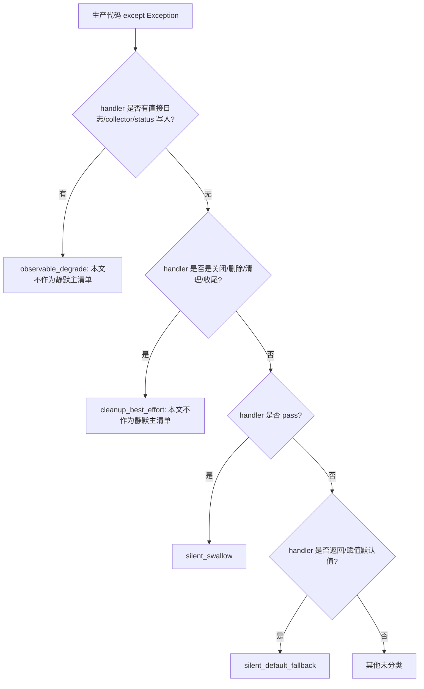

# 当前静默回退清单留档（P1 业务边界已修复验收）

## 速答

2026-05-22 更新：本文件已从“发现清单”进入“修复验收留档”。下面的“2026-05-20 原始全量扫描清单”只保留当日原始扫描证据，方便以后追溯当时发现了什么；它不再代表当前代码仍然存在这些问题。

本轮已完成原始清单中人工核实为需要处理的 P1 / 业务正确性静默回退问题，处理口径是：

- 本轮治理覆盖的重点业务边界中，会改变排产业务事实的坏数据，不再悄悄变成 0、1、空值或默认值。
- 必须兼容旧数据的地方，要么留下 warning / degradation / 页面提示 / OperationLogs，要么明确登记为可接受的展示兼容。
- Excel 模板不再因为“能打开”就被自动覆盖或下载，表头不一致会直接报可见错误。
- 分析页、历史页、周计划页遇到坏摘要数字或坏优化指标时，会显示“记录异常/结果有问题”，不会画成 0 或显示成功。
- 算法统计计数不再把坏值、小数、布尔值截成正常整数。

当前验收结果：

| 验收项 | 实际命令 | 结果 | 证据 |
|---|---|---|---|
| 严格静默回退门禁（当前台账边界） | `.venv/bin/python -m tools.quality_gate_scan --strict` | `return_code=0`，成功无输出 | `evidence/QualityGate/silent_fallback_inventory_acceptance/strict_scan.log` |
| 严格静默回退门禁计数快照（启动链四类全量 + 非启动链历史 `silent_swallow`） | `.venv/bin/python -m tools.quality_gate_scan --strict --json` | `scan_entry_count=100`，`ledger_entry_count=100`，分类：`observable_degrade=62` / `cleanup_best_effort=14` / `silent_default_fallback=6` / `silent_swallow=18` | `evidence/QualityGate/silent_fallback_inventory_acceptance/strict_scan_json.log` |
| 严格扫描 CLI 合同 | `.venv/bin/python -m pytest tests/regression_quality_gate_scan_contract.py -q` | `28 passed` | `evidence/QualityGate/silent_fallback_inventory_acceptance/strict_cli_contract_pytest.log` |
| 台账一致性检查 | `.venv/bin/python scripts/sync_debt_ledger.py check` | `return_code=0`，当前 `silent_fallback_count=100` | `evidence/QualityGate/silent_fallback_inventory_acceptance/quality_gate_ledger_check.log` |
| diff 空白检查 | `git diff --check` | `return_code=0`，无输出 | `evidence/QualityGate/silent_fallback_inventory_acceptance/git_diff_check.log` |
| 定向核心回归 | `.venv/bin/python -m pytest tests/regression_model_helper_silent_fallback_contract.py tests/regression_models_numeric_parse_hybrid_safe.py tests/regression_strict_parse_blank_required.py tests/regression_schedule_summary_fallback_counts_output.py tests/regression_metrics_to_dict_nonfinite_safe.py tests/regression_calendar_invalid_shift_window_contract.py tests/regression_seed_results_drop_duplicate_op_id_and_bad_time.py tests/regression_seed_results_dedup.py tests/regression_unit_excel_converter_diagnostics_visible.py tests/regression_unit_excel_converter_merge_steps_and_classify.py -q` | `15 passed` | `evidence/QualityGate/silent_fallback_inventory_acceptance/targeted_core_pytest.log` |
| 启动链 / UI mode / runtime 回归 | `.venv/bin/python -m pytest tests -q -k 'launcher or runtime or startup or stop or ui_mode or render_bridge' -p no:cacheprovider` | `272 passed, 3000 deselected` | `evidence/QualityGate/silent_fallback_inventory_acceptance/web_startup_pytest.log` |
| Excel 模板合同脚本 | `.venv/bin/python tests/regression_excel_template_contracts.py` | `OK` | `evidence/QualityGate/silent_fallback_inventory_acceptance/excel_template_contract_script.log` |
| 系统维护坏 JSON / 页面可见性合同 | `.venv/bin/python -m pytest tests/regression_maintenance_window_mutex.py tests/test_history_summary_parser.py tests/regression_system_logs_presenter_contract.py tests/regression_system_request_services_contract.py -q` | `31 passed` | `evidence/QualityGate/silent_fallback_inventory_acceptance/system_maintenance_bad_json_pytest.log` |
| 指标 JSON 安全脚本 | `.venv/bin/python tests/regression_metrics_to_dict_nonfinite_safe.py` | `OK` | `evidence/QualityGate/silent_fallback_inventory_acceptance/metrics_json_script.log` |
| 子代理修后对抗复审 | 人工/子代理交叉审查摘要 | 本轮核查范围内未发现需继续处理的 P1 真问题；不代表全仓静默回退清零，机器验收以上述命令和日志为准 | 本文档 + `.limcode/review/2026-05-21-silent-fallback-inventory-review.md` |

验收证据说明：

- 以上表格是 2026-05-22 08:27 +08:00 后重新补齐的可复现收口证据，所有命令均记录了 `started_at`、`finished_at`、`command`、`return_code` 和关键输出。
- 早期速记里的“定向 pytest 第一组 `58 passed` / 第二组 `141 passed`”未保留可审计 receipt，已由上表的当前可复现命令取代；后续不得再把旧数字当成当前验收依据。
- 原验收项 `tools.quality_gate_scan --strict` 已替换为真实可执行入口 `.venv/bin/python -m tools.quality_gate_scan --strict`；该命令成功时保持无输出，`--json` 用于留存计数快照。
- 当前技术债务台账快照仍是 `开发文档/技术债务治理台账.md` 中 `updated_at=2026-05-22T07:03:42+08:00`、`silent_fallback_count=100`；严格门禁通过仅证明“启动链四类全量 + 非启动链历史 `silent_swallow`”这个当前台账边界对齐。本文下方 181 / 77 文件清单仍仅代表 2026-05-20 原始发现口径。

本轮主要修复范围：

- 排产种子、日期解析、日历班次、版本仓库、摘要降级、关键链、排产持久化。
- 工艺路线解析、供应商默认周期、Unit Excel 诊断、OR-Tools 预热失败、启动器 PID 状态。
- Excel 模板生成/修复/下载校验、Excel 导入差异计算、基础设施日志与迁移标识符。
- 系统维护备份/清理结果、系统页面坏 JSON 显示、报表字段坏值校验。
- 分析页趋势图、优化过程表、优化曲线、历史摘要 counts 状态。
- 模型层关键数字字段：批次数量、批次工序顺序/工时/外协天数、零件工序模板顺序/工时/外协天数、日历班次/效率、供应商默认周期。
- 算法指标和统计：指标坏值不再变 0，负荷统计坏值不再跳过，fallback 计数坏值不再跳过、覆盖或截断。

> 说明：2026-05-20 原始内容里写着“本次只做只读审查与留档，未修改业务代码”，那是当时生成清单时的状态。2026-05-22 已按这份清单完成修复、回归和对抗复审。

## 原始扫描摘要

按 2026-05-20 原始生产代码范围扫描：

- 扫描范围：`core/`、`data/`、`web/`、`desktop/`、`plugins/`、`app.py`、`app_new_ui.py`、`config.py`
- 排除范围：`tests/`、`tools/`、`scripts/`、`docs/`、`evidence/`、`audit/`、历史计划/审查文档等非生产运行代码
- 扫描器总命中：356 处 `except Exception` 相关回退/降级处理
  - `silent_default_fallback`：157
  - `silent_swallow`：24
  - `observable_degrade`：127
  - `cleanup_best_effort`：48
- 本文主清单只列“静默回退候选”：`silent_default_fallback + silent_swallow`，合计 **181 处 / 77 个文件**。

> 重要说明：本文采用“保守静态口径”。有些条目实际上可能通过封装函数、返回结构、warning 列表、OperationLogs 或上层页面提示变得可见；但只要当前静态扫描不能直接证明它可观测，本文仍先列入“静默回退候选”。后续修复或裁决时应逐条人工复核：是改成显式错误、补可观测退化，还是登记为接受风险。



## 判定口径

本次沿用仓库现有技术债务治理分类：

| 分类 | 含义 | 本文处理 |
|---|---|---|
| `silent_swallow` | 静默吞异常，例如 `except Exception: pass` | 纳入主清单 |
| `silent_default_fallback` | 无可观测证据地回退默认值，例如 `return None`、`return 0`、`return False`、空集合、默认对象 | 纳入主清单 |
| `observable_degrade` | 先留可观测证据，再降级继续 | 不列入主清单，只在统计中说明 |
| `cleanup_best_effort` | 关闭、删除、清理、收尾类尽力而为逻辑 | 不列入主清单，只在统计中说明 |

对应依据：

- `开发文档/技术债务治理台账.md:16-26` 定义四类静默回退/降级分类，并声明当前门禁边界。
- `tools/quality_gate_scan.py:356-383` 根据 handler 内的日志/collector/cleanup/default actions/control flow 对 `except Exception` 分类。
- `tools/quality_gate_scan.py:409-449` 扫描 Python AST 中的 `except Exception` handler 并生成条目。
- `tools/quality_gate_shared.py:246-251` 固定四类 `fallback_kind`。

## 复现方式

本次用仓库现有扫描器读取生产代码路径，再筛选 `silent_swallow` 与 `silent_default_fallback`：

```bash
python - <<'PY'
from collections import Counter
from pathlib import Path
from tools.quality_gate_scan import scan_silent_fallback_entries

roots = ['core', 'data', 'web', 'desktop', 'plugins']
files = []
for root in roots:
    root_path = Path(root)
    if root_path.exists():
        files.extend(
            str(path).replace('\\\\', '/')
            for path in root_path.rglob('*.py')
            if '__pycache__' not in path.parts
        )
for path in ['app.py', 'app_new_ui.py', 'config.py']:
    if Path(path).exists():
        files.append(path)

entries = scan_silent_fallback_entries(sorted(set(files)))
strict = [
    entry for entry in entries
    if entry.get('fallback_kind') in ('silent_swallow', 'silent_default_fallback')
]
print(len(entries), Counter(entry.get('fallback_kind') for entry in entries))
print(len(strict), Counter(entry.get('fallback_kind') for entry in strict))
PY
```

本轮实测摘要：

| 口径 | 数量 |
|---|---:|
| 生产代码扫描文件数 | 以 `core/data/web/desktop/plugins` 与入口文件为准 |
| 全部 fallback/降级 handler | 356 |
| `silent_default_fallback` | 157 |
| `silent_swallow` | 24 |
| 本文主清单合计 | 181 |
| 涉及文件 | 77 |

## 模块分布

| 模块域 | 命中数 |
|---|---:|
| `core/services/scheduler` | 29 |
| `core/algorithms` | 23 |
| `core/infrastructure` | 23 |
| `core/services/common` | 21 |
| `web/bootstrap` | 14 |
| `web/routes` | 13 |
| `core/services/process` | 12 |
| `core/services/system` | 11 |
| `data/repositories` | 8 |
| `web/viewmodels` | 8 |
| `core/models` | 7 |
| `core/plugins` | 5 |
| `web/other` | 3 |
| `desktop` | 2 |
| `entrypoint` | 1 |
| `core/services/report` | 1 |

命中最多的文件：

| 文件 | 命中数 | 观察 |
|---|---:|---|
| `core/infrastructure/backup.py` | 10 | 维护锁、pid 探测、备份清理存在多个默认化/吞错点 |
| `core/services/common/excel_templates.py` | 7 | Excel 模板读取/刷新多处失败回 `False` / 空列表 |
| `core/algorithms/ortools_bottleneck.py` | 6 | OR-Tools warm-start 可选降级和 logger 吞错集中 |
| `core/models/_helpers.py` | 6 | 通用模型解析 helper 大量默认值回退 |
| `web/bootstrap/launcher_processes.py` | 6 | 启动链 pid / PowerShell / 强杀探测存在可观测不足候选 |
| `core/plugins/manager.py` | 5 | 插件加载/注册路径日志失败吞错，配置读取失败回空 |
| `core/services/common/excel_validators.py` | 5 | Excel 字段规范化失败回默认状态/文案 |
| `core/services/scheduler/gantt_critical_chain.py` | 5 | 关键链计算异常回 unavailable result |
| `core/services/system/maintenance/backup_task.py` | 5 | 自动备份失败回结果 tuple，telemetry 写入失败回 False |
| `core/services/system/maintenance/cleanup_task.py` | 5 | 自动清理失败回结果 tuple，telemetry 写入失败回 False |
| `web/bootstrap/launcher_observability.py` | 5 | 启动日志可观测自身写入失败回 False |

## 优先级建议

这不是修复方案，只是留档时的风险排序建议：

### P1：建议优先人工复核/治理

这些条目更可能影响排产结果、数据可信度或错误显性：

- 排产算法与排序：`core/algorithms/dispatch_rules.py`、`core/algorithms/greedy/date_parsers.py`、`core/algorithms/greedy/scheduler.py`、`core/algorithms/ortools_bottleneck.py`、`core/algorithms/sort_strategies.py`
- 排产服务主链：`core/services/scheduler/calendar_engine.py`、`core/services/scheduler/run/schedule_persistence.py`、`core/services/scheduler/gantt_critical_chain.py`、`core/services/scheduler/summary/*`
- 工艺路线/外协导入：`core/services/process/part_route_validation.py`、`core/services/process/route_parser_constraints.py`、`core/services/process/unit_excel/parser.py`
- 仓储/版本号：`data/repositories/schedule_history_repo.py`、`data/repositories/config_repo.py`、`data/repositories/external_group_repo.py`
- 备份维护与启动链：`core/infrastructure/backup.py`、`web/bootstrap/launcher_processes.py`

### P2：建议统一为“可观测兼容”或明确接受风险

这些条目多为 UI 展示、报表、Excel 模板/字段读取或安全日志封装，不一定要 fail-fast，但应尽量让失败原因可见：

- `core/services/common/excel_templates.py`
- `core/services/common/excel_validators.py`
- `web/routes/reports.py`
- `web/routes/navigation_utils.py`
- `web/viewmodels/*`
- `web/error_boundary.py`

### P3：偏“日志/清理/最佳努力”，可最后处理或登记接受风险

这些条目多发生在 logger 本身失败、清理动作失败、静态版本号注入失败等“不要影响主流程”的场景，但仍建议统一出口，避免完全无留痕：

- `data/repositories/base_repo.py` 的日志安全化 helper
- `core/infrastructure/logging.py`
- `core/infrastructure/migrations/common.py:fallback_log`
- `web/bootstrap/static_versioning.py`
- `web/bootstrap/launcher_observability.py`

## 2026-05-20 原始全量扫描清单

说明：

- `silent_default_fallback`：异常后返回/赋值默认值。
- `silent_swallow`：异常后直接吞掉，通常为 `pass`。
- “扫描动作/控制流”来自静态扫描器的 handler 签名摘要，用于快速定位，不代表完整业务语义。

### 入口

- `app.py`
  - L61-63 `main`：`silent_default_fallback`，扫描动作 `return:number:nonzero`；入口模块加载失败后记录 prelaunch failure 并返回退出码 `14`。

### `core/algorithms`

- `core/algorithms/dispatch_rules.py`
  - L34-35 `parse_dispatch_rule`：`silent_default_fallback`，扫描动作 `return:name`。
  - L76-77 `_safe_positive`：`silent_default_fallback`，扫描动作 `nested_return:number:zero, return:number:zero`。
- `core/algorithms/evaluation.py`
  - L73-74 `_round_finite`：`silent_default_fallback`，扫描动作 `nested_return:number:zero, return:number:zero`。
  - L344-345 `_cv`：`silent_default_fallback`，扫描动作 `nested_return:number:zero, return:number:zero`。
- `core/algorithms/greedy/algo_stats.py`
  - L28-29 `ensure_algo_stats`：`silent_default_fallback`，扫描动作 `return:call:_empty_stats`。
  - L42-54 `snapshot_algo_stats`：`silent_default_fallback`，扫描动作 `return:name`。
  - L67-68 `increment_counter`：`silent_default_fallback`，扫描动作 `assign:number:zero, nested_assign:number:zero`。
- `core/algorithms/greedy/config_adapter.py`
  - L22-23 `read_schedule_config_value`：`silent_default_fallback`，扫描动作 `return:call:CriticalConfigReadResult`。
- `core/algorithms/greedy/date_parsers.py`
  - L20-21 `parse_date`：`silent_default_fallback`，扫描动作 `nested_return:none, return:none`。
  - L42-43 `parse_datetime`：`silent_default_fallback`，扫描动作 `nested_return:none, return:none`。
- `core/algorithms/greedy/dispatch/sgs.py`
  - L406-421 `_dispatch_selected`：`silent_default_fallback`，扫描动作 `assign:number:zero, nested_assign:number:zero`。
- `core/algorithms/greedy/downtime.py`
  - L40-41 `find_earliest_available_start`：`silent_default_fallback`，扫描动作 `assign:number:zero, nested_assign:number:zero`。
- `core/algorithms/greedy/external_groups.py`
  - L62-65 `schedule_external`：`silent_default_fallback`，扫描动作 `assign:number:zero, nested_assign:number:zero`。
  - L111-114 `schedule_external`：`silent_default_fallback`，扫描动作 `assign:number:zero, nested_assign:number:zero`。
- `core/algorithms/greedy/scheduler.py`
  - L325-326 `_safe_op_id`：`silent_default_fallback`，扫描动作 `nested_return:number:zero, return:number:zero`。
  - L371-372 `_valid_seed_result`：`silent_default_fallback`，扫描动作 `nested_return:bool:false, return:bool:false`。
- `core/algorithms/ortools_bottleneck.py`
  - L45-46 `try_solve_bottleneck_batch_order`：`silent_default_fallback`，扫描动作 `nested_return:none, return:none`。
  - L69-70 `try_solve_bottleneck_batch_order`：`silent_default_fallback`，扫描动作 `assign:number:zero, nested_assign:number:zero`。
  - L121-122 `try_solve_bottleneck_batch_order`：`silent_default_fallback`，扫描动作 `assign:number:zero, nested_assign:number:zero`。
  - L160-161 `try_solve_bottleneck_batch_order`：`silent_swallow`，扫描动作 `pass`。
  - L187-188 `try_solve_bottleneck_batch_order`：`silent_swallow`，扫描动作 `pass`。
  - L195-196 `try_solve_bottleneck_batch_order`：`silent_swallow`，扫描动作 `pass`。
- `core/algorithms/sort_strategies.py`
  - L172-173 `parse_strategy`：`silent_default_fallback`，扫描动作 `return:name`。

### `core/infrastructure`

- `core/infrastructure/backup.py`
  - L55-56 `_pid_exists`：`silent_default_fallback`，扫描动作 `return:bool:true`。
  - L72-73 `_pid_exists`：`silent_default_fallback`，扫描动作 `return:bool:true`。
  - L109-110 `_apply_maintenance_lock_token`：`silent_default_fallback`，扫描动作 `assign:none, nested_assign:none`。
  - L117-118 `_apply_maintenance_lock_token`：`silent_default_fallback`，扫描动作 `assign:none, nested_assign:none`。
  - L127-128 `_apply_maintenance_lock_age`：`silent_default_fallback`，扫描动作 `assign:none, nested_assign:none`。
  - L154-155 `_should_auto_heal_lock`：`silent_default_fallback`，扫描动作 `nested_return:bool:false, return:bool:false`。
  - L232-233 `maintenance_window`：`silent_swallow`，扫描动作 `pass`。
  - L246-250 `maintenance_window`：`silent_default_fallback`，扫描动作 `nested_assign:none`。
  - L249-250 `maintenance_window`：`silent_swallow`，扫描动作 `pass`。
  - L335-336 `_copy_db_file`：`silent_swallow`，扫描动作 `pass`。
- `core/infrastructure/database.py`
  - L107-108 `ensure_schema`：`silent_swallow`，扫描动作 `pass`。
- `core/infrastructure/database_bootstrap.py`
  - L34-35 `build_schema_exec_script`：`silent_default_fallback`，扫描动作 `return:name`。
- `core/infrastructure/errors.py`
  - L79-80 `__post_init__`：`silent_swallow`，扫描动作 `pass`。
  - L85-86 `__post_init__`：`silent_swallow`，扫描动作 `pass`。
- `core/infrastructure/logging.py`
  - L17-18 `_invoke_safely`：`silent_default_fallback`，扫描动作 `nested_return:bool:false, return:bool:false`。
  - L27-28 `_format_log_message`：`silent_default_fallback`，扫描动作 `return:joinedstr`。
  - L170-171 `log`：`silent_default_fallback`，扫描动作 `assign:bool:false, nested_assign:bool:false`。
  - L201-209 `log`：`silent_default_fallback`，扫描动作 `nested_return:bool:false, return:bool:false`。
- `core/infrastructure/migrations/common.py`
  - L35-36 `table_exists`：`silent_default_fallback`，扫描动作 `assign:string:empty, nested_assign:string:empty`。
  - L58-59 `column_exists`：`silent_default_fallback`，扫描动作 `assign:string:empty, nested_assign:string:empty`。
  - L100-101 `fallback_log`：`silent_swallow`，扫描动作 `pass`。
  - L104-105 `fallback_log`：`silent_swallow`，扫描动作 `pass`。
- `core/infrastructure/migrations/v1.py`
  - L156-157 `norm`：`silent_default_fallback`，扫描动作 `nested_return:none, return:none`。

### `core/models`

- `core/models/_helpers.py`
  - L26-27 `get`：`silent_default_fallback`，扫描动作 `return:name`。
  - L48-49 `parse_int`：`silent_default_fallback`，扫描动作 `return:name`。
  - L59-60 `parse_int`：`silent_swallow`，扫描动作 `pass`。
  - L67-68 `parse_int`：`silent_default_fallback`，扫描动作 `return:name`。
  - L70-71 `parse_int`：`silent_default_fallback`，扫描动作 `return:name`。
  - L97-98 `parse_float`：`silent_default_fallback`，扫描动作 `return:name`。
- `core/models/scheduler_public_errors.py`
  - L120-121 `_positive_int`：`silent_default_fallback`，扫描动作 `nested_return:number:zero, return:number:zero`。

### `core/plugins`

- `core/plugins/manager.py`
  - L164-165 `load_from_base_dir`：`silent_swallow`，扫描动作 `pass`。
  - L196-197 `load_from_base_dir`：`silent_swallow`，扫描动作 `pass`。
  - L235-236 `load_from_base_dir`：`silent_swallow`，扫描动作 `pass`。
  - L257-258 `load_from_base_dir`：`silent_default_fallback`，扫描动作 `assign:none, nested_assign:none`。
  - L280-281 `load_from_base_dir`：`silent_swallow`，扫描动作 `pass`。

### `core/services/common`

- `core/services/common/enum_normalizers.py`
  - L196-197 `skill_level_label`：`silent_default_fallback`，扫描动作 `return:string:text`。
- `core/services/common/excel_service.py`
  - L222-223 `_normalize_for_compare`：`silent_default_fallback`，扫描动作 `return:name`。
  - L233-234 `_normalize_for_compare`：`silent_default_fallback`，扫描动作 `return:ifexp`。
  - L254-255 `_calc_changes`：`silent_default_fallback`，扫描动作 `assign:dict:empty, nested_assign:dict:empty`。
  - L260-261 `_calc_changes`：`silent_default_fallback`，扫描动作 `assign:dict:empty, nested_assign:dict:empty`。
- `core/services/common/excel_templates.py`
  - L25-26 `_active_sheet_or_none`：`silent_default_fallback`，扫描动作 `nested_return:none, return:none`。
  - L153-154 `_read_xlsx_headers`：`silent_default_fallback`，扫描动作 `nested_return:list:empty, return:list:empty`。
  - L163-164 `_read_xlsx_headers`：`silent_default_fallback`，扫描动作 `nested_return:list:empty, return:list:empty`。
  - L306-307 `_refresh_existing_template_layout`：`silent_default_fallback`，扫描动作 `nested_return:bool:false, return:bool:false`。
  - L321-322 `_refresh_existing_template_layout`：`silent_default_fallback`，扫描动作 `nested_return:bool:false, return:bool:false`。
  - L343-344 `_known_generated_template_needs_refresh`：`silent_default_fallback`，扫描动作 `nested_return:bool:false, return:bool:false`。
  - L357-358 `_known_generated_template_needs_refresh`：`silent_default_fallback`，扫描动作 `nested_return:bool:false, return:bool:false`。
- `core/services/common/excel_validators.py`
  - L82-83 `_normalize_batch_date_cell`：`silent_default_fallback`，扫描动作 `return:dict:nonempty`。
  - L179-180 `_validate_and_normalize`：`silent_default_fallback`，扫描动作 `return:string:text`。
  - L190-191 `_validate_and_normalize`：`silent_default_fallback`，扫描动作 `return:string:text`。
  - L198-199 `_validate_and_normalize`：`silent_default_fallback`，扫描动作 `return:string:text`。
  - L221-222 `_validate_and_normalize`：`silent_default_fallback`，扫描动作 `return:string:text`。
- `core/services/common/normalization_matrix.py`
  - L234-235 `skill_level_rank`：`silent_default_fallback`，扫描动作 `return:number:nonzero`。
- `core/services/common/openpyxl_backend.py`
  - L31-32 `_is_blank_cell`：`silent_default_fallback`，扫描动作 `nested_return:bool:false, return:bool:false`。
- `core/services/common/pandas_backend.py`
  - L109-110 `read`：`silent_default_fallback`，扫描动作 `assign:list:empty, nested_assign:list:empty`。
- `core/services/common/safe_logging.py`
  - L21-22 `safe_log`：`silent_default_fallback`，扫描动作 `nested_return:bool:false, return:bool:false`。

### `core/services/process`

- `core/services/process/external_group_service.py`
  - L35-36 `_normalize_float`：`silent_default_fallback`，扫描动作 `nested_return:none, return:none`。
- `core/services/process/part_operation_hours_excel_import_service.py`
  - L125-126 `_coerce_int`：`silent_default_fallback`，扫描动作 `nested_return:none, return:none`。
  - L143-144 `_coerce_finite_float`：`silent_default_fallback`，扫描动作 `nested_return:none, return:none`。
  - L148-149 `_coerce_finite_float`：`silent_default_fallback`，扫描动作 `nested_return:none, return:none`。
- `core/services/process/part_route_validation.py`
  - L48-50 `coerce_external_default_days`：`silent_default_fallback`，扫描动作 `return:tuple:nonempty`。
- `core/services/process/route_parser_constraints.py`
  - L69-71 `_resolve_supplier_op_type_name`：`silent_default_fallback`，扫描动作 `nested_return:none, return:none`。
  - L90-91 `_resolve_supplier_default_days`：`silent_default_fallback`，扫描动作 `return:tuple:nonempty`。
- `core/services/process/unit_excel/parser.py`
  - L203-204 `_parse_step_seq`：`silent_default_fallback`，扫描动作 `return:tuple:nonempty`。
  - L209-210 `_parse_step_seq`：`silent_default_fallback`，扫描动作 `return:tuple:nonempty`。
  - L244-245 `_to_float`：`silent_default_fallback`，扫描动作 `nested_return:none, return:none`。
  - L254-255 `_to_float`：`silent_default_fallback`，扫描动作 `nested_return:none, return:none`。
- `core/services/process/unit_excel/resource_sheet_builder.py`
  - L100-101 `most_common_key`：`silent_default_fallback`，扫描动作 `nested_return:none, return:none`。

### `core/services/report`

- `core/services/report/exporters/xlsx.py`
  - L64-65 `_utilization_percent`：`silent_default_fallback`，扫描动作 `return:name`。

### `core/services/scheduler`

- `core/services/scheduler/_sched_utils.py`
  - L27-28 `_safe_int`：`silent_default_fallback`，扫描动作 `return:name`。
- `core/services/scheduler/batch_service.py`
  - L63-64 `_safe_float`：`silent_default_fallback`，扫描动作 `nested_return:none, return:none`。
- `core/services/scheduler/calendar_admin.py`
  - L114-115 `_normalize_shift_window`：`silent_default_fallback`，扫描动作 `assign:none, nested_assign:none`。
- `core/services/scheduler/calendar_engine.py`
  - L138-139 `_parse_shift_start`：`silent_default_fallback`，扫描动作 `return:call:time`。
- `core/services/scheduler/config/active_preset_provenance.py`
  - L94-98 `active_preset_meta_parse_warning`：`silent_default_fallback`，扫描动作 `return:dict:nonempty`。
  - L115-116 `parse_active_preset_meta`：`silent_default_fallback`，扫描动作 `assign:none, nested_assign:none`。
- `core/services/scheduler/config/config_presets.py`
  - L134-135 `raw_value_matches_canonical`：`silent_default_fallback`，扫描动作 `nested_return:bool:false, return:bool:false`。
- `core/services/scheduler/gantt_critical_chain.py`
  - L40-41 `_minutes_between`：`silent_default_fallback`，扫描动作 `nested_return:none, return:none`。
  - L141-142 `_eligible_process_edge`：`silent_default_fallback`，扫描动作 `nested_return:bool:false, return:bool:false`。
  - L153-154 `_eligible_resource_edge`：`silent_default_fallback`，扫描动作 `nested_return:bool:false, return:bool:false`。
  - L325-326 `compute_critical_chain_from_rows`：`silent_default_fallback`，扫描动作 `return:call:_unavailable_result`。
  - L339-340 `compute_critical_chain`：`silent_default_fallback`，扫描动作 `return:call:_unavailable_result`。
- `core/services/scheduler/gantt_range.py`
  - L18-19 `_parse_date`：`silent_default_fallback`，扫描动作 `nested_return:none, return:none`。
- `core/services/scheduler/gantt_tasks.py`
  - L60-61 `build_calendar_days`：`silent_default_fallback`，扫描动作 `assign:number:zero, nested_assign:number:zero`。
- `core/services/scheduler/graph/id_policy.py`
  - L41-42 `normalize_operation_row_id`：`silent_default_fallback`，扫描动作 `nested_return:none, return:none`。
- `core/services/scheduler/resource_dispatch_excel.py`
  - L149-150 `_degradation_message_text`：`silent_default_fallback`，扫描动作 `assign:number:zero, nested_assign:number:zero`。
- `core/services/scheduler/run/schedule_orchestrator.py`
  - L99-101 `_summary_warnings`：`silent_default_fallback`，扫描动作 `return:ifexp`。
  - L116-118 `_summary_errors`：`silent_default_fallback`，扫描动作 `return:ifexp`。
  - L128-129 `_to_int`：`silent_default_fallback`，扫描动作 `nested_return:number:zero, return:number:zero`。
- `core/services/scheduler/run/schedule_persistence.py`
  - L126-127 `_result_identity`：`silent_default_fallback`，扫描动作 `assign:none, nested_assign:none`。
  - L140-141 `_build_validated_schedule_row`：`silent_default_fallback`，扫描动作 `return:tuple:nonempty`。
  - L153-154 `_build_validated_schedule_row`：`silent_default_fallback`，扫描动作 `return:tuple:nonempty`。
- `core/services/scheduler/summary/schedule_summary.py`
  - L95-96 `serialize_end_date`：`silent_swallow`，扫描动作 `pass`。
- `core/services/scheduler/summary/schedule_summary_degradation.py`
  - L53-54 `_iter_build_outcome_values`：`silent_default_fallback`，扫描动作 `return:list:nonempty`。
  - L126-127 `_meta_int`：`silent_default_fallback`，扫描动作 `nested_return:number:zero, return:number:zero`。
  - L153-154 `_metric_int`：`silent_default_fallback`，扫描动作 `nested_return:number:zero, return:number:zero`。
  - L187-188 `_event_count`：`silent_default_fallback`，扫描动作 `return:number:nonzero`。
- `core/services/scheduler/summary/summary_runtime_state.py`
  - L91-92 `_append_summary_warning`：`silent_default_fallback`，扫描动作 `nested_return:bool:false, return:bool:false`。
- `core/services/scheduler/summary/summary_size_guard.py`
  - L46-47 `_positive_int`：`silent_default_fallback`，扫描动作 `nested_return:number:zero, return:number:zero`。

### `core/services/system`

- `core/services/system/maintenance/backup_task.py`
  - L22-23 `_safe_logger_emit`：`silent_swallow`，扫描动作 `pass`。
  - L38-40 `_write_oplog`：`silent_default_fallback`，扫描动作 `nested_return:bool:false, return:bool:false`。
  - L52-54 `_write_job_state`：`silent_default_fallback`，扫描动作 `nested_return:bool:false, return:bool:false`。
  - L100-101 `maybe_run_auto_backup`：`silent_default_fallback`，扫描动作 `assign:none, nested_assign:none`。
  - L137-166 `maybe_run_auto_backup`：`silent_default_fallback`，扫描动作 `return:tuple:nonempty`。
- `core/services/system/maintenance/cleanup_task.py`
  - L21-22 `_safe_logger_emit`：`silent_swallow`，扫描动作 `pass`。
  - L37-39 `_write_oplog`：`silent_default_fallback`，扫描动作 `nested_return:bool:false, return:bool:false`。
  - L51-53 `_write_job_state`：`silent_default_fallback`，扫描动作 `nested_return:bool:false, return:bool:false`。
  - L216-245 `maybe_run_auto_backup_cleanup`：`silent_default_fallback`，扫描动作 `return:tuple:nonempty`。
  - L321-350 `maybe_run_auto_log_cleanup`：`silent_default_fallback`，扫描动作 `return:tuple:nonempty`。
- `core/services/system/system_config_service.py`
  - L139-141 `_get_int`：`silent_default_fallback`，扫描动作 `return:call:int`。

### `data/repositories`

- `data/repositories/base_repo.py`
  - L133-134 `_safe_value`：`silent_default_fallback`，扫描动作 `return:joinedstr`。
  - L137-138 `_safe_value`：`silent_default_fallback`，扫描动作 `return:joinedstr`。
  - L160-161 `_safe_params`：`silent_default_fallback`，扫描动作 `return:string:text`。
  - L165-167 `_log_db_error`：`silent_swallow`，扫描动作 `pass`。
- `data/repositories/config_repo.py`
  - L38-39 `count_all`：`silent_default_fallback`，扫描动作 `nested_return:number:zero, return:number:zero`。
- `data/repositories/external_group_repo.py`
  - L78-79 `update`：`silent_swallow`，扫描动作 `pass`。
- `data/repositories/schedule_history_repo.py`
  - L40-41 `get_latest_version`：`silent_default_fallback`，扫描动作 `nested_return:number:zero, return:number:zero`。
  - L92-93 `allocate_next_version`：`silent_swallow`，扫描动作 `pass`。

### `desktop`

- `desktop/gantt/pyqt_poc.py`
  - L25-26 `<module>`：`silent_default_fallback`，扫描动作 `assign:bool:false, nested_assign:bool:false`。
  - L115-116 `_build_query`：`silent_default_fallback`，扫描动作 `assign:none, nested_assign:none`。

### `web/bootstrap`

- `web/bootstrap/launcher_observability.py`
  - L77-78 `_format_message`：`silent_default_fallback`，扫描动作 `return:joinedstr`。
  - L100-102 `_write_logger`：`silent_default_fallback`，扫描动作 `nested_return:bool:false, return:bool:false`。
  - L137-139 `_append_text_file`：`silent_default_fallback`，扫描动作 `nested_return:bool:false, return:bool:false`。
  - L149-151 `_write_text_file`：`silent_default_fallback`，扫描动作 `nested_return:bool:false, return:bool:false`。
  - L158-160 `_write_stderr`：`silent_default_fallback`，扫描动作 `nested_return:bool:false, return:bool:false`。
- `web/bootstrap/launcher_processes.py`
  - L33-35 `_parse_pid`：`silent_default_fallback`，扫描动作 `nested_return:number:zero, return:number:zero`。
  - L47-49 `_windows_pid_state`：`silent_default_fallback`，扫描动作 `nested_return:none, return:none`。
  - L123-125 `_run_powershell_text`：`silent_default_fallback`，扫描动作 `return:tuple:nonempty`。
  - L136-138 `_query_process_executable_path`：`silent_default_fallback`，扫描动作 `nested_return:none, return:none`。
  - L197-199 `_kill_runtime_pid`：`silent_default_fallback`，扫描动作 `nested_return:bool:false, return:bool:false`。
  - L211-213 `_kill_runtime_pid`：`silent_default_fallback`，扫描动作 `nested_return:bool:false, return:bool:false`。
- `web/bootstrap/static_versioning.py`
  - L68-69 `_mtime_version`：`silent_default_fallback`，扫描动作 `nested_return:string:empty, return:string:empty`。
  - L84-86 `_versioned_url_for`：`silent_swallow`，扫描动作 `pass`。
  - L102-103 `install_versioned_url_for`：`silent_swallow`，扫描动作 `pass`。

### `web` 其他模块

- `web/error_boundary.py`
  - L107-108 `get_user_visible_field_label`：`silent_default_fallback`，扫描动作 `assign:string:empty, nested_assign:string:empty`。
  - L303-304 `_details_text`：`silent_default_fallback`，扫描动作 `return:call:str`。
- `web/render_bridge.py`
  - L91-92 `_describe_template_name`：`silent_default_fallback`，扫描动作 `return:call:str`。

### `web/routes`

- `web/routes/domains/scheduler/scheduler_config.py`
  - L74-75 `_resolve_scheduler_manual_md_path`：`silent_default_fallback`，扫描动作 `assign:none, nested_assign:none`。
  - L142-143 `_format_manual_mtime`：`silent_default_fallback`，扫描动作 `nested_return:none, return:none`。
- `web/routes/domains/scheduler/scheduler_utils.py`
  - L54-55 `_normalize_due_date`：`silent_default_fallback`，扫描动作 `return:call:str`。
  - L69-70 `_normalize_calendar_date`：`silent_default_fallback`，扫描动作 `return:call:str`。
- `web/routes/navigation_utils.py`
  - L51-53 `_safe_next_url_core`：`silent_default_fallback`，扫描动作 `nested_return:none, return:none`。
  - L70-71 `_same_origin_absolute_to_relative`：`silent_default_fallback`，扫描动作 `nested_return:none, return:none`。
  - L78-79 `_same_origin_absolute_to_relative`：`silent_default_fallback`，扫描动作 `nested_return:none, return:none`。
- `web/routes/process_excel_part_operation_hours.py`
  - L72-73 `_parse_seq`：`silent_default_fallback`，扫描动作 `nested_return:none, return:none`。
- `web/routes/reports.py`
  - L160-161 `_send_report_export_file`：`silent_default_fallback`，扫描动作 `assign:number:zero, nested_assign:number:zero`。
  - L213-214 `_with_utilization_percent`：`silent_default_fallback`，扫描动作 `assign:none, nested_assign:none`。
- `web/routes/system_backup.py`
  - L118-119 `backup_create`：`silent_default_fallback`，扫描动作 `assign:none, nested_assign:none`。
- `web/routes/system_utils.py`
  - L82-83 `_normalize_time_range`：`silent_default_fallback`，扫描动作 `assign:none, nested_assign:none`。
  - L179-180 `_get`：`silent_default_fallback`，扫描动作 `assign:none, nested_assign:none`。

### `web/viewmodels`

- `web/viewmodels/scheduler_analysis_trends.py`
  - L13-14 `safe_float`：`silent_default_fallback`，扫描动作 `return:call:float`。
  - L22-23 `safe_int`：`silent_default_fallback`，扫描动作 `return:call:int`。
  - L101-102 `build_trend_rows`：`silent_default_fallback`，扫描动作 `assign:dict:empty, nested_assign:dict:empty`。
  - L147-148 `_selected_dict`：`silent_default_fallback`，扫描动作 `nested_return:none, return:none`。
- `web/viewmodels/scheduler_degradation_presenter.py`
  - L29-30 `_safe_int`：`silent_default_fallback`，扫描动作 `return:call:int`。
- `web/viewmodels/scheduler_summary_display.py`
  - L108-109 `_safe_positive_int`：`silent_default_fallback`，扫描动作 `nested_return:none, return:none`。
  - L274-275 `_to_int`：`silent_default_fallback`，扫描动作 `nested_return:number:zero, return:number:zero`。
  - L289-290 `_safe_int_or_none`：`silent_default_fallback`，扫描动作 `nested_return:none, return:none`。

## 后续处理建议

如果后续进入治理，不建议一次性改 181 处。更稳妥的拆法：

1. **先定义允许保留的语义**：例如日志自身失败、清理失败、静态资源版本号失败，是否允许 best-effort；允许的必须登记为 `observable_degrade` 或 accepted risk，而不是散落的 `pass`。
2. **先修 P1 主链**：排产参数、日期、资源、版本、持久化、外协默认周期、calendar shift 等会直接改变业务事实的路径。
3. **把“兼容回退”统一显性化**：凡是为了兼容旧数据/旧库/旧 Excel 格式而回退，应至少进入 warning、degradation event、返回结构字段或 OperationLogs。
4. **给工具扫描器补白名单/增强识别**：例如封装 `_warn()` 后 return tuple 的模式，当前静态扫描可能无法识别为可观测，需要决定是增强扫描器，还是改代码让可观测通道更直观。
5. **每批修复后刷新台账与回归**：使用现有 `scripts/sync_debt_ledger.py` / quality gate 流程，避免文档和扫描事实漂移。
