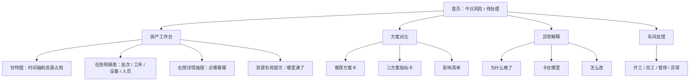
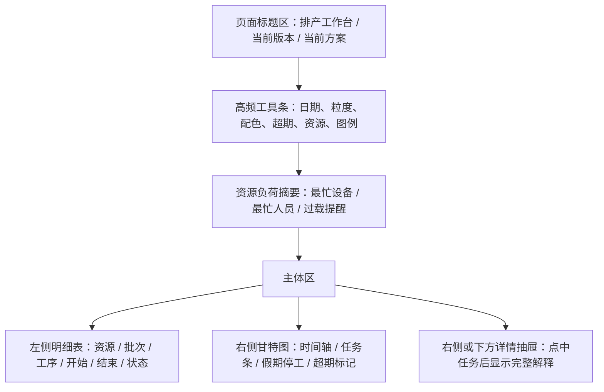

## 问题与范围

这次专题研究回答一个问题：

> 市面上成熟 APS / MES / 计划排程软件的前端页面是怎么设计和排版的？当前项目哪些可以借鉴，哪些不适合照搬？

本轮只做研究，不改业务代码。

调研方式：

- 主代理先按 CodeStable 规则读取项目入口资料。
- 本轮重新创建 16 个全新 Sub Agent。
- 每个 Sub Agent 都被明确要求必须调用 Exa MCP 搜索公开资料。
- Sub Agent 覆盖国外主流 APS、供应链计划平台、中小制造软件、MES 现场反馈、甘特图组件、方案对比、异常解释、国内 APS/MES 和当前项目适配红线。
- 主代理读取当前项目真实前端模板、CSS、JS 和既有 CodeStable 文档，把外部资料和本项目现状做对照。
- 本轮新开的 16 个 Sub Agent 已在结果收集后全部关闭。

说明：

- 工具层没有提供“列出所有旧子代理”的接口，所以主代理无法关闭未知 ID 的旧子代理。
- 本轮使用的是全新的 Sub Agent ID，任务说明不继承旧上下文；完成后逐个关闭。
- 外部产品资料主要来自官方页面、官方文档、官方视频页、官方学习资料和少量可信 UX 资料。
- 公开资料里很多截图不是完整后台，部分产品真实登录后的界面无法直接验证；这类地方在文末标为“证据不足”。

## 速答

成熟 APS 前端不是“宣传型漂亮页面”，而是“计划员每天干活的工作台”。

共同规律非常清楚：

- **甘特图是核心，但不是唯一入口**：专业计划员需要甘特图看时间和资源占用；普通业务用户更需要先看到“今天该处理什么、哪些批次会晚、哪些资源排满了”。
- **表格和甘特图要联动**：左边或下方是订单、工序、资源、状态表；右边或中间是时间轴。点表格能定位甘特条，点甘特条能看到明细。
- **资源负荷要靠近排程结果**：成熟产品通常会把资源负荷、产能过载、瓶颈资源放在甘特图旁边、下方或相邻标签里，而不是只放到一个单独报表里。
- **异常必须从日志里拿出来**：晚交、缺料、资源冲突、产能不足、数据缺失等，应有“异常总览”和“为什么晚了”详情层。
- **多方案对比要先给结论**：不要只给一张指标表。要先告诉用户推荐哪一个、为什么推荐、代价是什么、哪些批次受影响。
- **车间反馈界面要比计划员界面更简单**：现场人员需要卡片、大按钮、少字段；计划员需要表格、筛选、甘特、影响分析。
- **当前项目方向是对的，但信息还分散**：首页、甘特图、方案对比、诊断、资源派工、报表都有基础；下一步不是换皮，而是把“工作台、解释层、联动层”补起来。

建议借鉴路线：

1. 首页加“今日风险 / 待处理”，把统计卡变成可点击入口。
2. 甘特图页做“甘特 + 明细表 + 详情抽屉 + 资源负荷提示”的工作台。
3. 方案对比页在现有表格上方补“推荐方案卡”和“好处/代价/影响清单”。
4. 排产分析页把诊断卡升级成“异常总览”和“为什么晚了”侧栏。
5. 资源派工页作为车间反馈第一入口，先做低门槛开工、完工、暂停、异常上报。

## 本轮 Sub Agent 分工和证据概览

| 子代理 | 调研方向 | 主要结论 |
| --- | --- | --- |
| 01 | 横向主流 APS 前端 | 成熟 APS 以甘特图、资源负荷、方案模拟、表格联动为主 |
| 02 | Siemens Opcenter APS / Preactor | 偏计划员工作台，甘特、验证面板、筛选、资源约束都很重 |
| 03 | PlanetTogether APS | 甘特 + Activity Grid / List + Capacity Plan + What-if 是核心结构 |
| 04 | Asprova APS | 典型“表格 + 甘特 + 属性窗口 + 负荷/库存图” |
| 05 | DELMIA Ortems / Quintiq | 资源负荷矩阵、颜色状态、拖拽影响、瓶颈预警值得借鉴 |
| 06 | SAP PP/DS / Fiori | “左表右甘特”、工具栏、图例、对象页、保存视图是关键 |
| 07 | Oracle Manufacturing / Production Scheduling | 范围选择、指标卡、异常列表、详情钻取、资源负荷联动清楚 |
| 08 | Kinaxis / o9 / Blue Yonder | 大型平台重视场景对比、例外管理、根因和处理建议 |
| 09 | MRPeasy / Katana / JobBOSS 等中小制造软件 | 普通用户入口更偏列表、卡片、状态色，甘特是深入视图 |
| 10 | MES / 车间反馈 | 现场端应是任务卡片 + 大按钮 + 原因下拉，不应是大表格 |
| 11 | 甘特图和资源负荷交互 | 常见结构是顶部工具栏、左表、右时间轴、详情面板、下方负荷 |
| 12 | 多方案对比 | 最适合“先给推荐结论，再给指标差异，再给影响清单” |
| 13 | 异常解释 / Root cause | 成熟产品从异常列表进入原因详情，再进入影响链路 |
| 14 | 国内 APS / MES | 常按“排程、派工、报工、看板、异常”分层，文案偏业务动作 |
| 15 | 首页和导航 | 首页不是欢迎页，而是状态、风险、待办、快捷入口 |
| 16 | 当前项目适配红线 | 不照搬云、实时 IoT、3D、重型 BI、大屏营销式界面 |

## 关键证据

1. 当前项目已有稳定的全站顶层导航，按“首页、排产、工艺、人员、设备、物料、报表、系统”组织：`templates/base.html:53-64`。
2. 当前首页已有四个状态卡，以及“最近排产”和“排产作业 / 基础资料 / 分析复盘”工作区分组：`templates/dashboard.html:4-21`、`templates/dashboard.html:23-86`。
3. 当前页面统一组件已经支持页面标题、说明、操作按钮、上下文条、摘要卡、详情说明等：`templates/components/ui_macros.html:201-251`。
4. 当前甘特图页已有版本、方案、视图切换、周切换、日期范围、时间粒度、配色、批次/资源筛选、仅超期、仅外协、关键工序、关系线等控制：`templates/scheduler/gantt.html:81-158`、`templates/scheduler/gantt.html:185-260`。
5. 当前甘特图明确是查看模式，模拟调整入口仍禁用；JS 也把查看模式设置为只读：`templates/scheduler/gantt.html:163-176`、`static/js/gantt_adapter.js:33-56`。
6. 当前甘特图样式已经有假期/停工背景、超期红边、外协虚线、关键工序外框、悬浮详情尺寸控制：`static/css/aps_gantt.css:43-68`、`static/css/aps_gantt.css:96-137`、`static/css/aps_gantt.css:174-196`。
7. 当前方案对比已经有表格，展示方案标签、方案、状态、失败工序数、超期批次数、总拖期、总工期、换型次数、评分和跳转入口：`templates/scheduler/analysis_parts/_candidate_comparison.html:14-77`。
8. 当前候选方案 ViewModel 已经能给出采用原因、候选角色、关键指标和可跳转链接；但它仍主要输出表格行，不是业务结论卡：`web/viewmodels/scheduler_analysis_candidates.py:28-34`、`web/viewmodels/scheduler_analysis_candidates.py:269-337`。
9. 当前排产分析页已有诊断区，能把诊断项做成摘要卡，并支持“查看诊断依据”和跳转链接：`templates/scheduler/analysis_parts/_diagnostic_sections.html:1-72`。
10. 当前资源派工页已有查询条件、版本/方案上下文、任务数/工时/超期等摘要，并支持“任务明细 / 日历矩阵 / 甘特图”三种标签页：`templates/scheduler/resource_dispatch.html:44-182`、`templates/scheduler/resource_dispatch.html:222-275`。
11. 当前资源负荷报表能按设备和人员展示负荷小时、任务数、可用工时、利用率，但它和甘特图还没有贴在一起：`templates/reports/utilization.html:83-124`、`templates/reports/utilization.html:127-169`。
12. 当前统一 CSS 已经有表格横向滚动、查询表单网格、摘要卡、页面头、工作区网格、资源派工标签等基础排版能力：`static/css/ui_contract.css:660-705`、`static/css/ui_contract.css:862-875`、`static/css/ui_contract.css:1212-1273`、`static/css/ui_contract.css:3356-3368`、`static/css/ui_contract.css:3575-3586`、`static/css/ui_contract.css:4778-4791`。

## 本次加细补充核对

用户反馈“太粗糙”后，主代理又直接调用 Exa MCP 做了一轮补充核对，重点核对两类资料：

1. APS 排产工作台怎么排版。
2. MES / 车间端怎么做开工、完工、暂停和异常反馈。

补充核对后，对本文细化蓝图影响最大的资料如下：

| 来源 | 本文吸收的点 | 对当前项目的意义 |
| --- | --- | --- |
| [SAP Detailed Scheduling Planning Board](https://help.sap.com/doc/saphelp_scm700_ehp02/7.0.2/en-US/64/4dc95360267614e10000000a174cb4/content.htm?no_cache=true) | 计划板左侧选择区、上方工具条、多个图层、资源和产品对象显示 | 证明甘特图不应孤立存在，旁边要有选择、筛选、对象和详情 |
| [Oracle Redwood Gantt for Supply Plans](https://docs.oracle.com/en/cloud/saas/readiness/scm/25d/scp25d/25D-sc-planning-wn-f39800.htm) | 从表格钻取到甘特、甘特下方面板、诊断属性、拖动需有约束 | 支持“表格 + 甘特 + 诊断详情”的工作台结构 |
| [Acumatica Production Schedule Board](https://help.acumatica.com/(W(29))/Wiki/ShowWiki.aspx?pageid=c03a4712-ba0a-48c9-a168-826684b26403) | 工单甘特、工作中心、机器面板、产能 histogram、错过交期提醒 | 支持把资源负荷摘要贴近甘特图，而不是只放报表 |
| [NETRONIC VAPS Three Different Views](https://help.netronic.com/en/visual-advanced-production-scheduler/look-and-feel/three-different-views) | Capacity View、Production Order View、Sales Order View、World View | 支持把计划员视图和业务订单视图区分，不让一个页面承担所有角色 |
| [Visual Advanced Production Scheduler Manual](https://315990.fs1.hubspotusercontent-na1.net/hubfs/315990/2017%20Relaunch/Manuals/For%20D365/VAPS/VAPS%20Manual%201.20.0.0.pdf) | 时间轴、左表、右侧图形区、工作日和非工作日背景、菜单区 | 支持“顶部工具条 + 左表 + 右甘特”的基础排版 |
| [SyteLine Demand Detail Chart APS](https://erp.smcusa.com/SyteLine/Language/en-US/mergedProjects/sl_invprod/forms/system/demand_detail_chart_aps.htm) | 需求树、关键路径、资源负荷条、停机条、信息面板 | 支持“为什么晚了”要能展开到工序、资源、停机和后续影响 |
| [MPDV APS FEDRA](https://us.mpdv.com/products/mip-marketplace/mapp-mpdv-production-planning-with-aps) | 图形计划板、实时生产数据、冲突清单、资源利用率 | 支持把异常冲突做成清单，并和生产反馈连接 |
| [OpenMES Documentation](https://getopenmes.com/documentation/) | 主管流程、操作员流程、工作队列、开工/完工、暂停/阻塞/完成状态 | 支持车间反馈第一版采用任务卡片和明确状态流转 |
| [Oracle MES Workstation](https://docs.oracle.com/cd/E18727_01/doc.121/e13057/T469821T469943.htm) | 派工列表、Job On、Clock In、Clock Out、异常上报 | 支持“开工、暂停、完工、异常”必须记录实际时间和人员 |
| [Oracle MES Supervisor Workbench](https://docs.oracle.com/cd/E26401_01/doc.122/e48906/T469821T469939.htm) | 主管看板、工单状态、甘特、异常解决、重排工单 | 支持计划员端要看到计划 vs 实际和异常影响 |
| [Oracle Process MES Operator Workbench](https://docs.oracle.com/cd/E26401_01/doc.122/e49057/T465565T465571.htm) | 操作员工作台、步骤指引、单击处理任务、批次状态 | 支持现场端要简化，不能让操作员面对复杂排产表 |
| [AVEVA MES](https://www.aveva.com/en/products/manufacturing-execution-system/) | 任务式操作界面、实时生产控制、排程和执行同步 | 支持当前项目后续把资源派工从“看计划”延伸到“反馈执行” |

这些资料共同指向一个结论：

- APS 计划员界面要“密”，因为计划员需要同时看时间、资源、订单、异常和方案。
- 车间操作员界面要“简”，因为现场只需要知道现在做什么、能点什么、出了问题怎么报。
- 方案对比和异常解释不能只放表格，要先把结论、原因、代价和下一步讲清楚。

## 外部前端设计共同规律

### 1. 主页面是“工作台”，不是“欢迎页”

成熟 APS / MES 首页通常直接回答：

- 今天有哪些问题。
- 哪些订单会晚。
- 哪些资源排满了。
- 最新排程版本是什么状态。
- 下一步要处理什么。

可参考来源：

- [Siemens Opcenter APS 2504 Validation Dashboard](https://blogs.sw.siemens.com/opcenter/see-opcenter-aps-2504-in-action/)
- [MRPeasy Dashboard](https://www.mrpeasy.com/et/ressursid/juhend/dashboard/)
- [Oracle Work Execution Work Area](https://docs.oracle.com/en/cloud/saas/supply-chain-and-manufacturing/25a/faumf/overview-of-the-work-execution-work-area.html)
- [Blue Yonder Demand and Supply Planning](https://blueyonder.com/solutions/supply-chain-planning/demand-and-supply-planning)

对当前项目的借鉴：

- 当前首页已有“待排、已排、超期、最近版本”，方向对。
- 但这些卡片还更像展示数字，不够像“可点击的下一步入口”。
- 建议把它们变成动作入口：
  - 点“待排批次”进入执行排产或批次页。
  - 点“超期批次”进入超期清单。
  - 点“最近排产版本”进入排产历史或分析页。
- 再加一个“今日待处理”区域：
  - 最近一次排产失败或部分成功。
  - 存在超期批次。
  - 存在未排批次。
  - 存在停机影响。
  - 存在候选方案对比结果。

### 2. 甘特图是主视图，但要和表格联动

外部产品常见结构：

- 顶部：版本、日期、刷新、缩放、筛选、图例、导出、保存。
- 左侧：资源树、订单表、工序表、工作中心列表。
- 中间或右侧：时间轴和任务条。
- 下方或右侧：任务详情、资源负荷、异常说明。

可参考来源：

- [SAP Fiori Gantt Chart](https://www.sap.com/design-system/fiori-design-web/v1-96/ui-elements/gantt-chart/usage)
- [SAP Advanced Scheduling Board - F5460](https://community.sap.com/t5/supply-chain-management-blog-posts-by-sap/advanced-scheduling-board-f5460/ba-p/13538309)
- [Oracle Manufacturing Scheduler Workbench](https://docs.oracle.com/cd/E18727_01/doc.121/e15190/T473792T473960.htm)
- [Asprova Visual Management](http://www.asprova.com/en/asprova/gantt_chart.html)
- [PlanetTogether Gantt Charts](https://www.planettogether.com/aps/gantt-charts-as-a-tool-for-production-planning-and-control?hs_amp=true)
- [DHTMLX Gantt Resource Management](https://docs.dhtmlx.com/gantt/guides/resource-management/)

对当前项目的借鉴：

- 当前甘特图控制项已经很完整，已经有视图、区间、版本、方案、缩放、配色、筛选。
- 短板不是“没有控制项”，而是：
  - 常用控制藏在“筛选与配色”折叠面板里，计划员要多点一步。
  - 点击任务主要靠弹窗，不是稳定的任务详情区。
  - 资源负荷在报表页，不在甘特图附近。
  - 表格和甘特还不是同一页强联动。

建议第一版做法：

- 把高频控制露出来：
  - 时间粒度。
  - 配色。
  - 仅超期。
  - 资源筛选。
  - 图例。
- 其余低频设置继续放折叠面板。
- 增加“任务详情抽屉”：
  - 点甘特条后右侧或下方固定显示详情。
  - 展示批次、图号、工序、设备、人员、开始结束、交期、是否超期、前后工序、跳转入口。
- 增加“资源负荷提示条”：
  - 先不用复杂图表。
  - 可以在甘特图上方或下方列出本周最满的 5 个资源。
  - 颜色表达：红色过载、黄色接近满负荷、绿色正常、灰色空闲。

### 3. 资源负荷不能只藏在报表里

成熟产品会把资源负荷贴近排程界面：

- PlanetTogether 有 Capacity Plan。
- Asprova 有 Resource Load Graph。
- SAP Fiori Gantt 支持资源利用率图。
- Oracle 有资源负荷与产能相关视图。
- NETRONIC / DHTMLX 这类排程组件也强调资源负荷图或 histogram。

可参考来源：

- [PlanetTogether Training Workbook](https://www.planettogether.com/hubfs/Academy/Training/PT_Training_Workbook.pdf)
- [Asprova e-Learning User Interface](https://lib.asprova.com/en/2-beginners/23-user-interface.html)
- [NETRONIC Resource View](https://help.netronic.com/en/vjs365/basics/the-resource-view)
- [Acumatica Production Schedule Board](https://help.acumatica.com/(W(29))/Wiki/ShowWiki.aspx?pageid=c03a4712-ba0a-48c9-a168-826684b26403)

当前项目现状：

- 资源负荷报表已经能列设备/人员负荷、任务数、可用工时、利用率。
- 但计划员在甘特图页看不到“这台设备到底满不满”的直观提示。

建议第一版做法：

- 不急着做高级资源直方图。
- 先做一个“小型资源负荷摘要”：
  - 最忙设备 Top 5。
  - 最忙人员 Top 5。
  - 每项显示负荷小时、利用率、任务数。
  - 超过阈值用红/黄状态。
  - 提供“去资源排班查看明细”或“去资源负荷报表”入口。

### 4. 方案对比要先讲结论，再给表

外部成熟系统和 UX 资料的共同规律：

- 对比数量不要太多，常见 2-3 个，最多不要让用户同时看太多。
- 顶部先给推荐结论。
- 然后讲“为什么推荐”。
- 再讲“代价和风险”。
- 最后才放表格、图表、甘特跳转。

可参考来源：

- [Oracle Supply Planning Redwood Compare Plans](https://docs.oracle.com/en/cloud/saas/readiness/common/rrdem/redwood-analyze-supply-plans-using-a-configurable-redwood-page.html)
- [Oracle S&OP Redwood Scenario Plan Compare](https://docs.oracle.com/en/cloud/saas/readiness/common/rrdem/redwood-analyze-sales-and-operations-planning-plans-using-a-configurable-redwood-page.html)
- [SAP IBP Response and Supply Planning](https://www.sap.com/products/scm/integrated-business-planning/features/response-and-supply-planning.html)
- [SAP IBP Harmonized Scenario Management Demo](https://www.sap.com/assetdetail/2026/02/da334a97-3b7f-0010-bca6-c68f7e60039b.html)
- [InEight Analyze What-if Schedules](https://learn.ineight.com/integrated_solutions/Content/Business-Processes/Scheduling/Analyze-What-IF/Analyze-What-if-Schedules.htm)
- [NN/g Comparison Tables](https://www.nngroup.com/articles/comparison-tables/?lm=3-types-calculator&pt=article)

当前项目现状：

- 已有“最终采用、原算法最好、重点工序优先最好”三类代表方案。
- 已有失败工序、超期批次、总拖期、总工期、换型次数、评分和跳转链接。
- 已有采用原因短句。
- 但现在主要还是一张明细表，业务用户需要自己推理。

建议第一版做法：

- 在表格上方加“推荐方案卡”：
  - 系统建议采用：某某方案。
  - 推荐原因：例如“超期批次数没有增加，总拖期更少，失败工序没有增加”。
  - 代价：例如“换型次数多 2 次，M-03 设备更忙”。
  - 需要关注：例如“B202605-018 比原算法晚 6 小时”。
- 把三套方案做成并排小卡：
  - 每张卡只放 4-6 个指标。
  - 与最终采用或原算法相比的差值要直接写出来。
  - 不要让评分成为主角。
- 增加影响清单：
  - 提前最多的批次。
  - 延后最多的批次。
  - 新增超期的批次。
  - 消失超期的批次。
  - 设备负荷变化最大的资源。

### 5. 异常解释要变成“为什么晚了、卡在哪里、怎么改”

成熟产品通常不是只写“晚了”，而是三层展开：

1. 异常列表：哪些订单/批次有问题。
2. 原因详情：为什么有问题。
3. 影响链路：卡在哪道工序、哪个资源、哪个物料，影响了谁。

可参考来源：

- [Oracle Redwood Scheduling Diagnostics](https://docs.oracle.com/en/cloud/saas/readiness/scm/26b/scp26b/26B-sc-planning-wn-f42968.htm)
- [Oracle Redwood Manage Planning Exceptions](https://docs.oracle.com/en/cloud/saas/readiness/scm/25b/demand25b/25B-demand-wn-f36769.htm)
- [Microsoft Dynamics 365 Supply Schedule](https://learn.microsoft.com/en-us/dynamics365/supply-chain/master-planning/supply-schedule)
- [Microsoft Net Requirements and Pegging](https://learn.microsoft.com/en-us/dynamics365/supply-chain/master-planning/planning-optimization/net-requirements)
- [Siemens Opcenter APS 2510](https://blogs.sw.siemens.com/opcenter/whats-new-in-opcenter-aps-2510/)
- [o9 PO delay example](https://o9solutions.com/videos/the-o9-unique-control-tower-capability-po-delay-example)

当前项目现状：

- 已有排产诊断区。
- 已有诊断项摘要、依据明细和链接。
- 已有超期、资源负荷、停机影响、关键链等材料。
- 但这些材料还没有按“单个延期批次”收成一条业务解释。

建议第一版做法：

- 排产分析页增加“异常总览”：
  - 晚交。
  - 物料不足。
  - 产能不足。
  - 资源冲突。
  - 数据缺失。
  - 排不进时间窗。
- 每类异常显示数量和受影响批次。
- 点异常后打开“为什么晚了”详情：
  - 这个批次应完成时间。
  - 当前计划完成时间。
  - 晚了多久。
  - 第一卡点。
  - 卡点类型。
  - 涉及工序。
  - 涉及设备/人员/物料。
  - 后续受影响工序。
  - 可以点的下一步：定位甘特图、查看资源占用、查看物料缺口、复制说明。

第一版不建议做：

- 不做 AI 自动改计划。
- 不做复杂图形关键路径。
- 不做一键自动重排。
- 不用 `pegging`、`gating factor` 等英文术语。

页面文案示例：

- “这批晚了 14 小时，第一卡点是第 30 工序。”
- “第 30 工序排在设备 M-03，但 M-03 当天已经排满。”
- “受影响：后续 2 道工序整体后移。”
- “可处理：查看 M-03 占用、尝试换设备、接受延期并导出说明。”

### 6. 车间反馈要做“现场能点得动”的页面

MES / shop floor execution 类产品共同规律：

- 现场页面不做复杂大表格。
- 第一屏是“今天/当前工位要做什么”。
- 操作按钮大而清楚。
- 异常先选原因，再补备注。
- 计划员页面再看计划 vs 实际、异常原因、暂停时长、影响交期。

可参考来源：

- [Tulip Complete an app](https://support.tulip.co/r230/docs/how-to-complete-an-app)
- [Tulip App-Based Work Instructions](https://support.tulip.co/docs/app-based-work-instructions)
- [Sepasoft OEE Downtime Module Features](https://docs.sepasoft.com/articles/user-manual/oee-downtime-module-features/)
- [AVEVA Start or end a job](https://docs.aveva.com/bundle/manufacturing-execution-system/page/25948.html)
- [Plex Connected Worker](https://plex.rockwellautomation.com/en-us/products/connected-worker.html)
- [Odoo Shop Floor overview](https://www.odoo.com/documentation/19.0/applications/inventory_and_mrp/manufacturing/shop_floor/shop_floor_overview.html)
- [Katana Shop Floor Control App](https://support.katanamrp.com/en/articles/5967424-using-the-shop-floor-control-app)

当前项目现状：

- 资源派工页已经有任务明细、日历矩阵、甘特图。
- 它很适合作为“计划下发 + 现场反馈”的入口。
- 但当前还没有真正的开工、完工、暂停、异常上报。

建议第一版做法：

- 在资源派工页增加“车间反馈视图”或“今日任务卡片”。
- 每个任务卡显示：
  - 批次。
  - 图号。
  - 工序。
  - 设备/人员。
  - 计划开始/结束。
  - 当前状态。
  - 是否超期。
- 按状态显示按钮：
  - 未开工：开工。
  - 生产中：暂停/报停、完工、报异常。
  - 暂停中：继续生产、完工。
  - 已完工：只看记录，不允许误操作。
- 完工弹窗只收：
  - 完成数量。
  - 报废数量。
  - 异常原因。
  - 备注。
- 异常/暂停原因下拉：
  - 设备故障。
  - 缺料。
  - 质量问题。
  - 换型等待。
  - 人员问题。
  - 其他。

### 7. 国内产品的借鉴重点是“业务顺序”和“中文动作”

国内 APS/MES 公开资料常把能力拆成：

- 计划排程。
- 任务派工。
- 生产执行/报工。
- 质量/设备/物料。
- 现场看板/异常看板。

可参考来源：

- [黑湖智造 MES](https://www.blacklake.cn/zhuanti/mes)
- [鼎捷 MES](https://www.digiwin.com/software/smessystem.html)
- [鼎捷 APS](https://www.digiwin.com/project/APS/APS.html)
- [用友 U9 cloud 智能工厂](https://u9cloud.yonyou.com/news/detailes/news/893.html)
- [金蝶云星空智慧工厂云](https://m.kingdee.com/products/galaxy_smart_factory.html)
- [金蝶 MES 看板设置文档](https://vip.kingdee.com/article/395247756979066112)
- [赛意 SIE MOM](https://www.chinasie.com/product/673.html)

对当前项目的借鉴：

- 页面可以更按业务顺序组织：
  1. 排程前检查。
  2. 开始排程。
  3. 看甘特图。
  4. 查延期/冲突。
  5. 处理异常。
  6. 导出或交接结果。
- 页面标题和按钮尽量用业务动作：
  - “开始排产”。
  - “查看排程结果”。
  - “处理排产异常”。
  - “查看缺料和资源冲突”。
  - “导出交接清单”。
- 少用抽象词：
  - “调度算法结果”。
  - “资源约束分析”。
  - “启发式配置”。
  - “Scenario / What-if / Pegging”等英文词。

### 8. 不适合当前项目照搬的东西

当前项目有硬约束：

- Win7 x64。
- Python 3.8。
- 离线交付。
- 前端静态资源本地打包。
- 目标用户是计划调度员、工艺员和车间业务用户。

不建议照搬：

- 云登录、注册、订阅、外部账号体系。
- 必须联网的地图、CDN、BI、AI 服务。
- 实时 IoT / MES / ERP 数据流，除非项目真实接入。
- 3D / VR / GIS / 数字孪生。
- 电视墙大屏直接搬到普通操作页面。
- 重型 BI 可配置组件。
- 完全自由拖拽改正式计划。
- 大量隐藏右键菜单。
- 多窗口桌面软件式复杂布局。
- 官网页面的营销风格、大标题、渐变、口号。

可参考但要降级：

- 大屏看板：只借鉴“少指标、远距离可读”，不要做主操作页。
- 数字孪生：最多降级成二维资源/工序示意图。
- What-if：先降级成复制版本和方案对比，不做企业级仿真沙盒。
- 资源负荷图：先做 Top 资源和颜色状态，不急着做复杂 histogram。
- 拖拽排程：先做模拟模式和影响预览，不直接改正式计划。

## 当前项目页面级建议

### 首页

当前已有：

- 待排批次。
- 已排批次。
- 超期批次。
- 最近排产版本。
- 最近排产摘要。
- 常用工作区分组。

建议补：

- 统计卡可点击。
- 新增“今日待处理”列表：
  - 有多少待排批次。
  - 有多少超期批次。
  - 最近一次排产是否成功。
  - 是否有方案对比结果可看。
  - 是否有停机影响。
- 首页入口继续保留“排产作业 / 基础资料 / 分析复盘”，不要改成复杂角色门户。

### 甘特图页

当前已有：

- 设备/人员视图。
- 周切换。
- 日期范围。
- 版本。
- 方案。
- 时间粒度。
- 配色。
- 批次筛选。
- 资源筛选。
- 仅超期。
- 仅外协。
- 高亮关键工序。
- 工序关系线。
- 查看模式和模拟调整入口。

建议补：

- 高频控制外露。
- 图例更靠近甘特图。
- 右侧或下方任务详情抽屉。
- 表格和甘特联动。
- 资源负荷摘要。
- 点击超期任务后显示“为什么红”。

### 排产优化分析页

当前已有：

- 版本选择。
- 当前版本概览。
- warnings。
- 诊断区。
- 指标卡。
- 方案对比表。
- 优化过程。
- 趋势图。

建议补：

- 把诊断区改造成更清楚的异常入口：
  - 晚交。
  - 资源冲突。
  - 设备停机。
  - 物料未齐。
  - 排不进时间窗。
- 异常详情要能定位到批次、工序、资源。
- 方案对比表上方加推荐结论卡。
- 趋势图不要成为主角，主角应是“这次排产哪里有问题、怎么处理”。

### 方案对比

当前已有：

- 三类代表方案。
- 失败工序数。
- 超期批次数。
- 总拖期。
- 总工期。
- 换型次数。
- 评分。
- 跳转到甘特图、周计划、资源排班。

建议补：

- 推荐方案卡。
- 三方案并排指标卡。
- 好处/代价/风险。
- 批次级影响清单。
- 设备/人员负荷变化清单。
- 把评分降级为内部参考，不作为业务主语言。

### 报表中心

当前已有：

- 超期清单。
- 资源负荷与利用率。
- 停机影响统计。

建议补：

- 报表中心更像“风险入口页”：
  - 顶部显示最新版本。
  - 顶部显示超期数量。
  - 卡片显示每个报表解决什么问题。
  - 超期清单和资源负荷之间要有相互跳转。

### 资源派工页

当前已有：

- 查询条件。
- 人员/设备/班组视角。
- 周/月/自定义区间。
- 版本和方案。
- 任务明细。
- 日历矩阵。
- 甘特图。

建议补：

- 车间反馈入口。
- 任务卡片视图。
- 开工、暂停、继续、完工、报异常按钮。
- 完工/异常弹窗。
- 计划 vs 实际对比列。
- 状态颜色：
  - 灰色未开工。
  - 绿色生产中。
  - 黄色暂停。
  - 红色异常。
  - 蓝色已完工。

## 详细落地蓝图

这一节把上面的研究结论继续往下拆。

前面的内容回答“别人怎么做、我们差在哪里”。这一节回答“如果后续真的要改页面，第一屏怎么排、每个区域放什么、按钮怎么叫、用户点完发生什么”。

为了避免后续实现跑偏，下面统一按“业务用户能看懂、计划员能干活、Win7 离线能交付”的标准写。

### 0. 总体页面骨架

成熟 APS 的页面不是一页一页孤立的。更像一个连续工作流程：

1. 首页先告诉用户今天哪里危险。
2. 用户点进排产工作台，看甘特图和明细。
3. 用户发现晚了，进入异常解释，看原因和卡点。
4. 用户要选方案，进入方案对比，看推荐、好处和代价。
5. 用户要下发执行，进入资源派工。
6. 车间开工、完工、暂停、异常反馈后，计划员再回来复盘计划和实际差距。

建议页面都使用同一套基本骨架：

| 区域 | 放什么 | 目的 | 当前项目可借用 |
| --- | --- | --- | --- |
| 顶部导航 | 首页、排产、工艺、人员、设备、物料、报表、系统 | 保持全站位置感 | `templates/base.html` |
| 页面标题区 | 页面名称、用途短句、主按钮 | 告诉用户“这是干什么的” | `ui_page_header` |
| 上下文条 | 当前版本、方案、时间范围、数据时间 | 防止用户看错版本 | `ui_context_bar` |
| 高频工具条 | 时间粒度、视图、筛选、图例、刷新、导出 | 把每天会点的东西放出来 | 现有表单控件和按钮样式 |
| 主工作区 | 甘特、表格、卡片、异常列表 | 承载主操作 | 现有页面布局和表格 |
| 详情区 | 点中一条任务、一条异常或一个方案后显示详情 | 避免用户跳来跳去 | 可新增右侧或下方详情面板 |
| 底部说明 | 数据口径、更新时间、空状态说明 | 让用户知道数字从哪来 | 现有帮助文案样式 |

不要把页面做成宣传页。

具体来说：

- 不需要大横幅。
- 不需要很大的口号。
- 不需要渐变背景。
- 不需要为了好看塞很多装饰图。
- 不需要把每个区域都放进一层又一层卡片。

APS 页面更重要的是“扫一眼知道风险，点一下看到原因，再点一下能处理”。

### 1. 首页详细蓝图

首页的目标不是“欢迎使用系统”。首页应该像计划员早上打开系统的值班台。

它第一眼要回答五个问题：

1. 今天有没有没排的批次。
2. 已排计划里有没有会晚的批次。
3. 最近一次排产是不是成功。
4. 有没有值得马上看的推荐方案。
5. 车间有没有开工、完工、暂停、异常反馈。

#### 1.1 首页第一屏建议排版

建议从上到下分成四层：

| 层级 | 页面区域 | 建议内容 | 用户看完应该知道什么 |
| --- | --- | --- | --- |
| 第一层 | 状态卡 | 待排批次、已排批次、超期批次、最近版本 | 今天整体情况严重不严重 |
| 第二层 | 今日待处理 | 按风险排序的待办列表 | 现在最该点哪里 |
| 第三层 | 最近排产结果 | 最近版本、采用方案、是否有超期、是否有异常 | 最新一次排程是否能交接 |
| 第四层 | 工作区入口 | 排产作业、基础资料、分析复盘、车间反馈 | 下一步能做哪些事情 |

建议视觉层级：

- 状态卡仍然保留，但每张卡要变成能点的入口。
- “超期批次”卡如果数量大于 0，要比其他卡更醒目。
- “今日待处理”不要做成普通公告，要做成可点击清单。
- 每条待处理都要有“去处理”按钮或整行可点击。

#### 1.2 首页状态卡字段

| 卡片 | 主数字 | 副文案 | 点击后去哪里 | 状态颜色 |
| --- | --- | --- | --- | --- |
| 待排批次 | 待排数量 | “还有 X 个批次没有进入计划” | 批次列表或开始排产页 | 黄色 |
| 已排批次 | 已排数量 | “最近版本已覆盖 X 个批次” | 甘特图页 | 绿色或蓝色 |
| 超期批次 | 超期数量 | “有 X 个批次晚于交期” | 超期清单或异常解释 | 红色 |
| 最近版本 | 版本号或日期 | “采用方案：X，状态：成功/部分成功/失败” | 排产分析页 | 按状态变化 |

如果没有数据，不要只显示 `0`。

空状态建议写成：

- “当前没有待排批次，可以先检查工艺、设备和人员资料是否完整。”
- “当前没有超期批次，最近一次排产结果可以直接进入甘特图查看。”
- “还没有排产版本，请先导入订单并执行排产。”

#### 1.3 今日待处理列表

今日待处理建议按严重程度排序，不按创建时间排序。

推荐排序：

1. 排产失败或部分失败。
2. 新增超期批次。
3. 关键工序卡住。
4. 资源过载。
5. 停机影响。
6. 物料或基础数据缺失。
7. 有未确认方案。

列表字段：

| 字段 | 示例 | 说明 |
| --- | --- | --- |
| 类型 | 超期 / 资源 / 停机 / 方案 / 数据 | 用户先知道问题类别 |
| 标题 | “3 个批次会晚于交期” | 用业务语言写，不写内部错误码 |
| 影响 | “最晚 B202605-018 晚 14 小时” | 让用户知道影响大小 |
| 建议动作 | “查看为什么晚了” | 告诉用户下一步 |
| 入口 | 按钮或整行点击 | 直接跳对应页面 |

示例文案：

- “3 个批次会晚于交期，最晚晚 14 小时。”
- “M-03 本周利用率 96%，有 5 道工序集中在周三。”
- “最近一次排产采用了‘重点工序优先’，但换型次数增加 2 次。”
- “B202605-018 第 30 工序被 M-03 卡住，建议先看资源占用。”

#### 1.4 首页不要做的事

- 不要把首页做成一堆入口按钮，用户不知道先点哪个。
- 不要只放统计数字，不告诉用户数字代表什么问题。
- 不要把“最近排产版本”藏在页面底部。
- 不要把超期和异常放到报表里才看得到。
- 不要在首页讲算法、评分、内部配置。

### 2. 排产工作台和甘特图详细蓝图

排产工作台是整个 APS 的主战场。

当前项目已经有甘特图页，基础非常好。下一步不是重做甘特图，而是把它从“查看图”升级成“排产工作台”。

#### 2.1 建议页面布局

第一版推荐使用“上方控制 + 中间甘特 + 下方详情”的结构。

原因很简单：

- 当前项目已有甘特图主体，改动较小。
- 右侧抽屉在窄屏上容易挤压甘特图。
- 下方详情更适合 Win7 上的老显示器，横向空间更稳。

如果后续确认用户屏幕普遍宽，可以再改成右侧详情抽屉。

#### 2.2 高频控制和低频控制

当前甘特图已有很多控制项。问题不是少，而是要分层。

建议外露的高频控制：

| 控制 | 为什么外露 | 默认值建议 |
| --- | --- | --- |
| 版本 | 用户必须确认看的是哪次排产 | 最新版本 |
| 方案 | 用户必须知道看的是哪个方案 | 最终采用 |
| 日期范围 | 计划员每天都会切时间 | 最近 7 天或当前周 |
| 时间粒度 | 小时 / 天切换频繁 | 天，必要时小时 |
| 设备/人员视图 | 计划员经常切资源角度 | 设备视图 |
| 仅看超期 | 查问题最常用 | 默认关闭 |
| 资源筛选 | 找某台设备或某个人 | 默认全部 |
| 图例 | 解释颜色和边框 | 常驻或一键展开 |

继续放在折叠面板里的低频控制：

- 外协过滤。
- 批次多选。
- 是否显示关系线。
- 是否高亮关键工序。
- 颜色策略细项。
- 导出高级设置。

#### 2.3 左侧明细表字段

甘特图旁边必须有表格。原因是甘特条很适合看时间，但不适合读完整信息。

左侧或下方明细表建议字段：

| 字段 | 示例 | 用途 |
| --- | --- | --- |
| 资源 | M-03 | 看这道工序在哪台设备或哪个人上 |
| 批次 | B202605-018 | 方便搜索和交接 |
| 图号/产品 | P-1008 | 业务识别 |
| 工序 | 30 精加工 | 看卡在哪道工序 |
| 计划开始 | 05-24 08:00 | 看排程位置 |
| 计划结束 | 05-24 18:00 | 看完成时间 |
| 交期 | 05-24 12:00 | 判断是否晚 |
| 状态 | 正常 / 超期 / 外协 / 关键 | 快速识别风险 |
| 操作 | 定位 / 详情 | 跳到甘特条和详情 |

交互要求：

- 点表格行，甘特条高亮。
- 点甘特条，表格行高亮。
- 表格的“定位”按钮能把甘特滚到对应时间和资源。
- 如果任务超期，表格状态不要只显示红点，要写“超期 6 小时”。

#### 2.4 甘特图颜色规则

颜色不能太多，否则用户会看晕。

推荐第一版只保留 5 类视觉信号：

| 视觉信号 | 表达什么 | 建议样式 |
| --- | --- | --- |
| 任务条填充色 | 批次、资源或状态 | 继续沿用现有配色 |
| 红色边框 | 超期 | 边框比填充更重要 |
| 虚线边框 | 外协 | 不改变主色，叠加虚线 |
| 深色外框 | 关键工序 | 不和超期红冲突 |
| 灰色背景 | 假期、停工、不可用时段 | 放在时间背景层 |

不要新增太多颜色含义。

比如不要同时用颜色表达批次、状态、资源、优先级、风险和人员。一个颜色系统只承担一个主要含义，其他信息用边框、图标、标签表达。

#### 2.5 任务详情抽屉

点中任务后，详情区要回答四件事：

1. 这是什么任务。
2. 它排在什么时候、排给谁。
3. 它有没有风险。
4. 用户下一步能做什么。

详情区建议分组：

| 分组 | 字段 |
| --- | --- |
| 基本信息 | 批次、图号、产品、工序、数量、客户或交付对象 |
| 时间信息 | 计划开始、计划结束、交期、是否超期、超期时长 |
| 资源信息 | 设备、人员、班组、外协标记 |
| 上下游 | 上道工序、下道工序、前置关系、后续影响 |
| 风险说明 | 为什么红、卡在哪里、是否关键工序、是否停机影响 |
| 操作入口 | 查看异常解释、查看资源负荷、跳转资源派工、复制交接说明 |

详情区文案示例：

- “这道工序计划在 M-03 上生产，结束时间晚于交期 6 小时。”
- “主要原因是 M-03 在同一天还有 4 道工序，当前利用率接近满负荷。”
- “后续还有 2 道工序会被一起推迟。”
- “可以先查看 M-03 资源占用，或在模拟方案里尝试换设备。”

#### 2.6 资源负荷摘要

资源负荷不一定第一版就做复杂图。

建议先做一个贴在甘特图附近的小摘要：

| 字段 | 示例 |
| --- | --- |
| 资源 | M-03 |
| 类型 | 设备 |
| 任务数 | 12 |
| 负荷小时 | 46.5 小时 |
| 可用小时 | 48 小时 |
| 利用率 | 96.9% |
| 风险 | 接近满负荷 |
| 入口 | 查看资源排班 |

展示方式：

- 只显示 Top 5 最忙设备和 Top 5 最忙人员。
- 超过 90% 显示红色。
- 80% 到 90% 显示黄色。
- 低于 80% 显示正常。
- 如果可用小时为 0，要显示“无可用工时”，不要算成奇怪百分比。

#### 2.7 甘特图第一版验收标准

第一版做到这些就足够有价值：

- 用户能一眼看出当前版本、方案和时间范围。
- 用户能快速切换设备/人员视图。
- 用户能点一个超期任务，看到“为什么红”。
- 用户能从任务详情跳到异常解释或资源排班。
- 用户能看到最忙资源，不需要再单独打开报表猜。
- 现有只读模式继续保留，不误导用户以为拖动就能改正式计划。

### 3. 方案对比详细蓝图

用户已经明确说过“多方案对比还不够业务用户直观”。这块要重点改。

当前项目已经有候选方案表。表本身不是问题，问题是业务用户不想自己推理。

方案对比页应该先给一句人话：

> 系统建议采用 A 方案，因为它让超期更少；代价是 M-03 更忙，换型次数多 2 次。

#### 3.1 页面结构

建议从上到下：

1. 推荐方案卡。
2. 三个方案并排摘要卡。
3. 关键指标对比表。
4. 批次级影响清单。
5. 资源影响清单。
6. 跳转入口。

#### 3.2 推荐方案卡

推荐方案卡必须放在表格上方。

字段建议：

| 字段 | 示例 | 说明 |
| --- | --- | --- |
| 推荐方案 | 重点工序优先 | 直接说采用谁 |
| 推荐理由 | 超期批次数减少 2 个，总拖期减少 18 小时 | 讲好处 |
| 代价 | 换型次数增加 2 次，M-03 利用率升到 96% | 讲代价 |
| 需要关注 | B202605-018 比原算法晚 6 小时 | 讲风险 |
| 适用场景 | 更适合优先保交期 | 帮用户判断是否符合业务目标 |
| 下一步 | 查看甘特图 / 查看影响清单 / 采用说明 | 给入口 |

文案不要写：

- “score = 0.87”
- “heuristic 优于 baseline”
- “candidate role is best_critical”

要写：

- “这个方案更保交期。”
- “这个方案牺牲了一点换型次数。”
- “如果车间更怕频繁换型，可以再看原算法方案。”

#### 3.3 三方案并排摘要卡

三张卡建议固定顺序：

1. 最终采用。
2. 原算法最好。
3. 重点工序优先最好。

每张卡只放最关键的 5 个指标：

| 指标 | 为什么放 |
| --- | --- |
| 超期批次数 | 业务最关心 |
| 总拖期 | 看整体晚了多少 |
| 失败工序数 | 看方案是否可执行 |
| 总工期 | 看整体完成时间 |
| 换型次数 | 看车间执行代价 |

每个指标最好显示差值：

- “超期 2 个，比原算法少 1 个”
- “总拖期 18 小时，比原算法少 6 小时”
- “换型 12 次，比原算法多 2 次”

如果没有对照数据，就写“暂无对照”，不要留空。

#### 3.4 批次级影响清单

这张表是业务用户最容易看懂的地方。

建议字段：

| 字段 | 示例 |
| --- | --- |
| 批次 | B202605-018 |
| 图号/产品 | P-1008 |
| 原算法完成 | 05-24 12:00 |
| 当前方案完成 | 05-24 18:00 |
| 变化 | 晚 6 小时 |
| 是否超期变化 | 新增超期 / 取消超期 / 不变 |
| 主要变化原因 | 换到 M-03 后等待资源 |
| 入口 | 定位甘特图 |

排序建议：

1. 新增超期在最上面。
2. 晚得最多的在前面。
3. 取消超期的放在第二组。
4. 提前但不影响交期的放后面。

#### 3.5 资源影响清单

方案对比不能只看订单，还要看车间能不能承受。

建议字段：

| 字段 | 示例 |
| --- | --- |
| 资源 | M-03 |
| 类型 | 设备 |
| 原方案利用率 | 82% |
| 当前方案利用率 | 96% |
| 变化 | 增加 14% |
| 风险 | 接近满负荷 |
| 影响说明 | 周三 08:00 到 18:00 连续排满 |
| 入口 | 查看资源排班 |

#### 3.6 方案对比第一版验收标准

- 用户不用看完整表，就能知道系统推荐哪个方案。
- 用户能知道推荐方案的好处和代价。
- 用户能看到哪些批次提前、哪些批次延后。
- 用户能看到哪些设备或人员变忙。
- 所有指标都用中文解释，不用算法词当主语言。
- 原表格仍保留，给需要细看的人用。

### 4. 异常解释详细蓝图

用户明确点出的第二个方向是“缺少为什么晚了、卡在哪里、怎么改的解释层”。

这个解释层不是简单加一段文字。它应该是一套从总览到详情的页面能力。

#### 4.1 异常总览

异常总览建议放在排产分析页，也可以在首页“今日待处理”里露出摘要。

异常分类：

| 分类 | 用户看到的名字 | 说明 |
| --- | --- | --- |
| late | 晚交风险 | 完成时间晚于交期 |
| resource_overload | 资源过载 | 设备或人员利用率过高 |
| resource_conflict | 资源冲突 | 同一时间排了多个任务或资源不可用 |
| downtime | 停机影响 | 设备停机、假期、班次不可用 |
| material_shortage | 物料未齐 | 缺料或物料时间晚 |
| predecessor_late | 上道工序延迟 | 前序工序推迟导致后序晚 |
| unscheduled | 排不进去 | 批次或工序没有被排入计划 |
| data_missing | 数据缺失 | 工艺、设备、人员、工时等基础数据缺失 |

异常卡字段：

| 字段 | 示例 |
| --- | --- |
| 异常类型 | 晚交风险 |
| 数量 | 3 个批次 |
| 最严重影响 | 最晚 B202605-018 晚 14 小时 |
| 第一处理建议 | 查看卡点工序 |
| 入口 | 查看详情 |

#### 4.2 单个延期批次详情

详情页或详情抽屉要分成三段：

1. 为什么晚了。
2. 卡在哪里。
3. 怎么改。

字段建议：

| 分组 | 字段 |
| --- | --- |
| 延期结果 | 批次、交期、计划完成、晚了多久 |
| 第一卡点 | 工序、设备/人员、计划开始、计划结束、等待时长 |
| 原因判断 | 资源过载、停机、前序晚、缺料、排不进去、数据缺失 |
| 影响链路 | 后续工序、受影响批次、是否影响客户交期 |
| 可处理动作 | 定位甘特、查看资源占用、查看物料、查看前序、复制说明 |

示例文案：

- “B202605-018 晚了 14 小时。”
- “第一卡点是第 30 工序，计划使用 M-03。”
- “M-03 在 05-24 已经排了 4 道工序，空闲时间不足，所以这道工序被推到晚上。”
- “后续第 40、50 工序会一起后移。”
- “可以尝试换设备、调整前序顺序，或接受延期并导出说明。”

#### 4.3 “为什么晚了”的第一版规则

第一版不需要做很复杂的智能分析，可以先用可解释的规则。

规则建议：

| 判断顺序 | 如果满足 | 解释文案 |
| --- | --- | --- |
| 1 | 计划完成时间晚于交期 | “当前计划完成时间晚于交期，所以该批次被标为超期。” |
| 2 | 前序工序结束时间已经很晚 | “前序工序结束较晚，后续工序没有足够时间完成。” |
| 3 | 资源利用率超过阈值 | “主要资源接近满负荷，任务需要等待资源空出来。” |
| 4 | 命中停机或不可用时段 | “计划时间段内存在停机、假期或班次不可用。” |
| 5 | 物料时间晚于计划开始 | “物料到齐时间晚于工序计划开始时间。” |
| 6 | 工序没有排上 | “该工序没有进入有效排程，需要检查基础数据或时间窗。” |
| 7 | 无法判断 | “系统暂时无法判断明确原因，请查看工序、资源和物料明细。” |

#### 4.4 “怎么改”不要过度承诺

第一版只能给建议入口，不要承诺系统能自动解决。

可以给：

- “查看资源占用”
- “定位甘特图”
- “查看前序工序”
- “查看物料缺口”
- “复制延期说明”
- “进入模拟方案”

暂时不要给：

- “一键修复”
- “自动改到最优”
- “自动换设备并采用”
- “自动通知所有人”

#### 4.5 异常解释第一版验收标准

- 用户点一个超期批次，能看到晚了多久。
- 用户能看到第一卡点是哪道工序。
- 用户能看到涉及哪个设备、人员或物料。
- 用户能看到后续影响。
- 用户能获得下一步入口。
- 解释文案用业务语言，不用内部算法名。

### 5. 车间反馈详细蓝图

用户明确点出的第三个方向是“缺少车间实际开工、完工、异常反馈”。

这件事要分清两种人：

- 计划员看的是排程、资源、风险、计划和实际差距。
- 车间人员看的是今天要做什么、现在能点什么、出问题怎么报。

同一个页面可以共享数据，但界面不应该完全一样。

#### 5.1 资源派工页增加两个视角

建议在资源派工页新增一个标签：

- `任务明细`
- `日历矩阵`
- `甘特图`
- `车间反馈`

也可以把“车间反馈”做成独立页面，但第一版放在资源派工页更省改动，因为这里已经有版本、方案、资源、时间范围和任务数据。

#### 5.2 车间反馈第一屏

第一屏建议以任务卡片为主。

卡片字段：

| 字段 | 示例 |
| --- | --- |
| 批次 | B202605-018 |
| 图号/产品 | P-1008 |
| 工序 | 30 精加工 |
| 设备 | M-03 |
| 人员 | 张三 |
| 计划开始 | 05-24 08:00 |
| 计划结束 | 05-24 18:00 |
| 当前状态 | 未开工 / 生产中 / 暂停 / 异常 / 已完工 |
| 计划偏差 | 未到时间 / 已晚 2 小时 / 提前 |
| 异常原因 | 设备故障 / 缺料 / 质量问题 |

卡片按钮按状态变化：

| 状态 | 主按钮 | 次按钮 | 禁用或隐藏 |
| --- | --- | --- | --- |
| 未开工 | 开工 | 报异常 | 完工、继续 |
| 生产中 | 完工 | 暂停、报异常 | 开工 |
| 暂停中 | 继续生产 | 完工、报异常 | 开工 |
| 异常中 | 继续生产 | 完工、查看异常 | 开工 |
| 已完工 | 查看记录 | 复制交接 | 开工、暂停、完工 |

按钮文案要直接：

- 用“开工”，不要用“启动任务实例”。
- 用“完工”，不要用“提交执行结果”。
- 用“暂停”，不要用“创建停机事件”。
- 用“报异常”，不要用“新建异常工单”。

#### 5.3 开工弹窗

第一版开工弹窗越简单越好。

字段建议：

| 字段 | 默认值 | 是否必填 |
| --- | --- | --- |
| 实际开始时间 | 当前时间 | 必填 |
| 操作人员 | 当前登录用户或选择人员 | 必填 |
| 设备 | 计划设备 | 必填 |
| 备注 | 空 | 选填 |

开工成功后：

- 任务状态变成“生产中”。
- 记录实际开始时间。
- 计划员页面能看到“已开工”。
- 如果实际开始晚于计划开始，显示“晚开工 X 小时”。

#### 5.4 完工弹窗

字段建议：

| 字段 | 默认值 | 是否必填 |
| --- | --- | --- |
| 实际完成时间 | 当前时间 | 必填 |
| 完成数量 | 计划数量 | 必填 |
| 报废数量 | 0 | 选填 |
| 异常原因 | 无 | 条件必填 |
| 备注 | 空 | 选填 |

完工成功后：

- 任务状态变成“已完工”。
- 记录实际完成时间。
- 计算计划 vs 实际偏差。
- 如果晚完工，回写给排产分析或资源派工。

#### 5.5 暂停和异常上报

暂停弹窗字段：

| 字段 | 示例 |
| --- | --- |
| 暂停开始时间 | 当前时间 |
| 原因 | 设备故障、缺料、质量问题、换型等待、人员问题、其他 |
| 预计恢复时间 | 可选 |
| 备注 | 可选 |

异常上报字段：

| 字段 | 示例 |
| --- | --- |
| 异常类型 | 设备、物料、质量、人员、工艺、其他 |
| 严重程度 | 一般 / 影响交期 / 已停工 |
| 异常说明 | 用户输入 |
| 关联任务 | 当前任务自动带出 |
| 图片或附件 | 第一版可不做 |

第一版不建议做图片上传。Win7 离线环境下，图片上传、压缩、存储、打包都要额外验证。可以后续再加。

#### 5.6 计划 vs 实际对比

计划员视角必须看到计划和实际差距。

资源派工任务明细建议新增列：

| 字段 | 示例 |
| --- | --- |
| 计划开始 | 05-24 08:00 |
| 实际开始 | 05-24 08:32 |
| 开工偏差 | 晚 32 分钟 |
| 计划结束 | 05-24 18:00 |
| 实际结束 | 05-24 19:10 |
| 完工偏差 | 晚 1 小时 10 分 |
| 当前状态 | 已完工 |
| 异常时长 | 40 分钟 |
| 异常原因 | 设备故障 |

这样计划员才能判断：

- 是计划本来排得太紧。
- 还是现场晚开工。
- 还是生产中发生异常。
- 还是工时估计不准。

#### 5.7 车间反馈第一版验收标准

- 车间人员能看到今天自己的任务。
- 未开工任务能点“开工”。
- 生产中任务能点“暂停、完工、报异常”。
- 暂停任务能点“继续生产”。
- 完工后能看到实际完成时间。
- 计划员能看到计划开始/结束和实际开始/结束。
- 异常原因是下拉选项，不让用户每次从零输入。
- 任何操作都有成功提示和失败提示。

### 6. 报表中心详细蓝图

报表中心现在已经有超期、资源负荷、停机影响统计。下一步要让它从“报表入口”变成“风险复盘入口”。

#### 6.1 报表首页结构

建议顶部先显示当前口径：

- 当前版本。
- 当前方案。
- 时间范围。
- 数据更新时间。

然后按风险分组：

| 报表卡 | 回答的问题 | 点击后 |
| --- | --- | --- |
| 超期清单 | 哪些批次晚了，晚多久 | 进入超期明细 |
| 资源负荷 | 哪些设备/人员太忙 | 进入资源负荷明细 |
| 停机影响 | 哪些停机影响排程 | 进入停机影响明细 |
| 计划 vs 实际 | 现场执行和计划差多少 | 进入执行偏差明细 |

#### 6.2 超期清单字段

| 字段 | 示例 |
| --- | --- |
| 批次 | B202605-018 |
| 图号/产品 | P-1008 |
| 交期 | 05-24 12:00 |
| 计划完成 | 05-24 18:00 |
| 超期时长 | 6 小时 |
| 第一卡点 | 30 精加工 |
| 主要原因 | M-03 资源满负荷 |
| 入口 | 查看为什么晚了 |

#### 6.3 资源负荷字段

| 字段 | 示例 |
| --- | --- |
| 资源 | M-03 |
| 类型 | 设备 |
| 可用工时 | 48 小时 |
| 负荷工时 | 46.5 小时 |
| 利用率 | 96.9% |
| 任务数 | 12 |
| 风险 | 接近满负荷 |
| 入口 | 查看资源排班 |

#### 6.4 报表中心第一版验收标准

- 报表不是孤立数字，能跳回甘特、资源派工和异常解释。
- 每张报表卡都写清楚“这张表帮你看什么”。
- 风险相关报表优先显示，不把用户引到无关统计里。
- 版本和方案口径始终显示，避免看错数据。

### 7. 统一视觉和排版细则

这部分是给后续前端实现用的。它不讲业务，只讲页面怎么保持一致。

#### 7.1 颜色使用

建议保留一个朴素、稳定的企业工具风格。

颜色分工：

| 颜色 | 用途 |
| --- | --- |
| 蓝色 | 普通主操作、链接、当前选中 |
| 绿色 | 正常、已完成、可执行 |
| 黄色 | 需要关注、接近风险 |
| 红色 | 超期、异常、失败 |
| 灰色 | 未开始、不可用、说明文字、背景分隔 |

不要让一个页面变成一大片同色调。

尤其不要：

- 大面积紫蓝渐变。
- 大面积深蓝黑底。
- 大面积米色、咖啡色。
- 装饰性光球、漂浮渐变块。

APS 页面是操作台，不是产品宣传页。

#### 7.2 字体和密度

建议：

- 页面标题保持清楚，但不要过大。
- 表格和工具条文字要紧凑。
- 卡片标题一行能读完。
- 按钮文字不要太长。
- 关键数字可以稍大，但不要把所有数字都做成大屏风格。

避免：

- 卡片里用很大的标题，导致正文挤在下面。
- 工具条按钮文字过长，移动端或窄屏溢出。
- 一屏只显示很少信息，让计划员不停滚动。

#### 7.3 卡片使用

卡片只用于：

- 首页状态卡。
- 方案摘要卡。
- 异常摘要卡。
- 车间任务卡。
- 单个报表入口。

不要做：

- 大卡片套小卡片。
- 整个页面每个区域都加浮层阴影。
- 把表格放在多层卡片里。

表格、甘特图、工具条更适合放在清爽的工作区里。

#### 7.4 图标和按钮

按钮文案用业务动作：

| 不建议 | 建议 |
| --- | --- |
| 执行调度 | 开始排产 |
| 查看 candidate | 查看方案 |
| Commit result | 采用方案 |
| Trace root cause | 查看为什么晚了 |
| Operation feedback | 车间反馈 |
| Submit execution | 完工 |

图标可以辅助，但不要只用图标。

车间端按钮尤其要有文字，因为现场人员不能靠猜图标操作。

#### 7.5 空状态、错误状态、加载状态

每个新增区域都要有三种状态：

| 状态 | 应该显示什么 |
| --- | --- |
| 空状态 | 为什么没有数据，下一步去哪 |
| 加载状态 | 正在读取哪个版本或哪个时间范围 |
| 错误状态 | 哪里出错，用户能不能重试 |

示例：

- “当前版本没有超期批次，可以查看甘特图确认排程结果。”
- “当前没有车间反馈记录，可能是还没有开工。”
- “读取资源负荷失败，请重新刷新页面；如果仍失败，请检查当前排产版本是否存在。”

### 8. 外部产品借鉴到当前项目的映射表

| 外部产品或资料 | 可以借鉴什么 | 当前项目怎么落地 | 不要照搬什么 |
| --- | --- | --- | --- |
| SAP PP/DS / Fiori Gantt | 左表右甘特、多图层、工具栏、对象详情 | 甘特图增加明细表和详情区 | 不照搬复杂配置和企业级多图层 |
| Siemens Opcenter APS | 验证面板、告警、保存视图、资源筛选 | 排产分析补异常总览，甘特图保留筛选组合 | 不照搬重型桌面软件复杂度 |
| PlanetTogether | Gantt、Activity Grid、Capacity Plan、What-if | 甘特图旁补任务表和资源负荷摘要 | 不先做完整仿真沙盒 |
| Asprova | 表格、甘特、属性窗口、资源负荷图 | 点任务后显示属性详情和资源负荷 | 不照搬大量属性窗口 |
| Oracle Redwood | 表格钻取到甘特、诊断属性、方案比较 | 方案对比加推荐卡，异常解释加原因详情 | 不照搬云端 Redwood 视觉和复杂配置 |
| NETRONIC VAPS | 时间轴、左表、工作日背景、World View | 可借鉴小型缩略导航和工作日背景 | 不急着做全拖拽编辑 |
| Acumatica Schedule Board | 工作中心、机器、产能 histogram、firm/undo firm | 资源负荷贴近甘特图，后续考虑锁定任务 | 不先做复杂订单层级展开 |
| Tulip / Odoo / Katana | 车间任务卡、大按钮、步骤化反馈 | 资源派工页新增车间反馈视图 | 不把现场端做成复杂表格 |
| 国内 APS/MES | 排程、派工、报工、异常、看板的业务顺序 | 导航和按钮改成中文动作 | 不照搬营销页和大屏口号 |

### 9. 第一版实现任务拆分

如果后续要真正进入实现，建议拆成四个小功能，不要一次做成超级大改。

#### 9.1 功能一：首页今日待处理

范围：

- 首页状态卡加链接。
- 首页新增今日待处理列表。
- 列表先从已有排产版本、超期、诊断、候选方案数据生成。

页面改动：

- `templates/dashboard.html`
- 可能新增一个 dashboard viewmodel。
- `static/css/ui_contract.css`

验收：

- 有超期时首页能看到超期待办。
- 无超期时有正常空状态。
- 点击待办能进入对应页面。

#### 9.2 功能二：方案对比业务化

范围：

- 在现有候选方案表上方加推荐方案卡。
- 加三方案摘要卡。
- 如果数据足够，加批次影响清单；如果暂时不够，先预留空状态。

页面改动：

- `templates/scheduler/analysis_parts/_candidate_comparison.html`
- `web/viewmodels/scheduler_analysis_candidates.py`
- 可能增加 CSS 小组件。

验收：

- 用户不用看表格就知道推荐哪套方案。
- 推荐理由、代价和风险都有中文说明。
- 表格原能力不丢。

#### 9.3 功能三：甘特图工作台补强

范围：

- 高频控制外露。
- 新增任务详情区。
- 新增资源负荷摘要。
- 表格和甘特先做单向定位，后续再做双向联动。

页面改动：

- `templates/scheduler/gantt.html`
- `static/js/gantt_adapter.js`
- `static/css/aps_gantt.css`
- 可能补充甘特 viewmodel。

验收：

- 点任务能看到详情。
- 超期任务能看到解释入口。
- 最忙资源能在甘特附近看到。
- 只读模式仍然清楚。

#### 9.4 功能四：异常解释最小闭环

范围：

- 排产分析页新增异常总览。
- 单个超期批次能看到“为什么晚了”。
- 提供跳转甘特、资源负荷、物料或前序的入口。

页面改动：

- `templates/scheduler/analysis.html`
- `templates/scheduler/analysis_parts/_diagnostic_sections.html`
- 可能新增 `scheduler_analysis_exceptions.py`

验收：

- 超期批次有晚了多久。
- 有第一卡点。
- 有主要原因。
- 有下一步入口。

#### 9.5 功能五：车间反馈最小闭环

范围：

- 资源派工页新增车间反馈标签。
- 任务卡片展示。
- 开工、完工、暂停、继续、报异常。
- 记录计划 vs 实际。

页面改动：

- `templates/scheduler/resource_dispatch.html`
- 可能新增反馈接口和数据表。
- 可能新增资源派工 JS。

验收：

- 未开工任务能开工。
- 生产中任务能完工或暂停。
- 暂停任务能继续。
- 异常能记录原因。
- 计划员能看到实际时间和偏差。

### 10. 先后顺序建议

如果目标是最快让业务用户觉得“好用了”，建议顺序是：

1. 先做首页今日待处理。
2. 再做方案对比推荐卡。
3. 再做异常解释。
4. 再做甘特详情和资源负荷摘要。
5. 最后做车间反馈。

原因：

- 首页和方案对比主要是展示层，风险较低。
- 异常解释需要梳理规则，但不一定要改排程算法。
- 甘特详情要碰 JS 和复杂页面，风险中等。
- 车间反馈会涉及数据写入、状态流转和撤销规则，风险最高，应该单独设计和验收。

如果目标是最贴近用户这次指出的三大问题，建议顺序是：

1. 方案对比推荐卡和影响清单。
2. 异常解释层。
3. 车间反馈最小闭环。

这条路线更贴合业务价值，但第三步会更重。

### 11. 需要拍板的问题

后续进入设计或实现前，需要用户拍板这些点：

| 问题 | 为什么要拍板 |
| --- | --- |
| 方案对比默认推荐标准是什么 | 是优先少超期，还是优先少换型，还是优先总工期 |
| 超期解释优先看哪类原因 | 资源、前序、物料、停机的优先级会影响文案 |
| 车间反馈是否允许撤销 | 撤销开工、撤销完工会影响数据规则 |
| 车间反馈是否需要登录到个人 | 如果需要，会影响权限和审计 |
| 完工数量是否必须等于计划数量 | 这会影响部分完工和后续排程 |
| 异常原因是否要自定义 | 固定下拉简单，自定义更灵活但更难统计 |
| 已开工任务是否允许重排 | 这会影响排程算法和版本保存规则 |

### 12. 这次研究的最终判断

当前项目不是“完全没有前端基础”。相反，它已经有了很多重要骨架：

- 有首页。
- 有甘特图。
- 有方案对比。
- 有排产分析。
- 有诊断区。
- 有资源派工。
- 有资源负荷报表。
- 有统一 UI 组件和 CSS。

真正差距在三件事：

1. 信息还不够按业务用户的脑子组织。
2. 甘特、表格、异常、资源负荷之间还不够联动。
3. 车间实际执行还没有形成闭环。

所以后续不要把任务理解成“重做一个更漂亮的前端”。更准确的目标是：

> 把现有页面改成计划员每天能用的排产工作台，让业务用户不用懂算法，也能知道哪里晚、为什么晚、该看哪里、怎么交接。

## 推荐执行顺序

### 第一阶段：不改底层排程，只改“看懂”

最适合先做，风险最低：

1. 首页“今日待处理”。
2. 方案对比推荐卡。
3. 甘特图任务详情抽屉。
4. 甘特图资源负荷摘要。
5. 异常总览卡。

### 第二阶段：把信息联动起来

需要少量前后端协同：

1. 表格行和甘特条互相定位。
2. 异常详情能定位到甘特任务。
3. 超期清单能跳到对应批次/甘特。
4. 资源负荷能跳到资源排班。
5. 方案对比能显示批次级影响清单。

### 第三阶段：做车间反馈最小闭环

需要数据表和状态规则：

1. 资源派工页加任务卡片。
2. 开工、完工、暂停、异常上报。
3. 记录实际开始/结束、异常原因、备注。
4. 计划员页面显示计划 vs 实际。
5. 后续重排尊重已开工/已完工事实。

### 第四阶段：谨慎开放模拟调整

只有在后端校验、版本保存、撤销、影响说明都稳以后再做：

1. 模拟模式下拖动。
2. 拖动后显示影响。
3. 冲突校验。
4. 保存为模拟方案。
5. 明确“采用方案”才改变正式计划。

## 不确定点

- 公开资料无法完整证明每个产品最新版后台的精确像素布局，很多只能证明信息组织方式。
- 有些产品页面是视频或登录后演示，本轮没有逐帧截图核验。
- “国内产品更常用什么页面结构”来自本轮抽样，不是全市场统计。
- 当前项目是否已有按小时/日期分桶的资源负荷接口，证据不足；当前只确认资源负荷报表和资源派工视图。
- 方案对比要做批次级差异清单，需要确认当前候选方案明细是否足够直接计算。
- 车间反馈第一版是否允许撤销开工/撤销完工，需要设计阶段拍板。

## 后续建议

建议把这个专题拆成一个前端体验 roadmap：

1. `排产工作台可视化补强`：首页待处理、甘特详情抽屉、资源负荷摘要。
2. `方案对比业务化`：推荐卡、差异卡、影响清单。
3. `异常解释层`：异常总览、为什么晚了、影响链路、处理入口。
4. `车间反馈最小闭环`：资源派工页增加开工、完工、暂停、异常。

这四件事不需要一开始追求“像 SAP/Oracle 那样全能”，更适合按当前 Win7 离线 APS 的边界，先做成计划员真正看得懂、点得准、能复盘的本地工作台。

## 相关文档

- `.codestable/audits/2026-05-23-aps-market-gap/index.md`
- `.codestable/compound/2026-05-23-explore-aps-three-gap-directions.md`
- `templates/dashboard.html`
- `templates/scheduler/gantt.html`
- `templates/scheduler/analysis.html`
- `templates/scheduler/analysis_parts/_candidate_comparison.html`
- `templates/scheduler/analysis_parts/_diagnostic_sections.html`
- `templates/scheduler/resource_dispatch.html`
- `templates/reports/utilization.html`
- `static/css/aps_gantt.css`
- `static/css/ui_contract.css`
