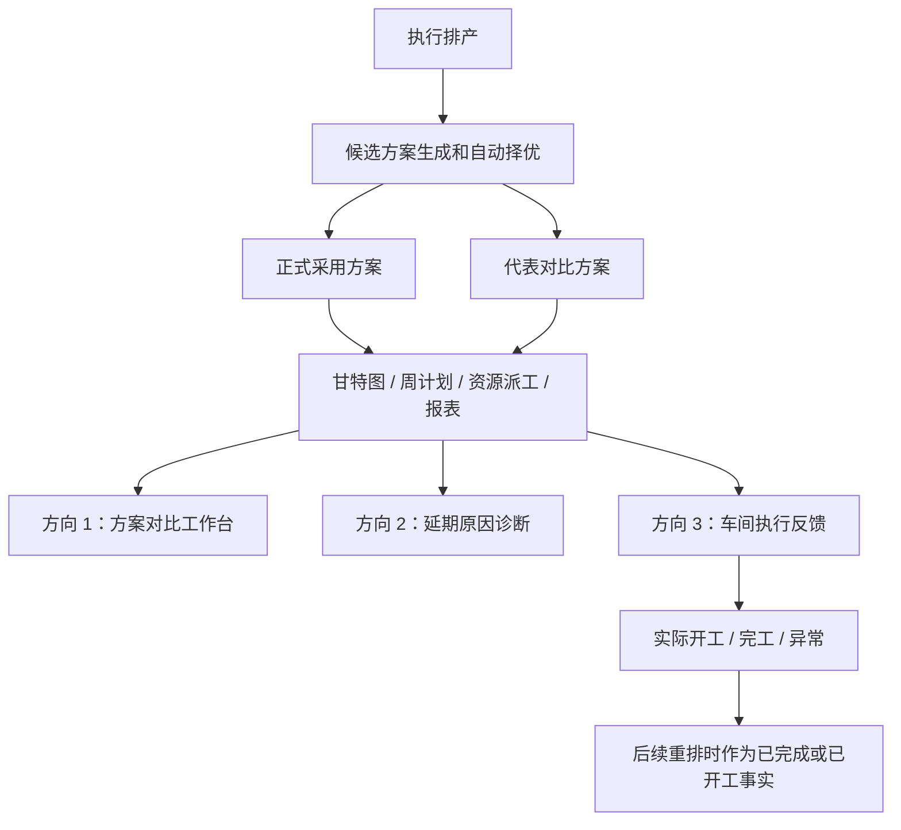

## 问题与范围

这次专题研究只看三个方向：

1. 多方案对比还不够业务用户直观。
2. 缺少“为什么晚了、卡在哪里、怎么改”的解释层。
3. 缺少车间实际开工、完工、异常反馈。

范围边界：

- 只做研究和证据整理，不改业务代码。
- 以当前项目现有代码为事实源，前一份市场差距审计作为背景资料。
- 不顺手扩大到完整 ERP/MES 集成、完整库存 MRP、AI 助手或多工厂供应链计划。

## 速答

当前项目不是从零开始补这三块，而是各有一半地基：

- **多方案对比**：后端已经能生成 `原算法 + 3/5/7 档重点工序优先方案`，也能自动选择最终采用方案，并把代表方案接到甘特图、周计划、资源排班；但现在页面更像“技术指标表”，还没有把“为什么推荐这版、这版比另一版好在哪里、会影响哪些批次”讲成人能马上判断的样子。
- **延期解释层**：系统已经有超期清单、资源负荷、停机影响、关键链、排程 warnings、甘特图超期和关键任务标记；但这些信息是分散的，还没有按“单个延期批次”收成一个原因结论，也没有给出下一步建议。
- **车间反馈**：批次和工序模型里已经有 `processing/completed` 这类状态，资源派工页也能把任务下发成现场视图；但页面没有真正的开工、完工、暂停、异常上报入口，也没有实际开始/结束时间、实际工时、异常原因这些记录，所以现在更像“计划下发”，不是“现场反馈闭环”。

建议拆成两个近期专题和一个中期专题：

- 近期专题 1：**方案对比工作台**，先把已有候选方案讲清楚。
- 近期专题 2：**延期原因诊断**，先做基于现有数据的“事后解释”，不要一上来改排程算法。
- 中期专题 3：**车间执行反馈闭环**，需要加数据表、服务、页面和重排规则，范围明显大一些。



## 关键证据

1. 候选方案不是概念，代码已经支持 `3/5/7` 档重点工序方案，并生成“原算法”和“重点工序优先方案 N/M”的候选定义：`core/services/scheduler/run/schedule_candidate_specs.py:11-18`、`core/services/scheduler/run/schedule_candidate_specs.py:49-88`。
2. 执行排产时，如果候选比较开启，编排层会运行候选比较，拿自动选择出的候选作为最终采用方案，并把候选比较摘要放进 `result_summary`：`core/services/scheduler/run/schedule_orchestrator.py:318-341`、`core/services/scheduler/run/schedule_orchestrator.py:366-404`。
3. 候选择优已经有基本业务保护：`balanced` 不是只看分数，还会限制失败工序数、超期批次数和总拖期，避免“分数好看但拖期明显变坏”的方案被采用：`core/services/scheduler/run/schedule_candidate_selection.py:44-100`、`core/services/scheduler/run/schedule_candidate_selection.py:156-180`。
4. 当前分析页已经接入“方案对比”，页面展示代表方案的失败工序数、超期批次数、总拖期、总工期、换型次数、评分和跳转链接：`templates/scheduler/analysis.html:25-31`、`web/viewmodels/scheduler_analysis_candidates.py:269-337`、`templates/scheduler/analysis_parts/_candidate_comparison.html:14-77`。
5. 现有指标已经足够支撑第一版方案对比：算法指标包含超期批次数、总拖期、加权拖期、总工期、换型次数、设备/人员利用率等；候选摘要也会保留失败工序、超期、拖期、总工期、换型次数：`core/algorithms/evaluation.py:44-100`、`core/algorithms/evaluation.py:136-162`、`core/services/scheduler/run/schedule_candidate_summary.py:34-50`。
6. 现在的超期判断能算出“已排程逾期 / 未排程逾期”和晚了多少小时/天，但没有原因字段；甘特图任务也只有 `is_overdue` 标记和基础 meta，没有“为什么晚”的诊断结果：`core/services/common/overdue_calculations.py:36-98`、`core/services/scheduler/gantt_tasks.py:157-196`。
7. 延期解释的材料已经分散存在：关键链能针对正式方案、候选方案、模拟方案计算；甘特调整校验已经能找资源冲突、前后工序冲突、日历、停机、交期和物料齐套问题：`core/services/scheduler/gantt_critical_chain_provider.py:134-170`、`core/services/scheduler/gantt_adjustment_validation_service.py:111-173`。
8. 车间反馈现在还没有闭环：模型有 `processing/completed` 状态，但批次详情保存工序时路由没有把状态传给服务；正式排程只把已排上的工序改成 `scheduled`，资源派工页也只是展示计划状态，没有开工/完工按钮或实际时间字段：`core/models/batch_operation.py:18-35`、`web/routes/domains/scheduler/scheduler_ops.py:12-38`、`core/services/scheduler/run/schedule_persistence.py:52-105`、`core/services/scheduler/run/schedule_persistence.py:211-230`、`templates/scheduler/resource_dispatch.html:242-258`。

## 细节展开

### 方向一：多方案对比工作台

#### 当前已经有的东西

系统现在已经有三层能力：

- **候选生成**：
  - 原算法方案。
  - 重点工序优先方案。
  - 重点工序方案可以按 3/5/7 档权重试跑。
- **自动选择**：
  - `score_only`：只看整体分数。
  - `balanced`：综合看分数、失败工序数、超期批次数、总拖期。
- **结果入口**：
  - 分析页里已有方案对比表。
  - 每个可用代表方案可以跳到设备甘特图、人员甘特图、周计划、资源排班。

#### 为什么现在还不够直观

对业务用户来说，现在的问题不是“没有方案”，而是“看完表以后还是要自己脑补”：

- “评分”是技术口径，计划员不一定知道它代表什么。
- 表里有总拖期和超期批次数，但没有直接告诉用户“这版更适合保交期 / 这版更适合减少换型 / 这版会牺牲哪些批次”。
- 现在只展示代表方案，不能很直观地看某个批次在两个方案里的时间差、设备差、人员差。
- 跳转是单个方案跳转，不是左右对照；用户要来回切页面才能比较。
- 自动采用原因现在是一句话，还没有展开到“采用它是因为哪些指标更好、哪些指标变差但仍可接受”。

#### 第一版建议做什么

第一版不建议重写算法，只建议把已有数据解释好。

最小功能可以叫：**方案对比工作台**。

页面入口：

- 放在 `排产优化分析` 的方案对比卡片里。
- 继续复用现有候选数据和 plan role。

第一版展示：

- 顶部一句话：
  - “系统推荐采用：重点工序优先方案 3/5。”
  - “原因：超期批次数没有增加，总拖期只多 4.2 小时，但关键工序提前了 18 小时。”
- 每个方案一张卡：
  - 超期批次数。
  - 总拖期。
  - 加权拖期。
  - 总工期。
  - 换型次数。
  - 设备平均利用率。
  - 人员平均利用率。
  - 失败工序数。
  - 是否正式采用。
- 增加“相对最终采用”的差异：
  - 多晚了几个批次。
  - 总拖期多/少多少小时。
  - 换型次数多/少多少次。
  - 总工期多/少多少小时。
- 保留跳转：
  - 设备甘特图。
  - 人员甘特图。
  - 周计划。
  - 资源排班。

第二版再做：

- 批次级差异清单：
  - 哪些批次在方案 B 里更早。
  - 哪些批次在方案 B 里更晚。
  - 哪些任务换了设备或人员。
- 方案影响摘要：
  - “这版主要让关键链上的 6 道工序提前。”
  - “代价是普通批次 B-123 晚 3 小时。”

#### 技术落点

可以优先复用这些现有位置：

- 方案表 ViewModel：`web/viewmodels/scheduler_analysis_candidates.py`。
- 分析页片段：`templates/scheduler/analysis_parts/_candidate_comparison.html`。
- 方案跳转：`web/routes/domains/scheduler/scheduler_analysis_links.py`。
- 候选摘要：`core/services/scheduler/run/schedule_candidate_summary.py`。
- 方案明细查询：`core/services/scheduler/schedule_plan_query_service.py`。

新增服务建议：

- `core/services/scheduler/candidate_comparison_diff_service.py`

它只做“方案 A 和方案 B 的差异计算”，不碰算法。

#### 风险和注意点

- 当前候选明细不是每个候选都完整保存，代表方案主要是 `最终采用 / 原算法最好 / 重点工序优先最好`。如果要比较全部 3/5/7 档，必须扩大落库范围，风险和存储都会变大。
- 第一版最好继续只比较代表方案，不要一上来做全候选大屏。
- 指标文字必须讲人话，不要把 `score tuple` 直接暴露成主解释。

### 方向二：延期原因诊断

#### 当前已经有的东西

系统现在已经能回答一部分问题：

- 哪些批次超期。
- 已排程超期还是未排程超期。
- 晚了多少小时/天。
- 设备和人员负荷。
- 停机影响。
- 关键链上的任务。
- 甘特图上哪些任务超期、哪些任务是关键任务。
- 甘特调整时哪些地方会撞资源、撞前后工序、撞日历、撞停机、撞物料齐套。

#### 真正缺的是什么

缺的不是更多表，而是“把分散信息收成一句业务结论”。

现在用户看到：

- 超期清单说这个批次晚了。
- 资源负荷说某台设备忙。
- 停机影响说某台设备停过。
- 甘特图说某些任务在关键链上。

但用户还要自己推理：

- 它为什么晚？
- 是设备太满，还是人太满？
- 是前序工序拖了，还是物料不齐？
- 是停机影响，还是交期本来就太紧？
- 我应该先改哪一个地方？

成熟 APS 里的“解释层”本质上就是把这些推理做成系统输出。

#### 第一版建议做什么

第一版可以叫：**延期原因诊断**。

先只做“事后解释”，不改排程算法。

输入：

- 一个排程版本。
- 一个 plan role，例如最终采用、原算法最好、重点工序优先方案最好。
- 可选 scenario_id。

输出：

- 按延期批次生成诊断行。
- 每行有：
  - 批次号。
  - 交期。
  - 最后完工时间。
  - 晚了多少小时。
  - 主原因。
  - 辅助原因。
  - 证据。
  - 建议动作。

第一批原因码可以很朴素：

- `material_not_ready`：物料未齐套或部分齐套。
- `predecessor_late`：前序工序把后续拖晚。
- `machine_bottleneck`：关键设备负荷过高。
- `operator_bottleneck`：关键人员负荷过高。
- `downtime_impact`：设备停机窗口压缩了可排时间。
- `external_duration`：外协周期导致后续衔接晚。
- `due_too_tight`：交期本身小于当前工艺总时长。
- `missing_resource`：有工序缺设备或人员，导致没有形成结果。
- `frozen_window`：冻结窗口保护了近期计划，导致不能挪动。
- `unknown`：证据不足时明确写“暂时只能判断为超期，还没有足够证据定位原因”。

第一版建议动作也先简单：

- 物料原因：补齐齐套状态/齐套日期，或确认是否启用齐套检查。
- 设备原因：看该设备负荷，考虑换设备、加班、拆批或外协。
- 人员原因：看人员负荷，考虑换人或调整班次。
- 前序原因：先处理关键链上更靠前的工序。
- 停机原因：核对停机记录，必要时重排。
- 外协原因：核对供应商和外协周期。

#### 技术落点

建议新增一个独立服务，不要把诊断逻辑塞进报表或甘特图：

- `core/services/scheduler/schedule_delay_diagnosis_service.py`

服务只读这些已有信息：

- `SchedulePlanQueryService`：读取某个版本/方案的任务明细。
- `ReportEngine.overdue_batches()`：读取超期批次。
- `ReportEngine.utilization()`：读取资源负荷。
- `ReportEngine.downtime_impact()`：读取停机影响。
- `GanttCriticalChainProvider`：读取关键链。
- `Batches.ready_status / ready_date`：读取齐套状态。
- `result_summary.errors / warnings / missing_internal_resource_ops`：读取排程阶段已经知道的问题。

页面落点：

- 第一版放在 `报表中心 → 超期清单`，给每个超期批次多两列：
  - “主要原因”。
  - “建议先处理”。
- 第二版放到 `排产优化分析`，做“本版最主要的延期原因 Top 5”。
- 第三版再接到甘特图 tooltip。

#### 风险和注意点

- 当前没有完整库存、采购和 BOM，所以物料原因第一版只能基于齐套状态，不能假装已经能做真实缺料追踪。
- 当前没有车间实际反馈，所以“现场做慢了”这一类原因第一版不能判断。
- 原因判断要保守，宁可写“证据不足”，不要把猜测写成事实。
- 第一版不要碰算法，只做解释；等解释稳定后，再考虑把诊断反向喂给排程策略。

### 方向三：车间实际开工、完工、异常反馈

#### 当前已经有的东西

现在已有这些地基：

- `Batch` 有 `pending / scheduled / processing / completed / cancelled` 状态。
- `BatchOperation` 有 `pending / scheduled / processing / completed / skipped` 状态。
- 正式排程成功后，会把已排上的工序改成 `scheduled`。
- 模拟排程不会污染批次/工序正式状态。
- 批次详情能编辑设备、人员、工时、供应商、外协周期。
- 资源派工页能按人员、设备、班组展示现场任务。

#### 真正缺的是什么

现在状态更像“计划状态”，不是“现场执行事实”。

缺少：

- 开工按钮。
- 暂停按钮。
- 完工按钮。
- 异常上报按钮。
- 实际开始时间。
- 实际结束时间。
- 实际耗时。
- 异常原因。
- 现场备注。
- 谁上报的。
- 什么时候上报的。
- 这些反馈如何影响下次重排。

另外，虽然服务层的工序编辑函数支持传 status，但页面路由没有传 status，批次详情模板也没有状态下拉或执行按钮。因此它不是一个可用的车间反馈入口。

#### 第一版建议做什么

第一版可以叫：**车间执行反馈最小闭环**。

目标不是一口气做完整 MES，而是让现场能把计划执行状态回到 APS。

最小业务流程：

1. 计划员正式排程。
2. 现场打开资源派工页。
3. 现场看到某个任务。
4. 点击“开工”。
5. 系统记录实际开工时间。
6. 点击“完工”。
7. 系统记录实际完工时间、实际耗时、备注。
8. 计划员后续重排时，已完成工序不再重排，进行中工序作为锁定事实处理。

第一版按钮：

- `开工`
- `完工`
- `异常`

第一版异常原因：

- 缺料。
- 设备故障。
- 人员不到位。
- 质量问题。
- 外协未回。
- 其他。

第一版不要做：

- 不做扫码枪依赖。
- 不做云端多人消息。
- 不做复杂审批流。
- 不做工资计件。
- 不做完整设备 IoT。

#### 数据建议

不要直接把实际时间塞进 `Schedule` 表。

原因：

- `Schedule` 是计划结果。
- 实际反馈是现场事实。
- 计划和实际要能对比，不能互相覆盖。

建议新增事件表：

```text
OperationExecutionEvents
- id
- op_id
- batch_id
- schedule_version
- schedule_id
- event_type        start / pause / resume / finish / exception
- event_time
- reported_status
- reason_code
- remark
- created_by
- created_at
```

再做一个读模型或视图：

```text
OperationExecutionState
- op_id
- current_status
- actual_start_time
- actual_end_time
- actual_duration_minutes
- last_reason_code
- last_remark
- updated_at
```

第一版可以不真的建物化表，先由事件表聚合出状态；如果页面变慢，再考虑缓存。

#### 页面建议

最适合先放在资源派工页：

- 因为资源派工页本来就是面向现场任务的。
- 它已经有任务明细、日历矩阵、甘特图。
- 它比排产优化分析更接近车间用户。

第一版资源派工新增列：

- 计划开始。
- 计划结束。
- 实际状态。
- 实际开工。
- 实际完工。
- 操作。

批次详情页第二步再补：

- 显示每道工序的实际状态。
- 显示执行日志。
- 允许计划员手工修正误报。

#### 重排规则建议

第一版重排规则要简单、保守：

- 已完工工序：
  - 不再进入排程算法。
  - 下游工序最早只能接在实际完工后。
- 加工中工序：
  - 不随意挪动。
  - 可以作为冻结任务。
  - 如果没有预计剩余工时，先按计划剩余时间估算。
- 异常工序：
  - 默认不自动跳过。
  - 需要计划员确认是否继续、暂停、返工或重排。

#### 风险和注意点

- 车间反馈会改变“计划版本”和“实际执行”的关系，必须先设计清楚数据边界。
- 不要让现场反馈直接改历史 `Schedule` 计划行，否则以后无法知道原计划和实际偏差。
- 需要补操作日志和误操作修正，不然现场点错后很难恢复。
- 如果未来要支持多人使用，再考虑登录和权限；第一版可以先用本地操作员名或当前用户占位。

## 未决问题

- 方案对比第一版是否只展示三类代表方案，还是要保存并展示全部 3/5/7 档候选？建议先只做代表方案。
- 延期诊断第一版是否只放在超期清单，还是同步放到甘特图 tooltip？建议先放超期清单。
- 车间反馈第一版是否允许“撤销开工/撤销完工”？建议需要，至少要有计划员修正入口。
- 车间反馈里的 `created_by` 当前没有登录体系，第一版要用什么身份？可先用本机默认用户、页面输入人名或 `system`，但要在设计阶段拍板。
- 已开工但未完工的工序，重排时剩余工时怎么算？第一版可按计划剩余时间，后续再支持现场填写预计剩余工时。

## 后续建议

建议把这三个方向拆成一个小 roadmap：先做 `方案对比工作台`，再做 `延期原因诊断`，最后做 `车间执行反馈最小闭环`；前两个能快速吃到现有数据红利，第三个要单独设计数据表和重排规则。

## 相关文档

- `.codestable/audits/2026-05-23-aps-market-gap/index.md`：主流 APS 市场能力和当前项目差距总览。
- `.codestable/architecture/ui-gantt.md`：甘特图查看、调整草稿、场景预览、发布链路现状。
- `.codestable/architecture/ARCHITECTURE.md`：项目整体架构入口和 Win7 离线边界。
