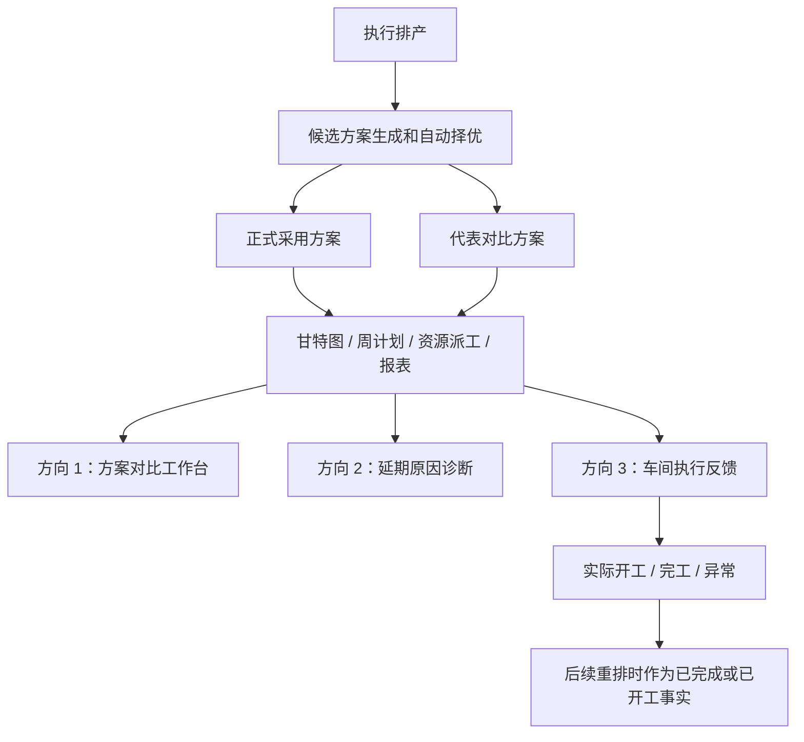
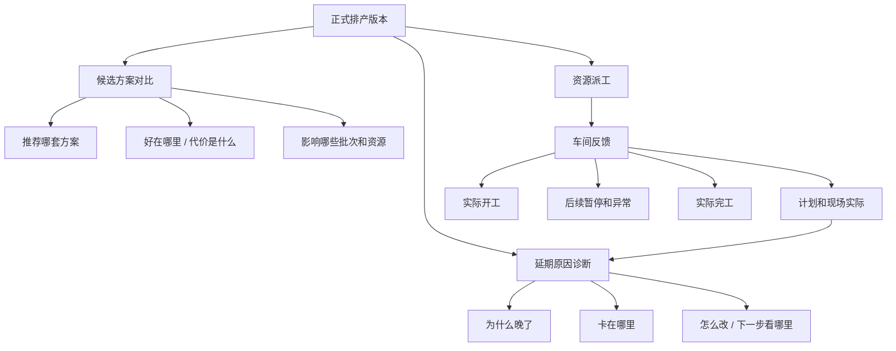
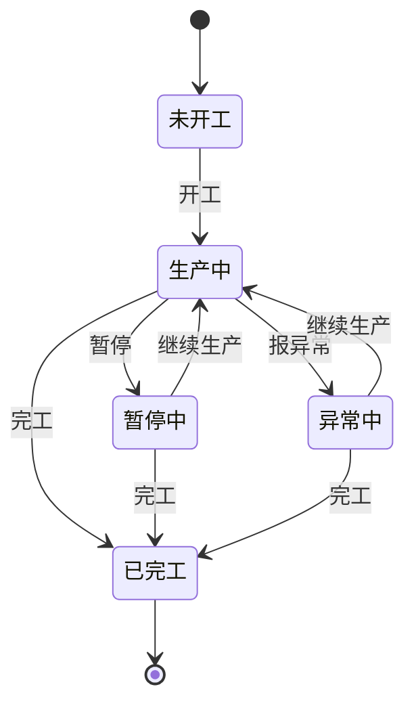

> **重要提示：本文件后半部分的路线草案已经被新的 roadmap 覆盖。**
>
> 后续做 feature-design、写代码、写测试时，请以 `.codestable/roadmap/aps-three-gap-directions/aps-three-gap-directions-roadmap.md` 和 `.codestable/roadmap/aps-three-gap-directions/aps-three-gap-directions-items.yaml` 为准。
>
> 本文件现在只保留研究证据和历史背景。后半段如果和 roadmap 不一致，一律按 roadmap。不要照着旧草案里的“单一确定原因”、任意两方案自由对比、旧异常写入入口、反馈人默认写假用户、页面展示内部编号/来源表/动作类型/内部评分串、未开工直接报异常等做实现。新的口径是：用户页面用中文大白话，只说“可能线索 / 建议先复核 / 当前数据不足”；现场反馈必须基于最新正式采用方案，反馈人必须由页面填写，候选方案和模拟预览不能写现场事实，未开工任务第一版不能直接报异常。

## 问题与范围

这次专题研究只看三个方向：

1. 多方案对比还不够业务用户直观。
2. 缺少“为什么晚了、卡在哪里、怎么改”的解释层。
3. 缺少车间实际开工、完工、异常反馈。

范围边界：

- 只做研究和证据整理，不改业务代码。
- 以当前项目现有代码为内部事实源，前一份市场差距审计作为背景资料。
- 外部资料通过 16 个全新 Sub Agent 并行调用 Exa MCP 补充调研，主代理只负责汇总、去重、和当前项目对照。
- 不顺手扩大到完整 ERP/MES 集成、完整库存 MRP、AI 助手或多工厂供应链计划。

## 速答

当前项目不是从零开始补这三块，而是各有一半地基：

- **多方案对比**：后端已经能生成 `原算法 + 3/5/7 档重点工序优先方案`，也能自动选择正式采用方案，并把代表方案接到甘特图、周计划、资源排班；但现在页面更像“技术指标表”，还没有把“为什么推荐这版、这版比另一版好在哪里、会影响哪些批次”讲成人能马上判断的样子。
- **延期解释层**：系统已经有超期清单、资源负荷、停机影响、关键链、排程 warnings、甘特图超期和关键任务标记；但这些信息是分散的，还没有按“单个延期批次”收成一个原因结论，也没有给出下一步建议。
- **车间反馈**：批次和工序模型里已经有 `processing/completed` 这类状态，资源派工页也能把任务下发成现场视图；但页面没有真正的开工、完工、暂停、异常反馈入口，也没有实际开始/结束时间、实际工时、异常原因这些记录，所以现在更像“计划下发”，不是“现场反馈闭环”。

建议拆成两个近期专题和一个中期专题。默认顺序先补“为什么会延期”的信任底座，再把方案对比讲成人话；如果目标只是快速改善页面观感，可以临时把方案对比提前，但那不是默认路线。

- 近期专题 1：**延期原因诊断**，先做基于现有数据的“事后解释”，不要一上来改排程算法。
- 近期专题 2：**方案对比工作台**，把已有候选方案讲清楚，让计划员知道系统为什么推荐这一版。
- 中期专题 3：**车间执行反馈闭环**，需要加数据表、服务、页面和重排规则，范围明显大一些。



## 关键证据

1. 候选方案不是概念，代码已经支持 `3/5/7` 档重点工序方案，并生成“原算法”和“重点工序优先方案 N/M”的候选定义：`core/services/scheduler/run/schedule_candidate_specs.py:11-18`、`core/services/scheduler/run/schedule_candidate_specs.py:49-88`。
2. 执行排产时，如果候选比较开启，编排层会运行候选比较，拿自动选择出的候选作为正式采用方案，并把候选比较摘要放进 `result_summary`：`core/services/scheduler/run/schedule_orchestrator.py:237-250`、`core/services/scheduler/run/schedule_orchestrator.py:309-313`。
3. 候选择优已经有基本业务保护：`balanced` 不是只看分数，还会限制失败工序数、超期批次数和总拖期，避免“分数好看但拖期明显变坏”的方案被采用：`core/services/scheduler/run/schedule_candidate_selection.py:44-100`、`core/services/scheduler/run/schedule_candidate_selection.py:156-180`。
4. 当前分析页已经接入“方案对比”，页面展示代表方案的失败工序数、超期批次数、总拖期、总工期、换型次数、评分和跳转链接：`templates/scheduler/analysis.html:25-31`、`web/viewmodels/scheduler_analysis_candidates.py:269-337`、`templates/scheduler/analysis_parts/_candidate_comparison.html:14-77`。
5. 现有指标已经足够支撑第一版方案对比：算法指标包含超期批次数、总拖期、加权拖期、总工期、换型次数、设备/人员利用率等；候选摘要也会保留失败工序、超期、拖期、总工期、换型次数：`core/algorithms/evaluation.py:44-100`、`core/algorithms/evaluation.py:136-162`、`core/services/scheduler/run/schedule_candidate_summary.py:34-50`。
6. 现在的超期判断能算出“已排程逾期 / 未排程逾期”和晚了多少小时/天，但没有原因字段；甘特图任务也只有 `is_overdue` 标记和基础 meta，没有“为什么晚”的诊断结果：`core/services/common/overdue_calculations.py:36-98`、`core/services/scheduler/gantt_tasks.py:157-196`。
7. 延期解释的材料已经分散存在：关键链能针对正式方案、候选方案、模拟方案计算；甘特调整校验已经能找资源冲突、前后工序冲突、日历、停机、交期和物料齐套问题：`core/services/scheduler/gantt_critical_chain_provider.py:134-170`、`core/services/scheduler/gantt_adjustment_validation_service.py:111-173`。
8. 车间反馈现在还没有闭环：模型有 `processing/completed` 状态，但批次详情保存工序时路由没有把状态传给服务；正式排程只把已排上的工序改成 `scheduled`，资源派工页也只是展示计划状态，没有开工/完工按钮或实际时间字段：`core/models/batch_operation.py:18-35`、`web/routes/domains/scheduler/scheduler_ops.py:12-38`、`core/services/scheduler/run/schedule_persistence.py:52-105`、`core/services/scheduler/run/schedule_persistence.py:211-230`、`templates/scheduler/resource_dispatch.html:242-258`。

## Sub Agent + Exa MCP 补充调研

本节是用户指出“应该先用 Sub Agent 调用 Exa MCP 调研”后的补证。

处理方式：

- 重开 16 个全新 Sub Agent。
- 每个 Sub Agent 都明确要求使用 Exa MCP，不复用旧上下文。
- Sub Agent 只读外部资料和本项目现状，不改文件。
- 主代理在所有 Sub Agent 完成后统一收集结果，再写入本专题。
- 全部 Sub Agent 已完成并关闭，避免后续上下文继续被污染。

### 16 个 Sub Agent 分工

| 组 | Sub Agent | 研究重点 | 主要用途 |
| --- | --- | --- | --- |
| 0 | `019e545c-d5a2-7ea1-ab3e-da45b4c2be8f` | Exa MCP 可用性探测、APS 调研口径校准 | 先确认工具链能查到 APS/计划系统资料 |
| 1 | `019e545d-b389-7a80-b9f3-237860b31b54` | Oracle / SAP 的方案、版本、模拟、对比做法 | 给“多方案对比”找成熟样板 |
| 1 | `019e545d-bca6-7e92-a796-3ae0f61a7a2b` | Primavera / Deltek / Asta / Microsoft Project 的基线对比 | 补“基线 vs 当前 vs 方案”的差异展示 |
| 1 | `019e545d-ca25-78a0-9734-e3af2c404435` | 对比表、推荐卡、差异卡的前端设计模式 | 把方案对比从指标表改成业务决策页 |
| 2 | `019e545d-d77a-7782-a768-2e67cc9ad795` | Oracle / Infor / frePPLe 的异常、约束、甘特分析 | 给“为什么晚了、卡在哪里”找原因解释模式 |
| 2 | `019e545d-e139-7a51-98db-3de746d9eb52` | pegging、需求追溯、供应链解释链 | 判断哪些解释能做，哪些解释现在还做不了 |
| 2 | `019e545d-ea03-7bd1-a6ba-8eca430081e3` | 事故/异常管理产品的解释层布局 | 借鉴“事实、可能原因、建议动作、状态”的页面结构 |
| 2 | `019e545d-f310-7b92-b82d-99b375ba4c44` | 异常原因码、置信度、证据不足提示 | 防止系统硬猜根因，避免误导用户 |
| 3 | `019e545d-fbe7-7ae1-97e0-647cd4984fae` | Oracle MES / D365 / Odoo / Katana 的车间执行入口 | 给开工、暂停、完工、报异常找标准流程 |
| 3 | `019e545e-04b4-7f40-8787-e5709e2e693b` | Tulip / OpenMES / 工位作业指导 | 判断现场页面应该如何简化给工人使用 |
| 3 | `019e545e-115f-7a71-acd0-343f74790313` | OEE / 停机 / 异常原因目录 | 给暂停、异常、停机原因找字段边界 |
| 3 | `019e545e-1b22-7013-8e8f-feb881f41e15` | 车间反馈和重排的边界 | 避免现场反馈直接改坏正式计划 |
| 4 | `019e545e-23d3-7d03-bc73-ecebed13605f` | 系统集成、IoT、BI、大屏、云端能力红线 | 识别第一版不能照搬的东西 |
| 4 | `019e545e-2c9d-7692-a5f2-fc4a2d7932da` | 国内中文产品口径、按钮命名、业务词 | 把页面文案改成计划员和车间能懂的话 |
| 4 | `019e545e-3620-7fa3-a323-e9c80f6f649c` | Win7 离线、本地部署、浏览器兼容边界 | 过滤掉不适合本项目的现代云端组件 |
| 4 | `019e545e-3eea-7121-96fe-5104d978fb8f` | 三方向实施顺序、验收标准、风险清单 | 形成后续可执行的路线 |

### 外部样板来源和可借鉴点

这些来源不是要照抄产品，而是用来判断“成熟 APS / 计划 / 车间系统通常怎么表达这些问题”。

| 方向 | 外部来源 | 看到的成熟做法 | 对本项目的启发 |
| --- | --- | --- | --- |
| 多方案对比 | Oracle Supply Planning 的 plan comparison、simulation；SAP IBP 的 version / scenario；Oracle Primavera 的 scenario comparison | 先选基准计划，再看候选计划；顶部先给结论和 KPI，下面再给 changed / added / deleted 或差异明细 | 本项目第一版不要只放指标表，要先给“系统建议采用哪套、为什么、代价是什么” |
| 多方案对比 | Deltek Acumen、Asta Powerproject、Microsoft Project 的基线对比 | 用“当前值、基线值、差值”帮助用户看变化；甘特上可显示 baseline vs current | 本项目可以先做“相对正式采用方案”的差值文案，后续再做批次级和甘特级对照 |
| 多方案对比 | Nielsen Norman Group comparison tables、SAP Fiori comparison pattern | 业务用户适合先看少量关键差异；复杂表格要支持分组、固定列、突出差异，不要把所有字段平均铺开 | 第一版固定三张卡：正式采用、原算法代表、重点工序优先代表 |
| 延期解释 | Oracle plan exceptions、constrained supply plan exceptions、Gantt diagnosis | 系统不是只报“late”，而是报异常对象、严重程度、原因类型、证据和建议动作 | 本项目要把超期清单升级成“异常解释清单”，每条能点开看证据 |
| 延期解释 | Infor APS output、Infor / SAP / Oracle pegging | 成熟系统会追溯需求、供应、工序、物料、资源之间的因果链 | 本项目目前没有完整供应链 pegging，所以第一版只做“排程内部证据”，不要承诺完整根因 |
| 延期解释 | frePPLe constraint report、resource report、demand Gantt | 约束报告会告诉用户是资源、物料、前序、容量还是时间窗口卡住 | 本项目可以先把资源冲突、前序拖延、停机、交期窗口、缺数据做成原因码 |
| 延期解释 | Datadog incident、Oracle production exceptions、Google People + AI explainability | 好的解释层会区分“已确认事实、可能原因、还缺什么数据”，避免系统装作全知 | 本项目必须加“证据充分 / 证据一般 / 证据不足”，不能硬猜 |
| 车间反馈 | Oracle MES Workstation、D365 production floor execution、Odoo shop floor、Katana shop floor app | 车间端不是复杂报表，而是任务队列加大按钮：开始、暂停、继续、完成、报异常 | 本项目资源派工页要加“现场反馈”视图，字段少、按钮大、状态清楚 |
| 车间反馈 | Tulip work instructions、OpenMES、Oracle workstation queue | 工位页面围绕当前任务、操作指导、状态按钮和异常提交组织 | 本项目当前第一阶段先做“任务卡 + 开工 + 完工 + 备注”，异常原因和报异常放到后续 `shop-exception-feedback` |
| 车间反馈 | Sepasoft / inmation / Symestic 的 OEE 和 downtime reason | 停机和异常要有原因目录，且原因目录要能后续统计 | 后续异常反馈再把异常原因分成设备、人员、物料、质量、工艺、其他；当前第一阶段不做完整 OEE |
| 国内中文口径 | 华为云 MBM、金蝶工序派工/报工、安达发 C1、数夫、MES 安灯资料 | 国内业务用户常见词是派工看板、工序派工、工序报工、异常反馈、工单开工、暂停原因、处理完成 | 页面命名尽量用“方案为什么被采用、为什么会晚、开工/完工/报异常”，少用 What-if、candidate、pegging |

外部参考链接：

- Oracle Supply Planning plan comparison: <https://docs.oracle.com/en/cloud/saas/supply-chain-and-manufacturing/26a/fausp/how-you-compare-supply-plans-and-orders.html>
- Oracle Supply Planning simulations: <https://docs.oracle.com/en/cloud/saas/supply-chain-and-manufacturing/24d/fausp/simulations-in-supply-planning.html>
- SAP IBP versions and scenarios: <https://learning.sap.com/courses/mastering-the-advanced-configuration-in-sap-ibp/creating-and-comparing-versions-and-scenarios-1>
- Oracle Primavera schedule compare: <https://primavera.oraclecloud.com/help/en/user/193627.htm>
- Deltek Acumen Forensics: <https://help.deltek.com/Product/Acumen/8.2/GA/Forensics%20Tab.html>
- Microsoft Project compare: <https://support.microsoft.com/en-us/project/compare-two-versions-of-a-project>
- Oracle plan exceptions: <https://docs.oracle.com/en/cloud/saas/supply-chain-and-manufacturing/25a/faspf/overview-of-plan-exceptions.html>
- Oracle Gantt diagnosis: <https://docs.oracle.com/en/cloud/saas/supply-chain-and-manufacturing/26b/fausp/how-to-diagnose-plan-output-using-order-attributes-and-the-gantt.html>
- frePPLe constraint report: <https://frepple.com/docs/current/user-interface/plan-analysis/constraint-report.php>
- Infor pegging: <https://docs.infor.com/ln/10.8/en-us/lnolh/cpolh/cpom000076.html>
- Oracle MES Workstation: <https://docs.oracle.com/cd/E18727_01/doc.121/e13057/T469821T469943.htm>
- Microsoft D365 production floor execution: <https://learn.microsoft.com/en-us/dynamics365/supply-chain/production-control/production-floor-execution-use>
- Odoo shop floor overview: <https://www.odoo.com/documentation/19.0/applications/inventory_and_mrp/manufacturing/shop_floor/shop_floor_overview.html>
- Katana shop floor app: <https://support.katanamrp.com/en/articles/5967424-using-the-shop-floor-control-app>
- Tulip digital work instructions: <https://support.tulip.co/docs/digital-work-instructions-use-case>
- 华为云工单操作台: <https://support.huaweicloud.com/usermanual-craftartsipdcenter/mbm_usermanual_0057.html>
- 金蝶工序报工: <https://help.open.kingdee.com/dokuwiki_std/doku.php?id=%E5%B7%A5%E5%BA%8F%E6%8A%A5%E5%B7%A5>

### Exa 调研后修正的判断

Sub Agent 外部调研后，对原内部草稿有四个修正：

1. **不能只把多方案对比理解成“更多指标”。**
   - 市面成熟做法是先给结论，再给证据。
   - 本项目第一版要把“系统为什么采用这套方案”放到表格上方。
   - 表格只适合做证据，不适合当唯一入口。
2. **延期解释必须分成“已确认事实、可能原因、还缺什么数据”。**
   - 因为当前项目没有完整物料、采购、仓储、需求 pegging 链。
   - 如果系统直接说“根因是物料不足”，但实际数据不够，就会误导用户。
   - 第一版要诚实表达“按当前排程数据看，最可能卡在某资源或前序”。
3. **车间反馈要单独建“现场实际状态”，不能复用计划状态糊在一起。**
   - 外部 MES / Shop Floor 产品普遍把计划下发和现场报工分开。
   - 本项目现有 `scheduled / processing / completed` 更像工序计划状态。
   - 后续要新增实际开工、实际完工、异常事件，不能直接覆盖原计划。
4. **默认实施顺序要从“最快见效”改成“先补信任底座”。**
   - 如果只想快速改善页面观感，方案对比可以先做。
   - 但从用户信任来看，先解释“为什么晚了、卡在哪里”更关键。
   - 推荐路线改为：延期解释最小层 → 方案对比业务化 → 车间反馈最小闭环。

### 第一版坚决不要照搬的东西

这些能力在大厂产品里常见，但不适合当前项目第一版：

- 不做云端多租户协同。
- 不做 IoT 设备实时采集。
- 不做完整 MES。
- 不做扫码、电子签名、质量追溯全链路。
- 不做 PowerBI / 外部 BI 嵌入。
- 不做拖拽甘特后直接覆盖正式计划。
- 不做“AI 自动告诉你根因”，尤其是证据不足时。
- 不做需要现代浏览器新特性的重型前端组件，除非先验证 Win7 + Chrome 109 可用。
- 不做十几个候选方案同时铺满大屏。
- 不把英文术语直接放到业务页面，比如 What-if、candidate、pegging、root cause。

### 当前项目和外部成熟做法的差距评估

这张表回答“我们离市面成熟产品还差多远”。

| 方向 | 外部成熟做法 | 当前项目已有 | 主要缺口 | 差距判断 | 第一版工作量 |
| --- | --- | --- | --- | --- | --- |
| 多方案对比 | 方案/版本/场景清楚分层，先给推荐结论，再给 KPI 差值、变化清单、甘特钻取 | 已有候选方案生成、自动择优、指标表、跳转甘特/周计划/资源派工 | 页面还是技术指标表；推荐原因太短；缺少差值文案、代价说明、批次/资源影响 | **中等差距**：数据地基够，主要差在表达和差异计算 | 低到中 |
| 延期解释 | 异常清单有严重程度、对象、原因、证据、建议动作；能跳到甘特、资源、物料、订单 | 已有超期计算、甘特超期标记、资源负荷、停机、关键链、校验规则 | 信息分散；没有按批次收成原因；没有证据等级；没有“怎么改”建议 | **中高差距**：材料够一半，但缺核心解释服务 | 中 |
| 车间反馈 | 工位任务队列，开工/暂停/继续/完工/异常；实际时间、原因、操作者、记录可追溯 | 有资源派工页；工序模型有状态枚举；计划下发能写 scheduled | 没有独立现场事件表；没有实际开始/结束；没有反馈按钮；没有计划状态和现场状态分离 | **高差距**：需要新增数据、服务、页面和重排边界 | 中到高 |

更直白地说：

- **方案对比**不是“没有”，而是“机器已经算了，人还看不懂”。这是最容易补的。
- **延期解释**不是“没有数据”，而是“证据散在不同页面和服务里，没有收成一句能指导行动的话”。这是最值得优先补的。
- **车间反馈**现在基本还停留在“计划下发”，没有真正进入“现场实际执行”。这是差距最大的一块。

如果按完成度粗略打分：

| 方向 | 当前完成度 | 说明 |
| --- | --- | --- |
| 多方案对比 | 60% | 算法和指标已有，缺业务化展示 |
| 延期解释 | 40% | 证据材料已有，但缺解释层和页面入口 |
| 车间反馈 | 20% | 有计划任务和状态枚举，但缺真正报工闭环 |

这不是精确百分比，只是帮助排优先级：

- 60% 表示“主要补页面和解释”。
- 40% 表示“要补一个新服务，把已有数据串起来”。
- 20% 表示“要补数据表、服务、页面、状态流转和重排边界”。

## 细节展开

### 方向一：多方案对比工作台

#### 当前已经有的东西

系统现在已经有三层能力：

- **候选生成**：
  - 原算法方案。
  - 重点工序优先方案。
  - 重点工序方案可以按 3/5/7 档权重试跑。
- **自动选择**：
  - `score_only`：只看整体分数。
  - `balanced`：综合看分数、失败工序数、超期批次数、总拖期。
- **结果入口**：
  - 分析页里已有方案对比表。
  - 每个可用代表方案可以跳到设备甘特图、人员甘特图、周计划、资源排班。

#### 为什么现在还不够直观

对业务用户来说，现在的问题不是“没有方案”，而是“看完表以后还是要自己脑补”：

- “评分”是技术口径，计划员不一定知道它代表什么。
- 表里有总拖期和超期批次数，但没有直接告诉用户“这版更适合保交期 / 这版更适合减少换型 / 这版会牺牲哪些批次”。
- 现在只展示代表方案，不能很直观地看某个批次在两个方案里的时间差、设备差、人员差。
- 跳转是单个方案跳转，不是左右对照；用户要来回切页面才能比较。
- 自动采用原因现在是一句话，还没有展开到“采用它是因为哪些指标更好、哪些指标变差但仍可接受”。

#### 第一版建议做什么

第一版不建议重写算法，只建议把已有数据解释好。

最小功能可以叫：**方案对比工作台**。

页面入口：

- 放在 `排产优化分析` 的方案对比卡片里。
- 继续复用现有候选数据和 plan role。

第一版展示：

- 顶部一句话：
  - “系统推荐采用：重点工序优先方案 3/5。”
  - “原因：超期批次数没有增加，总拖期只多 4.2 小时，但重点工序提前了 18 小时。”
- 每个方案一张卡：
  - 超期批次数。
  - 总拖期。
  - 加权拖期。
  - 总工期。
  - 换型次数。
  - 设备平均利用率。
  - 人员平均利用率。
  - 失败工序数。
  - 是否正式采用。
- 增加“相对正式采用方案”的差异：
  - 多晚了几个批次。
  - 总拖期多/少多少小时。
  - 换型次数多/少多少次。
  - 总工期多/少多少小时。
- 保留跳转：
  - 设备甘特图。
  - 人员甘特图。
  - 周计划。
  - 资源排班。

第二版再做：

- 批次级差异清单：
  - 哪些批次在方案 B 里更早。
  - 哪些批次在方案 B 里更晚。
  - 哪些任务换了设备或人员。
- 方案影响摘要：
  - “这版主要让关键链上的 6 道工序提前。”
  - “代价是普通批次 B-123 晚 3 小时。”

#### 技术落点

可以优先复用这些现有位置：

- 方案表 ViewModel：`web/viewmodels/scheduler_analysis_candidates.py`。
- 分析页片段：`templates/scheduler/analysis_parts/_candidate_comparison.html`。
- 方案跳转：`web/routes/domains/scheduler/scheduler_analysis_links.py`。
- 候选摘要：`core/services/scheduler/run/schedule_candidate_summary.py`。
- 方案明细查询：`core/services/scheduler/schedule_plan_query_service.py`。

新增服务建议：

- `core/services/scheduler/candidate_comparison_diff_service.py`

它只做“方案 A 和方案 B 的差异计算”，不碰算法。

#### 风险和注意点

- 当前候选明细不是每个候选都完整保存，代表方案主要是 `正式采用方案 / 原算法代表方案 / 重点工序优先代表方案`。如果要比较全部 3/5/7 档，必须扩大落库范围，风险和存储都会变大。
- 第一版最好继续只比较代表方案，不要一上来做全候选大屏。
- 指标文字必须讲人话，不要把 `score tuple` 直接暴露成主解释。

### 方向二：延期原因诊断

#### 当前已经有的东西

系统现在已经能回答一部分问题：

- 哪些批次超期。
- 已排程超期还是未排程超期。
- 晚了多少小时/天。
- 设备和人员负荷。
- 停机影响。
- 关键链上的任务。
- 甘特图上哪些任务超期、哪些任务是关键任务。
- 甘特调整时哪些地方会撞资源、撞前后工序、撞日历、撞停机、撞物料齐套。

#### 真正缺的是什么

缺的不是更多表，而是“把分散信息收成一句业务结论”。

现在用户看到：

- 超期清单说这个批次晚了。
- 资源负荷说某台设备忙。
- 停机影响说某台设备停过。
- 甘特图说某些任务在关键链上。

但用户还要自己推理：

- 它为什么晚？
- 是设备太满，还是人太满？
- 是前序工序拖了，还是物料不齐？
- 是停机影响，还是交期本来就太紧？
- 我应该先改哪一个地方？

成熟 APS 里的“解释层”本质上就是把这些推理做成系统输出。

#### 第一版建议做什么

第一版可以叫：**延期原因诊断**。

先只做“事后解释”，不改排程算法。

输入（历史草案，实施时请按 roadmap 的 `PlanIdentity` 契约细化）：

- 一个排程版本。
- 一个方案身份，例如正式采用方案、原算法代表方案、重点工序优先代表方案。
- 可选模拟预览身份。

输出：

- 按延期批次生成诊断行。
- 每行有：
  - 批次号。
  - 交期。
  - 最后完工时间。
  - 晚了多少小时。
  - 可能线索。
  - 证据缺口。
  - 证据。
  - 建议动作。

第一批原因码可以很朴素：

- `material_not_ready`：物料状态显示未齐套或部分齐套；页面要说“物料线索待核对”，不要直接断言物料一定没齐。
- `predecessor_late`：前序工序把后续拖晚。
- `machine_bottleneck`：关键设备负荷过高。
- `operator_bottleneck`：关键人员负荷过高。
- `downtime_impact`：设备停机窗口压缩了可排时间。
- `external_duration`：外协周期导致后续衔接晚。
- `due_too_tight`：交期本身小于当前工艺总时长。
- `missing_resource`：有工序缺设备或人员，导致没有形成结果。
- `frozen_window`：冻结窗口保护了近期计划，导致不能挪动。
- `unknown`：证据不足时明确写“暂时只能判断为超期，还没有足够证据定位原因”。

第一版建议动作也先简单：

- 物料线索：补齐齐套状态/齐套日期，或确认是否启用齐套检查。
- 设备原因：看该设备负荷，考虑换设备、加班、拆批或外协。
- 人员原因：看人员负荷，考虑换人或调整班次。
- 前序原因：先处理关键链上更靠前的工序。
- 停机原因：核对停机记录，必要时重排。
- 外协原因：核对供应商和外协周期。

#### 技术落点

建议新增一个独立服务，不要把诊断逻辑塞进报表或甘特图：

- `core/services/scheduler/schedule_delay_diagnosis_service.py`

服务只读这些已有信息：

- `SchedulePlanQueryService`：读取某个版本/方案的任务明细。
- `ReportEngine.overdue_batches()`：读取超期批次。
- `ReportEngine.utilization()`：读取资源负荷。
- `ReportEngine.downtime_impact()`：读取停机影响。
- `GanttCriticalChainProvider`：读取关键链。
- `Batches.ready_status / ready_date`：读取齐套状态。
- `result_summary.errors / warnings / missing_internal_resource_ops`：读取排程阶段已经知道的问题。

页面落点（历史草案，实施时以 roadmap 的“超期清单延期解释入口”为准）：

- 第一版放在 `报表中心 → 超期清单`，给每个超期批次多两列：
  - “建议先复核哪里”。
  - “建议先处理”。
- 第二版放到 `排产优化分析`，做“本版最主要的延期原因 Top 5”。
- 第三版再接到甘特图 tooltip。

#### 风险和注意点

- 当前没有完整库存、采购和 BOM，所以物料原因第一版只能基于齐套状态，不能假装已经能做真实物料问题追踪。
- 当前没有车间实际反馈，所以“现场做慢了”这一类原因第一版不能判断。
- 原因判断要保守，宁可写“证据不足”，不要把猜测写成事实。
- 第一版不要碰算法，只做解释；等解释稳定后，再考虑把诊断反向喂给排程策略。

### 方向三：车间实际开工、完工、异常反馈

#### 当前已经有的东西

现在已有这些地基：

- `Batch` 有 `pending / scheduled / processing / completed / cancelled` 状态。
- `BatchOperation` 有 `pending / scheduled / processing / completed / skipped` 状态。
- 正式排程成功后，会把已排上的工序改成 `scheduled`。
- 模拟排程不会污染批次/工序正式状态。
- 批次详情能编辑设备、人员、工时、供应商、外协周期。
- 资源派工页能按人员、设备、班组展示现场任务。

#### 真正缺的是什么

现在状态更像“计划状态”，不是“现场执行事实”。

缺少：

- 开工按钮。
- 暂停按钮。
- 完工按钮。
- 异常反馈按钮。
- 实际开始时间。
- 实际结束时间。
- 实际耗时。
- 异常原因。
- 现场备注。
- 谁上报的。
- 什么时候上报的。
- 这些反馈如何影响下次重排。

另外，虽然服务层的工序编辑函数支持传 status，但页面路由没有传 status，批次详情模板也没有状态下拉或执行按钮。因此它不是一个可用的车间反馈入口。

#### 第一版建议做什么

第一版可以叫：**车间执行反馈最小闭环**。

目标不是一口气做完整 MES，而是让现场能把计划执行状态回到 APS。

最小业务流程：

1. 计划员正式排程。
2. 现场打开资源派工页。
3. 现场看到某个任务。
4. 点击“开工”。
5. 系统记录实际开工时间。
6. 点击“完工”。
7. 系统记录实际完工时间、实际耗时、备注。
8. 计划员后续重排时，已完成工序不再重排，进行中工序作为锁定事实处理。

历史草案里曾写过的第一版按钮如下，但这段已经被 roadmap 收窄，不能照做：

- `开工`
- `完工`
- 后续异常反馈入口，不属于当前第一阶段

后续异常原因素材：

- 物料问题。
- 设备问题。
- 人员不到位。
- 质量问题。
- 外协问题。
- 其他。

第一版不要做：

- 不做扫码枪依赖。
- 不做云端多人消息。
- 不做复杂审批流。
- 不做工资计件。
- 不做完整设备 IoT。

#### 数据建议

不要直接把实际时间塞进 `Schedule` 表。

原因：

- `Schedule` 是计划结果。
- 实际反馈是现场事实。
- 计划和实际要能对比，不能互相覆盖。

建议新增事件表：

```text
OperationExecutionEvents
- id
- op_id
- batch_id
- schedule_version
- schedule_id
- event_type        start / pause / resume / finish / exception
- event_time
- reported_status
- reason_code
- remark
- created_by（历史草案字段；roadmap 已拍板为页面必填“反馈人”，不能默认写假用户）
- created_at
```

再做一个读模型或视图：

```text
OperationExecutionState
- op_id
- current_status
- actual_start_time
- actual_end_time
- actual_duration_minutes
- last_reason_code
- last_remark
- updated_at
```

第一版可以不真的建物化表，先由事件表聚合出状态；如果页面变慢，再考虑缓存。

#### 页面建议

最适合先放在资源派工页：

- 因为资源派工页本来就是面向现场任务的。
- 它已经有任务明细、日历矩阵、甘特图。
- 它比排产优化分析更接近车间用户。

第一版资源派工新增列：

- 计划开始。
- 计划结束。
- 实际状态。
- 实际开工。
- 实际完工。
- 操作。

批次详情页第二步再补：

- 显示每道工序的实际状态。
- 显示执行日志。
- 允许计划员手工修正误报。

#### 重排规则建议

第一版重排规则要简单、保守：

- 已完工工序：
  - 不再进入排程算法。
  - 下游工序最早只能接在实际完工后。
- 加工中工序：
  - 不随意挪动。
  - 可以作为冻结任务。
  - 如果没有预计剩余工时，先按计划剩余时间估算。
- 异常工序：
  - 默认不自动跳过。
  - 需要计划员确认是否继续、暂停、返工或重排。

#### 风险和注意点

- 车间反馈会改变“计划版本”和“实际执行”的关系，必须先设计清楚数据边界。
- 不要让现场反馈直接改历史 `Schedule` 计划行，否则以后无法知道原计划和实际偏差。
- 需要补操作日志和误操作修正，不然现场点错后很难恢复。
- 当前没有完整登录体系，但第一版也不能用系统自动猜出来的名字或 `system` 占位。roadmap 已拍板：页面必须让用户填写“反馈人”，空值直接拒绝；后续接登录体系时再替换来源。

## 三个方向详细落地蓝图

> **历史草案，已作废，不能照做。**
> 这一大节只保留当时探索思路和背景。后续实施必须以 `.codestable/roadmap/aps-three-gap-directions/aps-three-gap-directions-roadmap.md` 和 `aps-three-gap-directions-items.yaml` 为准；如果这里和 roadmap 不一致，一律按 roadmap。

这一节把三个方向继续写细。

前面的内容回答“当前已有啥、缺啥”。这一节回答“如果后续要做，页面怎么排、字段怎么放、按钮怎么叫、数据怎么流、第一版怎么验收”。

统一原则：

- 先让业务用户看懂，不先追求功能炫。
- 先复用当前已有排程版本、候选方案、甘特、报表、资源派工数据，不一上来重写算法。
- 页面文案用人话，比如“晚了 6 小时”“M-03 排满了”“建议先看资源占用”，不要用内部变量名。
- 计划和实际要分开存，不能让现场反馈直接覆盖原计划。
- 所有结论都要能点开看到证据，不能只给一句“系统判断”。

### 总体关系

这三个方向不是三套孤立功能。更合理的关系是：



也就是说：

- 方案对比回答“还没执行前，选哪套排产结果更合适”。
- 延期解释回答“这套排产结果为什么会晚、先看哪里”。
- 车间反馈回答“计划下发后，现场实际做成什么样”。
- 车间反馈做完后，延期解释可以进一步升级为“是计划本来排得紧，还是现场执行出了偏差”。

### 方向一详细蓝图：多方案对比业务化

> **历史草案，已作废，不能照做。**
> 本小节只保留方案对比的研究背景。后续实现必须按 roadmap 里的固定三类代表方案、正式采用方案 / 对比参考方案口径、不能第一眼显示内部评分、不能任意两方案自由对比来做。

#### 1.1 要解决的真实问题

现在页面已经能列出方案指标，但业务用户看完仍然会问：

- 到底推荐哪套？
- 为什么推荐它？
- 它比原算法好在哪里？
- 它的代价是什么？
- 会不会让某几个批次变晚？
- 哪些设备或人员会更忙？
- 如果我更关心换型次数，应该看哪套？

所以第一版目标不是“多展示几个指标”，而是把表格变成“能辅助拍板的方案说明”。

一句话目标：

> 用户打开方案对比，不用懂算法，也能知道系统建议采用哪套方案、为什么、代价是什么、哪些批次和资源受影响。

#### 1.2 页面建议结构

建议继续放在 `排产优化分析` 页面里，不新增很深的入口。

页面从上到下：

| 顺序 | 区域 | 作用 |
| --- | --- | --- |
| 1 | 推荐方案卡 | 先告诉用户系统建议选哪套 |
| 2 | 推荐理由和代价 | 用人话讲为什么，不让用户自己推理 |
| 3 | 三方案摘要卡 | 正式采用方案、原算法代表方案、重点工序优先代表方案并排看 |
| 4 | 指标对比表 | 保留现有表格，给需要细看的人 |
| 5 | 后续批次明细 | 看哪些批次提前或延后 |
| 6 | 后续资源明细 | 看哪些设备或人员变忙 |
| 7 | 跳转入口 | 去甘特图、周计划、资源派工看细节 |

推荐第一版先做到 1-4，第二版再补 5-6。

#### 1.2.1 外部调研后的页面拆法

Oracle、SAP、Primavera、Deltek、Microsoft Project 这类系统的共同点不是“表格字段很多”，而是把对比分成几层。

第一层：先定基准。

- Oracle / SAP 会区分正式计划、版本、模拟、候选场景。
- Primavera / Microsoft Project 会区分当前计划和基线。
- 对本项目来说，第一版也要明确三种身份：
  - **正式采用方案**：已经写入正式排产结果。
  - **原算法代表方案**：用来说明传统排法是什么样。
  - **重点工序优先代表方案**：用来说明新策略带来的变化。
- 页面上必须清楚写出“这是正式采用”还是“只是对比参考”，不然用户会误以为每套都已经下发。

第二层：先看结论。

- 成熟产品通常会把 KPI 差异放到上方。
- 不是让用户先翻明细，而是先告诉用户：
  - 这套方案比基准好在哪里。
  - 这套方案比基准差在哪里。
  - 差的地方能不能接受。
  - 下一步应该看哪张图或哪张表。
- 对本项目来说，推荐方案卡必须放在指标表前面。

第三层：再看差异。

- Oracle 计划对比强调 difference、percent difference、changed orders。
- Primavera / Deltek 会把 changed / added / deleted 或 old / new / delta 展开。
- 对本项目来说，第一版先做指标差异，第二版再做批次和资源差异。

第四层：最后钻到细节。

- 成熟系统不会在对比页塞满所有明细，而是从对比页跳到甘特、订单、资源、异常。
- 本项目已经有甘特图、周计划、资源派工入口，所以不要重复造一套大页面。
- 正确做法是：对比页负责“解释差异”，甘特图和资源派工负责“查证据”。

可以借鉴的页面布局：

| 页面层级 | 显示内容 | 用户脑子里的问题 |
| --- | --- | --- |
| 顶部结论条 | 系统建议采用哪套、是否已经正式采用 | 我该先看哪套？ |
| 三张摘要卡 | 正式采用、原算法代表、重点工序代表 | 三套差别大不大？ |
| 差值表 | 超期、拖期、工期、换型、失败工序 | 哪套好，哪套差？ |
| 后续明细 | 批次提前/延后、资源负荷变化 | 谁受影响？ |
| 证据入口 | 甘特图、周计划、资源派工 | 我去哪核对？ |

不要借鉴的做法：

- 不要做 SAP / Oracle 那种完整版本管理和多人协同审批。
- 不要做 Primavera 那种完整项目基线体系。
- 不要把所有 3/5/7 候选都铺成大表。
- 不要让用户手动维护一堆 scenario 名称。
- 不要一开始做多甘特叠加，因为 Win7 离线前端和现有页面复杂度都不适合第一版。

#### 1.3 推荐方案卡字段

推荐方案卡必须比表格更醒目。

字段建议：

| 字段 | 示例 | 说明 |
| --- | --- | --- |
| 系统建议采用 | 重点工序优先方案 3/5 | 直接说结论 |
| 推荐原因 | 超期批次数没有增加，总拖期更少 | 讲好处 |
| 可接受代价 | 换型次数多 2 次，M-03 更忙 | 讲坏处 |
| 需要复核 | B202605-018 比原算法晚 6 小时 | 提醒用户别盲信 |
| 适合场景 | 更适合优先保关键批次交期 | 帮用户结合业务目标判断 |
| 下一步 | 查看甘特图 / 查看资源排班 / 复制说明 | 直接给动作 |

文案示例：

```text
系统建议采用：重点工序优先方案 3/5。

原因：这套方案让重点工序更早完成，超期批次数没有比原算法增加，总拖期也在可接受范围内。

代价：M-03 的负荷更高，换型次数比原算法多 2 次。

建议：如果本次优先保交期，可以采用；如果车间更怕频繁换型，请重点复核换型次数。
```

#### 1.4 三方案摘要卡

建议固定三张卡：

| 卡片 | 内容 |
| --- | --- |
| 正式采用方案 | 正式写入排程的结果 |
| 原算法代表方案 | 原有排法里最好的代表 |
| 重点工序优先代表方案 | 新策略里最好的代表 |

每张卡只放 6 个以内核心指标：

| 指标 | 展示方式 | 用户看什么 |
| --- | --- | --- |
| 失败工序数 | `0 个` | 这套方案能不能落地 |
| 超期批次数 | `3 个，比原算法少 1 个` | 是否更保交期 |
| 总拖期 | `18.5 小时，比原算法少 6 小时` | 整体晚了多少 |
| 总工期 | `126 小时，比原算法多 2 小时` | 总体完成周期 |
| 换型次数 | `12 次，比原算法多 2 次` | 车间执行代价 |
| 推荐标签 | `系统采用 / 对比参考 / 需复核` | 用户是否要重点看 |

评分可以保留，但不要放在最醒目位置。

评分的文案建议：

- 不写“评分：0 / 3 / 18.5 / 126”这种技术串。
- 可以写“内部评分：用于系统择优，普通用户可先看上面的业务指标”。

#### 1.5 指标差值怎么计算

第一版差值可以只基于已有行数据计算，不需要新跑算法。

以“正式采用方案”为基准：

```text
差值 = 当前方案指标 - 正式采用方案指标
```

展示规则：

| 指标 | 越小越好还是越大越好 | 文案规则 |
| --- | --- | --- |
| 失败工序数 | 越小越好 | 多 X 个 / 少 X 个 |
| 超期批次数 | 越小越好 | 多 X 个 / 少 X 个 |
| 总拖期 | 越小越好 | 多 X 小时 / 少 X 小时 |
| 总工期 | 越小越好 | 多 X 小时 / 少 X 小时 |
| 换型次数 | 一般越小越好 | 多 X 次 / 少 X 次 |

颜色建议：

- 更好：绿色。
- 更差：红色。
- 基本持平：灰色。
- 差值很小：写“基本持平”，不要强行红绿。

#### 1.6 后续批次明细

第二版建议补“批次级变化明细”。这是业务用户最直观的地方。

字段：

| 字段 | 示例 | 说明 |
| --- | --- | --- |
| 批次 | B202605-018 | 业务对象 |
| 图号 | P-1008 | 识别产品 |
| 交期 | 05-24 12:00 | 判断风险 |
| 正式采用方案完成 | 05-24 18:00 | 当前正式结果 |
| 对比方案完成 | 05-24 15:00 | 另一套方案结果 |
| 变化 | 提前 3 小时 | 用户最关心 |
| 超期变化 | 仍超期 / 取消超期 / 新增超期 | 直接说明影响 |
| 主要变化 | 换了设备 / 顺序提前 / 等待资源 | 解释差异 |
| 入口 | 定位甘特图 | 去看细节 |

排序建议：

1. 新增超期。
2. 取消超期。
3. 延后最多。
4. 提前最多。
5. 变化很小的放后面。

第一版如果还没有足够明细，就先显示空状态：

```text
当前版本还没有批次级差异明细。你可以先通过甘特图查看每套方案的任务安排。
```

不要假装已经算出来。

#### 1.7 后续资源明细

资源级变化明细回答“这套方案车间能不能承受”。

字段：

| 字段 | 示例 |
| --- | --- |
| 资源 | M-03 |
| 类型 | 设备 |
| 正式采用方案负荷 | 46.5 小时 |
| 对比方案负荷 | 52 小时 |
| 变化 | 增加 5.5 小时 |
| 利用率变化 | 82% → 96% |
| 风险 | 接近满负荷 |
| 入口 | 查看资源排班 |

后续版本可以只做 Top 5 起步：

- 负荷增加最多的设备。
- 负荷增加最多的人员。
- 从正常变成接近满负荷的资源。

按当前 roadmap 口径，第一版不承诺资源级变化清单；可以先预留“后续版本再补资源变化明细”的空状态。

#### 1.8 后端和 ViewModel 落点

建议分三层做，不要把复杂逻辑写进模板：

| 层 | 文件建议 | 职责 |
| --- | --- | --- |
| 指标解释 | `web/viewmodels/scheduler_analysis_candidates.py` | 把已有指标翻译成中文差值和推荐文案 |
| 方案差异服务 | `core/services/scheduler/candidate_comparison_diff_service.py` | 计算方案之间批次、资源、时间差异 |
| 模板展示 | `templates/scheduler/analysis_parts/_candidate_comparison.html` | 只负责展示卡片、表格、链接 |

第一版最小改动：

- 在 `scheduler_analysis_candidates.py` 里给每个 row 增加：
  - `delta_vs_adopted`
  - `business_summary`
  - `risk_summary`
  - `is_recommended`
- 在模板里增加推荐卡和三方案卡。

第二版再增加独立 diff service。

#### 1.9 第一版验收标准

验收时不用先看代码，先用业务页面判断：

- 页面顶部能直接看到“系统建议采用哪套方案”。
- 推荐理由不是评分串，而是中文业务原因。
- 方案卡能显示每套方案的超期、拖期、工期、换型。
- 每个指标能看出比正式采用方案好还是差。
- 现有“查看甘特图、周计划、资源排班”的跳转不丢。
- 没开启候选方案时，有清楚提示，不报空白。
- 候选运行失败时，页面提示失败候选，不把失败方案当可采用方案。

#### 1.10 测试建议

至少补这些回归：

| 测试 | 验什么 |
| --- | --- |
| 有三类代表方案时显示推荐卡 | 页面能展示正式采用方案、原算法代表方案、重点工序优先代表方案 |
| 候选对比关闭时显示空状态 | 不出现空表或错误 |
| 有候选失败时显示提示 | 失败候选不会进入正常方案卡 |
| 差值文案正确 | 多/少/持平文案不反 |
| 跳转链接保留 version 和 plan_role | 用户点出去仍看同一方案 |

### 方向二详细蓝图：延期解释层

> **历史草案，已作废，不能照做。**
> 本小节只保留延期说明的研究背景。后续实现必须按 roadmap 里的“可能线索 / 建议先复核 / 证据不足”口径来做，不能把页面文案写成“主要原因”“根因已确认”或“第一卡点已确认”。

#### 2.1 要解决的真实问题

现在用户能知道“晚了”，但不知道：

- 为什么晚。
- 卡在哪里。
- 先处理哪个工序。
- 是设备问题、人员问题、物料问题、停机问题，还是前序工序拖了。
- 怎么去下一页查证据。

一句话目标：

> 用户点开一个超期批次，系统能用中文说明：这批晚了多久，建议先复核哪道工序，当前证据说明了什么，还缺什么数据，建议先看哪里。

#### 2.2 页面建议结构

建议先放在两个地方：

1. `报表中心 → 超期清单`：每个超期批次加原因和建议。
2. `排产优化分析`：显示本次排产延期原因 Top 5。

第二版再接到甘特图：

- 甘特图超期任务 tooltip 显示简短原因。
- 点甘特任务打开详情抽屉，展示完整诊断。

#### 2.3 超期清单字段

把超期清单从“晚了多少”升级成“晚了为什么”。

字段建议：

| 字段 | 示例 |
| --- | --- |
| 批次 | B202605-018 |
| 图号 | P-1008 |
| 交期 | 05-24 12:00 |
| 计划完成 | 05-24 18:00 |
| 超期时长 | 6 小时 |
| 建议先复核 | 第 30 工序：精加工 |
| 可能线索 | M-03 接近满负荷 |
| 证据 | M-03 当天利用率 96% |
| 建议先处理 | 查看 M-03 资源占用 |
| 入口 | 定位甘特 / 查看资源排班 |

#### 2.4 延期详情抽屉

点“查看为什么晚了”后，建议打开详情抽屉或详情页。

详情分四块：

| 区域 | 内容 |
| --- | --- |
| 结果 | 晚了多久、交期、计划完成时间 |
| 卡点 | 建议先复核的工序、设备、人员、开始结束时间 |
| 线索 | 可能线索、证据、还缺什么数据 |
| 下一步 | 查看甘特、查看资源、查看物料、复制说明 |

文案示例：

```text
B202605-018 晚了 6 小时。

建议先复核第 30 工序“精加工”，计划使用设备 M-03。

当前数据里比较明显的线索是 M-03 接近满负荷：本周已安排 46.5 小时，可用 48 小时，利用率 96.9%。这还不是唯一确定原因，需要人工复核。

建议先查看 M-03 资源排班，确认是否可以换设备、加班或调整前序顺序。
```

#### 2.4.1 外部调研后的解释层结构

Oracle plan exceptions、Infor APS、frePPLe constraint report 这类产品有一个共同点：

- 不只说“晚了”。
- 会说明“哪条需求、哪道工序、哪个资源、哪个约束出了问题”。
- 会把异常分级，让用户知道先处理谁。
- 会给入口，让用户去甘特图、资源报告或订单明细里核对。

但还有一个很重要的差别：

- 大厂系统有完整供应链数据，可以追到需求、供应、采购、库存、物料、订单。
- 当前项目主要是本地 APS 排程数据，还没有完整 ERP/MES 供应链链条。
- 所以本项目第一版不能说“根因一定是某某”，只能说“按当前排程数据看，建议先复核某道工序或某个资源”。

建议详情抽屉固定分成五块：

| 区域 | 说明 | 页面文案口径 |
| --- | --- | --- |
| 已确认事实 | 系统已经能从排程结果里直接算出的内容 | “这批计划完成时间晚于交期 6 小时” |
| 建议先复核的位置 | 最晚、最紧、最可能严重的工序或资源 | “建议先复核第 30 工序精加工” |
| 可能线索 | 根据规则判断出的线索，不装成绝对真相 | “可能是 M-03 设备排满” |
| 证据和缺口 | 有哪些证据、还缺哪些数据 | “已有设备负荷证据；没有现场实际完工数据” |
| 建议动作 | 让用户知道下一步点哪里、查什么 | “先查看 M-03 资源排班，再判断是否换设备或加班” |

置信度建议：

| 置信度 | 什么时候显示 | 文案示例 |
| --- | --- | --- |
| 证据充分 | 有明确冲突、停机、资源缺失、交期窗口不足 | “证据比较充分，建议优先处理这个卡点” |
| 证据一般 | 有高负荷或前序拖晚，但还缺现场/物料数据 | “这是当前数据下最可能的原因，需要人工复核” |
| 证据不足 | 没有足够数据判断 | “当前数据不足，不能确定唯一原因，请先查看甘特和工序明细” |

页面上要避免的说法：

- 不写“根因已经定位”。
- 不写“AI 判断一定是设备问题”。
- 不写“物料不足导致延期”，除非项目里确实有这条批次的齐套数据。
- 不把英文原因码露给用户。
- 不把内部校验错误、函数名、数据库字段名露给用户。

#### 2.5 原因码设计

第一版原因码要少而清楚。

| 原因码 | 中文显示 | 判断依据 | 建议动作 |
| --- | --- | --- | --- |
| `machine_bottleneck` | 设备排满 | 关键工序设备利用率高，或任务集中 | 查看设备资源排班 |
| `operator_bottleneck` | 人员排满 | 关键工序人员利用率高 | 查看人员资源排班 |
| `predecessor_late` | 前序工序拖晚 | 前一道工序结束时间太晚，后续被迫后移 | 定位前序工序 |
| `downtime_impact` | 停机影响 | 工序时间段碰到停机记录 | 查看停机记录 |
| `material_not_ready` | 物料线索待核对 | 批次齐套状态为 no 或 partial | 查看物料齐套 |
| `material_status_missing` | 物料状态缺失 | 没有齐套状态 | 补齐物料状态 |
| `external_duration` | 外协周期影响 | 外协工序周期较长或衔接晚 | 核对外协交期 |
| `due_too_tight` | 交期太紧 | 工艺总时长已经超过可用窗口 | 复核交期或拆批 |
| `missing_resource` | 资源缺失 | 工序缺设备或人员 | 补齐设备/人员 |
| `unknown` | 证据不足 | 暂时无法可靠判断 | 查看甘特和工序明细 |

#### 2.6 诊断规则优先级

第一版不要搞复杂 AI，先用规则。

推荐顺序：

1. 先确认是否真的超期。
2. 找这个批次最后完成的工序。
3. 找关键链中属于这个批次的最晚工序。
4. 如果前序工序结束已经接近或晚于交期，优先判断前序拖晚。
5. 如果该工序设备利用率过高，判断设备瓶颈。
6. 如果该工序人员利用率过高，判断人员瓶颈。
7. 如果工序时间段命中停机，判断停机影响。
8. 如果批次齐套状态为 no/partial，只输出“物料线索待核对”，不要写成已经确认的物料结论。
9. 如果缺设备/人员，判断资源缺失。
10. 如果都没有，给 `unknown`，并展示已有证据。

这里最重要的是保守。

不要为了看起来聪明，把没有证据的猜测写成事实。

#### 2.7 证据怎么展示

每条诊断都要带证据。

证据字段：

| 字段 | 示例 |
| --- | --- |
| evidence_type | resource_utilization |
| evidence_label | M-03 资源负荷 |
| evidence_value | 利用率 96.9%，任务 12 个 |
| source_page | 资源负荷报表 |
| link | `/reports/utilization?...` |

用户看到的样子：

```text
证据：
1. M-03 本周利用率 96.9%，接近满负荷。
2. 第 30 工序排在 M-03 上，计划结束时间已经晚于交期。
3. 后续第 40、50 工序都在它之后，无法提前开始。
```

#### 2.8 后端服务落点

建议新增：

```text
core/services/scheduler/schedule_delay_diagnosis_service.py
```

核心输入：

```text
version
plan_identity
模拟预览身份可选
batch_id 可选
```

核心输出：

```text
DelayDiagnosisRow
- batch_id
- part_no
- due_date
- planned_finish_time
- delay_hours
- suggested_operation_clue
- leading_clue_code
- leading_clue_label
- candidate_clues
- data_gaps
- evidences
- suggested_actions
- links
```

建议服务只读，不写任何排程结果。

依赖：

| 依赖 | 用途 |
| --- | --- |
| `SchedulePlanQueryService` | 读取当前版本/方案任务明细 |
| `compute_overdue_buckets()` | 识别超期批次和晚了多久 |
| `GanttCriticalChainProvider` | 找关键链和关键工序 |
| `ReportEngine.utilization()` | 找资源负荷 |
| `ReportEngine.downtime_impact()` | 找停机影响 |
| `Batches.ready_status` | 判断物料齐套 |
| `result_summary.warnings/errors` | 利用排程阶段已有 warning |

#### 2.9 页面落点

第一版：

- 超期清单增加“建议先复核哪里”“建议先处理”两列。
- 行内有“查看为什么晚了”按钮。

第二版：

- 排产分析页新增“延期原因 Top 5”。
- 按原因汇总：
  - 设备排满：4 个批次。
  - 前序拖晚：2 个批次。
  - 停机影响：1 个批次。

第三版：

- 甘特图超期任务详情里显示诊断摘要。

#### 2.10 第一版验收标准

- 超期批次能显示晚了多久。
- 至少能显示一个可能线索或“证据不足”。
- 原因后面能看到证据。
- 建议动作能跳到甘特图、资源排班、资源负荷或物料页面。
- 没有物料数据时，不假装是物料问题，只显示“物料状态缺失”或“不判断物料原因”。
- 没有车间反馈前，不判断“现场做慢了”。

#### 2.11 测试建议

| 测试 | 验什么 |
| --- | --- |
| 已排程超期批次生成诊断 | 有 delay_hours 和 planned_finish_time |
| 资源高负荷时输出设备瓶颈 | 原因码和证据正确 |
| 齐套状态 partial 时输出物料线索待核对 | 不误判成设备原因，也不把线索写成已确认事实 |
| 停机重叠时输出停机影响 | 能链接到停机证据 |
| 证据不足时输出 unknown | 不抛异常、不瞎猜 |
| scenario_id 预览时使用同一套方案 | 不悄悄回到正式方案 |

### 方向三详细蓝图：车间实际执行反馈

#### 3.1 要解决的真实问题

现在资源派工页更像“计划下发”。

现场真实情况还进不来：

- 工人什么时候真的开工？
- 什么时候完工？
- 中间有没有暂停？
- 为什么暂停？
- 有没有异常？
- 实际用时比计划多还是少？
- 已经开工或完工的任务，下一次重排还能不能挪？

一句话目标：

> 后续完整目标是让车间能把实际开工、完工、暂停、异常反馈回 APS，让计划员能看到计划和实际差距。当前 roadmap 已拆成分步交付，先做开工/完工受控写入，再做暂停和异常反馈。

#### 3.2 第一版业务流程

> **历史草案，已作废，不能照做。**
> 这一段只保留当时探索过的想法，后续实施必须看新的 roadmap 和 items。尤其是“报异常”“完工”“开工”这些动作，必须服从 roadmap 里写的最小重排护栏、反馈人必填、只能基于最新正式采用方案等新规则。下面状态图不是第一版实施范围。



当前 roadmap 已把这一段拆开，不能按下面旧清单直接做。新的第一阶段只做开工、完工受控写入；暂停、继续生产、报异常放到后续 `shop-exception-feedback`。

- 开工。
- 完工。
- 查看记录。

第一版可以暂缓：

- 撤销开工。
- 撤销完工。
- 多人会签。
- 图片上传。
- 扫码枪。
- 工资计件。
- 复杂质量审批。

但要在设计里给撤销留接口位置，因为现场误点很常见。

#### 3.2.1 外部调研后的车间端设计口径

Oracle MES、D365 production floor execution、Odoo Shop Floor、Katana Shop Floor、Tulip 工位指导类产品的共同点很明显：

- 车间端不是计划分析页。
- 车间端不让工人看一大堆指标。
- 车间端先显示“我现在该做哪张工单、哪道工序、用哪台设备”。
- 车间端按钮很少，而且跟当前状态强绑定。

对本项目来说，资源派工页可以继续服务计划员，但“车间反馈”页签要更像任务队列。

完整车间反馈最终可以分两个视角。当前 roadmap 第一阶段只先做开工、完工受控写入；暂停、异常和计划/现场实际复盘都在后续条目里分开做。

| 视角 | 用户 | 重点 | 页面样子 |
| --- | --- | --- | --- |
| 车间视角 | 班组长、操作员 | 今天要做什么、先开工和完工，后续再加暂停和报异常 | 任务卡、大按钮、少字段 |
| 计划视角 | 计划员、调度员 | 哪些任务没开工、哪些已完工，后续再看异常和计划/现场实际偏差 | 表格、筛选、异常汇总、跳转 |

第一版车间端任务卡不要超过这些字段：

- 批次。
- 图号。
- 工序。
- 设备。
- 人员。
- 计划开始。
- 计划结束。
- 当前现场状态。
- 实际开始。
- 实际结束。

不要把“异常或暂停原因”塞进当前第一阶段任务卡。它属于后续 `shop-exception-feedback` 条目；当前第一阶段最多显示开工/完工相关的现场备注，避免用户以为现在已经能处理暂停和报异常。

第一版计划员端可以多一点：

- 计划开始和实际开始差了多久。
- 计划结束和实际结束差了多久。
- 当前是否阻塞。
- 最后一条现场反馈是什么。
- 谁提交的。
- 什么时候提交的。

最关键的边界：

- **计划状态**：排程系统计划这道工序应该什么时候做、用什么资源做。
- **现场状态**：车间实际有没有开工、有没有暂停、有没有异常、有没有完工。

两者必须分开。

举例：

| 情况 | 计划状态 | 现场状态 | 页面应该怎么显示 |
| --- | --- | --- | --- |
| 已排程但没人开始 | 已排程 | 未开工 | “计划已下发，现场未开工” |
| 已到计划时间但车间没动 | 已排程 | 未开工 | “已到计划开工时间，现场未开工” |
| 车间提前开始 | 已排程 | 生产中 | “提前开工 X 分钟” |
| 车间暂停等物料 | 已排程 | 暂停中 | “暂停原因：物料未到” |
| 车间做完但计划还没复盘 | 已排程 | 已完工 | “现场已完工，等待计划复核” |

不要一开始做的东西：

- 不做扫码枪绑定。
- 不做设备自动采集。
- 不做完整 OEE。
- 不做电子签名。
- 不做工资计件。
- 不做质量追溯全链路。
- 不做现场提交后自动重排。

这些东西不是不重要，而是第一版做了会直接把范围变成 MES 项目。

#### 3.3 页面入口

建议先放在资源派工页。

资源派工页现有标签：

- 任务明细。
- 日历矩阵。
- 甘特图。

建议新增：

- 车间反馈。

原因：

- 资源派工页已经有版本、方案、资源、时间范围。
- 资源派工页面向任务，不像分析页那样偏管理复盘。
- 用户从“今天排给谁”自然过渡到“今天谁开工了、谁完工了”。

#### 3.4 车间反馈任务卡字段

车间端不要一上来给大表格，建议给任务卡。

每张任务卡字段：

| 字段 | 示例 | 说明 |
| --- | --- | --- |
| 批次 | B202605-018 | 现场识别 |
| 图号 | P-1008 | 现场识别 |
| 工序 | 30 精加工 | 当前要做什么 |
| 设备 | M-03 | 在哪台设备做 |
| 人员 | 张三 | 谁负责 |
| 计划开始 | 05-24 08:00 | 原计划 |
| 计划结束 | 05-24 18:00 | 原计划 |
| 当前状态 | 未开工 / 生产中 / 已完工 | 当前第一阶段现场状态 |
| 实际开始 | 05-24 08:32 | 开工后显示 |
| 实际结束 | 05-24 19:10 | 完工后显示 |
| 偏差 | 晚开工 32 分钟 / 晚完工 70 分钟 | 计划和现场实际 |

后续 `shop-exception-feedback` 做完后，才把“已暂停”“异常中”补进当前状态。

#### 3.5 按状态显示按钮

> **历史草案，已作废，不能照做。**
> 下面这张按钮表只保留当时对完整车间反馈的设想。当前第一阶段按钮必须以后端 `available_actions` 和 roadmap/items 为准：普通用户只准备开工、完工能力；暂停、继续生产、报异常统一放到后续 `shop-exception-feedback`，不能提前做成当前可点按钮。

按钮一定要跟状态走，避免误操作。

| 当前状态 | 主按钮 | 次按钮 | 不显示 |
| --- | --- | --- | --- |
| 未开工 | 开工 | 无 | 完工 |
| 生产中 | 完工 | 无 | 开工 |
| 已完工 | 查看记录 | 无 | 开工、完工 |

后续 `shop-exception-feedback` 做完后，才新增暂停、继续生产、报异常和查看异常这些按钮。

按钮文案：

- “开工”
- “完工”
- “查看记录”

当前第一阶段只允许围绕“开工”“完工”“查看记录”做用户可见按钮。下面这些只作为后续异常反馈阶段的参考词，不属于当前阶段验收：

- “暂停”
- “继续生产”
- “报异常”

不要写：

- “提交状态变更”
- “创建执行事件”
- “更新 operation state”

#### 3.6 开工弹窗

字段：

| 字段 | 默认值 | 是否必填 |
| --- | --- | --- |
| 实际开工时间 | 当前时间 | 必填 |
| 操作人员 | 当前用户或手填 | 必填 |
| 设备 | 计划设备 | 必填 |
| 备注 | 空 | 选填 |

开工后系统做：

- 记录一条 `start` 事件。
- 当前执行状态变成 `processing`。
- 实际开始时间写入读模型。
- 页面显示“已开工”。
- 如果晚于计划开始，显示“晚开工 X 分钟”。

#### 3.7 暂停弹窗

> **历史草案，当前第一阶段不做。**
> 暂停弹窗属于后续 `shop-exception-feedback`，不能混进开工/完工第一阶段。

字段：

| 字段 | 默认值 | 是否必填 |
| --- | --- | --- |
| 暂停开始时间 | 当前时间 | 必填 |
| 暂停原因 | 下拉选择 | 必填 |
| 预计恢复时间 | 空 | 选填 |
| 备注 | 空 | 选填 |

暂停原因：

- 设备问题。
- 物料问题。
- 质量问题。
- 工艺问题。
- 人员不到位。
- 外协问题。
- 其他。

暂停后系统做：

- 记录 `pause` 事件。
- 当前状态变成 `paused`。
- 页面显示黄色暂停状态。
- 计划员页面显示异常时长从暂停开始累计。

#### 3.8 继续生产弹窗

> **历史草案，当前第一阶段不做。**
> 继续生产弹窗属于后续 `shop-exception-feedback`，不能混进开工/完工第一阶段。

字段：

| 字段 | 默认值 | 是否必填 |
| --- | --- | --- |
| 继续时间 | 当前时间 | 必填 |
| 操作人员 | 当前用户或手填 | 必填 |
| 备注 | 空 | 选填 |

继续后系统做：

- 记录 `resume` 事件。
- 当前状态回到 `processing`。
- 暂停时长停止累计。

#### 3.9 完工弹窗

字段：

| 字段 | 默认值 | 是否必填 |
| --- | --- | --- |
| 实际完工时间 | 当前时间 | 必填 |
| 完成数量 | 计划数量 | 必填 |
| 报废数量 | 0 | 选填 |
| 操作人员 | 当前用户或手填 | 必填 |
| 备注 | 空 | 选填 |

完工弹窗不要放“异常原因”。如果现场确实有异常，要等后续 `shop-exception-feedback` 的“报异常”能力做完后再记录，不能把异常原因偷塞进完工。

完工后系统做：

- 记录 `finish` 事件。
- 当前执行状态变成 `completed`。
- 实际结束时间写入读模型。
- 计算实际耗时。
- 计算计划和现场实际偏差。
- 后续重排不再移动已完工工序。

#### 3.10 报异常弹窗

> **历史草案，当前第一阶段不做。**
> 报异常弹窗属于后续 `shop-exception-feedback`。当前第一阶段不能把它和开工/完工一起验收。

字段：

| 字段 | 示例 |
| --- | --- |
| 异常类型 | 设备 / 物料 / 质量 / 人员 / 工艺 / 外协 / 其他 |
| 严重程度 | 一般 / 严重 / 紧急 |
| 异常开始时间 | 当前时间 |
| 异常说明 | 用户输入 |
| 上报人 | 当前用户或手填 |

当前 roadmap 不再使用“是否暂停生产”字段，也不能把报异常偷偷变成 pause。报异常必须按 `report_exception -> event_type=exception -> action_label=报异常` 的新契约处理。

#### 3.11 数据表建议

不要直接改历史 `Schedule` 行。

建议新增事件表：

```text
OperationExecutionEvents
- id
- op_id
- batch_id
- schedule_version
- schedule_id
- event_type
- event_time
- reported_status
- reason_code
- severity
- quantity_done
- quantity_scrapped
- remark
- created_by（历史草案字段；roadmap 已拍板为页面必填“反馈人”，不能默认写假用户）
- created_at
```

字段解释：

| 字段 | 说明 |
| --- | --- |
| `op_id` | 关联工序 |
| `batch_id` | 方便按批次查 |
| `schedule_version` | 关联当时看到的排产版本 |
| `schedule_id` | 关联正式计划行 |
| `event_type` | start / pause / resume / finish / exception |
| `event_time` | 现场事件发生时间 |
| `reported_status` | 上报后的状态 |
| `reason_code` | 后续异常或暂停原因；当前开工/完工第一阶段不用 |
| `quantity_done` | 完成数量 |
| `quantity_scrapped` | 报废数量 |
| `created_by` | 谁录入；第一版由页面必填“反馈人” |

再做读模型：

```text
OperationExecutionState
- op_id
- batch_id
- current_status
- actual_start_time
- actual_end_time
- actual_duration_minutes
- pause_duration_minutes
- last_event_type
- last_reason_code
- last_remark
- updated_at
```

第一版可以先不物化读模型，由事件表聚合；但页面查询多了以后，建议加读模型。

#### 3.12 服务层建议

新增服务：

```text
core/services/scheduler/operation_execution_feedback_service.py
```

职责：

- `start_operation(op_id, event_time, operator, remark)`
- `pause_operation(op_id, reason_code, event_time, remark)`
- `resume_operation(op_id, event_time, operator, remark)`
- `finish_operation(op_id, event_time, quantity_done, quantity_scrapped, remark)`
- `report_exception(op_id, reason_code, severity, event_time, remark)`
- `get_execution_state(op_ids)`
- `list_execution_events(op_id)`

服务要做状态校验：

| 当前状态 | 允许动作 |
| --- | --- |
| pending/scheduled | start |
| processing | pause, finish, exception |
| paused | resume, finish, exception |
| exception | resume, finish |
| completed | view only |

如果用户乱点：

- 已完工不能再开工。
- 未开工不能直接继续生产。
- 未开工不能直接完工，第一版也不能直接报异常；未开工发现问题时先找计划员处理计划或资源数据。

#### 3.13 路由建议

> **历史草案，已作废，不能照做。**
> 下面这些路由只是早期探索里的粗草图，真正开工时要按 `.codestable/roadmap/aps-three-gap-directions/aps-three-gap-directions-roadmap.md` 和 items.yaml 的接口、错误码、护栏要求重新设计，不能直接照抄。

新增路由：

```text
POST /scheduler/resource-dispatch/execution/<op_id>/start
POST /scheduler/resource-dispatch/execution/<op_id>/pause
POST /scheduler/resource-dispatch/execution/<op_id>/resume
POST /scheduler/resource-dispatch/execution/<op_id>/finish
POST /scheduler/resource-dispatch/execution/<op_id>/report-exception
GET  /scheduler/resource-dispatch/execution/<op_id>/events
```

也可以统一成一个 action 路由：

```text
POST /scheduler/resource-dispatch/execution/<op_id>/<action>
```

第一版建议用分开的路由，日志和测试更清楚。

#### 3.14 资源派工页面改动

任务明细表新增列：

| 列 | 说明 |
| --- | --- |
| 实际状态 | 未开工 / 生产中 / 已完工 |
| 实际开工 | 现场开工时间 |
| 实际完工 | 现场完工时间 |
| 偏差 | 晚开工 / 晚完工 |
| 操作 | 开工 / 完工 / 查看记录 |

后续 `shop-exception-feedback` 做完后，才把“已暂停”“异常中”“异常原因”“暂停 / 继续 / 报异常”补进资源派工页面。

新增“车间反馈”标签：

- 默认用卡片。
- 卡片上放大按钮。
- 支持按设备、人员、状态筛选。

#### 3.15 和下次重排的关系

这是车间反馈最容易做坏的地方。

建议规则：

| 执行状态 | 下次重排怎么处理 |
| --- | --- |
| 未开工 | 可以重排 |
| 生产中 | 默认冻结，不随便移动 |
| 暂停中 | 默认冻结，提示计划员处理 |
| 异常中 | 默认冻结，必须先确认 |
| 已完工 | 不再进入重排 |

已完工工序对后续的影响：

- 下道工序最早开始时间不能早于实际完工时间。
- 如果实际完工比计划晚，后续工序需要重新计算。
- 如果实际完工比计划早，可以释放后续工序，但第一版可以先不自动提前，只做提示。

#### 3.16 计划和现场实际分析

车间反馈做完后，要给计划员一个复盘视图：

| 字段 | 示例 |
| --- | --- |
| 批次 | B202605-018 |
| 工序 | 30 精加工 |
| 计划开始 | 05-24 08:00 |
| 实际开始 | 05-24 08:32 |
| 开工偏差 | 晚 32 分钟 |
| 计划结束 | 05-24 18:00 |
| 实际结束 | 05-24 19:10 |
| 完工偏差 | 晚 70 分钟 |
| 暂停时长 | 40 分钟 |
| 异常原因 | 设备问题 |

这个视图后续可以反哺“延期解释层”：

- 如果计划开始就晚，可能是前序或资源问题。
- 如果实际开工晚，可能是现场准备问题。
- 如果实际加工时间超出计划，可能是工时估计不准或异常停顿。

#### 3.17 第一版验收标准

> **历史草案，已作废，不能照做。**
> 这份验收标准不是最终验收入口。后续每条 feature 的验收要以 roadmap/items 里的中文大白话页面要求、服务端拒绝条件、模拟预览不泄露内部编号、物料/齐套事实源、Win7/Python 3.8 约束为准。

- 资源派工页能看到“车间反馈”入口。
- 未开工任务能点“开工”。
- 生产中任务能点“完工”。
- 已完工任务不能再次开工。
- 每个动作都写入事件记录。
- 页面能显示实际开工、实际完工和当前状态。
- 已完工工序后续重排不再被当作普通待排任务。

后续 `shop-exception-feedback` 再验收：

- 生产中任务能点“暂停”和“报异常”。
- 暂停任务能点“继续生产”。
- 计划员能看到暂停时长、异常原因和计划/现场实际偏差。

#### 3.18 测试建议

> **历史草案，已作废，不能照做。**
> 当前第一阶段测试只验开工、完工、已完工不能再开工、页面显示实际开工/完工和当前状态。暂停、继续生产、报异常、异常原因和严重程度都要等后续 `shop-exception-feedback` 再单独验收。

| 测试 | 验什么 |
| --- | --- |
| scheduled 工序可以 start | 写入 start 事件，状态变 processing |
| processing 工序可以 finish | 写入 finish 事件，状态变 completed |
| completed 工序不能 start | 返回清楚错误 |
| 资源派工 payload 包含执行状态 | 页面能显示实际状态 |
| 重排排除 completed 工序 | 已完工不再被移动 |

后续 `shop-exception-feedback` 再补这些测试：

| 后续测试 | 验什么 |
| --- | --- |
| 暂停和继续生产能累计暂停时长 | 暂停时长计算正确，页面用中文说明 |
| 报异常能记录原因和严重程度 | 计划员能查到异常，用户页面不显示内部字段 |

## 三个方向实施顺序

> **历史草案，已作废，不能照做。**
> 本节顺序只保留当时讨论背景。后续排期、依赖和每条 feature 的开始条件，以新的 roadmap 主文档和 items.yaml 为准。

Exa 外部调研后，建议把顺序分成两种口径。

如果只看“最快能在页面上看到变化”，方案对比业务化可以最先做，因为它主要复用现有候选方案数据。

但如果按“先让业务用户相信系统、知道问题卡在哪里”来排，推荐默认顺序改成：

1. 延期解释最小层。
2. 方案对比业务化。
3. 车间反馈最小闭环。

原因很简单：

- 用户如果不知道为什么晚，即使看到多套方案，也很难判断哪套方案更可信。
- 方案对比里的“推荐原因”和“代价说明”，很多证据都来自延期解释层。
- 车间反馈会产生真实开工、暂停、完工、异常，这些数据后面也会反过来增强延期解释。
- 所以前两块不是互相独立，延期解释是信任底座，方案对比是决策入口，车间反馈是现场事实来源。

### 第一阶段：延期解释最小层

为什么先做：

- 外部 APS / 计划系统普遍先把异常、约束、证据列出来，再让用户决定怎么处理。
- 当前项目已有超期、甘特、资源负荷、关键链、停机、齐套状态，可以先做只读解释。
- 先做解释层，不会改变排程结果，风险可控。
- 做完后，方案对比里的“为什么采用这版”可以复用同一套原因口径。

交付物：

- 延期诊断服务。
- 超期清单“建议先复核”列。
- “查看为什么晚了”详情抽屉。
- 可能线索、证据、建议动作。
- 证据充分 / 证据一般 / 证据不足。
- 能从超期清单跳到甘特图、资源排班、停机日历。

第一阶段验收：

- 用户打开超期清单，能看到每个超期批次晚了多久。
- 用户能看到建议先复核哪里、有哪些证据、还缺什么数据。
- 用户能看到系统为什么这么判断。
- 证据不够时，页面明确说“当前数据不足，不能确定唯一原因”。
- 页面不出现内部异常堆栈、数据库字段名、英文原因码。

### 第二阶段：方案对比业务化

为什么第二做：

- 当前候选方案数据已经比较完整。
- 延期解释层完成后，推荐理由可以讲得更像业务语言。
- 方案对比只做展示增强，不需要马上改排程算法。
- 外部产品的经验说明，业务用户更需要“结论 + 代价 + 证据”，不是一张越来越大的指标表。

交付物：

- 推荐方案卡。
- 三方案摘要卡。
- 中文差值说明。
- 失败候选和未开启对比的清楚提示。
- 方案采用原因和可接受代价。
- 后续可扩展的批次级变化明细、资源级变化明细。

第二阶段验收：

- 页面顶部直接告诉用户系统建议采用哪套方案。
- 用户不用懂评分公式，也能知道这套方案好在哪里。
- 用户能看到这套方案的代价，比如换型更多、某台设备更忙。
- 用户能区分“正式采用方案”和“只是用来对比的方案”。
- 跳到甘特图、周计划、资源派工时，方案身份不丢。

### 第三阶段：车间反馈最小闭环

为什么放第三：

- 要新增事件表。
- 要新增写入服务。
- 要处理状态流转和误操作。
- 会影响后续重排规则。

后续交付物按 roadmap 分阶段拆开：

- 资源派工车间反馈页签。
- 第一阶段只做开工、完工受控写入。
- 暂停、继续、报异常放到后续异常反馈条目。
- 执行事件表。
- 当前执行状态。
- 计划和现场实际偏差放到后续复盘条目。
- 重排尊重已开工/已完工事实。

第三阶段验收：

- 现场人员先能在一个任务卡上完成开工、完工；暂停、继续、报异常按后续条目验收。
- 每次操作都有操作人、时间、原因、备注。
- 计划状态和现场状态分开显示，不互相覆盖。
- 计划员能在资源派工或报表里看到现场反馈。
- 现场反馈不会自动重写正式排产，只作为后续重排和解释的事实来源。

## 文件级落点总表

| 方向 | 主要新增 | 主要修改 | 风险 |
| --- | --- | --- | --- |
| 方案对比业务化 | 可选 `candidate_comparison_diff_service.py` | `scheduler_analysis_candidates.py`、`_candidate_comparison.html` | 低 |
| 延期解释层 | `schedule_delay_diagnosis_service.py` | 超期报表、排产分析页、甘特详情入口 | 中 |
| 车间反馈 | `operation_execution_feedback_service.py`、事件表、执行状态读模型 | `resource_dispatch.html`、资源派工接口、重排过滤规则 | 高 |

## 共同不要做的事

这三块都容易膨胀，第一版要克制。

不要做：

- 不要把方案对比做成十几个候选的大屏。
- 不要把评分公式暴露给业务用户当主解释。
- 不要把“证据不足”的延期原因硬猜成设备或物料问题。
- 不要把车间反馈直接覆盖历史排程行。
- 不要一开始做完整 MES、扫码、IoT、审批、消息推送。
- 不要让现场人员面对复杂表格和太多字段。
- 不要在没有最小重排护栏、清楚确认提示、中文错误提示和计划员人工处理误点说明前开放普通用户开工/完工。完整撤销事件另起后续设计，不作为当前第一阶段按钮放开的前置条件。

## 未决问题

- 方案对比第一版是否只展示三类代表方案，还是要保存并展示全部 3/5/7 档候选？建议先只做代表方案。
- 延期诊断第一版是否只放在超期清单，还是同步放到甘特图 tooltip？建议先放超期清单。
- 车间反馈第一版不做“撤销开工/撤销完工”事件；开工/完工按钮放开前要有清楚确认提示、可追溯事件记录和计划员人工处理误点说明。真正的 correction/reversal 另起后续设计。
- 车间反馈里的 `created_by` 当前没有登录体系。roadmap 已拍板：第一版用页面必填的“反馈人”，不能为空，不能默认写本机用户或 `system` 这类假用户。
- 已开工但未完工的工序，重排时剩余工时怎么算？第一版可按计划剩余时间，后续再支持现场填写预计剩余工时。

## 后续建议

建议把这三个方向拆成一个小 roadmap，并按上文“先补信任底座”的口径推进：先做 `延期解释最小层`，再做 `方案对比业务化`，最后做 `车间反馈最小闭环`。如果目标只是快速改善页面观感，可以把方案对比工作台提前，但那是另一种取舍，不作为默认路线。

## 相关文档

- `.codestable/audits/2026-05-23-aps-market-gap/index.md`：主流 APS 市场能力和当前项目差距总览。
- `.codestable/architecture/ui-gantt.md`：甘特图查看、调整草稿、场景预览、发布链路现状。
- `.codestable/architecture/ARCHITECTURE.md`：项目整体架构入口和 Win7 离线边界。
