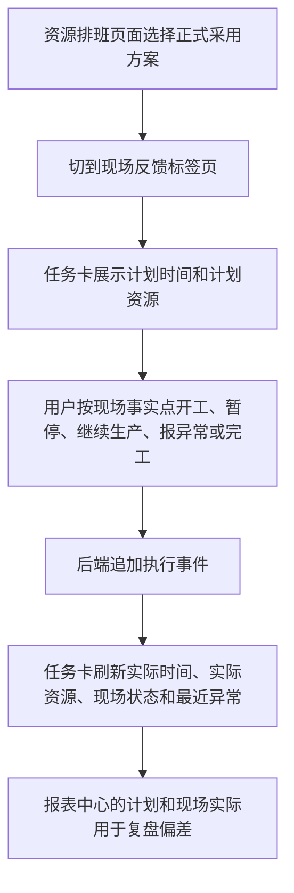

## 问题与范围

用户看到前端“现场反馈”模块后，不清楚计划开工、计划完工、实际开工、实际完工、异常等信息分别应该怎么填。本次只探索当前实现和文档口径，不改代码。

## 速答

现场反馈不是重新填写排产计划，而是在正式排产计划的任务上追加“现场实际发生了什么”。计划开始、计划结束、计划设备、计划人员来自排产结果，只展示给用户核对；用户真正填写的是反馈人、实际设备、实际人员、完成数量、暂停原因、异常原因、异常严重程度、影响资源、处理状态等现场事实。

只有当前最新的正式采用方案能写反馈。历史正式方案、对比参考方案、模拟预览都只能看，不能提交。提交动作按状态推进：待开工只能开工，生产中可暂停、完工、报异常，暂停中可继续生产、完工、报异常，异常中可继续生产或完工，已完工不能继续提交动作。

## 关键证据

- `.codestable/requirements/shop-floor-execution-feedback.md:21` 说明计划排程是“原本打算怎么做”，车间反馈是“现场实际发生了什么”，两者不能混在一起。
- `.codestable/requirements/shop-floor-execution-feedback.md:29` 明确现场实际时间不能覆盖原来的计划排程行，候选方案、模拟预览、历史正式方案不能写反馈。
- `templates/scheduler/resource_dispatch.html:284` 到 `templates/scheduler/resource_dispatch.html:294` 显示现场反馈标签页只有“反馈人”和任务卡容器，计划时间不是输入框。
- `static/js/resource_dispatch.js:428` 到 `static/js/resource_dispatch.js:436` 任务卡展示计划开始、实际开始、计划结束、实际结束、计划设备、实际设备、计划人员、实际人员。
- `static/js/resource_dispatch.js:487` 到 `static/js/resource_dispatch.js:563` 前端提交时会要求填写反馈人，并按动作弹出实际设备、实际人员、完成数量、暂停原因、异常原因、严重程度、影响时间、处理状态等信息。
- `core/services/scheduler/operation_execution_feedback_support.py:68` 到 `core/services/scheduler/operation_execution_feedback_support.py:85` 定义状态到动作的允许关系，避免用户在不合适的状态提交错误动作。
- `core/services/scheduler/operation_execution_feedback_service.py:342` 到 `core/services/scheduler/operation_execution_feedback_service.py:357` 后端再次确认只有最新正式采用方案能提交现场反馈。
- `static/docs/scheduler_manual.md:1359` 到 `static/docs/scheduler_manual.md:1373` 用户手册说明现场反馈只对最新正式采用方案开放，并解释开工、暂停、继续生产、报异常、完工分别怎么用。

## 细节展开

资源排班页上方先按视角、对象、日期、版本、方案筛选任务。页面里的“任务明细”可以看计划安排，“现场反馈”标签页用任务卡记录实际执行。任务卡里的计划开始和计划结束是排产结果，不需要也不能在这里手工改。前端提交反馈时，事件时间默认取当前浏览器时间，所以当前页面口径更像“现场当下点一下确认”，不是补录任意历史时间。

开工动作会要求确认实际设备和实际人员。实际设备默认带出计划设备，但后端要求它必须是当前正式排程记录里的设备；实际人员要填有效人员。完工动作要求填写完成数量，后端会校验完成数量和报废数量相加不能超过计划数量。

异常动作只用于“已经开工或暂停的任务”。异常原因只能选设备问题、人员问题、物料问题、质量问题、工艺问题、外协问题、其他；严重程度只能选轻微、一般、严重、紧急；处理状态只能选刚上报、处理中、等待条件、已处理。预计影响分钟数可以不填，不确定时页面会显示“暂时不知道影响多久”。是否建议重排只是一条提示，不会自动触发重新排程。

报表中心的“计划和现场实际”会把计划行和执行事件聚合结果放在一起，显示实际开始、实际结束、开工偏差、完工偏差、实际资源、暂停时长和异常信息。没有现场反馈时，它会写“暂无现场反馈”，不会把计划设备或计划人员冒充成实际设备或实际人员。

## 未决问题

当前前端使用浏览器当前时间作为反馈时间，没有给普通用户一个明显的“补录实际发生时间”输入框。撤销开工、撤销完工、纠错和反冲也被需求文档列为后续单独能力，不在第一版范围内。

## 后续建议

如果现场确实需要补录昨天的开工时间、修改误点的完工时间，下一步应单独设计“现场反馈补录和纠错”能力。

## 相关文档

- `.codestable/requirements/shop-floor-execution-feedback.md`
- `.codestable/features/2026-05-27-resource-dispatch-start-finish-feedback/resource-dispatch-start-finish-feedback-design.md`
- `.codestable/features/2026-05-27-shop-exception-feedback/shop-exception-feedback-design.md`
- `.codestable/features/2026-05-27-plan-vs-actual-review/plan-vs-actual-review-design.md`
- `static/docs/scheduler_manual.md`
- `static/docs/aps_three_gap_user_guide.md`
