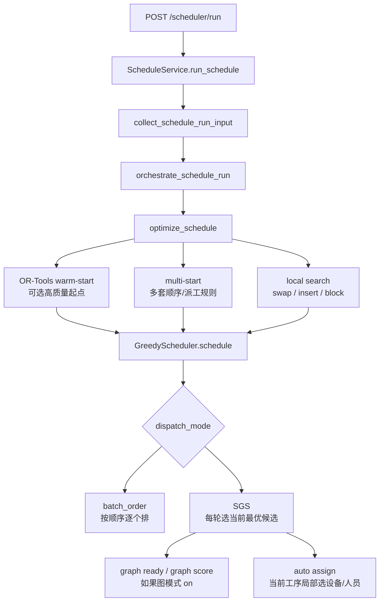

# 排产算法是否需要升级：调用链与先进算法探索

## 速答

需要升级，但不建议把当前算法整套推倒重写。

现在的系统不是“没有算法优化”。它已经有：

- Greedy / SGS 主排产链路。
- 图 ready 队列和图评分。
- 候选方案对比。
- OR-Tools 可选 warm-start。
- multi-start。
- 局部搜索。

真正问题是：这些优化主要还在“多试几套批次顺序、派工规则、图权重，再用同一个贪心排产器重跑”的范围里。它能更稳、更快地拿到可用方案，但离“全局最优求解器”还有距离。

推荐路线是：

1. 先补严肃 benchmark，证明每一步升级到底有没有变好。
2. 保留 Greedy / SGS 作为第一可行解和硬约束主链。
3. 把 local search 从“换批次顺序”升级到“关键链、瓶颈资源、延期批次、资源替换”的业务邻域。
4. 中期引入 LNS / ALNS，把已有可行排程局部拆开重排。
5. CP-SAT / OR-Tools 只作为未来解除“现阶段不加 OR-Tools”限制后的候选方向；本次 roadmap 不把它纳入实现主线。

## 本轮研究方式

- 主线程用调用链工具和源码逐层下钻，确认真实排产入口和算法核心。
- 9 个 Sub Agent 并行读取不同区域：入口链路、Greedy/SGS、optimizer/local search、图分析/NetworkX、benchmark 证据、CodeStable 路线、外部先进算法资料、ALNS/LNS 和 exact oracle。
- 外部资料使用 Exa MCP 联网研究，并补查 OR-Tools 官方文档和相关算法资料。
- 本轮只读研究，不改业务代码。

## 当前算法主链

真实调用链是：

1. `web/routes/domains/scheduler/scheduler_run.py:38-59`：页面提交排产请求。
2. `core/services/scheduler/schedule_service.py:197-224`：服务层加锁，进入排产实现。
3. `core/services/scheduler/run/schedule_input_collector.py:264`：收集批次、工序、冻结、资源池等算法输入。
4. `core/services/scheduler/run/schedule_orchestrator.py:141-169`：编排器调用优化函数。
5. `core/services/scheduler/run/schedule_optimizer.py:71-214`：优化器依次尝试 OR-Tools warm-start、multi-start、local search。
6. `core/algorithms/greedy/scheduler.py:61-140`：GreedyScheduler 建立批次顺序和排产状态。
7. `core/algorithms/greedy/dispatch/sgs.py:180-248`：SGS 每轮收集当前候选、打分、选一个、落位。

大白话解释：网页点“运行排产”后，不是直接进入某个全局数学求解器，而是先把数据整理好，再让优化器多试几套起点和规则，最后都交给 Greedy / SGS 这条主链真正排时间、排设备、排人员。

## 现有优化能力

### 1. OR-Tools 只是局部高质量起点

`core/algorithms/ortools_bottleneck.py:3-13` 写得很明确：

- 不做全量 APS。
- 只对瓶颈工种做单机序列子问题。
- 求出一个 batch 顺序后，作为 Greedy / SGS 的一个起点。
- 依赖缺失时走可见降级，不是硬依赖。

这条设计是合理的。原因是本项目仍要服从 Win7 x64、Python 3.8、离线交付边界。外部资料也显示，最新版 OR-Tools 已有 drop Python 3.8 的发布记录，官方 Windows 文档主要按 Windows 10 x64 测试。因此它适合继续当可选增强，不适合现在变成默认必装主引擎。

### 2. multi-start 主要枚举固定策略

`core/services/scheduler/run/schedule_optimizer.py:159-185` 说明 multi-start 会枚举策略、派工方式和派工规则。它的价值是用低风险方式多试几套方案。

但它还不是“自由搜索完整排程”。它主要改变批次顺序、派工模式和规则，然后继续交给同一个 Greedy / SGS 主排产器。

### 3. local search 邻域太窄

`core/services/scheduler/run/optimizer_local_search.py:15-61` 现在只有三类随机邻域：

- swap：交换两个批次。
- insert：抽一个批次插到另一个位置。
- block：搬动一小段批次。

`core/services/scheduler/run/optimizer_local_search.py:217-314` 会在预算和迭代上限内重复尝试，找到更优才替换。

这说明它能做“批次顺序附近的小范围改良”，但还没有深入搜索：

- 某台瓶颈设备上的工序重排。
- 某个关键链整段前移。
- 某个延期批次周边的局部窗口重排。
- 设备 / 人员替换。
- 冻结窗口之外的 repair。

### 4. SGS 是逐步贪心，不是全局求解

`core/algorithms/greedy/dispatch/sgs.py:180-248` 的核心逻辑是：

1. 收集当前能排的候选工序。
2. 给每个候选打分。
3. 选分数最好的一个。
4. 把它排上。
5. 进入下一轮。

图分析开启时，`core/algorithms/greedy/dispatch/sgs.py:341-348` 会把图优先级拼进候选评分。这个能力有用，但本质还是“每轮选当前最合适的一个”，不是一次性同时求全局最优。

### 5. 图分析已经参与排产，但还不是图求解器

图模式 `on` 已经能影响 ready 队列、图评分和候选方案选择。它不是纯报告。

但它的定位更像“告诉 SGS 哪些工序现在更该优先”，真正排时间、处理设备人员占用、停机、冻结和失败的，仍是 Greedy / SGS 主链。

资源匹配目前也更偏解释层。`core/services/scheduler/graph/resource_matching.py:153-202` 做第一波 ready 工序和设备的最大匹配摘要，`resource_matching_summary_to_public_dict()` 只对外给计数。它还没有反向控制设备分配。

## benchmark 证据不足

现有 FJSP 报告有价值，但不能作为“已经证明更先进算法有效”的强证据。

`evidence/Benchmark/fjsp_benchmark_report.md:4-6` 自己说明了局限：公开 FJSP 数据里的“多机可选且工时随机器变化”被 APS 模型折叠成单机绑定，所以 gap 只能参考。

线上可复核的重点不是某几组具体数字，而是证据口径本身还不够硬：

- 能跑。
- 当前报告只有少量 FJSP 折叠样本。
- gap 只能做参考对照。
- 还没有同模型 tiny exact oracle、稳定下界、best-known 管理和非劣化门禁。
- 还不能证明全局最优，也不能证明“继续加时间预算就一定变好”。

本地工作区里的 `evidence/Benchmark/fjsp_benchmark_report.md` 当前还有未提交改动，本文不把那些本地数字作为线上审阅证据；正式数值结论必须由后续 `optimizer-proof-harness` 重新生成并进入可复核流程。

## 根因判断

最深根因不是“缺一个更高级库”，而是三件事叠在一起：

1. 搜索变量太少。
   - 现在主要搜索批次顺序、派工规则、图权重档位。
   - 还没有系统搜索设备选择、人员选择、工序级插入、瓶颈资源窗口、关键链片段。

2. 搜索邻域太窄。
   - local search 现在基本是批次顺序的 swap / insert / block。
   - 它不会主动围绕延期批次、瓶颈设备、关键链做更有业务意义的移动。

3. 评测体系还不够硬。
   - FJSP 折叠后只能参考。
   - benchmark 脚本不是质量门禁里的自动阈值。
   - 缺少同模型小规模 exact oracle / lower bound。
   - 缺少真实业务样本集上的稳定对比。

这三个不补，直接换 CP-SAT、GA、SA、Tabu 或 LNS 都可能变成“看起来更先进，但不知道是否真的更好”。

## 先进算法对本项目的适配判断

| 算法方向 | 适合做什么 | 不适合做什么 | 本项目建议 |
| --- | --- | --- | --- |
| CP-SAT / OR-Tools | 小规模最优、瓶颈资源、关键链 repair、滚动窗口、给 greedy 提供高质量起点 | 当前非 OR-Tools 阶段直接纳入主线，或直接全量替换主排产链路 | 只作为未来可选增强；本次 `scheduler-global-optimizer` roadmap 不纳入 |
| Tabu Search | 在现有解附近深入搜索，避免重复来回换 | 单独证明全局最优 | 接在现有 local search 后面 |
| Simulated Annealing | 允许短期接受变差结果，跳出局部最优 | 单独做主算法 | 可作为 local search 的接受策略 |
| GA | 同时探索多套顺序和资源分配 | 第一阶段直接纯 GA 重写 | 等 benchmark 稳了再评估 |
| LNS / ALNS | 拆一小块排程，再局部修回去 | 没有 benchmark 时盲目上大工程 | 中期最推荐 |
| MILP 全量模型 | 小规模理论最优和下界证明 | 大规模真实 APS 默认主引擎 | 可做评测 oracle，不做主线 |
| DRL / GPU / 云优化 | 大规模数据训练、现代云部署 | Win7 离线交付 | 不适合当前边界 |

外部参考：

- OR-Tools CP-SAT 官方文档：<https://developers.google.com/optimization/cp/cp_solver>
- OR-Tools Job Shop 官方示例：<https://developers.google.com/optimization/scheduling/job_shop>
- OR-Tools Windows/Python 安装说明：<https://developers.google.com/optimization/install/python/pkg_windows>
- OR-Tools v9.13 发布记录，含 drop Python 3.8：<https://github.com/google/or-tools/releases/tag/v9.13>
- ALNS Python 包论文：<https://doi.org/10.21105/joss.05028>
- ALNS 项目：<https://github.com/N-Wouda/ALNS>
- FJSP 综述：<https://doi.org/10.1016/j.ejor.2023.05.017>
- PyJobShop：<https://arxiv.org/pdf/2502.13483>

## 推荐路线

### P0：先补算法评测底座

目标不是多写几个脚本，而是让每次算法升级都能回答：

- 有没有更好？
- 好在哪里？
- 有没有变慢？
- 有没有在某些场景变差？
- 有没有把可行解变成不可行？

建议内容：

- 建一个同模型 APS benchmark harness。
- 小规模 case 加 exact oracle 或 lower bound。
- 中大规模 case 只承诺相对改进和不劣化。
- 指标至少包括失败工序数、超期批次数、总拖期、最大拖期、makespan、换型次数、设备/人员利用、运行时间。
- benchmark 输出到临时目录，避免每次运行改写 `evidence/Benchmark`。
- 把关键阈值接入质量门禁或独立算法门禁。

### P1：强化现有 optimizer，不换主引擎

建议先做这些低风险增强：

- 增加搜索 stop_reason，让用户知道是候选跑完、超时、迭代上限还是没有更好方案。
- multi-start 不只复用同一排序结果，允许不同派工规则生成不同排序起点。
- 图候选先跑 3/5/7 档，再围绕当前最好权重细化搜索。
- rejected candidate 按原因聚合，帮助判断为什么没选某套方案。

### P2：把 local search 从“随机换顺序”升级为“业务邻域”

优先加这些邻域：

- 延期批次窗口：围绕超期批次前后几天重排。
- 瓶颈设备窗口：只动某台设备相关工序。
- 关键链片段：把关键链上连续片段提前或重排。
- 同换型族块移动：减少频繁换型。
- 资源替换候选：在可选设备/人员里重试不同组合。
- 冻结窗口外 repair：已开工/已冻结不动，只修未来窗口。

### P3：引入 LNS / ALNS

LNS / ALNS 更适合本项目中期升级，因为它不用推翻现有排产器。

做法是：

1. 先用当前 Greedy / SGS 生成可行排程。
2. 选择一小块要“拆掉”的区域，比如延期批次、瓶颈设备、未来 3-7 天窗口。
3. 当前阶段用 Greedy / SGS 把这块修回去；未来若解除 OR-Tools 限制，再单独评估 CP-SAT repair。
4. 只在新方案更好且不破坏硬约束时接受。

这条路比“直接全量 CP-SAT”更适合当前离线 APS，也更容易做渐进验证。

### P4：未来可选：CP-SAT 做局部强求解器

这一段不属于本次非 OR-Tools roadmap，只记录未来解除限制后的候选方向。CP-SAT 适合做：

- 瓶颈设备/工种排序。
- 小规模窗口内设备选择和时间安排。
- 关键链 repair。
- 下界估计。
- 小规模 exact oracle。

不建议现在做：

- 全量 APS 默认主引擎。
- 强制依赖最新版 OR-Tools。
- 不做 packaging proof 就进入 Win7 离线包。

## 不建议路线

- 不建议直接“换成更先进算法”然后重写主链。
- 不建议把最新版 OR-Tools 变成硬依赖。
- 不建议纯 GA / 纯 SA 从零重写。
- 不建议无限加大 local search 时间预算。
- 不建议上云、GPU、DRL。
- 不建议先追求“任何规模都证明全局最优”。更现实的目标是：小规模能证明最优或有下界，大规模能证明比旧算法稳定更好或至少不劣化。

## 旁支发现：诊断页可能暴露内部样本

这不是算法优劣问题，但应该单独开 issue。

证据链：

1. `core/services/scheduler/graph/resource_matching.py:224-249` 会把 `unmatched_operation_ids_sample` 和 `bottleneck_machine_ids_sample` 写入 diagnostics。
2. `web/viewmodels/scheduler_analysis_diagnostic_health.py:384-385` 会读取这两个 sample。
3. `web/viewmodels/scheduler_analysis_diagnostic_health.py:332-344` 会把 sample 放进页面 item details。
4. `templates/scheduler/analysis_parts/_diagnostic_sections.html:38-45` 会在“查看诊断依据”里渲染这些 detail。

架构口径要求 public 页面不要展示内部 `op_id` 这类标识。建议后续走 `cs-issue`：

- 页面只显示计数，或显示批次号 + 工序号/工序名这类业务可读字段。
- diagnostics 内部样本继续保留给调试，但不能直接进 public 页面。
- 补测试断言分析页、导出、OperationLogs 不出现内部 id 样本。

## 与旧资料的关系

`.codestable/compound/2026-05-23-explore-aps-three-gap-directions.md` 当时建议“第一版不重写算法，先把已有候选方案解释好”。这个结论仍然成立。

本文件补充的是下一层判断：

- 如果目标只是让计划员看懂结果，优先做解释层和方案对比。
- 如果目标是追求更接近全局最优，就需要单独开算法升级路线。
- 算法升级不能从“换高级库”开始，应从 benchmark 和搜索空间扩展开始。

## 建议下一步

如果决定继续推进，建议按已开出的 roadmap：`scheduler-global-optimizer`。

执行子项以 `.codestable/roadmap/scheduler-global-optimizer/scheduler-global-optimizer-items.yaml` 为准：

1. `optimizer-proof-harness`：算法评测底座。
2. `diagnostic-public-id-boundary-fix`：诊断页内部样本泄漏修复。
3. `optimizer-search-report-contract`：搜索过程、`stop_reason`、seed 和候选拒绝原因。
4. `optimizer-candidate-profile-contract`：非 OR-Tools 搜索 profile 和 fail-loud 配置合同。
5. `grasp-ig-candidate-construction`：GRASP / Iterated Greedy 可行起点。
6. `business-neighborhood-registry`：关键链、延期、瓶颈、换型、资源替换和时间窗邻域。
7. `vns-sa-local-search-upgrade`：VNS / SA 后处理。
8. `alns-partial-repair-contract`：ALNS 局部拆修的正式排产守门链复用合同。
9. `alns-state-operators-core`：ALNS state 和 destroy/repair operator 外壳。
10. `alns-sgs-repair-adapter`：SGS repair 适配。
11. `alns-selection-acceptance-trace`：ALNS 选择、接受和 trace。
12. `optimizer-integration-auto-selection`：接回 `OptimizationOutcome`、候选比较和 summary。
13. `benchmark-ratchet-quality-gate`：算法门禁和非劣化阈值。
14. `long-run-tuning-evidence`：长跑调参与统计证据。

未来如果解除“现阶段不加 OR-Tools”的限制，再单独开 `scheduler-cpsat-window-solver`，不要混进本次非 OR-Tools roadmap。
