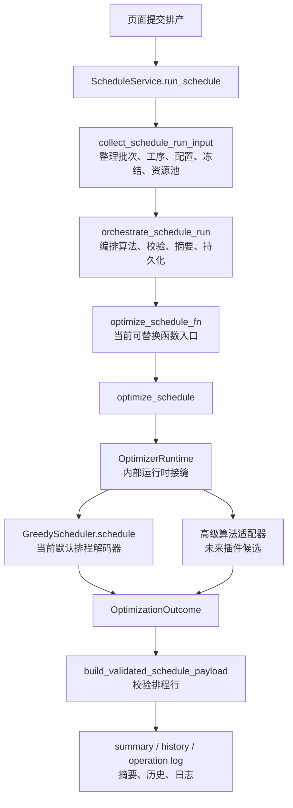

## 问题与范围

本次问题是：当前排产算法层能不能做成插件形式运行，以后如果有更高级算法库，能否直接接入。

本次只做代码探索，不改业务代码。重点看五块：

- 排产主流程在哪里调用算法。
- 现有优化器有没有可替换接缝。
- 贪心算法真正输入输出是什么。
- 配置、汇总、持久化对算法结果有什么硬要求。
- 现有测试已经保护了哪些替换边界。

## 速答

可以做，但不是现在就能“直接把高级算法库扔进来就跑”。

当前更准确的状态是：

- 已经有半成品接缝：服务编排层能传入 `optimize_schedule_fn`，优化器内部有 `OptimizerRuntime`，调度器调用也有签名兼容层。
- 还没有正式插件体系：没有插件发现、注册、配置选择、插件身份记录、插件能力协商和插件返回值适配合同。
- 最低成本接法是：先把高级算法库包成一个兼容当前 `OptimizationOutcome` 的适配器。
- 更稳的长期接法是：新增一个明确的“算法插件合同层”，把插件输入、插件输出、能力声明、错误处理和摘要投影都固定住。
- 更准确的范围不是“整个排产核心插件化”，而是“排产算法引擎插件化”。输入收集、排程行校验、摘要白名单、历史持久化和执行态保护仍应留在现有主链里。
- 现有 `core/plugins` 框架可以借“插件身份、能力注册、冲突可见、默认关闭”的思想，但第一阶段不建议直接复用它的动态加载和“失败不阻断启动”语义来跑核心排产算法。
- 这件事更适合并入 `scheduler-global-optimizer` 路线，作为一个上层“算法引擎合同”枢纽，而不是另开一条平行大路线。

大白话说：现在系统里已经有几个“可以换零件”的口子，但这些口子主要是给内部测试和内部重构用的。真要做插件，就要先把“高级算法库给我们的结果”翻译成当前系统能认的排程结果、摘要、指标和诊断信息。

## 关键证据

1. 主流程已经把算法调用放在编排器里，而且算法函数是参数。
   - `core/services/scheduler/schedule_service.py:321-327` 把 `optimize_schedule` 作为 `optimize_schedule_fn` 传给编排器。
   - `core/services/scheduler/run/schedule_orchestrator.py:145-173` 统一调用 `optimize_schedule_fn`，并传入日历、配置、工序、批次、停机、种子、资源池、图上下文等固定参数。

2. 但编排器目前硬性要求返回当前优化器的 `OptimizationOutcome`。
   - `core/services/scheduler/run/schedule_orchestrator.py:80-85` 直接导入并检查 `OptimizationOutcome` 类型，不是任意插件结果协议。

3. 优化器内部已经有 `OptimizerRuntime`，可以替换调度器工厂和若干阶段函数。
   - `core/services/scheduler/run/optimizer_runtime.py:7-16` 定义了 `scheduler_factory`、时钟、随机数、多起点、局部搜索、图候选、GRASP/IG 候选等接缝。
   - `core/services/scheduler/run/schedule_optimizer.py:76-86` 默认运行时仍绑定到内置 `GreedyScheduler` 和内置阶段函数。
   - `core/services/scheduler/run/schedule_optimizer.py:229-236` 的 `_runtime` 参数可替换运行时，但它是内部形态，不是公开插件入口。

4. 当前真正排时间、排设备、排人员的是 `GreedyScheduler.schedule`。
   - `core/algorithms/greedy/scheduler.py:70-87` 定义了当前调度器入口参数。
   - `core/algorithms/greedy/scheduler.py:128-142` 执行派工并返回排程结果、摘要、实际策略和实际参数。
   - `core/algorithms/types.py:10-39` 定义下游认可的 `ScheduleResult` 和 `ScheduleSummary` 基本形状。

5. 下游持久化不是“拿到任意算法结果就写库”，而是先校验排程行。
   - `core/services/scheduler/run/schedule_payload_contract.py:203-265` 要求每条结果能形成合法排程行，并拒绝越界工序、重复工序、非法时间和来源不一致。
   - `core/services/scheduler/run/schedule_persistence.py:290-320` 只把校验后的排程行写入排程表和历史记录。

6. 配置不是任意扩展字段，新算法名和新目标必须先进入配置合同。
   - `core/services/scheduler/config/config_field_spec.py:259-303` 当前算法模式只有 `greedy` 和 `improve`，目标也是枚举。
   - `core/services/scheduler/config/config_snapshot.py:24-55` 运行配置快照字段固定。

7. 摘要和公开展示有白名单，新插件诊断不能随便塞字段。
   - `core/services/scheduler/summary/schedule_summary_assembly.py:261-292` 会组装内部算法摘要。
   - `core/services/scheduler/summary/optimizer_public_summary.py:30-60` 公开算法摘要只投影白名单字段。

8. 测试已经保护内部接缝，但还没有保护完整插件体系。
   - `tests/algorithm/test_optimizer_runtime_seam_contract.py:86-114` 验证 `OptimizerRuntime` 的注入确实生效。
   - `tests/schedule/service/test_schedule_orchestrator_contract.py:140-216` 验证编排器可以注入 `optimize_schedule_fn`。
   - `tests/algorithm/test_schedule_optimizer_strict_mode_signature_cache.py:94-160` 验证调度器签名兼容、严格模式、齐套检查和图上下文边界。

9. 现有通用插件框架不是为核心算法主链设计的。
   - `core/plugins/manager.py:99-113` 说明当前插件管理器会动态加载 `plugins/*.py`，并建议重依赖不要放在顶层 import。
   - `core/plugins/registry.py:7-24` 只提供通用能力注册表和“先加载者保留”的冲突策略，能力 key 示例里虽有 `solver.greedy` / `solver.ortools`，但没有排产算法输入输出合同。
   - `web/bootstrap/plugins.py:198-203` 明确插件加载失败不阻断启动，返回状态用于系统页展示。这个语义适合可选扩展，不适合把一次核心排产算法失败包装成成功。

10. 现有全局优化路线已经承载大量算法升级工作，插件化应作为其中的合同枢纽。
    - `.codestable/roadmap/scheduler-global-optimizer/scheduler-global-optimizer-roadmap.md:91-104` 已把候选构造、多阶段搜索、接回 `OptimizationOutcome` 和 summary 链路列为路线范围。
    - `.codestable/roadmap/scheduler-global-optimizer/scheduler-global-optimizer-roadmap.md:154-166` 已按证明评测、搜索合同、候选构造、工序图、自适应大邻域拆修搜索、SGS repair、展示边界、门禁等模块拆分。
    - `.codestable/roadmap/scheduler-global-optimizer/scheduler-global-optimizer-items.yaml:287-403` 后续 ALNS 条目已经要求局部 repair 继续走正式 SGS / Greedy 解码、候选指纹和剪枝报告。算法插件合同应该复用这套口径。

11. 可维护性审计说明插件化不能再扩大结构债。
    - `.codestable/audits/2026-07-01-maintainability-upgradability-baseline/index.md:83-88` 把断硬加载期目录环、排产核心分包路线和 Win7 交付证明列为 P1 优先事项。
    - `.codestable/audits/2026-07-01-maintainability-upgradability-baseline/finding-01.md:21-24` 记录 `run`、`summary`、`config` 等仍处在硬加载期目录环里。
    - `.codestable/audits/2026-07-01-maintainability-upgradability-baseline/finding-02.md:21-25` 记录 `core/services/scheduler/` 仍是巨型模块，根目录平铺和旧垫片会放大后续改动成本。

## 细节展开

### 1. 现在最容易插件化的位置

第一层是 `orchestrate_schedule_run` 的 `optimize_schedule_fn`。

这个入口最适合做“整套算法引擎替换”。也就是说，未来可以让插件提供一个函数，吃掉当前固定参数，然后返回当前系统认可的结果对象。

难点是：现在 `_normalize_optimizer_outcome` 只认 `OptimizationOutcome`。所以插件不能直接返回自己的对象，必须由适配器翻译成 `OptimizationOutcome`，否则会被 `TypeError` 拦下。

第二层是 `OptimizerRuntime`。

这个入口适合做“把某一段搜索过程换掉”，比如：

- 换调度器工厂。
- 换多起点阶段。
- 换图候选阶段。
- 换 GRASP/IG 候选阶段。
- 换局部搜索阶段。

但这个入口目前像内部测试口，不像公开插件口。字段名前有 `_runtime`，配置和前端也没有选择它的正式入口。

第三层是 `GreedyScheduler.schedule` 兼容壳。

如果高级算法库只是想接入当前优化器，可以写一个新调度器，让它看起来像 `GreedyScheduler`：接同样参数，返回同样四件东西。这个能跑，但不理想，因为它会被迫理解 `dispatch_mode`、`dispatch_rule`、`graph_ready_context` 这些当前贪心/图派工细节。

### 2. 插件必须遵守哪些硬合同

插件输出至少要能满足这几类硬合同：

- 排程行合同：每个已排工序必须有正整数工序编号、开始时间、结束时间、来源；自制工序必须有设备和人员。
- 范围合同：插件不能返回本次不可重排范围外的工序。
- 摘要合同：必须能提供成功状态、总工序数、已排数、失败数、警告、错误和耗时。
- 策略合同：当前持久化和返回值会读 `used_strategy.value`，所以插件结果要么提供兼容对象，要么上游要改成稳定字符串合同。
- 指标合同：如果插件参与候选比较，必须提供当前 `objective_score` 能理解的指标。
- 诊断合同：尝试记录、搜索报告、插件名、插件版本等不能乱进公开摘要，必须经过白名单投影。

### 2.5. 和现有插件框架、路线图、审计的结合意见

这件事不要理解成“把排产核心都改成插件”。更稳的理解是：给排产主链里的算法引擎加一层稳定合同。

也就是说：

- `collect_schedule_run_input` 仍然负责整理输入，插件不能自己读数据库拼输入。
- `build_validated_schedule_payload` 仍然负责排程行校验，插件不能直接写数据库行。
- `summary` 仍然负责公开摘要白名单，插件诊断不能直接露到页面。
- `persist_schedule` 仍然负责历史和正式结果落库，插件不能绕开事务链。
- `OptimizationOutcome` 可以继续作为短期适配目标，但长期最好在它前面有一层插件输出合同，避免外部算法库和内部对象绑死。

现有 `core/plugins` 框架可以复用三点思想：

- 插件有编号、名称、版本。
- 插件要声明能力，冲突不能静默覆盖。
- 插件状态要可观测，失败原因要能进日志和维护页面。

但它的动态加载方式和失败语义不要直接照搬到算法主链。大白话讲：Excel 后端插件加载失败，系统还可以用默认后端继续启动；排产算法插件如果本次被选择却失败，就不能假装旧算法成功跑完，否则用户看到的是“排产成功”，实际算法选择已经失效。

和 `scheduler-global-optimizer` 路线的关系也要收紧：

- 不建议新开一条“算法插件化大路线”平行推进。
- 更建议在现有路线里补一个 `scheduler-algorithm-plugin-contract` 条目，作为后续高级算法、ALNS、GraphReady、候选池统一接入的上层合同。
- 这个条目应放在“已有候选/报告/指纹合同”之后、“外部高级算法库或更大规模算法引擎接入”之前。
- 如果后续要把它写成 roadmap update，接口契约至少要写到插件输入对象、插件输出对象、能力声明、错误码、诊断投影、默认内置插件等字段级别。

和可维护性审计的关系也要明确：

- 插件合同层应尽量放在中立位置，不要继续让 `run`、`summary`、`config` 三边互相钻。
- 如果新增合同文件，优先服务于断环和分包，而不是把新层塞进已有巨型根目录。
- 第一阶段只包装当前内置优化器，要求默认行为不变；这能先证明合同安全，不会在还没稳定时就引入第三方依赖。

### 3. 现在卡住完整插件化的点

- 没有插件注册表。现在没有“注册一个算法插件，然后按名字选择”的代码证据。
- 没有插件配置字段。当前 `algo_mode` 只有快速计算和精细计算，不表达插件名。
- 没有插件能力声明。比如插件是否支持严格模式、齐套检查、图上下文、冻结种子、资源池，目前没有统一协商层。
- 没有插件结果适配层。当前直接要求 `OptimizationOutcome`，这会让外部库和内部对象绑死。
- 没有插件失败语义。插件加载失败、插件不支持能力、插件返回非法结果，该怎么报给用户和日志，目前没有统一合同。
- 没有插件身份入摘要。插件名、版本、来源、适配器版本应该进内部诊断，但公开页面只能显示安全白名单字段。

### 4. 推荐的落地方式

建议分四步，不建议一步到位大改。

第零步：先改名和收边界。

- 对外说“排产算法引擎插件化”，不要说“整个排产核心插件化”。
- 明确输入收集、排程行校验、摘要白名单、持久化、执行态保护都不插件化。
- 明确这是 `scheduler-global-optimizer` 的上层合同补强，不是另起一套算法路线。

第一步：先做“内部插件合同”，不做外部动态加载。

- 新增一个稳定协议，比如 `SchedulerAlgorithmPlugin`。
- 插件只从内置注册表选择，不从任意目录动态加载。
- 默认插件仍然是当前内置贪心/优化器。
- 新增一个适配器，把插件返回值统一转成 `OptimizationOutcome`。
- 先用测试证明：选默认插件时结果和现在一致。
- 同时定义插件身份字段，比如 `engine_id`、`engine_version`、`adapter_version`、`capabilities`，但公开页面只展示白名单摘要。

第二步：把配置从“算法模式”扩成“算法引擎 + 算法模式”。

- `algo_mode` 继续表示快速/精细。
- 新增类似 `algorithm_engine` 的字段，默认 `builtin`。
- 先只允许内置枚举，不允许用户随便填模块路径。
- 配置快照、页面保存、摘要快照和测试都要同步。
- 如果选择的引擎不支持严格模式、齐套检查、图上下文、冻结种子或资源池，必须 fail-loud 或在选择前拒绝，不能运行到一半再静默回退。

第三步：再接高级算法库。

- 高级算法库不要直接碰服务层和数据库。
- 它只接插件输入对象，返回插件输出对象。
- 由适配器负责翻译成 `ScheduleResult`、`ScheduleSummary`、指标、搜索报告。
- 所有非法返回都 fail-loud，不能静默降级成旧算法成功。

### 5. 不建议的做法

- 不建议直接把 `_runtime` 暴露给业务配置。它是内部运行时结构，太贴近当前实现。
- 不建议让外部库直接返回数据库行。这样会绕过排程行校验。
- 不建议在插件内部读数据库。插件应该只消费已经整理好的输入。
- 不建议插件失败后静默回退旧算法并显示成功。最多可以提供明确的“插件失败，未执行本次排产”或用户主动选择的备用方案。
- 不建议把插件诊断字段直接塞进公开摘要。公开摘要必须继续走白名单。
- 不建议把现有 `core/plugins` 的“启动失败不阻断”语义直接搬到排产算法执行里。核心算法执行失败必须对本次排产可见。
- 不建议让插件合同继续依附在 `run`、`summary`、`config` 三个互相借用的内部模块上。这样会把插件化变成新的循环依赖放大器。

## 未决问题

- 是否允许离线包加载用户自定义插件文件：证据不足，需要结合 Win7 离线交付、安全边界和运维方式单独定。
- 高级算法库会不会引入新依赖：证据不足。若引入，必须先证明 Python 3.8、Win7 x64、离线包可交付。
- 插件是否要支持多算法并行比较：本次只确认现有候选比较链路能做内部比较，完整插件并行比较还需要设计。
- 插件结果的公开展示范围：需要和产品页面一起定，不能只在算法层定。
- 算法插件合同层物理放在哪里最合适：证据不足。倾向放在排产算法合同的中立包里，但需要结合断环 / 分包路线一起设计，避免继续加重 `run`、`summary`、`config` 的加载期环。

## 后续建议

如果要继续推进，建议下一步不是直接写代码，而是做一次 `scheduler-global-optimizer` 的 roadmap update：新增 `scheduler-algorithm-plugin-contract` 条目，把它放在已有候选 / 搜索报告 / 指纹合同之后，作为后续高级算法库接入前置。

这条设计的验收目标建议写死：

- 默认 `builtin` 引擎走完后，结果和现有默认链路行为一致。
- 插件输入、输出、能力声明、错误语义和诊断投影都有字段级合同。
- 插件失败不静默回退成旧算法成功。
- 插件不直接读数据库、不直接写排程行、不绕过 payload 校验。
- 不引入新的 Python 版本、Win7 或离线交付风险。

## 相关文档

- `.codestable/compound/2026-06-26-explore-scheduler-algorithm-upgrade.md`
- `.codestable/roadmap/scheduler-global-optimizer/`
- `.codestable/audits/2026-07-01-maintainability-upgradability-baseline/`

## 2026-07-01 更新

本次补充把讨论范围从“整个排产核心插件化”收窄为“排产算法引擎插件化”，并补上三点判断：

- 现有 `core/plugins` 只能借插件身份、能力注册和状态可见的思想，不应直接作为核心算法动态加载入口。
- 插件合同应并入 `scheduler-global-optimizer` 路线，新增上层合同条目，而不是另开平行路线。
- 插件合同层要服务于断环和分包，不要继续放大 `run`、`summary`、`config` 的结构债。
