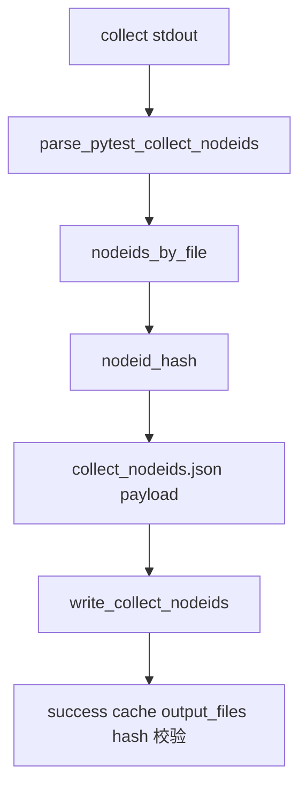

# collect-only-cache-output 设计方案

## 0. 术语约定

- collect-only：质量门禁第 1 步 `python -m pytest --collect-only -q tests`，只收集测试 nodeid，不执行测试。
- collect nodeids 输出：`evidence/QualityGate/collect_nodeids.json`，记录 collect stdout 解析出的 nodeid、数量、hash 和按文件分组结果。
- collect 输入范围：能影响 pytest 收集结果的测试文件、conftest、pytest 配置、依赖约束、门禁脚本和关键环境变量。
- 防冲突结论：本 feature 只做输出和失效合同，不把 collect-only 接入 `run_quality_gate.py` 的复用循环。

## 1. 决策与约束

### 需求摘要

本 feature 只做 roadmap PR-2：为 collect-only 建立稳定输出结构，并让 long gate manifest 的 collect entry 声明输入范围和输出文件。

成功标准：

- `pytest_collect_all` entry 的 input/config/tool/dependency/env/output scope 已声明。
- 能从 collect stdout 生成 `collect_nodeids.json` payload。
- 输出包含 `nodeids`、`nodeid_count`、`nodeid_hash`、`nodeids_by_file`、`pytest_version`、`generated_from_stdout_sha256`、`collect_stdout_log_path`。
- 测试证明输入没变时 success cache 可复用，新增/删除测试文件、修改 `conftest.py` 会让 collect cache 失效。

明确不做：

- 不执行 pytest collect。
- 不把 collect-only 复用接入 `scripts/run_quality_gate.py`。
- 不新增 CLI 参数。
- 不生成 full-test-debt 或 required regression 结果。

复杂度档位：走“小型输出 helper + 合同测试”默认档位。核心风险是 nodeid 清单不可信，所以输出 hash 必须来自 stdout。

## 2. 名词与编排

### 2.1 名词层

现状：

- `tools.quality_gate_shared.parse_pytest_collect_nodeids(stdout)` 已能从 collect stdout 提取 nodeid。
- PR-1 已有 `write_success()` 和 `decide_reuse()`，可以校验输出文件 hash。

变化：

- 新增 `tools/long_gate_collect.py`。
- `tools/long_gate_manifest.py` 中 `pytest_collect_all` entry 增加 collect 输入范围、环境 key 和 `collect_nodeids.json` 输出声明。

接口示例：

```python
payload = build_collect_nodeids_payload(stdout, pytest_version="pytest 8.3.5")
write_collect_nodeids(payload, repo_root)
```

### 2.2 编排层



跨层纪律：

- 输出文件只来自已完成的 collect stdout，不主动跑 pytest。
- 如果后续复用，success cache 必须校验 `collect_nodeids.json` hash。
- 输入范围变化只负责让指纹变化，不在本 feature 里决定是否跳过真实命令循环。

### 2.3 挂载点清单

本 feature 不引入运行时挂载点，只新增：

- `tools/long_gate_collect.py`
- `evidence/QualityGate/collect_nodeids.json` 输出协议
- `pytest_collect_all` manifest scope 声明

### 2.4 推进策略

1. 编排骨架：新增 feature 文档/checklist，回写 roadmap item。
   退出信号：YAML 校验通过。
2. manifest scope：补 collect-only 输入范围、环境 key 和输出文件。
   退出信号：测试能读取 entry scope。
3. collect 输出：新增 payload 生成和写文件 helper。
   退出信号：nodeids、hash、by_file 输出正确。
4. 合同测试：用 tmp_path 证明输入不变可复用，新增/删除/修改输入会失效。
   退出信号：定向 pytest、ruff、pyright 通过。

## 3. 验收契约

关键场景：

- S1：collect stdout 含多个 nodeid → 输出 nodeids、count、hash、by_file 正确。
- S2：输入没变，success cache 中的 `collect_nodeids.json` hash 匹配 → `decision=reuse`。
- S3：新增测试文件 → `decision=run`，invalidated_by 包含新增文件。
- S4：删除测试文件 → `decision=run`，invalidated_by 包含删除文件。
- S5：修改 `tests/conftest.py` → `decision=run`，invalidated_by 包含 conftest。

反向核对项：

- `scripts/run_quality_gate.py` 不应出现 collect cache 分支。
- 不应执行 pytest collect。

## 4. 与项目级架构文档的关系

本 feature 只补质量门禁辅助输出协议，不改变项目运行架构和正式质量门禁入口。验收阶段不需要更新 architecture。
