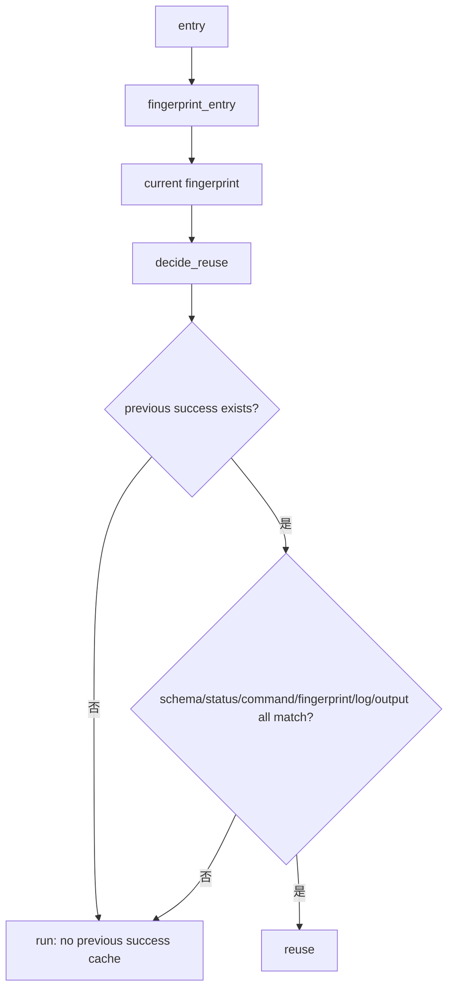

# long-gate-cache-core 设计方案

## 0. 术语约定

- 输入指纹：把一条门禁命令依赖的命令参数、文件集合、配置、依赖文件和环境变量整理成稳定 JSON，再计算 hash。输入没变，hash 才能相同。
- 文件集合指纹：记录文件路径列表 hash 和文件内容 hash。它必须能区分新增、删除、改名、内容变化、空文件替换和同内容不同路径。
- success cache：上一次成功执行后的结果记录，保存命令 hash、输入指纹 hash、stdout/stderr 日志 hash 和声明输出文件 hash。
- 复用决策：`reuse` 或 `run`。只要缓存缺失、损坏、上次不是成功、hash 不一致或输出文件缺失，就必须 `run`。
- 防冲突结论：本 feature 新增 `long_gate_fingerprint` 和 `long_gate_cache`，不改现有 QualityGate manifest/receipt 证明语义。

## 1. 决策与约束

### 需求摘要

本 feature 只做 roadmap PR-1：新增输入指纹和成功缓存核心模块，给后续 collect-only / full-test-debt / 回归组复用做底座。

成功标准：

- `fingerprint_files()` 能稳定记录路径、存在性、文件类型、大小、模式、sha256 和来源。
- `fingerprint_entry()` 能把 entry 的命令、scope 和环境合成总指纹。
- `write_success()` 写入 success cache。
- `decide_reuse()` 只在上一次成功、命令 hash 一致、输入指纹一致、日志和输出文件都存在且 hash 一致时返回 `reuse`。
- 损坏 JSON、缺字段、stdout/stderr log 缺失、output file 缺失、schema 变化、上次失败、timeout、interrupt、partial write 都必须返回 `run`。

明确不做：

- 不接入 `scripts/run_quality_gate.py`。
- 不执行任何门禁命令。
- 不为 collect-only 生成 nodeid 输出。
- 不实现 CLI 开关。
- 不删除损坏缓存。

复杂度档位：走“底层工具库”默认档位。核心风险是误复用，所以实现要保守，宁可多跑，不可错复用。

关键决策：

- D1：文件指纹默认只读仓库文件和传入 scope，不猜业务依赖。
- D2：缓存损坏只解释并绕过，不自动清理。
- D3：success cache 目录固定为 `evidence/QualityGate/long_gate/`，并加入 `.gitignore`。
- D4：测试使用临时目录，不读写真实仓库 evidence。

## 2. 名词与编排

### 2.1 名词层

现状：

- PR-0 已新增 `tools/long_gate_manifest.py`，entry 里有 `command_hash`、scope 和 `reuse_allowed`。
- 当前没有 long gate 输入指纹和 success cache 模块。

变化：

- 新增 `tools/long_gate_fingerprint.py`。
- 新增 `tools/long_gate_cache.py`。
- `.gitignore` 增加 `evidence/QualityGate/long_gate/`。

接口示例：

```python
# 来源：tools/long_gate_fingerprint.py
fingerprint = fingerprint_entry(entry, repo_root)
fingerprint["hash"] == "..."

# 来源：tools/long_gate_cache.py
decision = decide_reuse(entry, fingerprint, repo_root=repo_root)
decision["decision"] in {"reuse", "run"}
```

### 2.2 编排层

主流程：



现状：

- `tools/quality_gate_shared.py` 已有 command hash、receipt hash 等 proof helper，但没有 long gate success cache。

变化：

- 指纹模块只负责生成当前事实。
- 缓存模块只负责读写 success cache 和解释复用/失效。
- 两者不调用真实门禁命令。

跨层纪律：

- 失败语义：任何不确定都返回 `run`。
- 幂等性：重复写 success cache 会覆盖同 entry 的 success 文件。
- 可观测点：`CacheDecision.reason` 和 `invalidated_by` 必须能给用户解释。

### 2.3 挂载点清单

本 feature 不引入运行时挂载点，只新增工具库和忽略规则：

- `tools/long_gate_fingerprint.py`
- `tools/long_gate_cache.py`
- `.gitignore` 中的 `evidence/QualityGate/long_gate/`

删掉这些文件后，当前正式质量门禁行为不变。

### 2.4 推进策略

1. 编排骨架：新增 feature 文档/checklist，回写 roadmap item。
   退出信号：CodeStable YAML 校验通过。
2. 输入指纹：实现命令、环境、文件集合和 entry 指纹。
   退出信号：单测证明文件新增、删除、内容变化能改变 hash。
3. 成功缓存：实现 success cache 读写、日志/output 校验和 `CacheDecision`。
   退出信号：单测覆盖复用和各种失效场景。
4. 忽略规则和验证：补 `.gitignore`，跑定向 pytest、ruff、pyright。
   退出信号：PR-1 定向验证全部通过。

## 3. 验收契约

关键场景：

- S1：同一 entry、同一文件输入、同一环境 → 指纹 hash 稳定。
- S2：新增/删除/修改输入文件 → 文件集合 hash 变化。
- S3：上次成功且 command_hash、fingerprint_hash、日志 hash、输出文件 hash 都匹配 → `decision=reuse`。
- S4：上次失败、timeout、interrupted、partial write → `decision=run`。
- S5：cache JSON 损坏或缺字段 → `decision=run`，并说明原因。
- S6：stdout/stderr log 或 output file 缺失/hash 不一致 → `decision=run`。
- S7：command args 或 schema version 变化 → `decision=run`。

反向核对项：

- `scripts/run_quality_gate.py` 不应出现 long gate cache 接入。
- 不应新增 `--long-gate-cache` CLI。
- 测试不应写真实 `evidence/QualityGate/long_gate/`。

## 4. 与项目级架构文档的关系

本 feature 仍是质量门禁辅助工具底座，不改变正式质量门禁入口和 APS 运行架构。验收阶段不需要更新 architecture。
