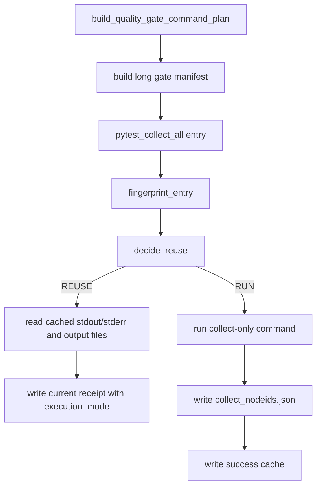

# quality-gate-runner-collect-cache 设计方案

## 0. 术语约定

- collect-only：质量门禁第 1 步 `python -m pytest --collect-only -q tests`。
- long gate success cache：PR-1 里新增的 `evidence/QualityGate/long_gate/results/*.success.json`。
- 真实执行：本次真的启动命令。
- 成功缓存复用：本次不启动命令，而是读取上一次成功缓存、日志和输出文件，并重新写本次 receipt。
- 防冲突结论：本 feature 只让 collect-only 接入复用；full-test-debt、启动回归、ruff、pyright 等仍保持原样。

## 1. 决策与约束

### 需求摘要

本 feature 完成 roadmap PR-3 的最小闭环：`scripts/run_quality_gate.py --long-gate-cache` 可以在 collect-only 输入完全没变时复用上一次成功结果；如果没有成功缓存或指纹不匹配，就照常真实执行。

成功标准：

- `--long-gate-cache` 打开 collect-only 成功缓存复用。
- `--no-long-gate-cache` 可以显式关闭。
- `--long-gate-cache-explain` 只打印决策，不执行门禁命令。
- 复用时 receipt 写 `execution_mode: reused_success_cache` 和 `reused_from`。
- 每条新写 receipt 记录 `started_at`、`ended_at`、`duration_s`、`timed_out`、`interrupted`、`partial_write`，方便后续慢命令统计和缓存安全判断。
- 真实执行通过后生成 `collect_nodeids.json`，并写入 long gate success cache。
- 普通 `--long-gate-cache` 运行开头打印决策表，让人先看懂哪些会复用、哪些会重跑。

明确不做：

- 不复用 full-test-debt、required regression、startup runtime regression、ruff、pyright。
- 不实现完整 `summary.json` / `summary.md` 和执行数量统计；这留给 roadmap PR-9。
- 不改变现有失败续跑能力；仍然先处理原来的 resume-prefix，再判断 long gate success cache。
- 不把复用伪装成真实执行。

## 2. 名词与编排

### 2.1 名词层

现状：

- PR-1 已有 `decide_reuse()`、`write_success()` 和文件/日志 hash 校验。
- PR-2 已有 `build_collect_nodeids_payload()` 和 `write_collect_nodeids()`。
- `scripts/run_quality_gate.py` 已有命令循环、receipt 写入和失败续跑逻辑。

变化：

- `scripts/run_quality_gate.py` 增加 long gate CLI 开关。
- 命令循环只为 `pytest_collect_all` entry 做 success cache 判断。
- collect-only 执行分支成功后写 `collect_nodeids.json` 和 success cache；单测里用 fake runner 代替真实 pytest 命令。
- 复用 collect-only 时读取缓存 stdout/stderr，再走原来的 collect proof 解析逻辑。

### 2.2 编排层

跨层纪律：

- 失败续跑仍然优先；被 resume-prefix 跳过的命令不再做 long gate success cache 判断。
- success cache 复用后仍要写本次 QualityGate receipt，方便本次 manifest 有完整命令证据。
- success cache 的日志放在 `evidence/QualityGate/long_gate/logs/`，不要依赖每次门禁都会清理的普通 logs。

## 3. 验收契约

关键场景：

- S1：explain 模式只输出决策表，不执行任何门禁命令。
- S2：第一次 `--long-gate-cache` 没有缓存时走 collect-only 执行分支，并写 success cache。
- S3：第二次输入不变时复用 collect-only，不再调用 pytest collect。
- S4：复用 receipt 明确写 `execution_mode: reused_success_cache` 和 `reused_from.fingerprint_hash`。
- S5：普通 `--long-gate-cache` 输出里能看到 `pytest_collect_all: RUN` 或 `pytest_collect_all: REUSE`。
- S6：已有 `--require-clean-worktree` 的生成物白名单包含 `collect_nodeids.json`，不会因为这个门禁生成物把干净工作区误判成脏。
- S7：新写 receipt 包含耗时和完整性字段，旧 receipt 缺字段时仍按旧逻辑兼容。

## 4. 与项目级架构文档的关系

本 feature 只改质量门禁 runner 的技术辅助能力，不改变 APS 业务运行架构。验收阶段不需要更新 architecture。
