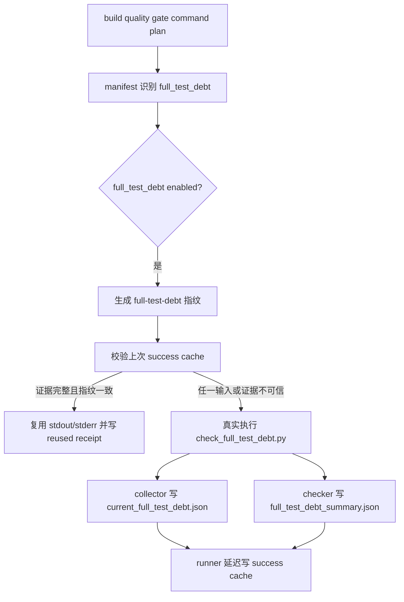

# full-test-debt-success-cache 设计方案

## 0. 术语约定

- full-test-debt：质量门禁里的 `python tools/check_full_test_debt.py` 这一步，用来确认 full pytest 测试债务证明仍可信。
- 整项成功复用：只要 full-test-debt 的所有输入完全没变，并且上次成功证据完整可信，就整步复用上次成功结果；任何输入或证据变化都重新执行整步。
- collect nodeid hash：`evidence/QualityGate/collect_nodeids.json` 里的 `nodeid_hash`。它表示当前测试 nodeid 集合。full-test-debt 复用必须绑定它。
- 输出证据：`evidence/QualityGate/current_full_test_debt.json` 和 `evidence/QualityGate/full_test_debt_summary.json`。两份文件缺一不可，hash 不一致也不可复用。
- planned entry：已经识别为长耗时候选，但还没有允许 success cache 复用的 entry。

## 1. 决策与约束

### 需求摘要

本 feature 完成 roadmap `NEXT-4`：只给 `python tools/check_full_test_debt.py` 增加整项成功复用。它复用 NEXT-3 已有的 schema、repo identity、runner/tooling hash、路径和坏证据拒绝规则，不另起缓存格式。

成功标准：

- `tools/long_gate_manifest.py` 中 success cache enabled 范围变成 `pytest_collect_all` + `full_test_debt`。
- `full_test_debt` 的输入指纹覆盖测试、源码、配置、依赖、治理台账、collector/checker/registry 工具和 `collect_nodeids.json`。
- `collect_nodeids.json` 缺失或 `nodeid_hash` 变化时，整项重跑，不做局部 nodeid 增量。
- `check_full_test_debt.py` 成功时稳定写出 `full_test_debt_summary.json`。
- runner 成功写缓存时按 entry 的 `output_result_files` 写入 output hash；full-test-debt 不走 collect-only 的 `collect_nodeids.json` 生成逻辑。
- 复用时 stdout/stderr 从上次 success cache 日志恢复，receipt 写 `execution_mode=reused_success_cache`，summary 标成 reused。

明确不做：

- 不做 `full_test_debt_node_cache.json`，不做 nodeid 级增量，那是 NEXT-5。
- 不启用 startup、required、ruff、pyright、debt ledger、quickref 等其它 planned entry。
- 不改变 `check_full_test_debt.py` 的债务判定语义，不吞异常，不把失败 proof 写成成功 cache。
- 不把 explain 当 proof；explain 只打印决策，不写 summary、receipt 或 success cache。
- 不提交 `evidence/QualityGate/` 下的运行产物。

复杂度档位：质量门禁缓存。最重要的不是命中率，而是不能少跑一次错用旧证据；所以边界一律保守。

## 2. 名词与编排

### 2.1 名词层

设计时现状：

- `tools/long_gate_manifest.py` 已能把 `python tools/check_full_test_debt.py` 分类为 `full_test_debt`，但设计起草时 `_CACHE_ENABLED_ENTRY_TYPES` 只包含 `pytest_collect_all`。
- `full_test_debt` 只声明了两个输出文件，没有完整输入范围。
- `tools/long_gate_fingerprint.py` 会把 entry 的文件 scope、环境 key 和 output_result_files 组装成总指纹，但不会主动读取 `collect_nodeids.json` 内部字段。
- `tools/check_full_test_debt.py` 成功时只把 summary 打到 stdout；`tools/collect_full_test_debt.py` 会写 `current_full_test_debt.json`。
- `scripts/run_quality_gate.py` 成功写 success cache 的分支目前只适配 collect-only，会生成 `collect_nodeids.json`。

变化：

- `full_test_debt` 进入 `_CACHE_ENABLED_ENTRY_TYPES`。
- `full_test_debt` 的 input/config/tool/dependency scope 补齐为 roadmap 指定范围，并把 `evidence/QualityGate/collect_nodeids.json` 作为输入文件纳入指纹。
- `tools/long_gate_fingerprint.py` 对 full-test-debt 的 `collect_nodeids.json` 增加结构化依赖：读取 `nodeid_hash`、schema、状态和 nodeid_count，写入 fingerprint 组件；文件缺失、JSON 损坏、字段缺失都会让指纹变化或不可复用。
- `tools/check_full_test_debt.py` 成功后原子写出 `evidence/QualityGate/full_test_debt_summary.json`，内容与 stdout summary 同源。
- `scripts/run_quality_gate.py` 增加 entry 级输出准备：collect-only 仍生成 `collect_nodeids.json`；full-test-debt 只收集 manifest 声明的两个输出文件，交给 `write_success()` 做 hash 校验。

### 2.2 编排层

跨层纪律：

- enabled 范围仍只由 `_CACHE_ENABLED_ENTRY_TYPES` 控制。
- success cache 写入继续等 summary 写入成功之后再落盘。
- dirty worktree、resume、timeout、interrupt、partial write 都沿用 NEXT-3 的拒绝规则。
- full-test-debt 的复用单位始终是整项，不因为测试文件变化做局部重跑。

### 2.3 挂载点

- `tools/long_gate_manifest.py`：登记 full-test-debt 的 enabled 状态、输入范围和输出文件。
- `tools/long_gate_fingerprint.py`：把 collect nodeid hash 纳入 full-test-debt 指纹。
- `scripts/run_quality_gate.py`：按 entry 类型准备 success cache 输出文件。
- `tools/check_full_test_debt.py`：补稳定 summary 输出文件。
- `tests/test_long_gate_full_test_debt_cache.py`：锁住正常复用、失效路径和范围边界。

拔掉本 feature 的方式：把 `full_test_debt` 从 enabled 列表移回 planned，移除 full-test-debt 指纹专用组件、runner 输出准备和 summary 输出测试，`check_full_test_debt.py` 仍可继续 stdout proof。

### 2.4 推进策略

1. 先补 CodeStable 文档和 roadmap in-progress 绑定。
2. 调整 manifest，让 enabled 范围只新增 `full_test_debt`，同时补齐输入/输出 scope。
3. 调整 fingerprint，让 full-test-debt 指纹包含 `collect_nodeids.json` 的 `nodeid_hash`。
4. 调整 checker/runner，让 summary 输出和 entry 级 output cache 写入都稳定。
5. 增加合同测试，覆盖成功复用、输入变化、坏证据、force/explain/planned 守护。
6. 跑窄验证、静态检查、explain，再进入验收回写。

## 3. 验收契约

关键场景：

- S1：成功执行 full-test-debt 后写 success cache，cache 里含两个输出文件 hash。
- S2：输入完全不变时复用 full-test-debt，不再次执行命令，receipt/summary 标为 reused。
- S3：`tests/**/*.py` 变化后不复用。
- S4：`core/**/*.py`、`web/**/*.py`、`data/**/*.py`、`plugins/**/*.py`、`app.py`、`app_new_ui.py`、`config.py`、`schema.sql` 任一变化后不复用。
- S5：技术债务台账变化后不复用。
- S6：collector/checker/registry 或 long gate 工具变化后不复用。
- S7：pytest 配置或依赖文件变化后不复用。
- S8：`collect_nodeids.json` 缺失、损坏、缺 `nodeid_hash` 或 `nodeid_hash` 变化后不复用。
- S9：`current_full_test_debt.json` 或 `full_test_debt_summary.json` 缺失、hash 不匹配后不复用。
- S10：stdout/stderr 日志缺失、损坏、非 UTF-8 后不复用。
- S11：timeout/interrupted/partial_write 旧成功证据不复用。
- S12：force rerun 只刷新 enabled entry；其它 planned entry 不被误启用。
- S13：explain 只打印，不写 proof。
- S14：NEXT-5 和其它 planned entry 仍保持 planned。

反向核对项：

- 不新增 `full_test_debt_node_cache.json`。
- 不启用 startup、required、ruff、pyright、debt ledger、quickref。
- 不改债务判断规则和 active xfail 语义。
- 不为了缓存命中加宽松 fallback。
- 不提交运行 evidence 产物。

## 4. 与项目级架构文档的关系

本 feature 是质量门禁工具链内部能力，不改变 APS 排产业务功能，不需要更新 `.codestable/requirements/`。roadmap 已经记录质量门禁长耗时缓存的整体架构；验收阶段只需要把本次完成状态回写到 roadmap/items，不需要更新 `.codestable/architecture/ARCHITECTURE.md`。
