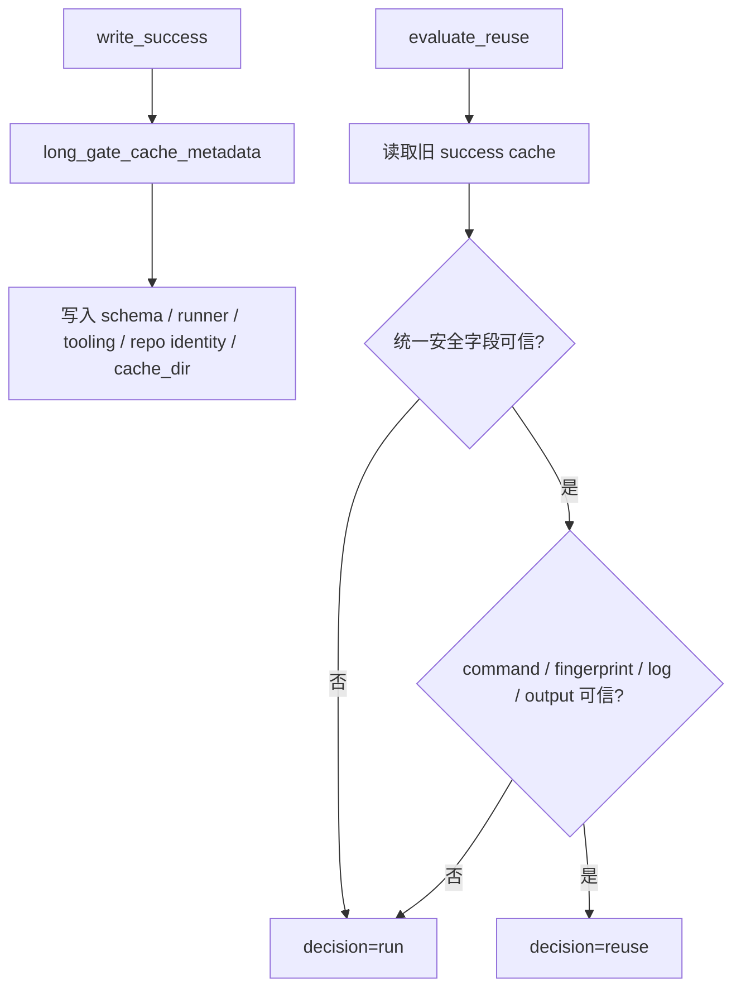

# long-gate-cache-safety-hardening 设计方案

## 0. 术语约定

- cache schema：success cache 文件自己的结构版本。它变了，旧 cache 不能继续复用。
- fingerprint schema：输入指纹的结构版本。它变了，旧指纹不能继续拿来证明“输入没变”。
- runner hash：`scripts/run_quality_gate.py` 的版本 hash。runner 变了，旧成功缓存必须失效。
- tooling hash：long gate 相关工具文件的版本 hash。缓存、指纹、manifest、summary、路径和 schema 工具变了，旧成功缓存必须失效。
- repo identity：当前 checkout 根目录真实路径和 git common dir 真实路径。搬到另一个 checkout 的 cache 不能直接当本仓库证据。
- 安全路径：路径必须留在 repo root 内；cache dir 仍只能在 `evidence/QualityGate/long_gate/` 或其子目录下。
- 坏证据重跑：旧 cache、日志、输出文件、指纹结构或路径只要不可信，就返回 `decision=run`，让真实命令重新执行。

## 1. 决策与约束

### 需求摘要

本 feature 完成 roadmap `NEXT-3`：把 long gate success cache 的共用安全规则集中起来，并把缺字段、坏结构、仓库身份不一致、runner/tooling 版本变化这些情况全部收紧成“重新执行”，避免误复用。

成功标准：

- 新增 `tools/long_gate_paths.py`，统一 repo 内路径、realpath、相对路径转换和常量。
- 新增 `tools/long_gate_schema.py`，统一 cache / fingerprint / manifest / summary schema version，以及 runner/tooling hash 和 repo identity 生成。
- success cache 写入 `cache_schema_version`、`fingerprint_schema_version`、`runner_version_hash`、`tooling_version_hash`、`cache_dir`、`repo_root_realpath`、`git_common_dir_realpath`。
- `evaluate_reuse()` 校验这些字段，不一致时稳定返回 `decision=run`。
- 数字字段必须是真正的 int，不能把 JSON bool 当成 0/1。
- fingerprint 结构坏时只判定 cache 损坏，不让 explain 或正式运行崩溃。
- repo 外路径和 symlink 目标继续保守处理，不读取仓库外目标内容；包含这类输入时不复用 success cache。
- 现有 enabled 范围不变，仍只有 `pytest_collect_all`。

明确不做：

- 不启用 `full_test_debt`、startup、required、ruff、pyright、debt ledger、quickref 等 planned entry。
- 不做 full-test-debt success cache，也不做 nodeid 增量。
- 不改变 `--long-gate-cache-explain` 的 proof 语义；explain 仍只打印决策。
- 不放宽任何损坏证据兜底；证据不完整就重新执行。
- 不提交 `evidence/QualityGate/long_gate/` 或 collect 输出产物。

复杂度档位：底层安全加固。风险不是“多跑一点”，而是“少跑一次却误用旧证据”，所以规则要偏保守。

## 2. 名词与编排

### 2.1 名词层

现状：

- `tools/long_gate_cache.py` 里有 cache dir、repo 内路径和 success cache 字段校验。
- `tools/long_gate_fingerprint.py` 里的 fingerprint schema version 写死为 `1`。
- `tools/long_gate_manifest.py` 里有 long gate manifest schema version。
- success cache 靠 command/fingerprint/log/output hash 判定复用，但没有显式 repo identity、runner hash 和 tooling hash 字段。

变化：

- 路径常量和 repo 内路径解析移到 `tools/long_gate_paths.py`。
- schema version、runner/tooling hash、repo identity 元数据移到 `tools/long_gate_schema.py`。
- `write_success()` 和 `write_failure()` 都写入统一元数据。
- `evaluate_reuse()` 先校验统一元数据，再继续校验 command、fingerprint、log、output。
- `QUALITY_GATE_TOOL_PATHS` 纳入 `long_gate_paths.py` 和 `long_gate_schema.py`，保证正式 proof 来源也覆盖新工具。

### 2.2 编排层

跨层纪律：

- enabled entry 范围仍由 `tools/long_gate_manifest.py` 的 `_CACHE_ENABLED_ENTRY_TYPES` 控制。
- planned entry 不进入 `evaluate_reuse()`，force 也不能启用 planned entry。
- explain 只走决策准备和打印，不写 manifest、receipt、summary 或 success cache。

## 3. 验收契约

关键场景：

- S1：success cache 写入新的共用安全字段。
- S2：cache schema 字段缺失或变化时，旧 cache 不复用。
- S3：fingerprint schema 字段缺失或变化时，旧 cache 不复用。
- S4：runner hash 或 tooling hash 变化时，旧 cache 不复用。
- S5：repo identity 不一致时，旧 cache 不复用。
- S6：JSON 顶层不是 object、字段类型不对、bool 冒充数字时，旧 cache 不复用。
- S7：fingerprint 结构坏但 hash 自洽时，不崩溃，只重新执行。
- S8：stdout/stderr 日志缺失、hash 不一致或不是 UTF-8 时，旧 cache 不复用。
- S9：输出文件缺失、hash 不一致、绝对路径逃出 repo 时，旧 cache 不复用或写入失败。
- S10：symlink 指向 repo 外时不读取外部文件内容，并且不复用 success cache。
- S11：manifest 仍然只有 `pytest_collect_all` 是 enabled，其它 long entry 保持 planned。
- S12：新增工具文件进入正式 quality gate 工具来源。

反向核对项：

- 不改 `_CACHE_ENABLED_ENTRY_TYPES`。
- 不启用 full-test-debt 或任何其它 planned entry。
- 不把 explain 输出当 proof。
- 不提交运行 evidence 产物。

## 4. 与项目级架构文档的关系

本 feature 是质量门禁内部安全加固，不改变 APS 排产业务能力，不需要更新 `.codestable/requirements/`。新增两个 long gate 工具模块属于质量门禁工具链内部结构，当前 roadmap 已记录；验收阶段不需要更新 `.codestable/architecture/ARCHITECTURE.md`。
