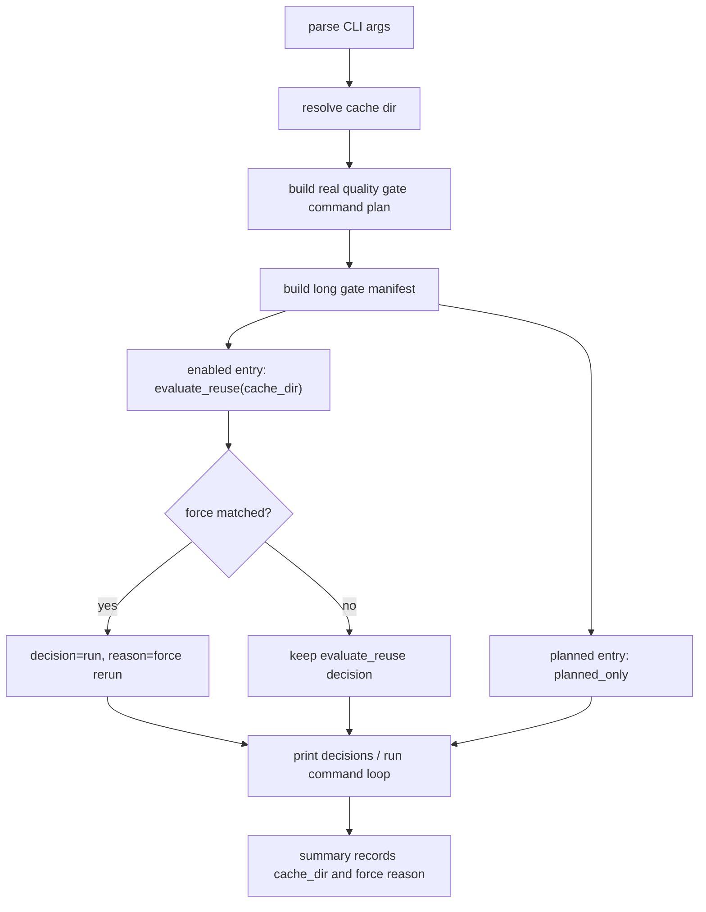

# long-gate-cli-controls 设计方案

## 0. 术语约定

- cache dir：long gate success cache 的读取和写入目录，默认仍是 `evidence/QualityGate/long_gate`。
- force rerun：用户明确要求某个已启用 cache 的 entry 本次不要复用旧成功结果，而是真实执行一次。
- force rerun all：用户明确要求所有已启用 cache 的 entry 本次都不要复用旧成功结果。
- enabled entry：当前真正允许 success cache 复用的 entry。现在只有 `pytest_collect_all`。
- planned entry：已经被识别成长耗时候选，但还没有启用 success cache 的 entry，例如 `full_test_debt`。force 参数不能把它变成 enabled。
- explain 不是 proof：`--long-gate-cache-explain` 只展示决策，不执行命令，不写 summary，不写 success cache。

## 1. 决策与约束

### 需求摘要

本 feature 完成 roadmap `NEXT-2`：给 long gate cache 增加几个本地控制入口，让维护者能指定缓存目录、强制刷新指定缓存，或者强制刷新所有已启用缓存。

成功标准：

- 新增 `--long-gate-cache-dir PATH`。
- 新增 `--long-gate-force-rerun ENTRY_ID`，可重复传入。
- 新增 `--long-gate-force-rerun-all`。
- force 只影响“是否复用旧成功缓存”，不改变真实 QualityGate command plan。
- force 后如果真实执行成功，仍然只有 `reuse_allowed=True` 的 entry 能写 success cache。
- 自定义 cache dir 必须在 repo root 内，第一版只允许位于 `evidence/QualityGate/long_gate` 目录本身或它的子目录下。
- cache 目录不存在、旧 success cache 不完整、日志或输出文件缺失、日志不在当前 cache dir、路径不可信、必填字段缺失时都重新执行。
- explain 可以打印 cache-dir 和 force 后的决策，但不执行、不写 summary、不写 success cache。
- summary 顶层记录实际使用的 `cache_dir`；被 force 的 enabled entry 在 `reason` / `invalidated_by` 里能看出原因。

明确不做：

- 不启用 `full_test_debt`、startup、required、ruff、pyright、debt ledger、quickref 等新的 planned entry。
- 不做 full-test-debt 缓存。
- 不做 startup / required / ruff / pyright / debt ledger / quickref 缓存。
- 不把 explain 输出当成 clean proof。
- 不给损坏缓存加宽松兜底；证据不完整就重跑。

### 参数优先级

从高到低：

1. `--no-long-gate-cache`：不读、不写 long gate success cache。
2. 失败续跑逻辑：如果 dirty 续跑命中上次成功前缀，仍优先于 long gate success cache。
3. `--long-gate-cache-explain`：只展示决策，不执行、不写证据。
4. `--long-gate-force-rerun-all`：所有 enabled entry 强制真实执行。
5. `--long-gate-force-rerun ENTRY_ID`：指定 enabled entry 强制真实执行。
6. 正常 `evaluate_reuse()`。

## 2. 名词与编排

### 2.1 名词层

现状：

- `tools/long_gate_cache.py` 固定读写 `evidence/QualityGate/long_gate/results/{entry_id}.success.json`。
- `scripts/run_quality_gate.py` 只接收 `--long-gate-cache`、`--no-long-gate-cache`、`--long-gate-cache-explain`。
- `tools/long_gate_summary.py` 已经支持顶层 `cache_dir` 字段，但 runner 当前总是传默认目录。
- `tools/long_gate_manifest.py` 当前只有 `pytest_collect_all` 的 `reuse_allowed=True`。

变化：

- `tools/long_gate_cache.py` 增加 cache dir 解析和校验函数，读写 success cache 时都接收 `cache_dir`。
- runner 解析新 CLI 参数，并把 cache dir 和 force 设置传给决策准备阶段。
- 决策准备阶段仍然只对 `reuse_allowed=True` 的 entry 调用 `evaluate_reuse()`。
- force 命中 enabled entry 时，把原本的 `reuse` 决策改为 `run`，原因写成强制重跑。
- planned entry 仍然只得到 `planned_only`，不会被 force 改成可复用。
- summary 和 explain 都展示实际 cache dir；正式 summary 仍写到 `evidence/QualityGate/long_gate/summary.json` / `.md`。

### 2.2 编排层

跨层纪律：

- command plan 只来自真实 `build_quality_gate_command_plan()`。
- force 不删除缓存文件，也不改 manifest 的启用状态。
- cache dir 只是 success cache 的读写位置，不改变 summary 的正式 proof 输出位置。
- 路径解析失败直接报错；旧缓存内部路径不可信时由 `evaluate_reuse()` 返回 `decision=run`。
- 写 success cache 仍然受干净工作区、完整 gate、非 resume、`reuse_allowed=True` 共同约束。

## 3. 验收契约

关键场景：

- S1：`--long-gate-cache-dir PATH` 使用 repo 内安全目录时，success cache 从该目录读写，summary 记录该目录。
- S2：cache dir 指向 repo 外或不在 `evidence/QualityGate/long_gate` 下时直接失败，不偷偷回退默认目录。
- S3：`--long-gate-force-rerun pytest_collect_all` 在已有可复用 success cache 时仍真实执行 collect-only。
- S4：force entry 后真实执行成功，会在同一个 cache dir 刷新 `pytest_collect_all.success.json`。
- S5：`--long-gate-force-rerun-all` 只影响 enabled entry，不影响 planned entry。
- S6：对 planned entry 传 force 时，planned entry 仍然是 `decision: planned_only` 和 `cache_status: planned`。
- S7：force 不改变 command plan，runner 仍按原计划执行。
- S8：explain 模式能显示 cache dir 和 force 后决策，但不执行、不写 summary、不写 success cache。
- S9：损坏 success cache、缺日志、日志跨 cache dir、缺字段、输出文件缺失或路径逃逸时都重新执行。
- S10：不启用任何新的 planned entry。

反向核对项：

- 不改 `_CACHE_ENABLED_ENTRY_TYPES`。
- 不让 `full_test_debt` 写 success cache。
- 不把 `--long-gate-cache-explain` 产物当 proof。
- 不提交 `evidence/QualityGate/long_gate/` 运行产物。

## 4. 与项目级架构文档的关系

本 feature 只增强质量门禁本地 CLI 控制，不改变 APS 排产业务架构，也不新增用户侧业务能力。验收阶段不需要更新 `.codestable/architecture/ARCHITECTURE.md` 或 `.codestable/requirements/`。
