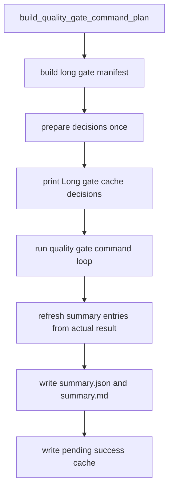

# long-gate-summary-output 设计方案

## 0. 术语约定

- long gate summary：质量门禁运行时额外写出的慢门禁缓存说明，包含 `summary.json` 和 `summary.md`。
- Long gate cache decisions：运行开头打印的决策表，告诉维护者每个 long gate entry 这次会跑、会复用、只是计划中，还是被禁用。
- executed：这次真的执行了命令。
- reused_success_cache：这次没有执行命令，而是复用了上一次完整成功缓存。
- planned_only：这个 entry 已经在 manifest 里识别出来，但还没有启用 success cache；它不能执行缓存复用。
- disabled：本次 long gate cache 没有真正启用，比如没有传 `--long-gate-cache`，或失败续跑优先接管。
- invalidated_by：缓存不能复用的具体原因，比如输入文件变了、日志丢了、输出文件 hash 不一致。
- copyable command / nodeid：失败后用户可以直接复制重跑的命令或 pytest nodeid。
- explain 不是 proof：`--long-gate-cache-explain` 只看决策，不执行命令，不写正式 summary，也不能当作质量门禁通过证明。

## 1. 决策与约束

### 需求摘要

本 feature 完成 roadmap `NEXT-1`：让 long gate cache 相关运行都能讲清楚“哪些跑了、哪些复用了、哪些只是计划中、哪些被禁用、为什么这样决定、失败后去哪看证据和怎么重跑”。

成功标准：

- 新增 `tools/long_gate_summary.py`，只负责组织 summary、渲染 markdown、截取日志尾部和提取失败重跑信息。
- `scripts/run_quality_gate.py --long-gate-cache` 正式运行后写：
  - `evidence/QualityGate/long_gate/summary.json`
  - `evidence/QualityGate/long_gate/summary.md`
- `--long-gate-cache-explain` 只打印决策表，不执行命令，不写正式 summary，不写 success cache。
- `summary.json` 记录 executed、reused、failed、planned_only、disabled 五类数量。
- 每个 summary entry 都有 `reason` 和 `invalidated_by`，即使 `invalidated_by` 是空数组。
- 失败时 summary 和控制台都包含失败 entry、copyable command、pytest nodeid、receipt、stdout/stderr log 路径和 stdout/stderr tail。
- summary 写入失败时，不允许写新的 long gate success cache。

明确不做：

- 不启用 full-test-debt、startup、required、ruff、pyright、debt ledger、quickref 等新的 success cache entry。
- 不新增 `--long-gate-cache-dir`、`--long-gate-force-rerun`、`--long-gate-force-rerun-all`。
- 不把 planned entry 改成 enabled。
- 不把 explain 输出当成 proof。
- 不为了让缓存命中而放宽证据校验；证据不完整仍然重新执行。

## 2. 名词与编排

### 2.1 名词层

现状：

- `tools/long_gate_manifest.py` 已经能从真实 command plan 识别 long gate candidate。
- `tools/long_gate_cache.py` 已经能通过 `evaluate_reuse()` 判断 collect-only 是否可复用。
- 当前真正允许 success cache 复用的 entry 只有 `pytest_collect_all`。
- runner 已有 receipt、stdout/stderr log、失败续跑和 dirty worktree 证明逻辑。

变化：

- 新增 summary 纯函数模块，不参与“是否复用”的判断。
- runner 在正式运行前只准备一份 long gate 决策；打印、执行、summary 刷新都复用这份结果，避免打印和实际执行对不上。
- collect-only 执行成功后先把 summary 写出来，再写新的 success cache。
- collect-only 复用成功后记录本次 receipt，并在 summary 里写 `execution_mode: reused_success_cache`。
- planned entry 进入 summary，但仍然是 `decision: planned_only`，不执行缓存复用。
- 失败路径尽量先写 summary，再把原来的 QualityGateError 抛出去。

### 2.2 编排层

跨层纪律：

- 复用决定只来自 `tools.long_gate_cache.evaluate_reuse()`。
- entry 分类只来自 `tools.long_gate_manifest.py`。
- summary 写文件失败时不能继续写新的 success cache。
- 失败续跑优先级高于 long gate success cache；这种情况下 summary 不能把 resume-prefix 误算成 long gate cache 复用。
- 普通环境探测命令不强塞进 long gate summary。

## 3. 验收契约

关键场景：

- S1：explain 模式打印完整决策表。
- S2：explain 模式不执行命令、不写 success cache、不写正式 `summary.json`。
- S3：正式运行成功后写 `summary.json` 和 `summary.md`。
- S4：summary counts 包含 executed、reused、failed、planned_only、disabled。
- S5：每个 entry 都有 reason 和 invalidated_by。
- S6：collect-only 真实执行时 summary 记录 `execution_mode: executed`。
- S7：collect-only 复用时 summary 记录 `execution_mode: reused_success_cache`。
- S8：planned entry 记录 `decision: planned_only`，并且不启用 success cache。
- S9：cache disabled 时 summary 有 disabled reason。
- S10：命令失败时 summary 记录 failure，并打印 copyable command。
- S11：能从 pytest 输出里提取 nodeid 时，summary 和控制台都展示 copyable nodeid。
- S12：失败时包含 receipt、stdout/stderr log 和 stdout/stderr tail。
- S13：stdout/stderr 很长时只截尾部。
- S14：summary 写入失败时不写新的 success cache。
- S15：dirty worktree 时 summary 如实记录 `worktree_clean: false`，但不写新的 success cache。
- S16：interrupted / partial_write 等完整性标记进入 summary。

反向核对项：

- 不启用除 `pytest_collect_all` 外的 entry。
- 不新增 NEXT-2 CLI 参数。
- 不提交 `evidence/QualityGate/long_gate/` 运行产物。
- 不把 explain 当作 clean-worktree proof。

## 4. 与项目级架构文档的关系

本 feature 只改质量门禁辅助输出，不改变 APS 排产业务架构，也不改变用户侧业务能力。验收阶段不需要更新 `.codestable/architecture/ARCHITECTURE.md` 或 `.codestable/requirements/`。
