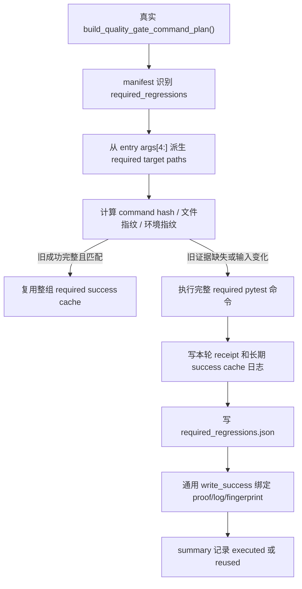

# required-regression-cache 设计方案

## 0. 术语约定

- required regressions：质量门禁里的 `required_regressions`，也就是真实 command plan 里那条 `python -m pytest -q ...required 测试整组...`。
- required target：从当前 manifest entry 的 `args[4:]` 取出的 pytest 目标。它是本 feature 的测试目标事实源，不能从缓存逻辑里再复制 `QUALITY_GATE_REQUIRED_TESTS`。
- 整组成功复用：上一轮整组 required pytest 已经成功，并且命令、输入文件、环境、日志和输出 proof 都完全匹配时，本轮直接复用上一轮成功结果。
- required proof：`evidence/QualityGate/required_regressions.json`。它记录这次 required 整组命令的命令身份、target、指纹、日志 hash、退出码和 HEAD。
- 整组重跑：任何证据不完整、不可信、字段缺失、日志缺失、hash 不一致、输入变化或环境变化时，不做局部复用，重新执行完整 required pytest 命令。
- planned entry：roadmap 后续条目，比如 architecture、ruff、pyright、debt ledger、quickref。本 feature 不启用它们。

## 1. 决策与约束

### 需求摘要

本 feature 完成 roadmap `NEXT-7`：给 `required_regressions` 做第一版整组 success cache。目标是减少重复跑 required 大回归组的时间，但不能让旧成功遮住新的回归问题。

成功标准：

- `required_regressions` 必须从真实 `build_quality_gate_command_plan()` 动态定位，缓存 proof 和 target hash 必须从当前 entry args 派生。
- 当前 enabled long gate entry 从 `pytest_collect_all`、`full_test_debt`、`startup_runtime_regressions` 变成 `pytest_collect_all`、`full_test_debt`、`startup_runtime_regressions`、`required_regressions`。
- NEXT-8 和后续 ruff、pyright、architecture、debt ledger、quickref 仍保持 planned，不写 success cache。
- required 指纹覆盖 required target、required 测试实际读取的业务源码、模板、静态资源、Excel 模板、说明书/蓝本文档、`.limcode` 自测脚本和计划文件、pytest 配置、依赖和门禁工具。
- required 指纹覆盖 Python/pytest/platform 环境，以及会影响 required 真实浏览器 smoke 或 APS 测试环境的关键环境变量。
- 成功执行 required 后写 `evidence/QualityGate/required_regressions.json`，并把它声明为该 entry 的 output file。
- proof 缺失、损坏、schema 不匹配、日志缺失、stdout/stderr hash 不一致、输出文件 hash 不一致时，整组重跑。

明确不做：

- 不做 required nodeid 级增量。
- 不启用 architecture、ruff、pyright、debt ledger、quickref 等后续 planned entry。
- 不改变 required 测试本身含义。
- 不提交 `evidence/QualityGate/required_regressions.json` 或 long gate 运行产物。
- 不把所有 markdown 都纳入 required 指纹；只纳入 required 测试明确读取或门禁证据需要的文档。

复杂度档位：质量门禁缓存。第一优先级是不能假绿；命中率排在安全之后。

## 2. 名词与编排

### 2.1 名词层

实现前现状：

- `required_regressions` 已能从真实 command plan 识别出来，但仍是 `planned`。
- required entry 当前只把 required 测试文件放进 `input_file_scopes`。
- required entry 当前没有 `env_keys`，也没有 `output_result_files`。
- runner 的通用 success cache 已经能校验 command、fingerprint、stdout/stderr 日志、输出文件、schema、repo identity、runner/tooling hash。
- startup 已有 proof 写入模式，但 required 的输入范围比 startup 更宽，不能照搬 startup 的 bootstrap 范围。

变化：

- `tools/long_gate_manifest.py` 只把 `ENTRY_REQUIRED_REGRESSIONS` 加进 enabled 列表，不新增其它 enabled entry。
- required entry 的测试 target 从当前 command entry 的 `args[4:]` 派生，proof 和 target hash 不再从 registry 里复制清单。
- required `input_file_scopes` 由真实 required args 加真实被测输入组成。
- required `env_keys` 补齐 Python/pytest/platform、pytest 环境变量、APS/浏览器 smoke 相关环境变量。
- required `output_result_files` 声明 `evidence/QualityGate/required_regressions.json`。
- `scripts/run_quality_gate.py` 在 required 整组执行成功后写 required proof，再进入通用 success cache 写入。
- `.gitignore` 和本地提交保护忽略 required proof。

required proof 最小字段：

- `schema_version`
- `status`
- `entry_id`
- `generated_at`
- `head_sha`
- `run_id`
- `quality_gate_plan_hash`
- `command_index`
- `display`
- `args`
- `command_hash`
- `capture_output`
- `output_policy`
- `required_target_count`
- `test_count`
- `required_target_paths`
- `required_target_hash`
- `fingerprint_schema_version`
- `fingerprint_hash`
- `returncode`
- `pytest_exit_code`
- `execution_mode`
- `duration_s`
- `stdout_log_path`
- `stderr_log_path`
- `stdout_sha256`
- `stderr_sha256`
- `timed_out`
- `interrupted`
- `partial_write`

### 2.2 编排层

跨层纪律：

- required 没有特殊增量分支；失效就是整组执行。
- command plan 是唯一命令事实源；缓存 proof 和指纹 target 只消费 manifest entry，不复制 required 清单。
- explain 只打印决策，不写 manifest、summary、receipt、required proof 或 success cache。
- `--no-long-gate-cache` 不读不写 required cache。
- force required 或 force all 只强制已 enabled 的 required 整组执行；planned entry 继续 ignored/planned_only。
- dirty/resume 场景不写新的 required success cache。
- stdout/stderr 长期日志路径必须是 `evidence/QualityGate/long_gate/logs/required_regressions.stdout.log` 和 `.stderr.log`。

### 2.3 挂载点

- `tools/long_gate_manifest.py`：启用 required，补 required 专属 input/config/tool/dependency/env/output scopes。
- `scripts/run_quality_gate.py`：新增 required proof 常量、生成物排除、proof 写入和 success cache output 绑定。
- `tools/quality_gate_shared.py` / `tools/quality_gate_support.py`：只暴露 required proof 路径常量，不改变 required 测试含义。
- `.gitignore` 和 `tools/git_hook_checks.py`：忽略并禁止误提交 required proof。
- `tests/test_long_gate_required_regression_cache.py`：覆盖动态 args、scope/env、proof、坏证据、force/no-cache/explain、既有 entry 隔离。
- 既有 long gate 测试：把 NEXT-6 里“required planned”的断言更新为“required enabled，但后续 planned 仍 planned”。
- `.codestable/roadmap/quality-gate-long-cache/`：验收时回写 NEXT-7 状态。

拔掉本 feature 的方式：把 `ENTRY_REQUIRED_REGRESSIONS` 从 enabled 列表移回 planned，删除 required output 绑定和 proof 写入，保留 NEXT-1 到 NEXT-6 已完成能力。

### 2.4 推进策略

1. 先落 feature 文档和 checklist，绑定 roadmap item 为 in-progress，并修正 roadmap 第 4.1 节里 startup 的旧 enabled 口径。
2. 补 required proof 常量、ignore、防误提交和 required 专属 scope/env/output。
3. 写 required proof 生成逻辑，并在 runner 成功执行后调用。
4. 新增 required 专项测试，先覆盖假绿风险，再覆盖 happy path。
5. 跑窄验证、静态检查和 explain。
6. 验收回写 acceptance、roadmap、items，并在最终提交后跑 clean-worktree gate。

## 3. 验收契约

关键场景：

- S1：required entry 能从真实 command plan 识别出来，args 来自真实计划，分类不依赖命令位置。
- S2：NEXT-7 后 enabled 只新增 `required_regressions`，NEXT-8 和后续仍 planned。
- S3：required 成功执行后写 `evidence/QualityGate/required_regressions.json`。
- S4：required proof 缺失、损坏、schema 不匹配或输出 hash 不一致时，整组重跑。
- S5：stdout/stderr 日志缺失或 hash 不一致时，整组重跑。
- S6：required 测试文件、`tools/test_registry.py`、`tools/quality_gate_shared.py`、`scripts/run_quality_gate.py` 或 long gate 工具变化时，整组重跑。
- S7：`core/**/*.py`、`web/**/*.py`、`data/**/*.py`、`plugins/**/*.py`、`app.py`、`app_new_ui.py`、`config.py`、`schema.sql` 变化时，整组重跑。
- S8：`templates/**/*.html`、`web_new_test/templates/**/*.html`、`static/**/*`、`web_new_test/static/**/*`、`templates_excel/**/*` 变化时，整组重跑。
- S9：required 测试实际读取的说明书、蓝本、evidence/audit README、技术债务台账、`.limcode` 自测脚本和计划文件变化时，整组重跑。
- S10：普通无关 markdown 变化不误伤 required。
- S11：Python/pytest/platform、pytest 环境变量、APS/浏览器相关环境变化时，整组重跑。
- S12：`--long-gate-cache-explain` 不写 proof。
- S13：`--no-long-gate-cache` 不读写 required cache。
- S14：`--long-gate-force-rerun required_regressions` 和 `--long-gate-force-rerun-all` 会整组重跑 required。
- S15：required 失效不会拖坏 collect/full-test-debt/startup 既有复用。
- S16：planned entry 即使被 force，也不能写 success cache。

反向核对项：

- 不复制 required 测试清单到缓存 proof/target 逻辑。
- 不启用 NEXT-8 或其它 planned entry。
- 不做 required nodeid 增量。
- 不把坏 proof、缺日志或 hash mismatch 当成可复用。
- 不提交 required proof 运行产物。

## 4. 与项目级架构文档的关系

本 feature 是质量门禁工具链内部能力，不改变 APS 排产业务功能，不需要更新 `.codestable/requirements/`。它会更新 `quality-gate-long-cache` roadmap 的 NEXT-7 状态。架构总入口无需新增业务模块说明。
