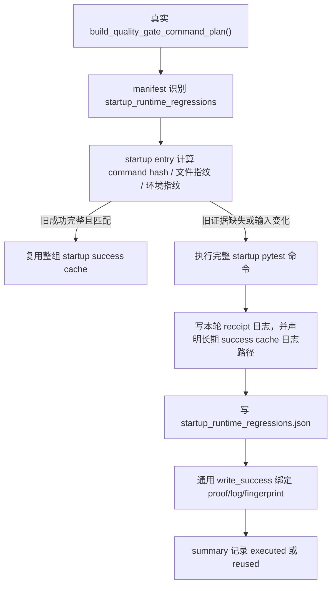

# startup-runtime-regression-cache 设计方案

## 0. 术语约定

- startup runtime regressions：质量门禁里的 `startup_runtime_regressions`，也就是真实 command plan 里那条 `python -m pytest -q ...startup 测试整组...`。
- 整组成功复用：上一轮整组 startup pytest 已经成功，并且命令、输入文件、环境、日志和输出 proof 都完全匹配时，本轮直接复用上一轮成功结果。
- startup proof：`evidence/QualityGate/startup_runtime_regressions.json`。它记录这次 startup 整组命令的命令身份、指纹、日志 hash、退出码、测试数量和 HEAD。
- 整组重跑：任何证据不完整、不可信、字段缺失、日志缺失、hash 不一致或输入变化时，不做局部复用，重新执行完整 startup pytest 命令。
- planned entry：roadmap 后续条目，比如 `required_regressions`、ruff、pyright、architecture、debt ledger、quickref。本 feature 不启用它们。

## 1. 决策与约束

### 需求摘要

本 feature 完成 roadmap `NEXT-6`：给 `startup_runtime_regressions` 做第一版整组 success cache。目标是减少重复跑启动回归组的时间，但不能让旧成功遮住新的启动问题。

成功标准：

- `startup_runtime_regressions` 必须从真实 `build_quality_gate_command_plan()` 动态定位，缓存逻辑不能复制 startup 测试清单。
- 当前 enabled long gate entry 从 `pytest_collect_all`、`full_test_debt` 变成 `pytest_collect_all`、`full_test_debt`、`startup_runtime_regressions`。
- `required_regressions` 和 NEXT-7 到后续 planned entry 仍保持 planned，不写 success cache。
- startup 指纹覆盖真实启动链：startup 测试文件、runtime/bootstrap/app/config/schema、插件、模板、静态资源、pytest 配置、依赖、runner/cache/manifest/fingerprint/schema/test registry 工具。
- startup 指纹覆盖指定环境：`APS_ENV`、`APS_DB_PATH`、`APS_LOG_DIR`、`APS_BACKUP_DIR`、`APS_EXCEL_TEMPLATE_DIR`、`APS_CHROME_PATH`、`PYTHONPATH`、`PYTHONUTF8`、`PYTHONIOENCODING`、Python realpath/version、pytest version/plugin versions、platform。
- 成功执行 startup 后写 `evidence/QualityGate/startup_runtime_regressions.json`，并把它声明为该 entry 的 output file。
- proof 缺失、损坏、schema 不匹配、日志缺失、stdout/stderr hash 不一致、输出文件 hash 不一致时，整组重跑。

明确不做：

- 不做 nodeid 级增量。
- 不启用 `required_regressions`。
- 不启用 ruff、pyright、architecture、debt ledger、quickref 等后续 planned entry。
- 不改变 startup 测试本身含义。
- 不提交 `evidence/QualityGate/startup_runtime_regressions.json` 或 long gate 运行产物。

复杂度档位：质量门禁缓存。第一优先级是不能假绿；命中率排在安全之后。

## 2. 名词与编排

### 2.1 名词层

实现前现状：

- `startup_runtime_regressions` 已能从真实 command plan 识别出来，但仍是 `planned`。
- startup entry 当前只把 startup 测试文件放进 `input_file_scopes`。
- startup entry 当前没有 `env_keys`，也没有 `output_result_files`。
- 所有 long entry 会先继承 `QUALITY_GATE_SOURCE_FILES`，里面包含 required 测试和技术债务台账；对 startup 来说范围太宽，会误伤无关文档和 required 测试变化。
- runner 的通用 success cache 已经能校验 command、fingerprint、stdout/stderr 日志、输出文件、schema、repo identity、runner/tooling hash。

变化：

- `tools/long_gate_manifest.py` 只把 `ENTRY_STARTUP_RUNTIME_REGRESSIONS` 加进 enabled 列表。
- startup entry 使用专属 scope，不继续整包继承 required 测试和无关 markdown。
- startup `input_file_scopes` 由真实 startup args 加真实启动链输入组成。
- startup `env_keys` 补齐用户指定环境和 pytest/Python 运行环境。
- startup `output_result_files` 声明 `evidence/QualityGate/startup_runtime_regressions.json`。
- `scripts/run_quality_gate.py` 在 startup 整组执行成功后写 startup proof，再进入通用 success cache 写入。
- `.gitignore` 忽略 startup proof。

startup proof 最小字段：

- `schema_version`
- `status`
- `entry_id`
- `generated_at`
- `head_sha`
- `run_id`
- `quality_gate_plan_hash`
- `command_index`
- `display`
- `args`
- `command_hash`
- `capture_output`
- `output_policy`
- `startup_target_paths`
- `startup_target_count`
- `startup_target_hash`
- `fingerprint_schema_version`
- `fingerprint_hash`
- `returncode`
- `pytest_exit_code`
- `execution_mode`
- `duration_s`
- `stdout_log_path`
- `stderr_log_path`
- `stdout_sha256`
- `stderr_sha256`
- `timed_out`
- `interrupted`
- `partial_write`
- `test_count`

### 2.2 编排层

跨层纪律：

- startup 没有特殊增量分支；失效就是整组执行。
- command plan 是唯一命令事实源；缓存代码只消费 manifest entry，不复制测试清单。
- explain 只打印决策，不写 manifest、summary、receipt、startup proof 或 success cache。
- `--no-long-gate-cache` 不读不写 startup cache。
- force startup 或 force all 只强制已 enabled 的 startup 整组执行；planned entry 继续 ignored/planned_only。
- dirty/resume 场景不写新的 startup success cache。

### 2.3 挂载点

- `tools/long_gate_manifest.py`：启用 startup，补 startup 专属 input/config/tool/dependency/env/output scopes。
- `scripts/run_quality_gate.py`：新增 startup proof 写入，成功后交给通用 success cache。
- `.gitignore`：忽略 `evidence/QualityGate/startup_runtime_regressions.json`。
- `tests/test_long_gate_startup_regression_cache.py`：覆盖动态 args、scope/env、proof、坏证据、force/no-cache/explain、required planned 守护。
- `.codestable/roadmap/quality-gate-long-cache/`：验收时回写 NEXT-6 状态。

拔掉本 feature 的方式：把 `ENTRY_STARTUP_RUNTIME_REGRESSIONS` 从 enabled 列表移回 planned，删除 startup output 绑定和 proof 写入，保留 NEXT-5 已完成能力。

### 2.4 推进策略

1. 先落 feature 文档和 checklist，绑定 roadmap item 为 in-progress。
2. 补 startup scope/env/output 常量和 `.gitignore`。
3. 写 startup proof 生成逻辑，并在 runner 成功执行后调用。
4. 新增 startup 专项测试，先覆盖假绿风险，再覆盖 happy path。
5. 跑窄验证、静态检查和 explain。
6. 验收回写 roadmap/items/acceptance，并在最终提交后跑 clean-worktree gate。

## 3. 验收契约

关键场景：

- S1：startup entry 能从真实 command plan 识别出来，args 来自真实计划。
- S2：NEXT-6 后 enabled 只新增 `startup_runtime_regressions`，`required_regressions` 仍 planned。
- S3：startup 成功执行后写 `evidence/QualityGate/startup_runtime_regressions.json`。
- S4：startup proof 缺失、损坏或 schema 不匹配时，整组重跑。
- S5：stdout/stderr 日志缺失或 hash 不一致时，整组重跑。
- S6：startup 测试文件变化时，整组重跑。
- S7：`web/bootstrap/**/*.py`、`app.py`、`app_new_ui.py`、`config.py`、`schema.sql`、`templates/**/*.html`、`static/**/*` 变化时，整组重跑。
- S8：pytest 配置、依赖、runner/cache/schema/fingerprint/manifest/test registry 工具变化时，整组重跑。
- S9：`APS_ENV`、`APS_DB_PATH`、`APS_LOG_DIR`、`APS_BACKUP_DIR`、`APS_EXCEL_TEMPLATE_DIR`、`APS_CHROME_PATH`、`PYTHONPATH`、`PYTHONUTF8`、`PYTHONIOENCODING` 变化时，整组重跑。
- S10：无关普通 markdown 变化不误伤 startup。
- S11：`--long-gate-cache-explain` 不写 proof。
- S12：`--no-long-gate-cache` 不读写 startup cache。
- S13：`--long-gate-force-rerun startup_runtime_regressions` 和 `--long-gate-force-rerun-all` 会整组重跑 startup。
- S14：required 仍不写 success cache。
- S15：NEXT-5 的 full-test-debt 整项复用、nodeid 增量、ledger-only 测试仍通过。

反向核对项：

- 不复制 startup 测试清单到缓存逻辑。
- 不启用 required 或其它 planned entry。
- 不做 startup nodeid 增量。
- 不把坏 proof、缺日志或 hash mismatch 当成可复用。
- 不提交 startup proof 运行产物。

## 4. 与项目级架构文档的关系

本 feature 是质量门禁工具链内部能力，不改变 APS 排产业务功能，不需要更新 `.codestable/requirements/`。它会更新 `quality-gate-long-cache` roadmap 的 NEXT-6 状态。架构总入口无需新增业务模块说明。
