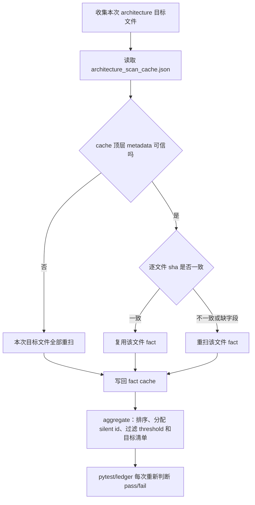

# architecture-scan-file-cache 设计方案

## 0. 术语约定

- architecture scan fact cache：架构扫描事实缓存。它只记录“某个 Python 文件按当前扫描器扫出了什么事实”。
- 单文件事实：只靠这个文件源码或 AST 就能算出来的信息，例如行数、静默回退 handler 原料、复杂度块、请求服务直接装配命中、仓储束消费命中。
- aggregate：每次运行时把多个文件事实重新汇总，再和台账、目标清单、样本点、白名单做比较。
- long gate success cache：已有长耗时门禁成功缓存。它缓存的是“某个命令成功跑过”，本 feature 不使用这个语义。
- `architecture_fitness`：`python -m pytest -q tests/test_architecture_fitness.py` 这条门禁 entry。本 feature 不把它加入 success cache enabled 列表。

## 1. 决策与约束

### 需求摘要

本 feature 完成 roadmap `NEXT-8`：给 architecture fitness 里的重 AST 扫描增加文件级 fact cache。目标是让没变过的文件少重复解析 AST 和跑 radon，但每次仍然重新做最终判断，避免旧结论遮住新问题。

成功标准：

- 只缓存单文件 AST/source 派生事实。
- 不缓存 architecture fitness 的 pass/fail。
- 不缓存 `tests/test_architecture_fitness.py` 的 pytest 成功结果。
- 不写 `architecture_fitness.success.json`。
- 不把 `architecture_fitness` 加进 `_CACHE_ENABLED_ENTRY_TYPES`。
- 跨文件规则、排序、ID 分配、ledger allowlist 对比、accepted risks、fixed 条目拒绝、new/stale/mismatch 判断每次重新 aggregate。
- ledger allowlist 变化可以不重扫 AST，但必须重新 aggregate。
- 文件新增、删除、内容变化必须正确处理；新增文件进入 aggregate，删除文件的旧 fact 不能进入 aggregate。
- scanner 源码、schema、Python version、radon 版本或行为变化必须失效。
- cache 损坏、缺字段、file sha mismatch 必须重扫。
- `generated_at` 只作记录，不能参与复用判断。
- 运行产物不能提交。
- 保持 Python 3.8 / Win7 兼容，不引入新语法和新外部依赖。

明确不做：

- 不启用 `architecture_fitness` long gate success cache。
- 不启用 `ruff_check_full`、`pyright_gate_full`、`pyright_tools_full`、`debt_ledger_sync`、`quickref_vs_routes`。
- 不改变 architecture fitness 规则本身的业务判断。
- 不把 daily fast gate 说成 clean proof，也不把 `--long-gate-cache-explain` 说成 proof。
- 不提交 `evidence/QualityGate/architecture_scan_cache.json`。

复杂度档位：质量门禁缓存。安全性优先，命中率第二。

## 2. 名词与编排

### 2.1 名词层

实现前现状：

- `tools/quality_gate_scan.py` 已有 `ScanContext`，只能在单次进程内复用源码和 AST。
- `architecture_silent_scan_entries()`、`architecture_oversize_scan_map()`、`architecture_complexity_scan_map()` 等 wrapper 每次都会重新扫所有目标文件。
- `_assign_silent_entry_ids()` 已在 `scan_silent_fallback_entries()` 里做，扫描事实和最终身份目前混在一起。
- long gate manifest 能识别 `architecture_fitness`，但它还是 planned，不允许 success cache 复用。

变化：

- 新增 `tools/architecture_scan_cache.py`，负责 `scan_single_file_architecture_fact()`、`scan_files_with_cache()`、`aggregate_architecture_scan()` 和 cache metadata。
- 单文件 fact payload 包含：
  - `path`
  - `line_count`
  - `silent_fallback_handlers_without_global_id`
  - `complexity_blocks_all`
  - `request_service_direct_assembly_entries`
  - `repository_bundle_drift_entries`
- silent fallback fact 不存最终 `id`，只存造 ID 需要的原料：`path`、`symbol`、`handler_fingerprint`、`handler_context_hash`、`except_ordinal`、`line_start`、`line_end`、`legacy_swallow_hit`、`fallback_kind`、`signature`、`scope_tag`。
- 顶层 cache schema 至少包含：
  - `schema_version`
  - `scanner_version_hash`
  - `scanner_schema_version`
  - `python_version`
  - `radon_version_or_behavior_hash`
  - `files`
  - `generated_at`
- `files[path]` 只保存 `file_sha256` 和 `fact`，不保存最终 pass/fail。
- `scanner_version_hash` 绑定 `tools/quality_gate_scan.py`、`tools/architecture_scan_cache.py`、`tools/quality_gate_operations.py`、`tools/quality_gate_shared.py`，并额外绑定 `tools/quality_gate_ledger.py`，因为 `entry_sort_key` 会影响聚合排序和 silent fallback ID 稳定性。
- `radon_version_or_behavior_hash` 优先使用 `importlib.metadata.version("radon")`；取不到 distribution 时用稳定 behavior probe hash，不能是空值。

### 2.2 编排层

跨层纪律：

- cache 只在“读文件和提取事实”这一层生效。
- `scan_silent_fallback_entries(paths)` 的公开行为继续返回带 `id` 且按 `entry_sort_key` 排序的条目。
- `_assign_silent_entry_ids()` 保留在 aggregate 阶段统一执行。
- `complexity_blocks_all` 存 radon 全量块；`COMPLEXITY_THRESHOLD` 过滤放到 aggregate，这样阈值或 allowlist 变化不用重扫 AST。
- `architecture_request_service_direct_assembly_entries()` 的目标文件/目标函数过滤每次做。
- `architecture_silent_scan_entries()` 的启动链保留、非启动链 legacy swallow 收窄每次做。
- `validate_startup_samples()` 通过 cached architecture silent entries 接入，不再裸跑一套绕开 cache 的扫描。
- cache 文件写在 `evidence/QualityGate/architecture_scan_cache.json`，它是运行产物。

### 2.3 挂载点

- `tools/architecture_scan_cache.py`：新增 fact cache schema、读写、metadata、单文件扫描和 aggregate。
- `tools/quality_gate_scan.py`：拆出 silent fallback 无 ID fact 提取，保持旧 public 函数行为。
- `tools/quality_gate_operations.py`：五个 architecture wrapper 改为从 fact provider aggregate；startup sample 走 cached entries。
- `tools/quality_gate_shared.py` / `tools/quality_gate_support.py`：只在需要时暴露新工具路径或稳定入口。
- `.gitignore` 和 `tools/git_hook_checks.py`：忽略并禁止提交 architecture scan cache 运行产物。
- `tests/test_architecture_scan_cache.py`：覆盖 miss、reuse、失效、坏 cache、metadata、generated_at、ledger 重新 aggregate、silent id 稳定、planned entry 守护和运行产物拦截。
- `tests/test_architecture_fitness.py`、long gate 和 hook 相关测试：锁住旧行为、planned entry 不误启用。
- `.codestable/roadmap/quality-gate-long-cache/`：实现开始标 in-progress，验收后标 done。

拔掉本 feature 的方式：让 architecture wrapper 回到直接调用 `quality_gate_scan.py` 的扫描函数，删除 fact cache 模块接入；long gate success cache enabled 列表不需要回滚，因为本 feature 不修改它。

### 2.4 推进策略

1. 落 design/checklist，绑定 roadmap item 为 in-progress。
2. 新增 architecture scan cache 模块，先只实现 schema、metadata、单文件 fact 和 aggregate。
3. 从 `quality_gate_scan.py` 拆出 silent fallback 无 ID fact 提取，保持旧 public 行为。
4. 接入 `quality_gate_operations.py` 的五个 architecture wrapper 和 startup sample。
5. 增加运行产物忽略和本地 hook 拦截。
6. 补齐缓存合同测试、fitness 回归、long gate planned 守护和静态检查。
7. 对抗审查后写 acceptance，回写 roadmap item 为 done。

## 3. 验收契约

关键场景：

- S1：cache miss 时扫描单文件并写 fact。
- S2：文件内容未变时复用 fact。
- S3：文件内容变化后重扫该文件。
- S4：新增文件后 aggregate 包含新文件。
- S5：删除文件后旧 fact 不进入 aggregate。
- S6：cache JSON 损坏后重扫。
- S7：cache 缺字段后重扫。
- S8：file sha mismatch 后重扫。
- S9：scanner source hash 变化后重扫。
- S10：schema version 变化后重扫。
- S11：Python version 变化后重扫。
- S12：radon behavior/version marker 变化后重扫。
- S13：ledger allowlist 变化时不重扫 AST，但重新 aggregate。
- S14：silent fallback ID 分配仍稳定，且仍由 aggregate 统一分配。
- S15：`architecture_fitness` 仍不是 enabled long gate success cache。
- S16：architecture scan cache 运行产物不会被提交。
- S17：`generated_at` 变化不会影响复用判断。

反向核对项：

- 不缓存最终 pass/fail。
- 不写 `architecture_fitness.success.json`。
- 不把 `architecture_fitness` 加进 `_CACHE_ENABLED_ENTRY_TYPES`。
- 不让 ledger 变化复用旧结论。
- 不漏新增/删除文件。
- 不接受坏 cache、缺字段、hash mismatch。
- 不绕过 scanner/radon/Python 失效。
- 不让 daily fast gate 文案冒充 clean proof。

## 4. 与项目级架构文档的关系

本 feature 属于质量门禁内部性能与证据链优化，不新增 APS 用户可见能力，不改变业务架构。`.codestable/architecture/ARCHITECTURE.md` 当前只需要继续保留“质量门禁入口以 scripts/run_quality_gate.py 为准”的约束，不需要新增独立架构文档。
