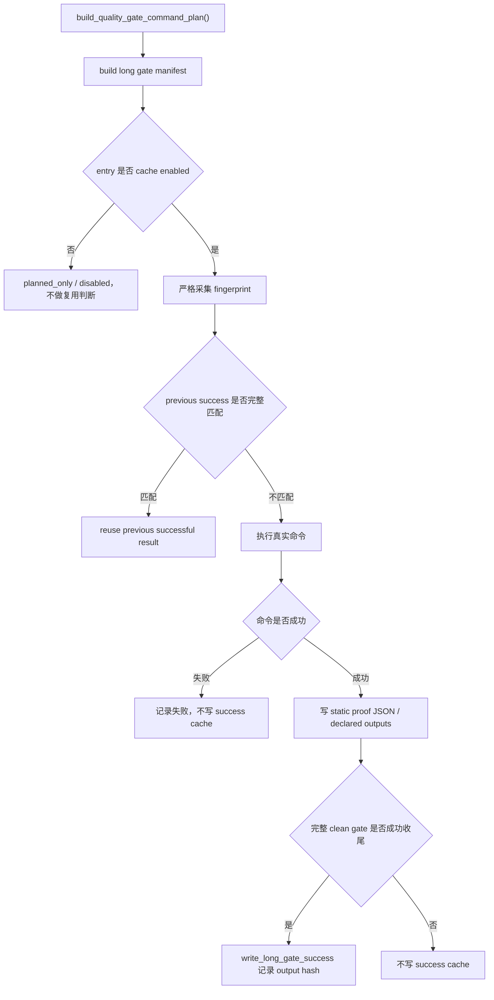

# static-formal-cache 设计方案

## 0. 术语约定

- formal static cache：正式静态门禁成功缓存。它只缓存完整质量门禁里的正式静态命令，不缓存局部快速预检。
- `ruff_check_full`：正式完整门禁里的 `python -m ruff check`。
- `pyright_gate_full`：正式完整门禁里的 `python -m pyright -p pyrightconfig.gate.json`。
- `pyright_tools_full`：正式完整门禁里的工具路径 pyright 检查。原命令 `python -m pyright <QUALITY_GATE_TOOL_PATHS>` 因默认 config 排除了 `scripts` / `tools`，只找到 2 个 source files；本 feature 改为 `python -m pyright -p pyrightconfig.tools.json`，并增加覆盖率自检，避免缓存空覆盖结果。
- static proof JSON：每条静态 entry 成功执行后写出的 sidecar JSON，例如 `evidence/QualityGate/ruff_check_full.json`。它只证明这一条命令本次成功输出完整，不证明整个仓库 clean proof 通过。
- clean-worktree final proof：干净工作区下运行 `scripts/run_quality_gate.py --require-clean-worktree --long-gate-cache` 并成功收尾。cache hit、static proof JSON 和 `--long-gate-cache-explain` 都不能冒充它。

## 1. 决策与约束

### 需求摘要

本 feature 推进 roadmap `NEXT-10`：为正式全量静态检查接入 long gate success cache。目标是让完整门禁在输入、配置、依赖、工具版本、Python 环境、日志和声明输出文件都匹配时，可以复用上一轮成功结果。

成功标准：

- `ruff_check_full` 绑定真实 `ruff check --show-files` 覆盖到的 Python 文件、ruff 配置、依赖文件、ruff 版本、Python 版本和相关环境。
- `pyright_gate_full` 绑定 `pyrightconfig.gate.json` 覆盖的应用范围、配置、依赖文件、pyright 版本、Python 版本和 `PYTHONPATH`。
- `pyright_tools_full` 通过 tools 专用 config 覆盖 `QUALITY_GATE_TOOL_PATHS`，并在 runner 里复查 `filesAnalyzed`；不能缓存“只找到 2 个 source files”的空结果。
- 三条 static entry 都要声明并写入各自 proof JSON，success cache 必须记录 proof JSON 的 hash。
- 缺 proof、坏 JSON、日志缺失、hash 不一致、fingerprint 变化、工具版本变化，都必须重跑。
- `--long-gate-cache-explain` 只解释决策，不执行命令，不写 proof，不算门禁证明。
- 只有完整门禁在 clean worktree 下成功收尾，才允许写新的 long gate success cache。

明确不做：

- 不把 NEXT-9 `--fast-precheck` 的局部 ruff 当成 `ruff_check_full`。
- 不把 pyright skip 或“只找到 2 个 source files”的结果当成 `pyright_tools_full` 成功。
- 不启用 `architecture_fitness`、`debt_ledger_sync`、`quickref_vs_routes`。
- 不改变 daily fast gate 的 proof 口径。
- 不改变 pre-push 默认入口。
- 不提交 `evidence/QualityGate/**` 运行产物、long gate cache、receipt 或 log。
- 不使用 Python 3.9+ 类型语法，不使用 `shell=True`。

复杂度档位：质量门禁安全增强。宁可因为输入范围保守而多重跑，也不能少算输入导致误复用。

### 只读审查结论

- 初始 manifest 审查确认：三条静态 entry 已能从真实 command plan 分类出来；开工前它们都是 planned，enabled 只有 `pytest_collect_all`、`full_test_debt`、`required_regressions`、`startup_runtime_regressions`。
- 阶段推进确认：Stage 3 已启用 `ruff_check_full`；Stage 4 已启用 `pyright_gate_full`；Stage 5 改用 `pyrightconfig.tools.json` 后已启用 `pyright_tools_full`，但 NEXT-10 仍需完成本阶段对抗审查和最终验收后才能标记 done。
- fingerprint 审查确认：`ruff_check_full` 已绑定 ruff 实际扫描的 Python 输入、配置、依赖和 `ruff_version`；`pyright_gate_full` 已绑定 `pyrightconfig.gate.json` 派生输入、`.pyi`、stub、配置、依赖和 `pyright_version`；`pyright_tools_full` 已绑定工具路径列表和顺序、工具文件内容、import closure helper、tools/gate/default pyright 配置、依赖、`pyright_version`、Python version 和 `PYTHONPATH`。
- proof 审查确认：static proof JSON 在 `_prepare_long_gate_success_output_files()` 里写出，并且早于 `write_long_gate_success()`。
- CodeStable 审查确认：本 feature 目录使用实际开工日 `2026-05-15-static-formal-cache`，roadmap item 从 `planned` 改为 `in-progress`，验收完成后才能改 `done`。
- 追加复验确认：2026-05-15 在本地只读运行 `PYTHONDONTWRITEBYTECODE=1 .venv/bin/python -m pyright --verbose tools/long_gate_manifest.py`，输出 `No source files found`；同日只读运行完整 `QUALITY_GATE_TOOL_PATHS` 展开命令并加 `--verbose`，输出 `Found 2 source files`。这说明旧 `pyright_tools_full` 原命令受 `pyrightconfig.json` 的 `exclude: scripts/tools` 影响，属于覆盖不足阻塞，不能缓存该结果。Stage 5 已新增 `pyrightconfig.tools.json`，并通过 `PYTHONDONTWRITEBYTECODE=1 .venv/bin/python -m pyright -p pyrightconfig.tools.json` 验证 0 errors / 0 warnings；这仍只是本阶段验证，不是 clean proof。

## 2. 名词与编排

### 2.1 名词层

现状：

- `tools/long_gate_manifest.py` 已定义 `ENTRY_RUFF_CHECK_FULL`、`ENTRY_PYRIGHT_GATE_FULL`、`ENTRY_PYRIGHT_TOOLS_FULL`。
- `_CACHE_ENABLED_ENTRY_TYPES` 当前包含四个旧 entry，以及已完成的 `ruff_check_full`、`pyright_gate_full`、`pyright_tools_full`。
- 三个 static entry 都已有专属 `input_file_scopes`、`dependency_file_scopes`、`env_keys` 和 `output_result_files`。
- `tools/long_gate_fingerprint.py` 已支持 `ruff_version` 和 `pyright_version` runtime key。
- `scripts/run_quality_gate.py` 已支持 collect/full-test-debt/startup/required 以及 static entry 的 success output 准备逻辑。
- `.gitignore` 和 `tools/git_hook_checks.py` 已拦截三个 static proof JSON。

变化：

- 在 `tools/quality_gate_shared.py` 增加 static proof rel path 常量：
  - `QUALITY_GATE_RUFF_CHECK_FULL_REL`
  - `QUALITY_GATE_PYRIGHT_GATE_FULL_REL`
  - `QUALITY_GATE_PYRIGHT_TOOLS_FULL_REL`
- 在 `tools/quality_gate_shared.py` 增加 `QUALITY_GATE_PYRIGHT_TOOLS_CONFIG`，让 tools pyright 命令固定走 `pyrightconfig.tools.json`。
- 如外部稳定入口需要，在 `tools/quality_gate_support.py` re-export 这些常量。
- 在 `tools/long_gate_manifest.py` 为三个 static entry 增加专属 scopes、env_keys、output_result_files。
- 在 `tools/long_gate_fingerprint.py` 增加 `ruff_version` 和 `pyright_version` runtime key，版本采集用 list args 或 `importlib.metadata`，不能依赖前置 version probe 的执行结果。
- 在 `scripts/run_quality_gate.py` 增加通用 static proof writer，写出单条 entry 的 proof JSON。
- 在 `.gitignore`、`tools/git_hook_checks.py`、`GENERATED_CLEAN_WORKTREE_EXCLUDED_PATHS` 中加入三个 static proof JSON。
- 在现有 long gate 测试中补 scopes、proof、reuse、artifact hygiene 和 planned/enabled 边界守护；本阶段没有另建 `tests/test_long_gate_static_cache.py`，而是把守护落在 `tests/test_long_gate_manifest.py`、`tests/test_long_gate_cache.py`、`tests/test_run_quality_gate.py`、`tests/test_git_hook_checks.py` 等现有文件里。

### 2.2 编排层

跨层纪律：

- manifest 必须继续来自真实 command plan。
- entry 的 command hash 继续覆盖 display、args、capture_output、output_policy 和 env_overlay。
- static proof JSON 在单条命令成功后准备；long gate success cache 仍等完整门禁成功收尾后再写。
- dirty worktree、resume、explain、失败续跑都不能写新的 success cache。
- `pyright_tools_full` 必须先通过 tools config 和 `filesAnalyzed` 覆盖率自检，才允许写 success cache；如果覆盖不足，runner 要失败，不能把空覆盖结果写成成功。

### 2.3 挂载点

- `tools/quality_gate_shared.py`：新增 proof path 常量和 `QUALITY_GATE_PYRIGHT_TOOLS_CONFIG`。
- `tools/quality_gate_support.py`：re-export 需要对外稳定导入的 proof path 常量。
- `tools/long_gate_manifest.py`：为 static entry 增加 scopes/output/enabled 状态。
- `tools/long_gate_fingerprint.py`：增加 ruff/pyright 版本 runtime key。
- `scripts/run_quality_gate.py`：写 static proof JSON，登记 clean-worktree excluded paths。
- `.gitignore`、`tools/git_hook_checks.py`：拦截 static proof 运行产物。
- `tests/test_long_gate_cache.py`、`tests/test_long_gate_manifest.py`、`tests/test_run_quality_gate.py`、`tests/test_git_hook_checks.py` 等：锁住 scopes、proof、reuse、artifact hygiene 和 planned/enabled 边界。
- `.codestable/roadmap/quality-gate-long-cache/`：记录 NEXT-10 状态。

拔掉本 feature 的方式：从 `_CACHE_ENABLED_ENTRY_TYPES` 移除对应 static entry；如果回滚 `pyright_tools_full`，也同步撤回 `pyrightconfig.tools.json`、command plan 和测试；proof writer 和 artifact 拦截可以保留，也可以随 entry 回退。

### 2.4 推进策略

1. 设计与状态：创建 feature 文档和 checklist，把 roadmap item 标为 in-progress。
2. static proof 与 artifact hygiene：新增三个 proof path、proof writer、ignore/hook/clean excluded path 和测试，不启用任何 static entry。
3. ruff cache：补 ruff scopes、`ruff_version`、proof/test，并只启用 `ruff_check_full`。
4. pyright gate cache：补 gate scopes、`pyright_version`、proof/test，并只启用 `pyright_gate_full`。
5. pyright tools 阻塞处理：新增 tools 专用 pyright config，修正真实覆盖问题；证明命令真实覆盖工具路径后，补 tools scopes/import closure/proof/test 并启用。
6. 验证与对抗审查：每阶段完成后调用只读 subagent 对抗审查；发现阻塞就修，修后再审，直到无阻塞再进入下一阶段。
7. 验收回写：完成 acceptance，更新 checklist，把 roadmap item 标为 done；如 pyright tools 因真实覆盖问题未启用，不能把 NEXT-10 写成全部完成。

## 3. 验收契约

关键场景：

- S1：static proof JSON path 常量存在，并通过 stable support 入口可读。
- S2：`.gitignore` 和 hook 会拦截 `ruff_check_full.json`、`pyright_gate_full.json`、`pyright_tools_full.json`。
- S3：`GENERATED_CLEAN_WORKTREE_EXCLUDED_PATHS` 包含三个 static proof JSON，但不放宽 clean proof 语义。
- S4：`ruff_check_full` 的 fingerprint 会因被 ruff 实际扫描的 Python 文件变化而变化。
- S5：`ruff_check_full` 的 fingerprint 会因 `pyproject.toml`、ruff 配置、`.gitignore`、依赖文件或 `ruff_version` 变化而变化。
- S6：`ruff_check_full` 成功后写 `evidence/QualityGate/ruff_check_full.json`，缺失或篡改该文件会让 reuse 变成 run。
- S7：启用 ruff 阶段只新增 `ruff_check_full`，两个 pyright static entry 仍保持 planned。
- S8：`pyright_gate_full` 的 fingerprint 会因 `pyrightconfig.gate.json`、gate include 范围、依赖文件、`pyright_version`、Python version 或 `PYTHONPATH` 变化而变化。
- S9：`pyright_gate_full` 成功后写 `evidence/QualityGate/pyright_gate_full.json`，缺失或篡改该文件会让 reuse 变成 run。
- S10：启用 pyright gate 阶段只新增 `pyright_gate_full`；启用 pyright tools 阶段必须先修完真实覆盖阻塞，再新增 `pyright_tools_full`。
- S11：`pyright_tools_full` 不能在只找到 2 个 source files 的情况下启用 success cache。
- S12：`pyright_tools_full` 如启用，必须绑定 `QUALITY_GATE_TOOL_PATHS` 列表内容、顺序、文件内容、import closure helper、config、依赖、`pyright_version`、Python version 和 `PYTHONPATH`。
- S13：`architecture_fitness`、`debt_ledger_sync`、`quickref_vs_routes` 仍是 planned。
- S14：`--long-gate-cache-explain` 输出不能写成 proof。
- S15：每个阶段都有 subagent 对抗审查记录，阻塞问题已修复并复审通过。

反向核对项：

- 不把局部 ruff 快速预检说成正式 `ruff_check_full`。
- 不把 pyright skip 或空覆盖说成 `pyright_tools_full`。
- 不把 static cache hit 说成 clean-worktree final proof。
- 不把 explain 当 proof。
- 不改变 daily/pre-push 默认语义。
- 不提交运行产物。

## 4. 与项目级架构文档的关系

本 feature 属于质量门禁工具链增强，不新增 APS 用户可见业务能力，不改变排产、导入、保存等业务链路。`.codestable/architecture/ARCHITECTURE.md` 已经把质量门禁入口写为 `scripts/run_quality_gate.py`，本 feature 验收时只需要确认这个入口仍然成立；`pyrightconfig.tools.json` 是该入口使用的工具链配置，不改变应用运行架构。
