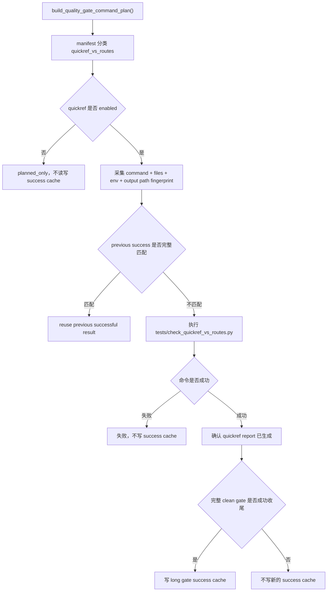

# quickref-vs-routes-cache 设计方案

## 0. 术语约定

- `quickref_vs_routes`：完整质量门禁里的 `python tests/check_quickref_vs_routes.py` 这一条命令。它把 `开发文档/系统速查表.md` 里的 GET/POST 接口清单，和 Flask 真实注册出来的路由表对比。
- quickref report：`evidence/QualityGate/quickref_vs_routes.md`。它是这条命令运行后生成的对账报告，只证明系统速查表和当前路由是否一致，不证明整个仓库通过 final gate。历史上的 `evidence/Conformance/quickref_vs_routes.md` 不再作为这条 long gate entry 的运行输出。
- success cache：只有完整 clean gate 成功收尾后，才允许写入的 long gate 成功缓存。后续复用前必须重新校验 command、fingerprint、stdout/stderr 日志、输出文件 hash、schema、runner/tooling hash 和仓库身份。
- clean-worktree final proof：干净工作区下运行 `scripts/run_quality_gate.py --require-clean-worktree --long-gate-cache` 并完整成功收尾。`--long-gate-cache-explain`、cache hit、quickref report 都不能冒充它。

## 1. 决策与约束

### 需求摘要

本 feature 推进 roadmap `NEXT-12`：把 `quickref_vs_routes` 从 long gate candidate / planned 推进到 enabled success cache。目标是：文档、路由、app 装配、模板、静态资源、配置、依赖、环境边界和输出报告都没变时，可以复用上一轮完整 clean gate 写下的成功结果；只要这些边界里有变化，就重新执行 quickref 对账。

成功标准：

- `quickref_vs_routes` 继续来自真实 `build_quality_gate_command_plan()`，命令仍是 `python tests/check_quickref_vs_routes.py`。
- manifest 为 `quickref_vs_routes` 声明完整输入范围、配置范围、工具范围、依赖范围、环境 key 和输出文件。
- `quickref_vs_routes` 进入 enabled，`architecture_fitness` 仍保持 planned，`debt_ledger_sync` 仍保持 enabled。
- `evidence/QualityGate/quickref_vs_routes.md` 缺失或 hash 不一致时不能复用旧成功。
- 系统速查表、路由、app/bootstrap、模板、静态资源、配置、依赖或关键环境变化都会让 fingerprint 变化。
- quickref stdout 不打印本机绝对路径，只打印仓库相对路径。
- quickref report 作为运行产物处理，不把本次生成内容混入提交。

明确不做：

- 不启用 `architecture_fitness`。
- 不回滚 `debt_ledger_sync`。
- 不改变 daily gate / pre-push 默认语义。
- 不降低 CI / final gate 要求。
- 不改 APS 排产、导入、保存等业务运行逻辑。
- 不为了让 quickref 过而放宽系统速查表和路由一致性检查。
- 不把 explain、cache hit、quickref report 当 clean-worktree final proof。
- 不使用 Python 3.9+ 类型语法，不使用 `shell=True`。

复杂度档位：质量门禁安全增强。宁可多重跑，也不能少算导致旧的“文档和路由一致”被错误复用到新的路由状态上。

## 2. 名词与编排

### 2.1 名词层

现状：

- `tools/quality_gate_shared.py` 的 command plan 已包含 `python tests/check_quickref_vs_routes.py`。
- `tools/long_gate_manifest.py` 已能把它识别为 `ENTRY_QUICKREF_VS_ROUTES`，但它还没有进入 enabled 集合。
- 目前 quickref entry 只声明了输出文件，缺少文档、路由、app/bootstrap、模板、静态资源、配置、依赖和环境边界。
- `tests/check_quickref_vs_routes.py` 会生成稳定报告正文，但 stdout 之前打印的是本机绝对路径。
- `evidence/Conformance/quickref_vs_routes.md` 当前已有历史跟踪文件；后续修复已把本 entry 的运行报告移到被忽略的 `evidence/QualityGate/quickref_vs_routes.md`，避免 tracked 证据和 runtime cache 混在一起。

变化：

- 将 `ENTRY_QUICKREF_VS_ROUTES` 加入 enabled 集合。
- 为 quickref entry 增加 input/config/tool/dependency/env scopes。
- 保持输出文件声明为 `evidence/QualityGate/quickref_vs_routes.md`，让通用 cache 层校验它存在且 hash 匹配。
- 将 quickref stdout 改成打印仓库相对路径，避免本机路径进入长期日志。
- 把 quickref report 加入 `.gitignore`、staged artifact block 和 clean-worktree generated path 说明，防止本次生成物误混入提交。
- 新增 `tests/test_long_gate_quickref_cache.py`，专门锁住 quickref enabled、fingerprint 变化和输出文件缺失/篡改失效。

### 2.2 编排层

跨层纪律：

- command hash 继续覆盖 display、args、capture_output、output_policy 和 env_overlay。
- quickref 只复用通用“脚本写输出 + output_result_files 校验 hash”的模式，不新增复杂 proof writer。
- strict fingerprint 失败时继续走 `cache_unavailable`：不读旧 success cache，不写新 success cache，真实执行命令。
- quickref report 是运行产物；本 feature 不靠提交它来证明成功。

### 2.3 挂载点

- `tools/long_gate_manifest.py`：启用 `quickref_vs_routes`，补齐 scopes 和输出声明。
- `tests/check_quickref_vs_routes.py`：stdout 改为仓库相对路径。
- `scripts/run_quality_gate.py`：clean-worktree generated path 说明包含 `evidence/QualityGate/quickref_vs_routes.md`。
- `.gitignore`、`tools/git_hook_checks.py`：防止 quickref report 误进入提交。
- `tools/test_registry.py`：把 quickref cache 测试纳入正式 required gate。
- `tests/test_long_gate_manifest.py`、`tests/test_long_gate_quickref_cache.py`、`tests/test_check_quickref_vs_routes.py`、`tests/test_git_hook_checks.py`、`tests/test_run_quality_gate.py`：锁住行为。
- `.codestable/roadmap/quality-gate-long-cache/`：记录 NEXT-12 状态。

拔掉本 feature 的方式：把 `ENTRY_QUICKREF_VS_ROUTES` 从 enabled 集合移回 planned；保留 artifact hygiene 和 stdout 相对路径不会改变其它 entry 的复用语义。

### 2.4 推进策略

1. CodeStable scaffold：创建 NEXT-12 feature 文档和 checklist，把 roadmap item 标为 in-progress。
2. quickref 合同加固：stdout 改仓库相对路径，补测试。
3. manifest / fingerprint：补齐 quickref scopes，启用 quickref，新增 false reuse 测试。
4. artifact hygiene：保护 quickref report，不改变 daily/pre-push/CI final 语义。
5. acceptance / roadmap：写验收报告，回写 checklist 和 roadmap 状态，明确 proof 口径。

## 3. 验收契约

- S1：`quickref_vs_routes` 继续从真实 command plan 分类出来，命令身份不变。
- S2：enabled 列表只新增 `quickref_vs_routes`；`architecture_fitness` 仍 planned，`debt_ledger_sync` 仍 enabled。
- S3：系统速查表、路由、app/bootstrap、模板、静态资源、配置、依赖、环境 key 变化会让 quickref fingerprint 变化。
- S4：声明输出 path 变化会让 fingerprint 变化。
- S5：`evidence/QualityGate/quickref_vs_routes.md` 缺失或 hash mismatch 时不复用。
- S6：quickref stdout 只打印仓库相对路径和结果，不打印本机绝对路径。
- S7：`--long-gate-cache-explain` 只打印决策，不写 proof，不是 clean proof。
- S8：strict fingerprint error 时不读旧 cache、不写新 success cache。
- S9：dirty / unbound / resume 场景不写新的 quickref success cache。
- S10：quickref report 不混入本次提交。

反向核对项：

- 不启用 `architecture_fitness`。
- 不改变 daily gate、pre-push 和 CI final gate 语义。
- 不把 quickref report 或 cache hit 说成 final proof。
- 不改 APS 业务逻辑。

## 4. 与项目级架构文档的关系

本 feature 属于质量门禁工具链增强，不新增 APS 用户可见业务能力，不改变排产、导入、保存等业务链路。`.codestable/architecture/ARCHITECTURE.md` 已经把质量门禁入口写为 `scripts/run_quality_gate.py`；本 feature 只是在该入口下新增一条 long gate success cache 能力，不改变应用运行架构。
