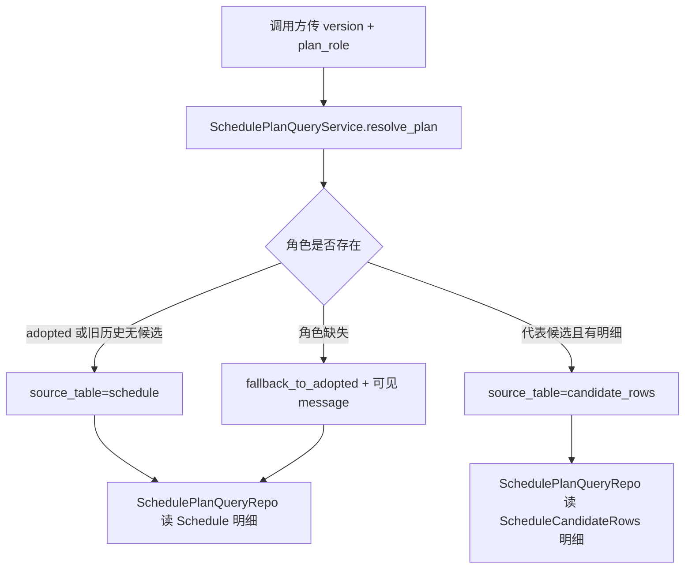

# scheduler-graph-candidate-schema-query 设计方案

## 1. 目标

本 feature 执行 roadmap `networkx-scheduler-graph-introduction` 的 PR-7a：`scheduler-graph-candidate-schema-query`。

大白话说，PR-6 已经让单次排产能按关键链评分。PR-7 要开始比较多套方案，但第一刀不能直接去跑多套方案。第一刀先把数据库和查询口径做稳：正式采用方案仍然从 `Schedule` 读，代表性的非正式候选方案从新候选明细表读，后续页面、导出和报表都通过同一个查询服务拿数据。

复杂度档位：走默认档位，但数据库约束和查询服务必须严格。这里宁可让坏 role、坏 status、缺候选明细直接暴露，也不做“查不到就悄悄当 adopted”的静默成功。

## 2. 范围

- 新增候选方案三张表：
  - `ScheduleCandidate`：保存所有候选摘要。
  - `ScheduleCandidateRows`：只保存非 adopted 的代表候选明细。
  - `ScheduleCandidateSelection`：保存 `adopted`、`baseline_best`、`critical_best` 三个角色指向。
- 新增 `core/models/schedule_candidate.py`，只放字段映射和轻量值对象。
- 新增 `data/repositories/schedule_candidate_repo.py`，只负责候选摘要、候选明细、角色映射的写入和查询。
- 新增 `data/repositories/schedule_plan_query_repo.py` 和 `core/services/scheduler/schedule_plan_query_service.py`，统一解析 `plan_role` 并读取当前方案明细。
- 改造 `data/repositories/schedule_detail_query.py`，让同一套 join 字段能从 `Schedule` 或 `ScheduleCandidateRows` 读取。
- 新增两份合同测试：
  - `tests/regression_scheduler_candidate_schema_contract.py`
  - `tests/regression_scheduler_candidate_plan_query_contract.py`

## 3. 明确不做

- 不做 PR-7b 的候选生成、候选运行、自动择优或关键链健康计算。
- 不改 `optimize_schedule()`，不新增 `candidate_trial_mode`。
- 不做 PR-7c 的主链接入和同事务持久化总入口。
- 不改 `/scheduler/run` 路由，不改页面，不接甘特图、周计划、资源派工、报表或导出。
- 不新增 PR-7e 的配置字段、临时时间上限、清理策略或性能证据。
- 不引入新数据库、新依赖、外部前端资源、后台续跑、多进程或 Python 3.9+ 语法。
- 不把 NetworkX、`nx.DiGraph`、完整 graph、完整候选 rows 塞进 summary 或 OperationLogs。

## 4. 名词层：现状 -> 变化

现状：

- `Schedule` 只保存某个 version 的正式排产行。
- `ScheduleHistory.result_summary` 保存排产摘要。
- `schedule_detail_query.py` 的 SQL 写死从 `Schedule s` 读取明细。
- 仓库里还没有 `ScheduleCandidate`、`ScheduleCandidateRows`、`ScheduleCandidateSelection`。

变化：

- 一个正式 version 仍然只代表一次排产。
- `adopted` 明细永远从 `Schedule` 读。
- `baseline_best` / `critical_best` 如果不是 adopted，则从 `ScheduleCandidateRows` 读。
- `SchedulePlanQueryService.resolve_plan(version, role)` 返回解析结果，包含 requested/effective role、source_table、candidate_id、candidate_key、message 和 available_roles。
- `SchedulePlanQueryService.list_plan_detail_rows_*()` 只负责按解析结果读取明细，不负责页面展示、不负责导出、不负责自动择优。

## 5. 编排层

流程约束：

- `role=None` 等同 `adopted`。
- 旧历史没有候选表记录时，`adopted` 正常读 `Schedule`。
- 请求非 adopted 但没有对应 selection 时，返回 `fallback_to_adopted`，并给出可见 message。
- 请求的 selection 指向 `candidate_rows` 时，如果缺 `candidate_id`，直接报合同错误，不伪装成 adopted。
- 查询服务不写数据库，不启动排产，不调用图分析。

## 6. 挂载点

- 数据库结构：`schema.sql` + `core/infrastructure/migrations/v10.py`。
- 候选数据仓库：`data/repositories/schedule_candidate_repo.py`。
- 统一方案读取：`data/repositories/schedule_plan_query_repo.py` + `core/services/scheduler/schedule_plan_query_service.py`。
- 明细 SQL 共用底座：`data/repositories/schedule_detail_query.py`。
- 合同测试：schema 合同和 plan query 合同。

## 7. 结构健康度与微重构

- 文件级：`schema.sql`、migration 注册、`schedule_detail_query.py` 都是现有职责的自然延伸，不做行为不变微重构。
- 目录级：`data/repositories/` 和 `core/services/scheduler/` 已经有同类仓库和服务文件，本次新增窄文件，不重组目录。
- compound convention 检索：未命中相关目录组织或命名约定。
- 超出范围观察：后续 PR-7d 会把页面和报表接到 `SchedulePlanQueryService`，但不在 PR-7a 里提前改页面路由。

## 8. 验收场景

- 新库或 v9 旧库迁移后，三张候选表、索引、CHECK、UNIQUE 约束存在。
- `ScheduleCandidate.status` 只允许 `completed` / `failed` / `skipped` / `not_run`。
- `ScheduleCandidateSelection.role` 只允许 `adopted` / `baseline_best` / `critical_best`。
- `adopted` 解析后从 `Schedule` 读明细。
- `baseline_best` / `critical_best` 指向 `candidate_rows` 时，从 `ScheduleCandidateRows` 读明细。
- 缺少候选 selection 的旧历史，请求非 adopted 时 fallback 到 adopted，并返回可见 message。
- `schedule_detail_query.py` 继续返回原有明细字段，不把所有页面 SQL 各自复制一份。
- 本阶段不出现候选运行、自动择优、页面 plan_role 或配置字段改动。
