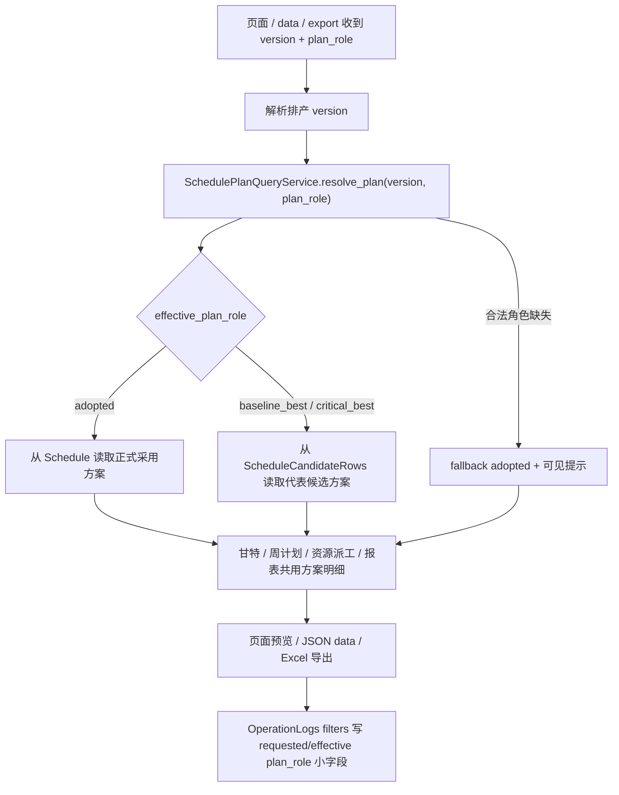

# scheduler-graph-plan-role-pages-reports 设计方案

## 0. 输入和边界

本 feature 执行 roadmap `networkx-scheduler-graph-introduction` 的 PR-7d：`scheduler-graph-plan-role-pages-reports`。

大白话说，PR-7a 已经有了候选方案表和 `SchedulePlanQueryService`，PR-7b 已经能在内存里跑多套候选，PR-7c 已经把最终采用方案和代表候选方案写进数据库。PR-7d 要做的是把这些“可读取的方案角色”接到用户能看到的地方：甘特图、周计划、资源派工、排产优化分析、超期清单、资源负荷与利用率、停机影响统计，以及这些页面对应的数据接口和 Excel 导出。

本轮已完成 PR-7d 设计、实现、合同测试和验收回填；roadmap/items 只回写 PR-7d 状态和实际文件范围，不改回 PR-8 已确认的资源匹配计划。

## 1. 目标、约束和明确不做

目标：

- 所有相关页面都能带 `plan_role=adopted / baseline_best / critical_best`。
- `plan_role` 不传时等同 `adopted`，旧链接保持可用。
- 页面预览、JSON data 接口、Excel 导出、报表计算读取同一套方案明细，不能出现“页面看的是 A，导出变成 B”。
- 非 adopted 页面和导出要明确提示：当前查看的是对比方案，不是本次正式采用结果。
- 合法但缺失的非 adopted 角色使用 fallback adopted，并把 requested / effective / message 明确返回和展示；未知 `plan_role` 继续报错，不悄悄成功。
- OperationLogs 的 Excel 导出 `filters` 必须记录 `requested_plan_role`、`effective_plan_role`、`plan_role_status`，必要时记录 `candidate_id / candidate_key` 小字段，但不能写候选 rows 或完整候选列表。

明确不做：

- 不碰 PR-6：不改图评分、ready 队列、SGS 排序方向、`graph/scoring.py` 或 PR-6 指标语义。
- 不碰 PR-8：不做资源匹配诊断、不新增资源匹配页面、不改变资源分配结果。
- 不做 PR-7e 配置：不新增配置字段、不接临时时间上限 UI、不做候选清理策略、不补性能守卫。
- 不新增 schema / migration，不写候选表，不重跑候选，不改自动择优。
- 不把完整 candidate rows、完整 candidates 列表、nodes、edges、raw graph、完整 diagnostics 写进 summary 或 OperationLogs。
- 不引入外部前端资源、新数据库驱动或 Python 3.9+ 语法。

复杂度档位：走默认档位，但 plan_role 是跨页面合同，必须用统一解析结果贯穿页面、接口、导出和日志，不允许每个页面各自猜角色。

## 2. 名词层：现状 -> 变化

现状：

- `SchedulePlanQueryService` 已提供 `resolve_plan()`、`list_plan_roles()`、`get_plan_time_span()`、`list_plan_detail_rows_between()`、`list_plan_detail_rows_all()`、`list_plan_dispatch_rows()`。
- `adopted` 读 `Schedule`；`baseline_best / critical_best` 如果指向候选明细，则读 `ScheduleCandidateRows`。
- `resolve_plan()` 对未知 role 报错；合法但缺失的 role fallback adopted，并返回 `status="fallback_to_adopted"` 和可见 message。
- `GanttService`、`ResourceDispatchService`、`ReportEngine` 目前主要通过 `ScheduleRepository` 或报表 SQL 直接读取 `Schedule`。
- 甘特图模板、周计划模板、资源派工模板、报表模板、系统历史链接和分析页跳转链接目前只带 `version`，不带 `plan_role`。
- `static/js/gantt_boot.js` 和 `static/js/resource_dispatch.js` 构造 data 请求时目前不会补 `plan_role`。
- Excel 导出日志通过 `log_excel_export()` 写 OperationLogs，当前 filters 只记录 version、日期和页面筛选条件。
- 甘特关键链缓存 key 目前只按连接范围和 version，不能区分不同候选方案。

变化：

- 所有页面统一使用一个轻量 plan context，至少包含：
  - `requested_plan_role`
  - `effective_plan_role`
  - `plan_role_status`
  - `plan_role_message`
  - `available_plan_roles`
  - `candidate_id`
  - `candidate_key`
  - `is_comparison`
- 旧页面默认 `plan_role=adopted`，旧版本没有候选数据时不显示方案切换。
- 请求 `baseline_best / critical_best` 但该版本没有对应 selection 时，页面继续显示 adopted，但必须展示 fallback adopted 提示。
- 请求未知 `plan_role` 时直接报错，不能 fallback。
- 非 adopted 的页面、data payload、导出文件名或导出摘要都要标明“对比方案”。
- 导出日志 filters 统一记录 requested/effective role，方便系统日志里能查出用户导出的到底是哪套方案。

## 3. 编排层



流程约束：

- version 解析仍沿用现有页面逻辑：缺失或 latest 继续走最新版本；明确不存在的 version 继续给用户可见错误。
- plan_role 解析在 version 确定之后进行，因为候选角色是按 version 保存的。
- `requested_plan_role` 是用户请求的角色；`effective_plan_role` 是实际读取的角色。
- fallback adopted 只用于“合法角色在当前 version 缺失”这一种情况。
- `available_plan_roles` 只来自 `SchedulePlanQueryService.list_plan_roles()`，不从 summary 猜。
- 页面切换链接、上周/下周、设备/人员视图、资源派工 data 请求、报表导出链接都必须继续携带当前 `plan_role`。

## 4. 各页面和接口设计

### 4.1 甘特图

现状：

- `/scheduler/gantt` 负责页面，`/scheduler/gantt/data` 负责 JSON。
- `GanttService.get_gantt_tasks()` 直接从 `ScheduleRepository.list_overlapping_with_details()` 取 version rows。
- 甘特关键链通过 `compute_critical_chain(schedule_repo, version)` 从正式 Schedule 取全量 version rows，并按 `(database_scope, version)` 缓存。

变化：

- 页面、data 接口都接收 `plan_role`。
- `GanttService` 用 `SchedulePlanQueryService` 解析 plan role，并按 effective role 读取区间 rows。
- `resolve_gantt_range_for_version()` 的 version span 改成按当前 plan role 的时间范围取，避免候选方案时间范围和 adopted 不一致时默认范围错位。
- 设备/人员视图切换、上周/下周、回到本周、日期范围表单和 JS `/gantt/data` 请求都保留 `plan_role`。
- 甘特 payload 返回 plan context；模板展示方案切换器和非 adopted / fallback 提示。
- 甘特关键链高亮必须按当前方案 rows 计算，缓存 key 至少包含 `version`、`effective_plan_role`、`source_table`、`candidate_id`，不能只按 version 缓存。
- 非 adopted 甘特图说明为对比方案；红色超期边框仍按当前 version 的 summary 超期信息做提示，不在 PR-7d 重新定义超期口径。

### 4.2 周计划

现状：

- `/scheduler/week-plan` 页面和 `/scheduler/week-plan/export` 导出都调用 `GanttService.get_week_plan_rows()`。
- 导出日志 filters 当前只记录 version。

变化：

- 页面和导出都接收 `plan_role`，并调用同一个 `get_week_plan_rows(..., plan_role=...)`。
- 页面预览前 50 行和导出的完整 Excel 必须来自同一个 effective plan role。
- 导出文件名或工作表摘要标明对比方案，例如包含 `baseline_best` / `critical_best` 或中文角色标签。
- 导出日志 filters 写入 `requested_plan_role`、`effective_plan_role`、`plan_role_status`、`candidate_id`、`candidate_key`。
- fallback adopted 时页面和导出都显示同一条 message；导出日志记录 requested 和 effective 不一致。

### 4.3 资源派工

现状：

- `/scheduler/resource-dispatch` 页面、`/resource-dispatch/data`、`/resource-dispatch/export` 共享 `ResourceDispatchService`。
- `static/js/resource_dispatch.js` 从当前 URL 或 filters 组装 data 请求。
- 服务层直接调用 `ScheduleRepository.list_dispatch_rows_with_resource_context()`。

变化：

- 页面、data、export 都接收并保留 `plan_role`。
- `ResourceDispatchService` 用 `SchedulePlanQueryService.list_plan_dispatch_rows()` 读取当前方案 rows，人员、设备、班组过滤都作用在同一套 rows 上。
- filters 里增加 plan context 小字段，JS `currentQueryString()` 必须把 `plan_role` 带回 data 请求。
- 页面 context bar、查询表单、导出按钮都显示或携带当前方案。
- 非 adopted 时显示对比方案提示；fallback adopted 时显示 fallback 提示。
- 导出文件名和 OperationLogs filters 记录当前方案角色。

### 4.4 排产优化分析

现状：

- `/scheduler/analysis` 主要读取 `ScheduleHistory.result_summary`，不读取方案 rows。
- 页面已有跳转甘特图的链接，但只带 version。

变化：

- analysis 页展示 `result_summary.algo.candidate_comparison` 的候选对比表，角色标签使用 `SchedulePlanQueryService` 的角色标签和可用 role。
- analysis 可以接收 `plan_role` 用于高亮当前查看角色，但历史 summary 本身仍是该 version 的排产摘要，不因为 plan_role 重新计算。
- adopted / baseline_best / critical_best 每一行提供跳转链接到甘特图、周计划、资源派工，并带 `version + plan_role`。
- 如果当前选择的是非 adopted，analysis 页也显示“正在查看对比方案入口”的提示，避免用户误以为它是最终采用结果。
- 如果请求的合法非 adopted role 缺失，analysis 页显示 fallback adopted 提示，并把跳转链接按 effective adopted 处理。

### 4.5 独立报表

现状：

- `/reports/overdue`、`/reports/utilization`、`/reports/downtime` 通过 `ReportEngine` 读取 `Schedule`。
- 超期清单的 SQL 直接 left join `Schedule s`。
- 利用率和停机影响通过 `schedule_repo.list_overlapping_with_details()` 取 rows。

变化：

- 三个报表页面和三个导出接口都接收 `plan_role`。
- `ReportEngine` 用 `SchedulePlanQueryService` 解析当前方案，并把 selected plan rows 传给计算逻辑。
- 超期清单：批次和交期仍来自 `Batches / BatchOperations`，finish_time 按当前方案 rows 聚合；当前方案没有排到的批次按未排程超期处理。
- 利用率：设备/人员工时按当前方案 rows 计算。
- 停机影响：停机记录仍来自 `MachineDowntimes`，与排程重叠部分按当前方案 rows 计算。
- 页面筛选表单、导出链接、日期默认范围都保留 `plan_role`；日期默认范围按 current effective plan 的时间范围取。
- 非 adopted 报表和导出都明确标为对比方案；fallback adopted 时展示 message。
- 报表导出 OperationLogs filters 记录 requested/effective role。

## 5. 挂载点

- 方案解析挂载点：`SchedulePlanQueryService`，所有页面只认它的解析结果。
- 排产结果页面挂载点：甘特图、周计划、资源派工服务和路由。
- 分析入口挂载点：排产优化分析页的候选对比表和跳转链接。
- 报表挂载点：`ReportEngine` 的超期、利用率、停机影响页面与导出。
- 前端保参挂载点：甘特图 JS、资源派工 JS、模板链接、系统历史链接。
- 导出审计挂载点：`log_excel_export()` 的 filters 小字段。

## 6. 推进策略

1. 只读核实现状：确认 PR-7a/7b/7c 的 `SchedulePlanQueryService`、candidate summary、selection、代表明细和当前页面读取路径。
2. 补统一 plan context：让后端服务和模板拿到同一份 requested/effective/status/message/roles 小结构。
3. 接甘特图和周计划：先让页面、data、导出读同一套 plan rows，再处理关键链 cache key 和 JS 保参。
4. 接资源派工：让 page/data/export 共用 plan_role，保留人员、设备、班组过滤。
5. 接报表和导出：让超期、利用率、停机影响页面与导出按同一 effective plan rows 计算，并写 OperationLogs filters。
6. 接 analysis：展示 candidate_comparison，对每个 role 给出跳转入口，链接带 version + plan_role。
7. 补合同测试和回归：用 roadmap 指定的 5 份 PR-7d 测试锁住页面、data、导出、日志和 fallback。

## 7. 结构健康度与微重构

compound convention 检索没有命中和本次目录组织、命名约定直接冲突的已有决策。

文件级判断：

- `GanttService`、`ResourceDispatchService`、`ReportEngine` 都已经承担对应页面的数据编排，本次是在现有职责上切换数据来源，不做大拆分。
- `web/routes/reports.py` 和 scheduler routes 已经分别承接页面参数和导出，PR-7d 不重组路由目录。
- `gantt_critical_chain.py` 当前直接读取 Schedule，后续实现可以把“从 rows 计算关键链”抽成窄函数，但不改变关键链算法语义。

目录级判断：

- 本次不新增顶层目录，不重组 `web/routes`、`templates`、`static/js`。
- 如果实现发现 plan context 在多个 route/template 重复，可新增一个窄 viewmodel/helper 承载展示字段；这属于减少重复的局部 helper，不是 PR-7d 的独立重构目标。

结论：本次不做“只搬不改行为”的前置微重构。实现阶段只允许围绕 plan_role 添加窄 helper，不借机重排页面结构。

## 8. 验收契约

- 甘特图：访问 `/scheduler/gantt?version=V&plan_role=critical_best`，页面下拉选中 critical_best，data 请求带 plan_role，返回 rows 来自 effective role，非 adopted 显示对比方案提示。
- 甘特图：设备/人员切换、上周/下周、日期范围查询后，URL 和 data 请求仍保留 plan_role。
- 甘特图：同一 version 的 adopted 与 critical_best 关键链缓存互不串用。
- 周计划：页面预览和导出 Excel 对同一个 `version + plan_role + week_start` 返回同一套行。
- 周计划：导出日志 filters 记录 requested/effective plan_role；非 adopted 文件名或摘要标明对比方案。
- 资源派工：页面、data、export 都保留 plan_role；operator / machine / team scope 过滤应用在 candidate rows 上。
- 资源派工：导出日志 filters 记录 plan_role 小字段。
- 报表：超期清单、资源负荷与利用率、停机影响统计都按当前 plan_role 读取排程 rows。
- 报表：导出结果和页面预览同源；导出日志记录 requested/effective plan_role。
- analysis：页面展示 candidate_comparison 表，adopted / baseline_best / critical_best 标签正确，跳甘特 / 周计划 / 资源派工都带 version + plan_role。
- fallback adopted：合法非 adopted role 缺失时，页面、data、导出都显示 adopted 数据，并返回/展示“已显示最终采用方案”的 message。
- 未知 role：`plan_role=bad_role` 报用户可见错误，不 fallback。
- 非 adopted 提示：所有非 adopted 页面和导出都能看出“这是对比方案，不是本次正式采用结果”。
- 范围守护：不改 PR-6 图评分、PR-8 资源匹配、PR-7e 配置和清理策略；不新增 schema/migration。

## 9. 验证命令

```bash
PYTHONDONTWRITEBYTECODE=1 .venv/bin/python -m pytest -q tests/regression_scheduler_candidate_gantt_plan_role_contract.py tests/regression_scheduler_candidate_week_plan_contract.py tests/regression_scheduler_candidate_resource_dispatch_contract.py tests/regression_scheduler_candidate_reports_contract.py tests/regression_scheduler_candidate_analysis_contract.py
PYTHONDONTWRITEBYTECODE=1 .venv/bin/python -m pytest -q tests/regression_scheduler_candidate_plan_query_contract.py
python .codestable/tools/validate-yaml.py --dir .codestable/features/2026-05-18-scheduler-graph-plan-role-pages-reports
```
