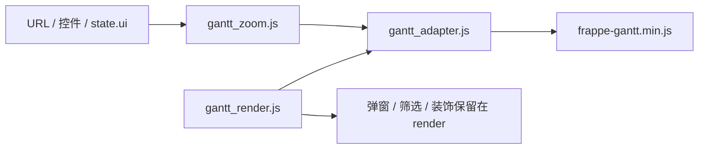

# gantt-adapter-contract design

## 0. 需求摘要

用户目标：只读甘特图第一版已经完成，下一步要先把 Frappe 依赖收口成 APS 自己的适配层，再进入模拟调整。

明确不做：
- 不开放“进入模拟调整”按钮。
- 不保存草稿，不新增保存接口。
- 不写 `Schedule` / `ScheduleHistory`。
- 不替换甘特组件，不新增 CDN 或联网资源。
- 不把弹窗文案、筛选、颜色、关键工序装饰搬进适配层。

## 1. 决策与约束

现状：`static/js/gantt_render.js` 直接 `new Gantt(...)`，同时写入 `view_mode`、分钟步长、列宽、只读参数、点击回调和弹窗回调。`static/js/gantt_zoom.js` 是缩放唯一事实源。

变化：新增 `static/js/gantt_adapter.js`，只负责把 APS 的 `mode + zoomLevel + callbacks` 翻译成 Frappe Gantt options，并创建 Gantt 实例。缩放仍然只读 `gantt_zoom.js`，不复制映射表。

复杂度档位：默认轻量前端合同。目标是减少耦合，不是重写渲染系统。

## 2. 方案

### 2.1 名词层

现状：
- `mode` 只有页面 data 属性和 `state.ui.mode`，默认 `view`。
- `zoomLevel` 是 `month/week/day/.../one-minute`，由 `gantt_zoom.js` 管。

变化：
- `adapter.buildGanttOptions({ mode, zoomLevel, onClick, customPopupHtml, onDraftChange })` 返回 Frappe options。
- `adapter.createGantt({ selector, tasks, mode, zoomLevel, ... })` 返回真实 Gantt 实例。
- `adapter.createAdapter()` 暴露 `setMode`、`setZoom`、`onTaskClick`、`onDraftChange`、`createGantt`。

### 2.2 编排层

现状：`render()` 过滤任务、做范围保护、创建 Gantt、安装弹窗适配、安装关键工序外框、滚动定位、装饰任务条。

变化：`render()` 仍保留业务编排，只把“创建 Frappe Gantt 和固定第三方参数”交给 adapter。`view` 模式继续禁拖；`simulate` 只提供未来 `onDraftChange` 事件出口，不连接保存。

### 2.3 挂载点

- 模板脚本顺序：新增 `gantt_adapter.js`，放在 `gantt_zoom.js` 后、`gantt_render.js` 前。
- 渲染入口：`gantt_render.js` 通过 `ns.adapter.createGantt()` 创建图。
- 回归合同：新增 `tests/regression_gantt_adapter_contract.py`，脚本顺序测试追踪 adapter 资产。
- roadmap item：`gantt-adapter-contract` 从 `planned` 改为 `in-progress`。

### 2.4 推进策略

1. 先落 design/checklist 和 roadmap in-progress。
2. 新增 adapter 骨架和合同测试。
3. 迁移 render 的 Gantt 初始化。
4. 更新模板脚本顺序和 Node 测试加载顺序。
5. 跑甘特图适配层回归和第一版只读回归。

### 2.5 结构健康度

`gantt_render.js` 已经偏大，但本阶段不做大拆分。只把 Frappe 初始化 options 抽到新文件，属于小范围“只搬不改行为”。弹窗、筛选、装饰继续留在 render，避免 adapter 变成第二个渲染大文件。

## 3. 验收契约

- 输入 `mode=view + zoomLevel=hour`，adapter 输出 readonly 参数为 true，Frappe view mode 为 `Hour`。
- 输入 `mode=simulate + zoomLevel=fifteen-minute`，adapter 输出非只读日期模式，并只触发 `onDraftChange` 事件，不保存。
- 页面 render 后仍能点击任务条打开弹窗，查看模式仍没有拖动手柄。
- `gantt_adapter.js` 加载顺序在 `gantt_zoom.js` 后、`gantt_render.js` 前。
- 新增测试进入甘特图质量门禁分组。

## 4. 风险

- 不允许 adapter 复制缩放映射表；否则以后缩放规则会分裂。
- 不允许在本阶段新增任何保存接口；否则会越过草稿/校验/发布路线。
