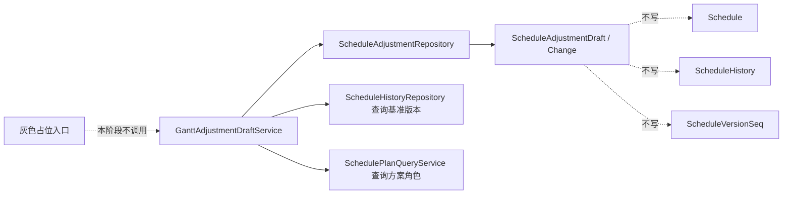

# gantt-adjustment-draft-model design

## 0. 需求摘要

用户目标：模拟调整主线进入后端模型阶段。系统需要能记录“用户想怎么改”，但这个记录不能成为正式排产结果，不能占正式版本号，也不能改变甘特图、周计划、资源排班和报表默认读取的正式版本。

明确不做：
- 不新增前端可点击入口。
- 不新增 route。
- 不做拖动落点校验。
- 不保存 Scenario 模拟方案。
- 不正式采用，不生成 Official Version。
- 不调用现有 `simulate=True` 排产入口，因为它仍会写正式 `Schedule` / `ScheduleHistory`。
- 不写 `Schedule`、`ScheduleHistory`、`ScheduleCandidate*`、`ScheduleVersionSeq`。

## 1. 决策与约束

现状：
- 正式版本号由 `ScheduleHistoryRepository.allocate_next_version()` 写 `ScheduleVersionSeq` 分配。
- 正式结果落在 `Schedule`，正式历史落在 `ScheduleHistory`。
- 现有 `simulate=True` 是“模拟排产版本”，不是 Draft 草稿。

变化：
- 新增 `ScheduleAdjustmentDraft` 和 `ScheduleAdjustmentChange`。
- 新增 `ScheduleAdjustmentDraft` / `ScheduleAdjustmentChange` dataclass。
- 新增 `ScheduleAdjustmentRepository`，只读写草稿表。
- 新增 `GanttAdjustmentDraftService`，创建草稿前校验基准正式版本和方案角色真实存在。
- 新增回归测试锁住：创建、记录调整、丢弃、删除草稿都不改变正式表和正式版本指针。

复杂度档位：中等后端模型。只做数据模型和合同，不打开用户入口。

## 2. 方案

### 2.1 名词层

- `ScheduleAdjustmentDraft`：一个草稿头，记录 `draft_id`、`base_version`、`base_plan_role`、状态、创建人、原因、调整数量、审计摘要。
- `ScheduleAdjustmentChange`：一条草稿调整，记录工序、排程行、时间变化、资源变化和校验状态。
- `base_version`：草稿基于哪个正式排产版本。
- `base_plan_role`：草稿基于 `adopted / baseline_best / critical_best` 中哪个方案角色。

### 2.2 编排层

创建草稿：

1. 校验 `base_version` 是正整数。
2. 校验 `base_plan_role` 属于现有方案角色枚举。
3. 查询 `ScheduleHistory`，确认基准正式版本存在。
4. 查询 `SchedulePlanQueryService.resolve_existing_plan()`，确认指定方案角色真实存在且明细不缺失，不允许静默回退到 `adopted`。
5. 只写 `ScheduleAdjustmentDraft`。

记录调整：

1. 时间调整写 `move_time / resize_time`。
2. 资源调整写 `change_resource`。
3. 每写一条调整，刷新草稿 `change_count`。
4. 不写正式排产表。

丢弃/删除草稿：

1. 丢弃只改草稿状态为 `discarded`。
2. 删除只删草稿表和草稿调整表。
3. 不影响正式 `Schedule` / `ScheduleHistory` / `ScheduleVersionSeq`。

### 2.3 挂载点

- `schema.sql`
- `core/infrastructure/migrations/v12.py`
- `core/infrastructure/migrations/__init__.py`
- `core/infrastructure/migration_state.py`
- `core/models/schedule_adjustment.py`
- `core/models/__init__.py`
- `data/repositories/schedule_adjustment_repo.py`
- `data/repositories/__init__.py`
- `core/services/scheduler/gantt_adjustment_draft_service.py`
- `tests/regression_gantt_adjustment_draft_model.py`
- `tools/test_registry.py`

### 2.4 推进策略

1. 新增 schema 和 v12 迁移。
2. 新增模型和仓储。
3. 新增 Draft 服务，先只暴露创建、记录时间调整、记录资源调整、丢弃。
4. 新增回归测试，锁住不写正式数据。
5. 回写 roadmap、architecture 和验收报告。

### 2.5 结构健康度

Draft 模型和正式排产服务分文件、分仓储。`GanttAdjustmentDraftService` 不依赖 `ScheduleService`，也不调用现有正式排产 persistence，避免“草稿”和“正式版本”混成一条链。

## 3. 验收契约

- fresh DB 下有 `ScheduleAdjustmentDraft` 和 `ScheduleAdjustmentChange`，`SchemaVersion` 是当前版本。
- v11 老库升级后新增 Draft 表，旧数据不丢。
- 创建草稿不改变 `Schedule`、`ScheduleHistory`、`ScheduleVersionSeq`、最新正式版本和版本下拉列表。
- 记录时间/资源调整只写草稿变更，正式排程行不变。
- 丢弃/删除草稿只影响 Draft 表，正式数据不变。
- 非法 `base_plan_role`、不存在 `base_version`、不存在方案角色必须拒绝。
- 新测试进入质量门禁 required/guard 和甘特相关分组。

## 4. 风险

- `simulate=True` 仍是正式模拟排产版本，会写正式表；Draft 服务不得调用它。
- `base_version` 不做数据库外键，因为 `ScheduleHistory.version` 不是唯一键；必须服务层校验。
- 本阶段不开放前端入口，否则会形成“能创建草稿但还不能校验/保存方案”的半成品。
