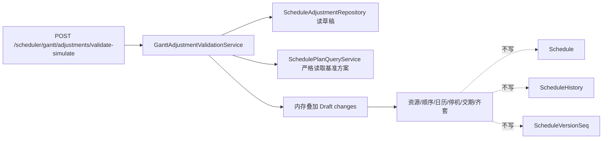

# gantt-adjustment-validate-simulate design

## 0. 需求摘要

本阶段回答一个问题：调度员把某个草稿调整放到目标时间/资源后，系统要告诉他“能不能放、为什么、会影响什么”。这不是保存方案，也不是正式采用。

明确不做：
- 不开放前端模拟调整入口。
- 不保存 Scenario 模拟方案。
- 不正式采用，不生成 Official Version。
- 不调用 `ScheduleService.run_schedule(simulate=True)`。
- 不写 `Schedule`、`ScheduleHistory`、`ScheduleVersionSeq`、`ScheduleCandidate*`。
- 不自动重排整单，不顺延下游工序。

## 1. 方案



## 2. 职责拆分

- `gantt_adjustment_projection.py`：纯函数，把基准排程行和 Draft 调整合成“假设调整后”的内存行，并做资源重叠、工序倒挂、交期影响等纯校验。
- `gantt_adjustment_validation_service.py`：读取 Draft、读取基准方案、查询停机和齐套状态，组织返回结果。
- `scheduler_gantt_adjustments.py`：薄 route，只解析 JSON、调用服务、返回 JSON。页面不注入这个 URL。

## 3. 返回合同

校验成功和发现冲突都返回 HTTP 200：

```json
{
  "success": true,
  "data": {
    "status": "valid|warning|blocked",
    "can_apply": true,
    "message": "可以放到这个位置，正式计划还没有改变。",
    "issues": []
  }
}
```

请求本身错误、草稿不存在、草稿状态不允许、时间格式错误，走统一 `ValidationError` JSON。

## 4. 验收契约

- 合法 Draft + 空闲落点返回 `valid`。
- 同设备重叠、同人员重叠返回 blocker。
- 同批次同件号前后工序倒挂返回 blocker。
- 全局日历不可排、设备停机返回 blocker。
- 超过交期、物料未齐套返回 warning。
- 返回消息必须是中文业务说明，不泄漏图结构、内部对象或调试样本。
- route 可直接调用，但页面入口仍禁用，模板不写调整校验 URL。
- 校验前后正式 `Schedule`、`ScheduleHistory`、`ScheduleVersionSeq`、`ScheduleCandidate*` 不变。

## 5. 风险

- 现有查看页允许候选方案缺失时回退 adopted；本阶段不能回退，必须使用 Draft 记录的 `base_version + base_plan_role` 严格读取。
- 日历第一版按“整段必须落在同一个工作窗口内”判断。跨多工作窗口的自动切分不在本阶段做。
- Draft 表已有 `validation_status` 字段，但本阶段先不回写，避免把“校验”变成“保存”。
