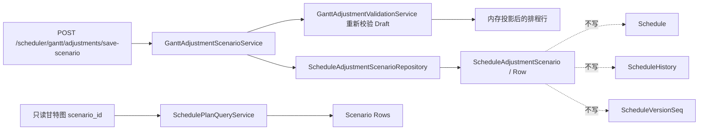

# gantt-draft-save-and-preview design

## 0. 需求摘要

本阶段回答一个问题：调度员已经有一份 Draft 草稿，系统校验后认为可以试看结果时，怎么把它保存成一份“模拟方案”，并让用户用只读页面预览。

Scenario 是“可反复打开看的模拟结果”，不是正式排产版本。它不能占正式版本号，不能改变默认甘特图、周计划、资源排班和报表，也不能写正式历史。

明确不做：
- 不开放拖动编辑工具栏。
- 不正式采用，不生成 Official Version。
- 不新增发布按钮。
- 不写 `Schedule`、`ScheduleHistory`、`ScheduleVersionSeq`、`ScheduleCandidate*`。
- 不把 Scenario 塞进 `plan_role=adopted/baseline_best/critical_best`。
- 不让报表默认读取模拟方案；必须显式带 `scenario_id` 才预览。

## 1. 决策与约束

现状：
- Draft 表只记录“用户想怎么改”。
- `validate-simulate` 已能把 Draft 叠到基准方案上，在内存里返回 `valid / warning / blocked`。
- 结果页通过 `SchedulePlanQueryService` 读取 `Schedule` 或 `ScheduleCandidateRows`。

变化：
- 新增 `ScheduleAdjustmentScenario` 和 `ScheduleAdjustmentScenarioRow`。
- 新增 Scenario 仓储和保存服务。
- 保存前必须重新调用 Draft 校验；`blocked` 不允许保存，`valid/warning` 可以保存。
- 预览时必须显式传 `scenario_id`，查询链路严格读取 Scenario 行，不做 adopted 静默回退。
- 页面必须显示“当前正在预览模拟方案，正式计划还没有改变”。

复杂度档位：中等后端和结果页查询改造。只做保存和显式预览，不做发布。

## 2. 方案

### 2.1 名词层

- `ScheduleAdjustmentScenario`：一份保存下来的模拟方案头，记录来源 Draft、基准版本、基准方案角色、校验状态、问题摘要、创建人和方案名。
- `ScheduleAdjustmentScenarioRow`：模拟方案的每一条排程结果。它来自基准方案行加上 Draft 调整后的内存投影。
- `scenario_id`：预览入口的显式身份。没有这个参数时，所有正式结果页仍看正式版本或候选代表方案。
- `validation_status`：保存时最后一次校验结果，只允许 `valid` 或 `warning` 保存。

### 2.2 编排层

保存 Scenario：

1. route 只解析 `draft_id`、`scenario_name` 和基准校验参数；创建人由服务端当前操作者口径提供，不能接受客户端自报 `created_by`。
2. 服务读取 Draft，并重新执行 `validate-simulate` 的同一套校验。
3. 如果结果是 `blocked`，直接拒绝保存。
4. 如果结果是 `valid` 或 `warning`，把投影后的全量排程行写入 `ScheduleAdjustmentScenarioRow`。
5. Draft 状态改为 `saved_scenario`。
6. 返回 `scenario_id` 和预览 URL。

预览 Scenario：

1. 甘特图页面和数据接口接收 `scenario_id`。
2. `SchedulePlanQueryService` 解析为 Scenario 数据源。
3. 时间范围、任务列表、超期标记、关键工序都按 Scenario 行计算。
4. 页面顶部显示模拟预览提示。
5. URL 复制后仍保留 `scenario_id`。

### 2.3 挂载点

- `schema.sql`
- `core/infrastructure/migrations/v13.py`
- `core/infrastructure/migration_state.py`
- `core/models/schedule_adjustment.py`
- `data/repositories/schedule_adjustment_scenario_repo.py`
- `core/services/scheduler/gantt_adjustment_validation_service.py`
- `core/services/scheduler/gantt_adjustment_scenario_service.py`
- `core/services/scheduler/schedule_plan_query_service.py`
- `data/repositories/schedule_plan_query_repo.py`
- `core/services/scheduler/gantt_service.py`
- `web/routes/domains/scheduler/scheduler_gantt.py`
- `web/routes/domains/scheduler/scheduler_gantt_adjustments.py`
- `templates/scheduler/gantt.html`
- `web_new_test/templates/scheduler/gantt.html`
- `static/js/gantt_boot.js`
- `tests/regression_gantt_draft_save_and_preview.py`

### 2.4 推进策略

1. 先落设计、schema、迁移和模型。
2. 把 validate-simulate 的内存投影结果提成可复用 evaluation，不复制校验逻辑。
3. 新增 Scenario 保存服务和 route。
4. 在查询服务里新增显式 `scenario_id` 预览入口，默认正式链路不变。
5. 接甘特图页面、数据接口、模板和 JS 的 URL 复现。
6. 补回归测试和文档。

### 2.5 结构健康度

Scenario 仓储独立于 Draft 仓储，避免一个文件同时承担草稿、方案、发布三类职责。Scenario 预览通过统一查询服务进入，页面不直接拼表名，也不把模拟方案伪装成候选方案角色。

## 3. 验收契约

- fresh DB 和 v12 老库升级后都有 Scenario 两张表和索引。
- 保存 Scenario 前必须重新校验 Draft。
- blocked Draft 不能保存 Scenario。
- warning Draft 可以保存，但返回和页面都要标明“正式计划还没有改变”。
- 保存 Scenario 不改变 `Schedule`、`ScheduleHistory`、`ScheduleVersionSeq`、`ScheduleCandidate*`。
- 保存后 Draft 状态变成 `saved_scenario`。
- 甘特图带 `scenario_id` 时读取 Scenario 行；不带时仍读取正式版本。
- 非法或不属于当前版本的 `scenario_id` 必须报错，不回退到 adopted。
- URL 切换缩放、筛选、刷新后仍保留 `scenario_id`。

## 4. 风险

- 预览链路如果沿用 `plan_role` 回退逻辑，会把找不到的 Scenario 悄悄变回正式 adopted，这是本阶段必须避免的最大风险。
- 关键工序和超期标记不能继续只看正式 `Schedule`，Scenario 预览必须按模拟行重新计算。
- 本阶段只接甘特图预览；周计划、资源排班和报表如果没有完全接入，必须在 checklist 和 acceptance 中明示剩余范围。
