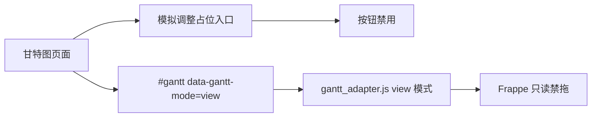

# gantt-simulation-entry-shell design

## 0. 需求摘要

用户目标：只读甘特图第一版和 Frappe 适配层已经完成。下一步需要开始进入模拟调整主线，但不能直接做成“能拖但是不保存”的半成品，避免用户误以为正式计划已经被改。

明确不做：
- 不切换到真实 `simulate` 模式。
- 不开放拖动、拉伸或改进度。
- 不新增保存草稿接口。
- 不新增正式采用接口。
- 不写 `Schedule` / `ScheduleHistory`。
- 不显示“保存成功”“正式采用”“提交调整”这类会让用户误会的文案。
- 不把模拟调整状态写进 URL。

## 1. 决策与约束

现状：
- 页面默认 `data-gantt-mode="view"`，适配层会把 `view` 转成只读 Frappe options。
- 页面已有“查看模式”提示，但没有稳定的模拟调整入口位置。
- 后端还没有 Draft 草稿模型、校验服务、Scenario 保存服务和 Official Version 发布链路。

变化：
- 在甘特图上方增加一个“模式壳”：当前模式明确显示为“查看结果”。
- 壳里放一个灰色禁用按钮：`模拟调整（后续开放）`。
- 按钮只表达未来入口位置，不触发 JS，不发请求，不创建草稿。
- 说明书和页面帮助同步告诉用户：当前入口不能点击，不会产生草稿、模拟方案或正式新版本。

复杂度档位：轻量前端壳。目标是立边界，不是提前实现编辑流程。

## 2. 方案

### 2.1 名词层

现状：
- `view`：只读查看模式，允许点击查看详情、筛选、缩放，不允许拖动修改。
- `simulate`：适配层预留的未来模拟模式，目前页面不进入。

变化：
- `ganttSimulationEntryShell`：页面上的模拟调整入口壳。
- `ganttSimulationEntry`：禁用态按钮，文案为 `模拟调整（后续开放）`。
- `data-simulation-state="disabled"`：明确当前模拟入口没有开放。

### 2.2 编排层

现状：用户打开甘特图后直接进入查看模式，所有操作都是看图操作。

变化：用户打开甘特图后仍然进入查看模式，但能看到未来模拟调整入口的位置。点击任务条、筛选、缩放、配色都保持原行为；禁用按钮不会触发网络请求或状态切换。

### 2.3 挂载点

- 主模板：`templates/scheduler/gantt.html`
- 镜像模板：`web_new_test/templates/scheduler/gantt.html`
- 样式：`static/css/aps_gantt_simulation.css`
- 页面帮助：`web/viewmodels/page_manuals_scheduler_outputs.py`
- 说明书：`static/docs/scheduler_manual.md`
- 回归测试：`tests/regression_gantt_simulation_entry_shell.py`
- 质量门禁分组：`tools/test_registry.py`

### 2.4 推进策略

1. 落 design/checklist，roadmap item 进入执行态。
2. 模板双份同步增加禁用入口壳。
3. 更新样式和用户说明。
4. 新增回归测试，锁住默认只读、按钮禁用、无保存入口、无正式数据写入入口。
5. 跑目标回归和静态检查。

### 2.5 结构健康度

本阶段不新增 JS 文件，也不扩展 `gantt_ui.js`。原因是当前入口不产生状态变化，不需要事件编排；如果提前写模拟状态机，会比真实能力先出现，后续草稿模型落地时反而容易重写。

## 3. 验收契约

- 默认页面仍是 `data-gantt-mode="view"`。
- 模拟调整入口可见，但按钮必须 disabled。
- 页面不能出现可用保存按钮、保存表单、保存接口请求或正式采用入口。
- 两份模板同步。
- 说明书和页面帮助明确告诉用户：当前入口不能点击，也不会产生草稿、模拟方案或正式新版本。
- 运行时 Gantt JS 不新增 POST 保存请求，不新增 `Schedule` / `ScheduleHistory` 写入入口。

## 4. 风险

- 如果按钮可点但没有后端草稿服务，用户会误以为拖动已经生效。
- 如果出现“保存为模拟方案”但按钮不可用，也可能造成误导；本阶段先不放保存按钮。
- 如果只改主模板不改镜像模板，后续镜像合同会失真。
