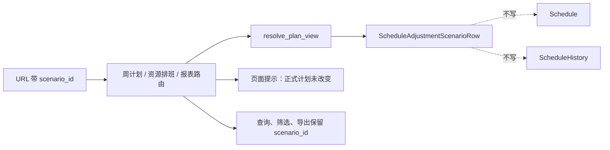

# scenario-preview-secondary-outputs design

## 0. 需求摘要

上一阶段已经能把 Draft 保存成 Scenario，并在只读甘特图里用 `scenario_id` 预览。
本阶段把同一份模拟方案继续接到周计划、资源排班和报表。

用户要得到的结果很简单：

- 从甘特图点到周计划、资源排班或报表时，如果 URL 带着 `scenario_id`，这些页面就看模拟方案。
- 页面上必须明确写清楚“当前正在预览模拟方案，正式计划还没有改变”。
- 查询、筛选、导出链接不能把 `scenario_id` 丢掉。
- `scenario_id` 不存在、状态不对、版本不匹配或方案不匹配时，必须报错，不能悄悄回到正式计划。

明确不做：

- 不把 Scenario 写进 `Schedule` 或 `ScheduleHistory`。
- 不改变正式版本指针。
- 不新增拖动保存入口。
- 不新增模拟方案自动套用到所有页面的默认行为；必须显式带 `scenario_id`。

## 1. 决策

公共查询已经有正路：

```text
SchedulePlanQueryService.resolve_plan_view(version, plan_role, scenario_id)
```

所以三条链路都复用这条正路，不再各自拼 SQL，也不新增页面私有回退规则。

第一版支持：

- 周计划页面预览和导出。
- 资源排班页面、data 接口和导出。
- 报表页面预览。
- 报表导出遇到 `scenario_id` 时明确拒绝，避免把模拟方案 Excel 当作正式文件流转。

## 2. 方案



### 2.1 周计划

- 路由解析 `scenario_id`。
- `GanttService.get_week_plan_rows()` 已支持 `scenario_id`，路由只负责传进去。
- 页面表单、导出 URL、导出失败跳回页面都保留 `scenario_id`。
- 导出日志和文件名标明模拟方案。

### 2.2 资源排班

- `ResourceDispatchService.build_page_context()` 和 `get_dispatch_payload()` 增加 `scenario_id`。
- 解析上下文走 `resolve_schedule_result_view_context(raw_scenario_id=...)`。
- 明细和超期标记都用同一份解析结果，不再按 `role` 重新查一次。
- 页面、data URL、export URL、Excel 摘要和文件名都标明模拟方案。

### 2.3 报表

- `ReportEngine` 增加 `scenario_id` 参数，用同一份 Scenario 行计算超期、利用率和停机重叠。
- 页面表单保留 `scenario_id`，并显示模拟方案提示。
- 导出第一版不支持 `scenario_id`，接口直接给明确错误，不忽略参数。

## 3. 验收契约

- 周计划带 `scenario_id` 时读取 Scenario 行，查询和导出不丢参数。
- 资源排班带 `scenario_id` 时读取 Scenario 行，data/export URL 和 Excel 摘要不丢参数。
- 报表页面带 `scenario_id` 时读取 Scenario 行；报表导出带 `scenario_id` 时明确拒绝。
- 三类页面都显示“当前正在预览模拟方案，正式计划还没有改变”。
- 非法 `scenario_id` 必须报错，不能回退 adopted。
- 不写 `Schedule`、`ScheduleHistory`、`ScheduleVersionSeq` 和 `ScheduleCandidate*`。

## 4. 风险

- 只接页面不接导出链接，会导致用户点导出后拿到正式计划，这是最高风险。
- 超期标记如果继续按正式历史读，会出现排班行来自模拟方案、红色超期标记来自正式版本的错配。
- 报表导出如果不做完整审计和文件名区分，Excel 离开系统后容易被当成正式计划，所以第一版先拒绝。
