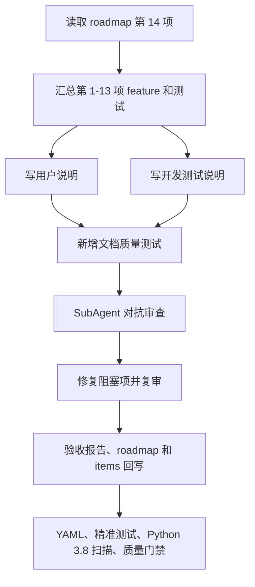

# 0. 术语约定

- 用户说明：给计划员、现场人员和管理人员看的操作说明，只写中文大白话，不出现内部字段名。
- 开发测试说明：给开发和测试看的收口文档，可以写内部字段，但必须标明“仅给开发和测试使用，不给用户看”。
- 回归清单：第 1-13 项已经新增或修改过的测试文件、关键 Python 文件和建议命令。
- 质量门禁证明：YAML、精准测试、Python 3.8 语法扫描、离线静态资源扫描、长门禁的运行结果。

# 1. 决策与约束

## 需求摘要

第 1-13 项已经把方案对比、延期解释、现场反馈、计划现场复盘和重排尊重现场事实落地。第 14 项只做收口：把用户该怎么看、开发该怎么维护、测试该跑哪些、Win7 离线怎么验写清楚，并补测试锁住这些文档边界。

## 明确不做

- 不再改排程、诊断、反馈或发布业务逻辑。
- 不引入外部 CDN、外链字体、外链脚本或外链样式。
- 不升级依赖，不使用 Python 3.8 不支持的语法。
- 不把开发专用字段写进用户说明。

## 关键决策

- 用户说明新增在 `static/docs/aps_three_gap_user_guide.md`，用普通业务话解释三个差距方向和现场闭环。
- 开发测试说明新增在 `docs/dev/aps_three_gap_quality_gate.md`，集中放内部字段、测试清单、关键 Python 文件、质量门禁命令和 Win7 离线验收手册。
- 新增 `tests/regression_aps_three_gap_docs_quality_gate.py`，测试用户说明没有内部字段、开发说明带开发专用标识、回归清单覆盖第 1-13 项。
- `aps-three-gap-docs-quality-gate` 完成后，roadmap 第 14 项和主 roadmap 状态一起回写。

## 复杂度档位

文档和测试收口档位。风险主要在“说明书写错边界”和“测试清单漏掉已完成 feature”，因此必须跑精准测试、YAML、Python 3.8 扫描和质量门禁。

# 2. 名词与编排

## 2.1 名词层

新增两个文档事实源：

- `static/docs/aps_three_gap_user_guide.md`：用户能读，不能出现内部字段。
- `docs/dev/aps_three_gap_quality_gate.md`：开发测试能读，允许内部字段，但必须清楚标记不是给用户看的。

新增一个回归测试：

- `tests/regression_aps_three_gap_docs_quality_gate.py`：只读文档，检查用户说明、开发说明和回归清单。

## 2.2 编排层

## 2.3 挂载点

- 用户说明挂在 `static/docs/`，让离线静态资源测试一起扫描。
- 开发测试说明挂在 `docs/dev/`，和已有开发说明放一起。
- 文档质量测试挂在 `tests/`，并加入本条 test_commands。
- roadmap 和 items.yaml 仍是路线图状态事实源。

## 2.4 推进策略

1. 先建第 14 项 design / checklist。
2. 新增用户说明和开发测试说明。
3. 新增文档质量测试。
4. 跑 item14 精准测试。
5. 组织 SubAgent 对抗审查，修到阻塞项为 0。
6. 写 acceptance，回写 roadmap / items.yaml / checklist。
7. 跑 YAML、精准测试、Python 3.8 扫描、`git diff --check` 和质量门禁。

## 2.5 结构健康度与微重构

结论：不做代码结构重构。

原因：

- 本条是文档和测试收口，不需要改业务分层。
- 新增测试只读文档，不接触 service、repository、route 或 viewmodel 职责边界。

# 3. 验收契约

- 用户说明讲清方案对比、延期解释、现场反馈、计划现场复盘和重排保护，且不出现内部字段名。
- 开发测试说明标明“仅给开发和测试使用，不给用户看”，并能讲清 PlanIdentity、EvidenceLink、执行事件、执行状态、state_revision 和执行快照。
- 开发测试说明明确原 explore 后半旧路线草案已被本 roadmap 覆盖。
- 回归清单列出第 1-13 项新增或修改过的测试文件和关键 Python 文件。
- Win7 x64、Python 3.8、Chrome 109、离线静态资源验收手册存在。
- 新增文档质量测试通过。
- item14 test_commands、YAML 校验、Python 3.8 语法扫描、`git diff --check` 和质量门禁通过。

# 4. 与项目级架构文档的关系

- 本条不改变系统结构。已有 `ARCHITECTURE.md` 和 `ui-gantt.md` 已在第 13 项归并现场事实快照和 scenario 发布边界。
- 本条只把“怎么给用户解释”和“怎么给开发测试验收”落到说明文档与测试清单。
