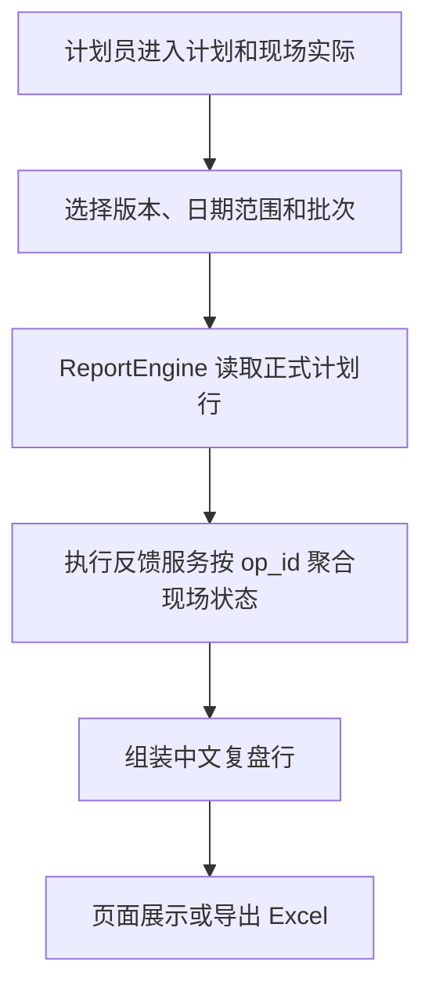

# 计划和现场实际复盘视图设计

## 背景

第 8-11 项已经把现场执行事件、开工完工反馈、暂停继续、报异常和异常字段打通。第 12 项要给计划员一个复盘入口，把正式计划里的计划时间、计划资源，和现场事件聚合出来的实际时间、实际资源放在同一张表里核对。

这项只做报表入口，不改排程算法，不改 `Schedule` 计划行，也不把计划资源冒充成实际资源。

## 目标

- 新增 `/reports/execution-review` 页面，按版本、日期范围和批次筛选正式采用方案。
- 新增 `/reports/execution-review/export` 导出，工作表名固定为“计划和现场实际”。
- 页面和导出展示计划开始、实际开始、开工偏差、计划结束、实际结束、完工偏差、暂停时长、异常原因和资源变化。
- 实际开始、实际结束、暂停时长、实际设备和实际人员全部来自执行事件聚合出的执行状态读模型。
- 没有执行事件时，页面和导出显示“暂无现场反馈”，不报错，不写成现场做慢了。

## 不做

- 不新增 `/scheduler/execution-review` 路由。
- 不支持候选方案、模拟预览或任意方案对比；第一版只复盘正式采用方案。
- 不修改 `Schedule.start_time / end_time / machine_id / operator_id`。
- 不新增执行事件表字段，也不新增物化执行状态表。
- 不做完整重排尊重执行事实；第 13 项单独处理。

## 名词和编排

### 复盘行

现状：报表服务已经能按版本和日期范围读取计划行；执行反馈服务可以按 `op_id` 批量聚合 `OperationExecutionState`。

变化：新增计划和现场实际复盘行。每行以正式计划的 `Schedule` 行为主体，计划字段来自计划行，现场实际字段来自 `OperationExecutionState`。没有执行事件时，现场状态写“暂无现场反馈”，实际时间和实际资源写中文空状态。

### 偏差展示

现状：执行状态里已有实际开始和实际结束，但报表页面还没有把它们和计划时间放在一起。

变化：开工偏差 = 实际开始 - 计划开始，完工偏差 = 实际结束 - 计划结束。没有实际时间时写“暂无现场反馈”；提前、准点、延后都用中文说法展示。

### 页面和导出

现状：报表中心已有 `/reports` Blueprint、报表导航、首页卡片、Excel 导出器和用户手册入口。

变化：复用现有报表路由和导出机制，只新增 `/reports/execution-review` 与 `/reports/execution-review/export`。资源派工页只加一个跳转入口，指向报表页面。

### 主流程

## 验收契约

- 页面能按版本、日期范围、批次筛选。
- 页面只新增 `/reports/execution-review`；导出只新增 `/reports/execution-review/export`。
- 资源派工页只提供跳转入口，不新增调度域复盘路由。
- 明细显示计划开始、实际开始、开工偏差、计划结束、实际结束、完工偏差。
- 明细显示暂停时长、异常原因、严重程度、预计影响时间、影响设备、影响人员、处理状态、是否建议重新排程、计划资源、实际资源和现场反馈状态。
- 实际时间和实际资源必须来自执行事件或执行状态读模型，不能从 `Schedule` 计划字段冒充。
- 没有执行事件时页面和导出都显示“暂无现场反馈”。
- 导出文件名使用中文格式：有日期时“计划和现场实际-正式采用方案-v{version}-{date_from} 至 {date_to}.xlsx”，无日期时“计划和现场实际-正式采用方案-v{version}.xlsx”。
- 导出工作表名固定为“计划和现场实际”，列名使用 roadmap 固定中文列名。
- 页面、导出、按钮、空状态和错误提示都用中文大白话，不显示内部英文枚举、数据库字段名或函数名。
- 新前端资源不走 CDN、外链字体、外链脚本、外链样式；新增 Python 代码保持 Python 3.8 语法。

## 架构归属

- `ReportEngine` 负责报表数据编排和导出编排。
- Excel 导出器只负责把已经整理好的复盘行写入工作簿。
- 执行反馈 service/repository 继续负责现场事件聚合。
- route 负责收参、调用 service 和返回页面或文件。
- 模板只展示 view data，不写业务规则。
