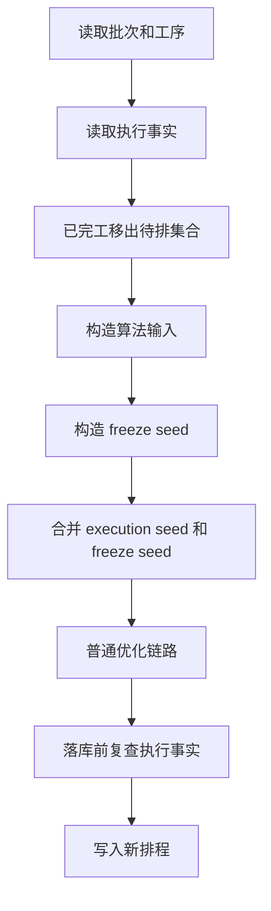

# 重排最小现场护栏设计

## 背景

第 9 项已经让资源派工页能在受控条件下写入开工和完工现场反馈。第 10 项要补上安全空窗：普通重排不能继续把已经开工或已经完工的工序当成普通待排任务随意移动。

本项只做开工、完工后的最小安全护栏，并同批放开普通用户开工/完工按钮。完整执行事实快照、候选比较、多起点、局部搜索、图排程 ready queue、scenario 保存和发布复算留到第 13 项。

## 目标

- 从现场执行事件读模型读取当前工序事实。
- 已完工工序从待排工序集合移除，并用真实完工时间约束后续工序最早开始。
- 生产中工序作为执行事实固定输入，保留实际开工时间、实际设备和实际人员。
- 执行事实 seed 与 freeze window seed 分开命名、分开记录来源；同一工序两边冲突时拒绝本次重排。
- freeze window seed 也必须服从已完工工序的真实完工时间；旧冻结排程和现场事实冲突时拒绝本次重排。
- 普通重排落库前重新检查相关现场事实，现场状态变化或结果冲突时不写 Schedule / ScheduleHistory，已经分配的 ScheduleVersionSeq 也必须回滚。
- 放开最新正式采用方案的普通用户开工/完工 POST 和页面按钮；页面按钮提交时必须填写“反馈人”，不能默认写假用户；候选、历史、模拟预览、非最新正式方案仍拒绝。

## 不做

- 不实现暂停、继续生产、报异常、异常原因、异常影响或异常重排策略。
- 不新增 `execution_snapshot_revision`、`execution_snapshot_op_ids` 或 scenario 执行快照。
- 不改候选比较、多起点、局部搜索、图排程 ready queue、scenario 保存或 scenario 发布。
- 不把 freeze window 当成现场事实，也不把现场事实写进 freeze window 变量。
- 不引入新依赖、外部脚本、外链样式或 Python 3.8 不支持语法。

## 名词和编排

### 执行事实

现状：执行事件通过 `OperationExecutionEventRepo.aggregate_states_by_op_ids()` 聚合为 `OperationExecutionState`，但普通重排没有读取它。

变化：新增 `ExecutionFactProvider.list_by_op_ids(op_ids)`，把状态读模型整理成只读事实。没有事件的工序返回 `not_started`，不会伪造 `schedule_id` 或 `schedule_version`。

### 重排输入

现状：`ScheduleRunInput` 只有 freeze window 的 `frozen_op_ids / seed_results`。这些代表计划冻结，不代表现场已经发生。

变化：`ScheduleRunInput` 增加 `execution_facts / execution_fixed_op_ids / execution_completed_op_ids / execution_seed_results`。普通算法仍接收统一 `seed_results`，但每条 seed 带 `seed_source`，用于区分 `execution_fact` 和 `freeze_window`。

### 主流程

## 验收契约

- 已完工工序不会进入 `algo_ops_to_schedule`，后续工序不能早于真实完工时间；冻结窗口 seed 也不能绕过这条约束。
- 生产中工序不会被算法改掉实际开工时间、设备、人员。
- 同一工序同时有现场事实和 freeze seed 且时间或资源不一致时，返回中文冲突错误，不写新排程。
- 落库前现场状态变了，返回 `6003 / 409`，不写 `Schedule / ScheduleHistory / ScheduleVersionSeq`。
- 执行事实缺少实际设备或实际人员时，直接提示现场反馈记录不完整，不用 `Schedule` 计划资源冒充现场实际资源。
- `simulate=True` 已有开工/完工事实时，只做安全校验，不生成可打开版本，不推进 `ScheduleVersionSeq`；页面不能提示“生成版本”，也不能跳到不存在的甘特版本。
- 普通用户直接 POST 最新正式采用方案的开工/完工可以写入事件，成功响应带刷新后的完整任务卡和新 `state_revision`。
- 资源派工页按钮提交开工/完工时，`created_by` 来自页面必填“反馈人”；未填写时页面直接提示，不发起写入。
- 候选方案、历史正式方案、模拟预览、非最新正式采用方案仍返回 `not_current_official_plan`，不写事件。

## 架构归属

- repository 继续负责 SQL，执行事实读取复用 `OperationExecutionEventRepo`。
- `ExecutionFactProvider` 是 scheduler service 层只读整理器，不写 SQL。
- route 只收参和返回响应；ViewModel 只整理任务卡数据。
- 后续第 13 项会把执行快照扩展到候选、图排程和 scenario，本项只留清楚字段边界。
