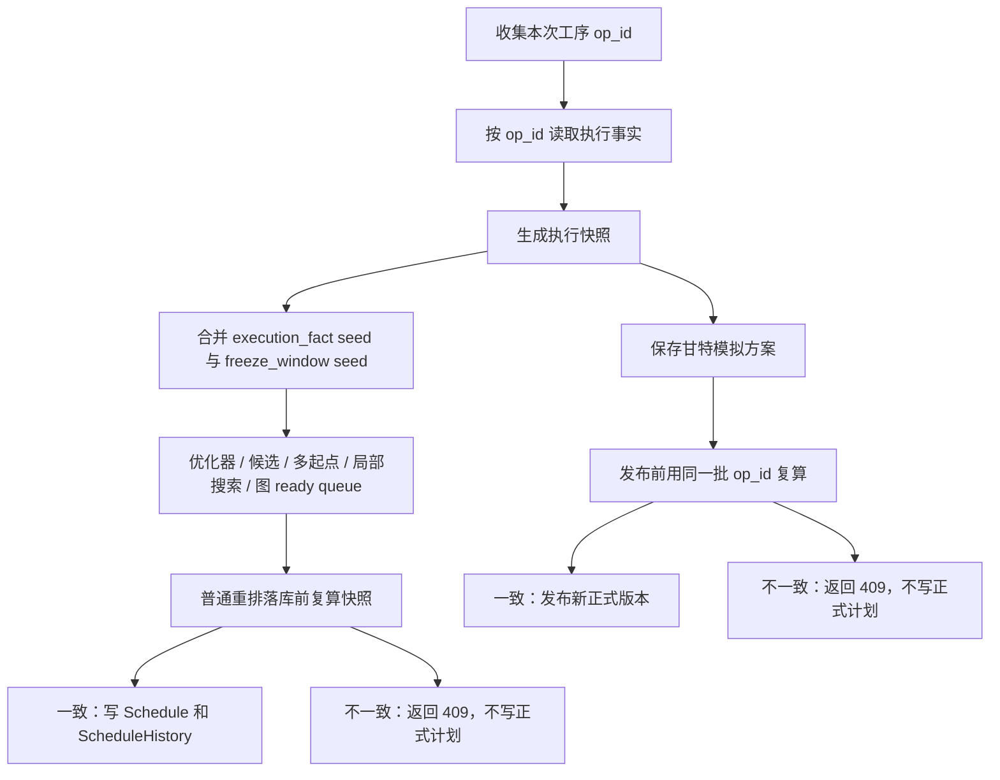

# 0. 术语约定

- 执行事实：按 `op_id` 聚合出来的现场状态，包含未开工、生产中、暂停中、异常中、已完工，以及实际时间、实际资源和状态版本。
- 执行快照：一次重排或一次模拟方案保存时看到的同一批 `op_id` 和每个工序的状态版本，写成 `execution_snapshot_revision`、`execution_snapshot_op_ids`、`execution_snapshot_op_count`。
- 执行固定 seed：现场已经开工、暂停或完工的工序传给算法的固定结果，来源标记是 `execution_fact`，和冻结窗口 `freeze_window` 分开。
- 普通自动重排：`ScheduleService.run_schedule()` 生成新正式版本的链路，不包含甘特模拟方案发布。
- 甘特模拟方案发布：把 `ScheduleAdjustmentScenario` 正式采用为新 `Schedule` 版本的链路。

# 1. 决策与约束

## 需求摘要

第 10 项已经做了开工/完工后的最小护栏，第 11 项已经让暂停和异常可被记录。第 13 项继续收口：所有会产生新排程结果的链路都必须尊重现场已经发生的事，保存时记录基于哪一批现场状态，发布或落库前发现现场状态变了就拒绝写入。

## 明确不做

- 不做异常工序的智能重排；异常中仍先阻止普通自动重排，并提示先处理异常。
- 不把 `scenario_id` 或内部字段给普通用户看；执行快照属于开发和测试追溯信息。
- 不升级依赖，不引入外部资源，不使用 Python 3.8 不支持的语法。
- 不把现场实际资源从 `Schedule` 计划资源里冒充出来。

## 关键决策

- 执行快照覆盖本次涉及的全部计划工序，而不只覆盖已经有事件的工序。这样保存后有人新开工、暂停、报异常或完工，复算快照时都会变。
- 快照版本用稳定 hash 表达，输入是按 `op_id` 排序后的 `op_id=state_revision`。完整 `op_id` 清单也保存，不能只保存 hash。
- 普通重排的 `ScheduleHistory.result_summary` 写执行快照；甘特模拟方案在 `ScheduleAdjustmentScenario` 表保存执行快照。
- scenario publish 使用保存 scenario 时的同一批 `op_id` 复算。状态不一致时返回 `6003 / 409`，不写 `Schedule`、`ScheduleHistory` 或发布状态。

## 复杂度档位

默认业务功能档位，但涉及数据库迁移和跨链路一致性，所以必须补迁移测试、普通重排测试、scenario 发布测试和 SubAgent 对抗复审。

# 2. 名词与编排

## 2.1 名词层

现状：

- `ExecutionFactProvider` 已能按 `op_id` 聚合 `ExecutionFact`，但没有快照对象。
- `ScheduleRunInput` 有 `execution_guard_state_revisions`，但没有 roadmap 要求的 `execution_snapshot_revision` 和 `execution_snapshot_op_ids`。
- `ScheduleAdjustmentScenario` 没有保存执行快照字段。
- `ScheduleResult` 没有保留 seed 来源，执行事实进入算法后追溯会断掉。

变化：

- 新增可复算的执行快照结构：
  - `execution_snapshot_revision`
  - `execution_snapshot_op_ids`
  - `execution_snapshot_op_count`
  - `state_revisions`
- `ScheduleRunInput` 带上执行快照，普通重排摘要写入同一份快照。
- `ScheduleAdjustmentScenario` 表、模型和 repository 保存执行快照。
- `ScheduleResult` 保留 `seed_source` 和 `state_revision`，不改变算法核心排序规则，只补追溯信息。

## 2.2 编排层

现状：

- 普通重排已经在 input collector 里读取执行事实，开工/暂停固定，完工剔除，异常阻止普通重排。
- 候选比较、优化器、多起点、局部搜索和图 ready queue 已经沿用同一份 `schedule_input.seed_results`。
- scenario 保存/发布只重新校验草稿和基准版本，没有执行快照复算。

变化：

- input collector 生成执行快照；普通重排落库前用同一批 `op_id` 复算。
- result summary 增加执行快照追溯字段。
- scenario 保存写快照；publish 前复算，变化则以中文冲突提示拒绝。
- 候选明细锁定来源把 execution fixed/completed 一起算入，避免只有 freeze window 被标锁定。

## 2.3 挂载点

- 普通重排入口：没有执行快照，feature 就不能阻止“排程中现场状态变化后仍写入”。
- 候选/优化/图排程输入：没有执行 seed 来源，feature 就不能证明候选和图排程也尊重现场事实。
- 甘特模拟方案保存/发布：没有 scenario 快照，feature 就不能阻止“保存后现场变化仍发布旧模拟”。
- 数据库迁移：没有 scenario 快照字段，feature 无法在老库和新库上稳定工作。
- 回归测试：没有第 13 项测试，后续改动会轻易破坏这条跨链路约束。

## 2.4 推进策略

1. 建立执行快照名词和普通重排传递链。
2. 补普通重排落库前快照复算和 result summary 追溯。
3. 补 scenario 快照字段、迁移、保存和发布前复算。
4. 补 seed 来源追溯和候选锁定来源。
5. 补第 13 项回归测试和迁移测试。
6. 跑精准测试并进入 SubAgent 对抗复审，直到阻塞项为 0。

## 2.5 结构健康度与微重构

结论：不做独立微重构。

原因：

- 现有职责边界清楚：repository 写 SQL，service 做业务编排，route 只响应请求，viewmodel 不参与本条。
- 新的快照逻辑跨普通重排和 scenario，放独立小模块更直接，不需要先搬动旧函数。
- `schedule_input_collector.py`、`schedule_persistence.py`、scenario service 都偏长，但本次只补明确业务节点，不做行为无关拆文件。

超出范围的观察：

- 甘特调整相关 service 后续可考虑拆出“发布审计摘要构造”和“发布前一致性校验”，但这会改变组织结构，另走 refactor 更稳。

# 3. 验收契约

- 已开工和暂停工序：触发普通重排后，新结果保持实际开始时间、实际设备和实际人员，任务行锁定。
- 已完工工序：触发普通重排后，真实完工时间保留，下游工序不能排到它之前。
- 异常中工序：触发普通重排返回 `6003 / 409`，中文提示先处理异常，不写新计划。
- 执行快照：普通重排生成的新 `ScheduleHistory.result_summary` 包含 revision、op_ids、op_count 和清单摘要。
- 状态变化：普通重排在落库前发现现场状态变化时返回 `6003 / 409`，不写 `Schedule` 或 `ScheduleHistory`。
- scenario 保存：保存模拟方案时记录执行快照字段，不改正式计划。
- scenario 发布：发布前同批 `op_id` 复算；现场状态变化时返回 `6003 / 409`，不写正式计划、不写发布状态。
- 候选、优化、多起点、局部搜索、图 ready queue：使用同一份执行 seed 和固定集合，不能移动现场已经发生的工序。
- 反向核对：simulate=True 只读快照和返回校验结果，不写 `Schedule`、`ScheduleHistory`、`ScheduleVersionSeq` 或 scenario 快照。

# 4. 与项目级架构文档的关系

- 需要更新 `.codestable/architecture/scheduler.md` 或相近 APS 排程架构文档，说明重排执行快照的职责边界。
- 如果当前架构文档没有对应章节，验收阶段补到最贴近的 scheduler / gantt 文档中。
