# 车间暂停继续和异常反馈设计

## 背景

第 8 项已经有执行事件表和状态读模型，第 9/10 项已经开放最新正式方案的开工、完工反馈，并让普通重排尊重开工和完工事实。

第 11 项要把剩下的车间异常反馈补齐：暂停、继续生产、报异常、异常原因、严重程度、预计影响时间、影响设备、影响人员、处理状态和是否建议重新排程。异常中先不做完整算法接入，只在普通自动重排入口挡住，提示计划员先处理异常。

## 目标

- 资源派工任务卡按服务端 `available_actions` 显示“暂停”“继续生产”“报异常”。
- 新增 `pause / resume / report-exception` POST 路由和事件列表 GET 路由，继续复用计划身份、幂等键、状态版本和直接 POST 保护。
- `pause` 和 `report_exception` 必填原因和情况说明；`report_exception` 必填严重程度，可填预计影响时间、影响设备、影响人员、处理状态和是否建议重新排程。
- `exception` 现场状态显示“异常中”，`event_type='exception'` 事件动作返回给前端时显示“报异常”，两套中文映射保持分开。
- 异常中普通自动重排直接返回 409 中文提示，不写 `Schedule / ScheduleHistory / ScheduleVersionSeq`。

## 不做

- 不做异常处理状态后续更新路由。
- 不自动触发重排，不把“建议重新排程”变成实际排程动作。
- 不把设备停机表当作现场异常表。
- 不新增 `execution_snapshot_revision / execution_snapshot_op_ids`，完整执行快照留给第 13 项。
- 不改候选比较、多起点、局部搜索、图排程 ready queue、scenario 保存或 scenario 发布。

## 名词和编排

### 现场反馈动作

现状：`OperationExecutionFeedbackService` 已有 `pause_operation / resume_operation / report_exception` 编排方法，状态机和 repository 也已经预留事件字段；但资源派工 route、viewmodel、JS 只开放开工和完工。

变化：页面和 route 增加暂停、继续生产、报异常入口，并补 `GET /scheduler/resource-dispatch/execution/<op_id>/events` 读取现场反馈记录。route 仍只收参和响应，业务校验继续留在 service。数据库继续写 `event_type='exception'`，返回 JSON 的 `event.action` 统一转成 `report_exception`。

### 异常字段

现状：`OperationExecutionEventRepo.aggregate_states_by_op_ids()` 已经能聚合最近异常字段和中文 label，但成功事件 payload 里异常字段 label 仍为空，前端任务卡也还没有展示最近异常详情。

变化：成功响应、事件列表、任务卡、任务明细、甘特弹窗和资源排班导出都返回中文 label：异常原因、严重程度、预计影响时间、影响设备、影响人员、处理状态、是否建议重新排程。`remark / reason_detail` 都归到用户看到的“情况说明”。页面和导出只展示中文，不展示内部字段名或枚举。

### 普通重排护栏

现状：第 10 项普通重排只保护 `processing / completed`。异常状态已经能被执行事实读模型读到，但普通自动重排没有先拦截 `exception`。

变化：普通排程输入收集阶段发现任一工序处于 `exception`，直接返回 `6003 / 409` 中文提示“请先处理异常”，不进入算法、不分配版本号、不写任何排程表。完整异常算法处理留给第 13 项。

### 主流程

```mermaid
flowchart TD
  A["用户打开资源派工现场反馈"] --> B["服务端返回任务卡和可用动作"]
  B --> C["用户选择暂停/继续生产/报异常"]
  C --> D["route 收参"]
  D --> E["service 校验计划身份、状态版本、状态流转和动作字段"]
  E --> F["repository 追加执行事件"]
  F --> G["重新聚合任务卡"]
  G --> H["页面局部刷新"]
```

## 验收契约

- `processing` 状态允许暂停、完工、报异常；`paused` 状态允许继续生产、完工、报异常；`exception` 状态允许继续生产、完工；`not_started` 不能报异常。
- `pause` 缺少原因或情况说明返回 `1001 / 400`，页面显示“原因”“情况说明”。
- `report-exception` 缺少原因、严重程度或情况说明返回 `1001 / 400`，页面显示“原因”“严重程度”“情况说明”。
- `impact_minutes` 为空时显示“暂时不知道影响多久”，填写时必须是非负整数并显示“预计影响 N 分钟”。
- `affected_machine_id / affected_operator_id` 可空；填写时必须存在，页面、弹窗和导出显示“影响设备 / 影响人员”，没填时显示中文空状态。
- `handling_status` 只记录上报时状态，默认按“刚上报”展示；不提供后续更新动作。
- `suggest_reschedule` 只显示“建议重新排程 / 暂不建议重新排程”，不自动触发重排。
- 成功响应 event 的 `action` 是 `report_exception`，`action_label` 是“报异常”；任务卡当前状态 `exception` 显示“异常中”。
- 事件列表 GET 路由能返回当前查询条件下的现场反馈记录，`event_type='exception'` 读取后同样转成 `action=report_exception` 和 `action_label=报异常`。
- 页面按钮、弹窗、空状态和错误提示只显示中文大白话，不显示 `reason_code / severity / handling_status / event_type / report_exception`。
- 异常中普通自动重排返回 `6003 / 409` 中文提示，不写 `Schedule / ScheduleHistory / ScheduleVersionSeq`。
- 候选方案、模拟预览、历史正式方案、非最新正式方案仍拒绝所有现场反馈 POST。
- 新前端资源不走 CDN、外链字体、外链脚本、外链样式，新增 Python 代码保持 Python 3.8 语法。

## 架构归属

- repository 继续只负责 SQL 和事件聚合。
- service 负责计划身份、状态流转、字段校验、幂等和事件写入。
- route 负责收参和响应，不写业务校验。
- ViewModel 只整理任务卡、动作 label 和成功返回数据，不导入 Flask、service、repository 或错误基础设施。
- 普通重排入口只做“异常中拒绝自动重排”的最小护栏，不把完整异常调度策略塞进本项。
