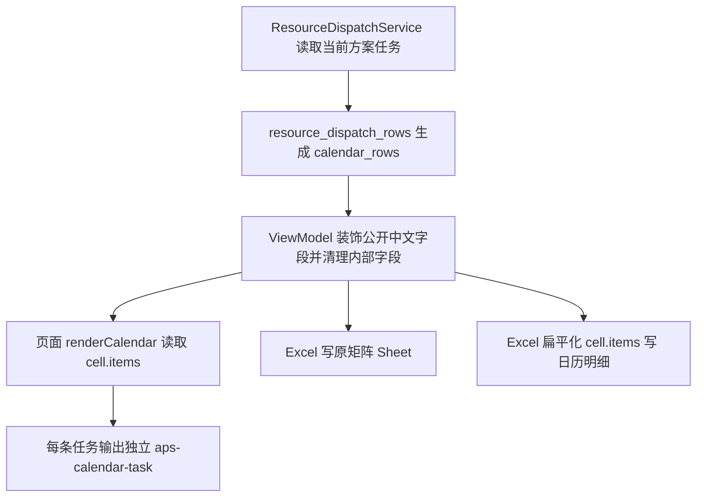

# 资源派工日历矩阵可读化设计

## 0. 术语约定

- 日历矩阵：资源派工页“日历矩阵”标签下的日期横轴、人员/设备纵轴表格；当前由 `static/js/resource_dispatch.js` 的 `renderCalendar()` 动态生成。
- 日历任务块：一个日历格子里每一条任务的独立展示块；它来自已有 `cell.items`，不是从 `cell.text` 拆出来的新数据。
- 日历明细：Excel 新增工作表 `日历明细`；按日历格子的结构化任务逐条展开，一条日历任务一行，方便筛选和查问题。
- 内部字段：`op_id`、`schedule_id`、`_row_identity`、`source_table`、`state_revision`、`execution_snapshot_revision`、`scenario_id`、`candidate_id`、`plan_role` 等只给程序、日志或开发测试使用的字段，不给普通用户在页面和 Excel 里直接看。
- 防冲突结论：代码里已有 `calendar_rows`、`calendar_headers`、`cell.items`、`cell.text`、`日历排班`，本 feature 只新增“日历任务块”和“日历明细”两个用户可见叫法，不改已有含义。

## 1. 决策与约束

### 需求摘要

- 做什么：把资源派工页日历矩阵里的多条任务从连续文字改成一条条独立任务块；每个块里把时间、批次、工序、计划设备、计划人员、图号/物料和超期标记分开显示；Excel 保留矩阵表，再新增 `日历明细`。
- 为谁做：给计划员、调度员和现场管理人员看 30 天甚至更长区间时快速分清“谁/哪台设备在什么时候做哪道任务”。
- 成功标准：页面上同一个日历格子的多条任务能明显分开；横向滚动时左侧查询对象列能固定；超期必须出现中文 `超期`；Excel 里能按一条日历任务一行筛选。
- 明确不做：不做热力图、不做拖拽排程、不做复杂折叠交互、不引入外部资源、不升级依赖、不改 SQL 查询口径、不把内部字段放进普通页面或 Excel。

### 复杂度档位

- 走 APS 小型 UI + 导出增强默认档位，无偏离：不新增数据库，不新增路由，不改变排程算法，只改现有页面展示、Excel 生成和相关测试。

### 关键决策

- D1：页面优先复用已有 `cell.items` 结构化数据，不从 `cell.text` 反向拆字段。原因是 `cell.text` 已经是展示文本，反拆容易把批次、工序、资源拆错。
- D2：不大改后端数据结构，只补 `part_name` 这类已有公开业务字段，让页面和 Excel 能显示“图号 / 物料”。原因是后端已经有每条任务结构，缺的是展示方式。
- D3：超期不用纯红色表达，页面任务块直接显示中文 `超期` badge，Excel 用 `是否超期` 的“是/否”字段。
- D4：单人/单机视角和班组视角都只新增一张 `日历明细`。班组视角用 `日历来源` 区分“班组人员日历”和“班组设备日历”，避免同一张工作簿里多出两张结构类似的新表。
- D5：保留 `日历排班` 矩阵表。矩阵适合看大盘，`日历明细` 适合筛选查错，两者不是互相替代。

### 前置依赖

- 无。当前工作区干净，且已有日历结构化数据，不需要先做重构或补数据库。

### SubAgent 只读探索汇总

- SubAgent A `019e6ecd-95f7-7391-b746-fd3614fe122f`：读取 route / service / repository / viewmodel / 日历生成链路。关键结论是 `cell.items` 已经是一条任务一条结构化记录，可直接复用；普通公开 JSON 不应暴露 `schedule_id/op_id/_row_identity/source_table`。采纳：复用 `cell.items`，不改 SQL，不暴露内部字段。不采纳：无。
- SubAgent B `019e6ecd-fae5-7360-8015-1f3678687ae0`：读取前端、CSS、模板、表格布局。关键结论是最合适改点在 `renderCalendar()`，已有 `.table-sticky-col` 可固定首列，新增任务块应使用专用 class 和深色主题 CSS。采纳：使用 `aps-calendar-task`、`table-sticky-col`、CSS 相邻分隔线。不采纳：不使用 `aps-resource-calendar-task` 命名，因为用户明确举例 `aps-calendar-task`。
- SubAgent C `019e6ecd-fb68-7d22-b7c1-a7a5335b6b02`：读取 Excel 导出链路。关键结论是 `日历排班` 当前是矩阵，新增 `日历明细` 应从 `calendar_rows[*].cells[*].items[*]` 扁平化生成，不应拆 `cell.text`。采纳：新增一张合并 `日历明细`；班组视角用 `日历来源` 区分轴。不采纳：不把来源、锁定状态、最近异常放进第一版日历明细，因为当前日历 item 证据不足，任务明细已经覆盖这些字段。
- SubAgent D `019e6ecd-fbca-7b00-bf93-a0c4661fbe35`：读取测试和 CodeStable 规范。关键结论是要补页面静态合同、固定左列合同、超期中文标记合同、Excel workbook 合同，并保留阶段产物。采纳：补 `regression_table_layout_readability_contract.py`、`regression_resource_dispatch_public_output_contract.py` 和冒烟测试。不采纳：不把这次“任务块”解释成现场反馈任务卡，因为用户上下文明确指日历矩阵格子里的任务块。

## 2. 名词与编排

### 2.1 名词层

#### 日历 item

- 现状：`core/services/scheduler/resource_dispatch_rows.py` 的 `_append_calendar_segments()` 已经给每条日历任务生成 `start/end/time_label/text/batch_id/op_code/seq/part_no/machine/operator/supplier/is_overdue`；`web/viewmodels/scheduler_resource_dispatch.py` 的 `_decorate_calendar_item()` 再补对应资源中文展示字段并重算 `text`。
- 变化：补 `part_name` 作为公开业务字段；页面任务块和 Excel 明细都继续只读取白名单字段，不把整行 `normalized` 直接塞给前端或 Excel。
- 示例：
  - 输入：一个 `cell.items[0]` 有 `time_label=08:00-10:00`、`batch_id=B001`、`op_code=OP10`、`part_no=P001`、`part_name=回转壳体`、`is_overdue=True`。
  - 输出：页面显示独立 `aps-calendar-task`，包含 `08:00-10:00`、`超期`、`批次：B001`、`工序：OP10`、`图号 / 物料：P001 回转壳体`。
  - 来源：`core/services/scheduler/resource_dispatch_rows.py::_append_calendar_segments`、`static/js/resource_dispatch.js::renderCalendar`。

#### 日历任务块

- 现状：`renderCalendar()` 已经遍历 `cell.items`，但每条任务只输出一个普通 `
`，主要展示 `item.text`，超期靠红色内联样式。
- 变化：每条任务输出独立 class `aps-calendar-task`；字段分行显示；超期使用 `badge("超期", "error")` 和 `aps-calendar-task--overdue` class。
- 示例：
  - 输入：同一天同一人员有两条 `cell.items`。
  - 输出：同一 `<td>` 内出现两个 `aps-calendar-task`，第二个任务不会和第一个任务连成一坨；两个任务之间由 CSS 分隔线隔开。
  - 来源：`static/js/resource_dispatch.js::renderCalendar`。

#### 日历明细 Sheet

- 现状：`core/services/scheduler/resource_dispatch_excel.py` 只有矩阵 Sheet，单人/单机叫 `日历排班`，班组叫 `班组人员日历` / `班组设备日历`，单元格写 `cell.text`。
- 变化：新增 `日历明细` Sheet，一行来自一个 `cell.items` 任务；字段为中文表头：`日历来源`、`查询对象`、`日期`、`时间`、`批次`、`工序`、`图号 / 物料`、`计划设备`、`计划人员`、`对应资源`、`是否超期`、`任务说明`。
- 示例：
  - 输入：`calendar_rows[0].cells[0].items` 有 2 条任务。
  - 输出：`日历排班` 仍是一行资源 + 日期矩阵；`日历明细` 增加 2 行，可按日期、查询对象、是否超期筛选。
  - 来源：`core/services/scheduler/resource_dispatch_excel.py::build_resource_dispatch_workbook`。

### 2.2 编排层

- 现状：route 负责收参和响应；service 负责解析查询、读取计划、生成资源派工 payload；viewmodel 负责整理公开中文字段；前端负责渲染；Excel 负责把装饰后的 payload 写成工作簿。
- 变化：不改变 route/service/repository 编排；在既有 payload 之后，页面渲染和 Excel 导出分别消费 `cell.items`，把已有结构化数据展示清楚。
- 流程级约束：
  - 错误语义不变：无历史仍由导出 route 返回现有错误；坏时间行仍走现有降级摘要。
  - 顺序不变：日历 item 仍由 `_calendar_cells()` 按开始时间、批次、工序排序。
  - 脱敏不变：普通资源派工 data 和 Excel 不显示内部字段。
  - 前端兼容 Chrome 109：只用普通 DOM 字符串拼接和 CSS，不用新语法、新依赖或外部资源。
  - Excel 兼容现有 openpyxl 写法：继续使用现有 `_write_table()`、`_sanitize_export_cell()`、自动列宽和冻结首行。

### 2.3 挂载点清单

- 资源派工日历矩阵 UI：`static/js/resource_dispatch.js::renderCalendar` — 修改已有 UI 注入点，新增 `aps-calendar-task` 任务块结构。
- 资源派工样式合同：`static/css/ui_contract.css` — 新增日历任务块、日历表格、深色主题和固定左列配套样式。
- 资源派工 Excel 导出：`core/services/scheduler/resource_dispatch_excel.py::build_resource_dispatch_workbook` — 新增 `日历明细` Sheet，保留原矩阵 Sheet。
- 用户帮助入口：`web/viewmodels/page_manuals_scheduler_outputs.py` — 更新导出内容说明，让页面帮助和 Excel 实际内容一致。

### 2.4 推进策略

1. 产物骨架：落 design 和 checklist。
   退出信号：feature 目录包含 design/checklist，checklist 通过 YAML 校验。
2. 前端结构：把日历格子从连续文本改成任务块，并接入固定左列。
   退出信号：静态合同能看到 `aps-calendar-task`、`table-sticky-col`、超期中文标记和横向滚动合同。
3. Excel 明细：新增 `日历明细` Sheet，从结构化 `cell.items` 扁平化写入。
   退出信号：workbook 测试确认原矩阵仍在、新 Sheet 表头中文、一条日历任务一行、不暴露内部字段。
4. 数据公开字段：补齐图号/物料展示需要的公开字段。
   退出信号：viewmodel 测试确认 `part_name` 不破坏旧 `cell.text` 合同，内部字段仍被清理。
5. 文档和测试收口：更新帮助说明和相关冒烟/合同测试。
   退出信号：相关 pytest、静态合同、Python 3.8 语法扫描通过。
6. 浏览器验收和 acceptance：打开用户当前 URL，检查页面可读性、固定左列和深色主题基础表现；若当前数据没有超期任务，超期中文标记用回归测试夹具验收，落验收报告。
   退出信号：验收报告完成，checklist checks 全部通过。

### 2.5 结构健康度与微重构

##### 评估

- 文件级 — `static/js/resource_dispatch.js`：1252 行，确实偏长；本次只改 `renderCalendar()` 附近，不新增跨页面逻辑，不拆文件，避免把 UI 改动扩大成前端重构。
- 文件级 — `static/css/ui_contract.css`：5575 行，已经是全局 UI 合同集合；本次新增样式与资源派工现有样式相邻，属于已有职责延伸。
- 文件级 — `core/services/scheduler/resource_dispatch_excel.py`：338 行，职责单一，专门负责资源派工工作簿，新增 Sheet 写入仍在当前职责内。
- 目录级 — `core/services/scheduler/`：已有多个 `resource_dispatch_*` 文件，资源派工已拆出 rows / support / excel / range 等文件，本次不新增 Python 文件，不加剧目录摊平。
- compound convention 检索：`python .codestable/tools/search-yaml.py --dir .codestable/compound --filter doc_type=decision --filter category=convention --query "目录组织 OR 命名 OR 归属"` 无命中。

##### 结论：不做

本 feature 不做微重构。`resource_dispatch.js` 和 `ui_contract.css` 偏长是存量问题，但本次改动能局部完成；拆前端文件会牵涉脚本加载顺序和模板加载合同，超过“日历矩阵可读化”的范围。

##### 超出范围的观察

- `static/js/resource_dispatch.js` 后续可以按“详情表 / 现场反馈 / 日历矩阵 / 甘特图”拆文件，但这需要单独走 `cs-refactor`，本 feature 不处理。

## 3. 验收契约

### 关键场景清单

- S1：页面加载包含多个 `cell.items` 的日历格子 → 每条任务都有独立 `aps-calendar-task`，任务之间有可识别分隔，不再是一坨连续文字。
- S2：页面加载超期任务 → 任务块里直接显示中文 `超期`，不是只靠颜色。
- S3：横向滚动 30 天日历矩阵 → 查询对象首列具备固定列 class，滚动时能保持识别当前行对象。
- S4：日历任务有批次、工序、设备、人员、图号/物料 → 页面按字段分行显示，不把编号和名称挤在一句里让用户猜。
- S5：导出单人/单机资源派工 Excel → 仍有 `日历排班`，并新增 `日历明细`；`日历明细` 一条日历任务一行。
- S6：导出班组资源派工 Excel → 仍有 `班组人员日历` 和 `班组设备日历`，并新增合并 `日历明细`，用 `日历来源` 区分人员轴和设备轴。
- S7：导出空日历数据 → `日历明细` 只有中文表头，不报错。
- S8：页面和 Excel 输出 → 不出现 `op_id`、`schedule_id`、`_row_identity`、`source_table`、`state_revision`、`execution_snapshot_revision` 等内部字段名。
- S9：护眼模式 / 深色主题 → 任务块背景、边框、文字和超期标记有深色主题规则，不出现刺眼白底。

### 明确不做的反向核对项

- 不出现拖拽排程实现，不新增拖拽事件监听或保存排程接口调用。
- 不新增热力图 class、颜色比例尺或统计聚合。
- 不新增外部 CDN、字体、脚本、样式链接。
- 不修改 repository SQL 查询。
- 普通页面和 Excel 表头不出现内部字段名。

## 4. 与项目级架构文档的关系

- 需要更新 `.codestable/architecture/ARCHITECTURE.md`：补一句资源派工导出现在同时提供矩阵和日历明细，且继续遵守内部字段不外显。
- 需要更新 `.codestable/architecture/ui-gantt.md`：资源排班在 Scenario 预览下页面和导出继续复用同一计划身份；本次新增 `日历明细` 也必须按同一套 decorated payload 输出，不显示内部编号。
- requirement 回写：验收阶段已 backfill `resource-dispatch-calendar-readable-output`，记录“看清资源派工和日历明细”这个已落地能力。
