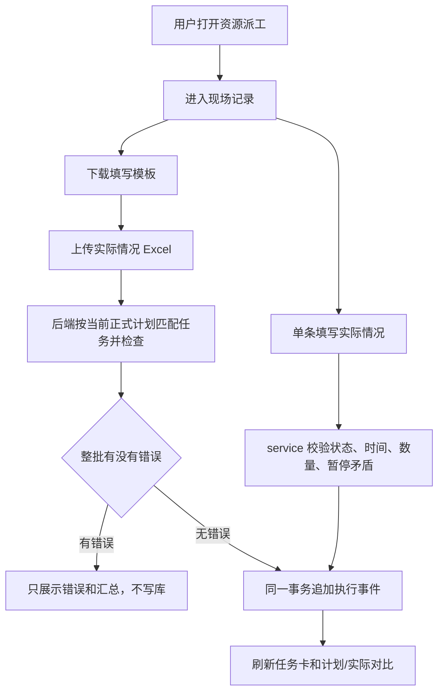

# 资源派工现场记录设计

## 0. 术语约定

- 现场记录：资源派工页里记录现场实际开工、实际完工、暂停时间和异常记录的用户入口。grep 现有代码里主要叫“现场反馈”，本 feature 将页面大字面改成“现场记录”，后端仍沿用 execution feedback/service 作为内部能力名。
- 填写实际情况：单条任务的人工填写入口，允许用户自己填实际发生时间，不再只取浏览器当前时间。
- 导入实际情况 Excel：批量上传 Excel 后，后端先完整检查整份文件；有错就返回错误明细并且一条都不写，整批无错误才直接写入。和现有“资源排班导出”不同，它写入的是 `OperationExecutionEvents`，不改 `Schedule` 计划行。
- 暂停时间：用户填写一段暂停开始和暂停结束，或暂停开始加暂停时长，系统拆成暂停事件和继续生产事件。页面不再把“暂停生产 / 继续生产”做成醒目的实时按钮。
- 异常记录：用户填写异常发生时间、异常原因、严重程度和异常说明，仍使用现有 exception 事件。

## 1. 决策与约束

### 需求摘要

- 为计划员 / 调度员提供更贴近现实的现场实际填写方式：单条填写实际开工、实际完工、暂停时间、异常记录，并提供 Excel 批量导入。
- 成功标准：用户在资源派工页看到“现场记录”“填写实际情况”“导入实际情况 Excel”“下载填写模板”“暂停时间”“异常记录”等大白话；开工/完工可手填时间；暂停按时间段填写；反馈人可空；Excel 一键导入前会先检查整份文件，有错误时不写库并展示错误明细。
- 明确不做：不接 MES / DNC，不做实时设备采集，不控制设备暂停/继续，不自动重排，不静默覆盖历史事件，不把 `op_id / schedule_id / state_revision / execution_snapshot_revision` 等内部字段放进普通模板或页面。
- 普通页面不展示“这些记录来自人工填写或 Excel 导入，不代表设备自动采集”这类提示。

### 复杂度档位

走本地 APS 默认档位：单机 Flask + SQLite + openpyxl、本地静态资源、Python 3.8、Chrome 109。偏离点只有 Excel 导入：普通页面采用“一键导入”，后端先检查整份文件，整批无错误才进入事务写入，要么全写，要么全不写。

### 关键决策

- 复用 `OperationExecutionEvents`，不新建 MES 表。原因：现有执行事件已经能表达开工、完工、暂停、继续和异常，重排护栏也读这条链路。
- 暂停时间第一版拆成 `pause` + `resume` 两条事件。原因：当前状态读模型已经按暂停和继续计算暂停时长；这样不改数据库结构，也能保留只追加原则。
- 单条“填写实际情况”按当前任务状态选择要写哪些事件，不做纠错覆盖。已有开工记录时不再写第二条开工；已有完工记录时不再写第二条完工。需要改错另走后续纠错 feature。
- Excel 模板用“任务识别码”作为用户可见匹配码。它由当前正式计划导出生成，普通用户不用填写内部字段；后端在导入检查阶段用它反查当前查询结果里的任务。
- 普通页面第一版采用一键导入。任何找不到任务、时间格式错误、完工早于开工、暂停时间矛盾、暂停重叠、重复导入风险都会阻止写入；通过后直接事务写入，不再要求用户额外点一次确认。
- 反馈人可以为空。后端写库时空反馈人保存为“未填写反馈人”，避免打破数据库 `created_by NOT NULL` 约束，同时页面和接口不强迫用户填写。

### 前置依赖

无。

## 2. 名词与编排

### 2.1 名词层

#### 现状

- `ExecutionFeedbackContext` 要求 `created_by` 必填；`OperationExecutionFeedbackService` 负责计划身份、状态版本、状态流转、时间顺序和写事件。
- `ResourceDispatchExecutionService.get_execution_context()` 返回当前查询范围的任务卡，任务卡包含 `schedule_id / op_id / state_revision` 等提交用内部值。
- `web/viewmodels/scheduler_resource_dispatch_execution.py` 把执行状态整理成任务卡和按钮。
- `static/js/resource_dispatch.js` 现在有“开工 / 暂停 / 继续生产 / 完工 / 报异常”按钮，提交时间默认当前时间，反馈人必填。
- `core/services/scheduler/resource_dispatch_excel.py` 只负责导出资源排班查看用 Excel。

#### 变化

- 新增“现场记录导入行”和值对象：表达模板行、检查结果行、检查汇总和写入统计，放在 scheduler service 层，不暴露给页面内部字段。
- `OperationExecutionFeedbackService` 支持空反馈人，空值统一落为“未填写反馈人”；新增组合填写方法，按一张任务卡和用户填写内容追加开工、完工、暂停时间、异常记录。
- 新增资源派工实际情况模板工作簿：Sheet `任务反馈` 和 `暂停明细`，列名只用用户看得懂的业务字段。
- 新增 Excel 一键导入接口：输入上传文件 + 当前查询参数，先输出同一套行级检查；有错返回 400 和错误明细、不写库；无错直接写入事件。
- 保留 Excel 预览 / 确认接口作为兼容入口：预览不写库，确认会重新校验并在整批无错误时写入事件；普通页面不再把它们作为主流程。
- ViewModel 输出更偏记录口径的 action：`fill_actual`、`view_records`；不再把 pause/resume 作为主按钮。内部 action 仍保留原 start/finish/pause/resume/report_exception 的 label，用于事件列表和兼容测试。

#### 接口示例

```json
// 来源：web/routes/domains/scheduler/scheduler_resource_dispatch.py
POST /scheduler/resource-dispatch/execution/10/actual
{
  "schedule_id": 100,
  "batch_id": "B1",
  "version": 2,
  "requested_plan_role": "adopted",
  "effective_plan_role": "adopted",
  "source_table": "schedule",
  "expected_state_revision": "10:0:0",
  "actual_start_time": "2026-05-01 08:10:00",
  "actual_finish_time": "2026-05-01 09:00:00",
  "quantity_done": 10,
  "quantity_scrapped": 0,
  "feedback_person": "",
  "remark": "白班补填"
}
```

返回：成功时返回最新事件、当前状态、刷新后的任务卡；失败时返回中文错误和字段中文名。

```json
// 来源：web/routes/domains/scheduler/scheduler_resource_dispatch.py
POST /scheduler/resource-dispatch/execution/import
{
  "file": "现场实际情况.xlsx"
}
```

返回：整份 Excel 无错误时直接写入并返回新增/忽略汇总；有错误时返回 400、行级错误和汇总，并且不写 `OperationExecutionEvents`。

### 2.2 编排层



#### 现状

- 单条按钮直接对应单个 action，除完工/暂停/异常少量内联表单外，开工取当前时间，暂停和继续生产表现为实时动作。
- route 负责把 JSON 转成 `ExecutionFeedbackContext` 后调用 service 的 `start_operation / finish_operation / pause_operation / resume_operation / report_exception`。
- service 一次只写一个事件，并依赖 `expected_state_revision` 阻止旧页面重复写。

#### 变化

- 页面主按钮改为“填写实际情况”和“查看记录”；填写表单里放实际开工、实际完工、完成数量、报废数量、暂停时间、异常记录、反馈人、备注。
- “暂停时间”提交时后端校验暂停开始、暂停结束、暂停时长：结束和时长都填时必须一致；同一批待写暂停段不能重叠；已有事件中已经记录过的暂停段判为可能重复。
- Excel 一键导入先按当前查询的正式计划任务生成任务识别码索引；`任务反馈` 负责开工、完工、数量、异常；`暂停明细` 负责多个暂停段。
- 一键导入复用同一套检查校验，并在一个事务中逐任务按时间顺序写事件；任何一条失败都会回滚整批。预览 / 确认接口保留为兼容入口，但普通页面不再要求用户先预览再确认。

#### 流程级约束

- 错误语义：普通页面一键导入时，检查错误返回 400 + 行级错误，不写库；兼容预览接口仍返回 200 + 行级错误。
- 幂等性：单条填写继续使用 idempotency_key；Excel 导入按导入 token、任务识别码、动作和时间生成稳定 key，重复导入时复用已有相同事件或报告可能重复。
- 顺序约束：同一任务内事件按实际发生时间升序写入。完工不能早于开工；暂停必须落在开工之后、完工之前或同一批填写范围内可判断的位置。
- 只追加约束：不更新、不删除旧执行事件；发现已有实际开工/完工时跳过或报可能重复，不覆盖。

### 2.3 挂载点清单

- 资源派工页面入口：`templates/scheduler/resource_dispatch.html` — 修改页签和按钮文案，新增模板下载、一键导入 UI 和导入结果展示。
- 资源派工前端脚本：`static/js/resource_dispatch.js` — 修改现场记录卡片、填写表单、Excel 一键导入交互。
- 资源派工路由：`web/routes/domains/scheduler/scheduler_resource_dispatch_execution_routes.py` — 新增 `/actual`、模板下载、一键导入、预览、确认导入 route。
- 请求服务注册：`web/bootstrap/request_services.py` — 挂载新增的现场记录导入 service。
- service 层公开入口：新增 scheduler service 文件 — 负责模板、检查和写入编排。

### 2.4 推进策略

1. 编排骨架：新增 service、route 和 ViewModel 输出，先让“现场记录 / 填写实际情况 / 下载模板 / 导入实际情况 Excel”接口形状跑通。
   退出信号：新接口能返回中文检查结果和模板，旧 execution data 仍可用。
2. 单条填写：让后端支持空反馈人、手填开工/完工/异常/暂停时间段，并把页面主按钮改为填写实际情况。
   退出信号：路由测试覆盖空反馈人、手填时间、完工早于开工、暂停结束/时长矛盾。
3. Excel 模板和导入检查：生成不含内部字段的模板，上传后先检查匹配、时间、重复和冲突，有错不写库。
   退出信号：测试证明错误导入前后事件数不变，模板没有内部列。
4. Excel 一键写入：整批无错误才事务写入，普通页面不再要求用户先预览再确认。
   退出信号：测试覆盖成功整批写入、错误整批拒绝、非最新正式方案拒绝。
5. 前端文案和状态：替换普通页面文案，隐藏实时暂停/继续主按钮，保留查看记录。
   退出信号：静态测试锁住页面不出现抽象术语和“不代表设备自动采集”提示。
6. 回归与浏览器验收：跑相关 route/service/excel/public contract 测试，做 Python 3.8 扫描，浏览器打开用户当前 URL 检查页面。
   退出信号：自动化和浏览器证据都通过。

### 2.5 结构健康度与微重构

##### 评估

- 文件级 — `static/js/resource_dispatch.js`：约 1353 行，资源排班明细、日历、甘特、现场反馈都在一个文件，本次会改 3 处以上；已偏胖。但拆 JS 会涉及模板脚本顺序和浏览器兼容，本 feature 先不做结构拆分。
- 文件级 — `web/routes/domains/scheduler/scheduler_resource_dispatch.py`：约 424 行，页面、data、execution、export 混在一起，本次会新增 route；仍在可控范围，但后续值得拆 execution routes。
- 文件级 — `core/services/scheduler/operation_execution_feedback_service.py`：约 501 行，当前承担单事件校验和写入，本次只补组合调用需要的窄入口，不把 Excel 解析塞进去。
- 目录级 — `core/services/scheduler/`：文件多但已有按功能拆分的命名习惯；新增 `resource_dispatch_actual_import_service.py` 属于资源派工现场记录编排，和现有命名一致。

##### 结论：做微重构（拆文件）

实现中新增的现场记录 service 已经同时承担模板生成、Excel 读取、预览校验和写入编排，单文件会超过 500 行；route 文件也会因为新增现场记录接口继续膨胀。为避免一开始就把新能力堆进大文件，本 feature 内先做两处“只搬不改业务口径”的小拆分：

- 后端 service 拆成现场记录主 service、Excel 模板/读取、预览计划/校验三块。主 service 只负责对外入口、正式方案写入权限、任务识别和事务写入。
- route 拆出资源派工现场记录/执行记录接口模块。资源派工主页、data、export 仍留在原 route 文件。

不在本 feature 拆 `static/js/resource_dispatch.js`。原因是这个文件本来已经同时承担明细、日历、甘特和现场记录交互，拆前端需要额外梳理脚本加载顺序和共享状态，属于独立重构题。当前只收窄现场记录相关逻辑，不继续扩大旧实时按钮逻辑。

## 3. 验收契约

- 打开资源派工页 → 普通页面能看到“现场记录 / 填写实际情况 / 导入实际情况 Excel / 下载填写模板 / 查看计划和实际”，不出现“执行事实补录 / 执行事件 / 事件底座 / 生产事实 / 事实台账 / 执行状态读模型”。
- 打开资源派工页 → 普通页面不出现“这些记录来自人工填写或 Excel 导入，不代表设备自动采集”。
- 单条填写时反馈人为空 → 后端允许写入，事件 `created_by` 有内部兜底值，页面不强制用户填写。
- 单条填写实际开工时间 → 写入的实际开工等于用户填的时间，不取当前浏览器时间。
- 单条填写实际完工时间早于实际开工时间 → 返回中文错误，不写完工事件。
- 单条填写异常记录 → 能填写异常时间、异常原因、严重程度、异常说明，事件列表显示“异常记录/报异常”的中文信息。
- 单条填写暂停开始 + 暂停结束 → 写入暂停和继续生产事件，状态读模型暂停时长正确。
- 单条填写暂停开始 + 暂停时长 → 自动计算暂停结束并写入暂停和继续生产事件。
- 暂停结束和暂停时长同时填写但不一致 → 返回中文错误，不静默吞掉矛盾。
- 同一任务内暂停时间段重叠 → 预览或提交返回中文冲突，不写入。
- 下载填写模板 → workbook 只含用户能理解的列，不含 `op_id / schedule_id / state_revision / execution_snapshot_revision`。
- Excel 一键导入 → 后端先检查整份文件；有错误时不写数据库，并展示匹配成功、找不到任务、时间格式错、完工早于开工、暂停重叠、可能重复导入和新增/忽略/冲突/错误汇总。
- Excel 一键导入 → 第一版整批无错误才写入；有任意错误时整批拒绝。
- 候选方案、模拟预览、历史正式方案、非最新正式方案 → 仍不能写现场记录或导入实际情况。
- 旧的执行事件只追加原则不被破坏：本 feature 不更新、不删除 `OperationExecutionEvents` 旧行。
- 新增 Python 代码通过 Python 3.8 语法扫描。

明确不做的反向核对项：

- 代码和页面不新增 MES/DNC 采集入口、设备控制调用或自动重排触发。
- 用户可见模板、普通页面、普通接口不暴露内部字段列名。
- 不静默覆盖旧开工、完工或异常事件。

## 4. 与项目级架构文档的关系

- `.codestable/architecture/ARCHITECTURE.md` 第 7 节需要在 acceptance 阶段更新：现场反馈入口口径从偏实时动作改为现场记录 / 实际情况填写与导入；执行事件表仍是只追加事实源。
- `shop-floor-execution-feedback` requirement 需要更新变更日志：说明反馈人可空、实际时间可手填、Excel 一键导入成为主流程之一，暂停/继续页面口径改成暂停时间。
