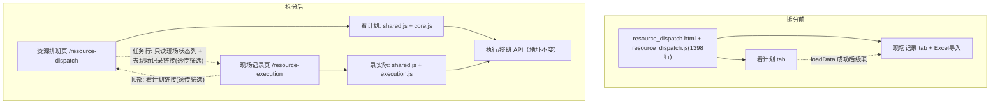

# 资源排班执行类功能独立设计

> ⚠️ **历史草案，不可执行。**
>
> 本文仍保留第一版"拆独立现场记录页"方案的完整推理，方便追溯当时为什么这么想；但后续多轮对抗评审已经确认：这个方案把"开发者减负"和"用户体验改动"绑在了一起，证据不足且范围过大。
>
> 当前执行方向已经重定向为：**只做前端 JS 按子域拆分，不拆页面、不新增 URL、不新增导航、不摘除排班页现场记录 UI**。正确入口见 `.codestable/refactors/2026-05-29-resource-dispatch-js-split/`。
>
> 同目录旧 checklist 已移入 `resource-dispatch-execution-page-extraction-checklist.superseded.yaml` 备查；标准名 `resource-dispatch-execution-page-extraction-checklist.yaml` 只保留禁止执行的占位清单。

> 本 feature 的方向由一次多角度论证（6 个 subagent + 主代理代码层仲裁）拍板：
> **先拆代码、再拆入口、不动 API**。核心结论是区分两种心智负担——
> 开发者负担（1398 行单文件 JS）和用户负担（看计划与录实际混在一页），用不同手段分别治理。

## 0. 术语约定

| 术语 | 定义 | 防冲突结论 |
|---|---|---|
| 资源排班页 | 现有 `scheduler.resource_dispatch_page`（`/scheduler/resource-dispatch`），承载查询/汇总/明细/日历/甘特/现场记录 6 块功能的超级页面 | 既有概念，沿用 |
| 现场记录页 | 本 feature 新增的独立页面 `scheduler.resource_execution_page`（`/scheduler/resource-execution`），只承载"填写/导入实际情况"。面向车间录入角色，砍掉版本/方案选择器 | grep `resource[_-]execution` 全仓零命中，slug/endpoint/URL 均可用 |
| 执行类功能 | 指现场记录任务卡、单条填写实际情况、实际情况 Excel 导入（含模板下载/预览/确认）这一组**写入** `OperationExecutionEvents` 的能力 | 沿用 `shop-floor-execution-feedback` req 口径 |
| 看计划功能 | 排班查询、汇总卡片、任务明细、日历矩阵、甘特图+班组表这一组**只读** `Schedule` 的能力 | 新归类词，仅本文档内使用 |
| 执行 API | 后端 `/scheduler/resource-dispatch/execution/*` 与 `…/actual*` 这一组路由（注册在 `scheduler_resource_dispatch_execution_routes.py`） | 既有路由，本 feature **不改其 URL/endpoint 名** |
| `window.RD` 命名空间 | 前端 JS 拆分后用于跨文件通信的全局对象（原生 JS，无模块系统，Win7/Chrome109 兼容） | 全新引入，grep 无冲突 |

## 1. 决策与约束

### 需求摘要

- **做什么**：把"执行类功能"从资源排班超级页面里抽出来，让它既不再拖累排班页的代码维护，也给车间录入者一个更简单的专用入口。
- **为谁**：
  - 开发者（改现场记录时不必在 1398 行单文件里翻找、不必担心碰坏看计划逻辑）；
  - 车间录入角色（进页面即录入，不需要理解"版本/方案/计划身份"这些计划员概念）。
- **成功标准**（可验证）：
  1. 拆分后 `static/js/resource_dispatch.js` 单文件不再同时承载看计划与执行两类逻辑（执行逻辑迁出到独立 JS）；
  2. 访问 `/scheduler/resource-execution?...` 返回 200，能加载任务卡、单条填写、Excel 导入，且这些操作命中的后端 endpoint 与拆分前**完全一致**；
  3. 排班页 `/scheduler/resource-dispatch` 的 URL 不变；摘除现场记录 UI 后，任务明细仍保留**只读**现场状态列，并提供"去现场记录"跳转（带当前筛选参数）；
  4. 现场记录页与排班页可双向跳转并透传筛选参数，用户无需重新输入查询条件。
- **明确不做**：
  - 不改任何执行 API 的 URL 路径与 endpoint 名（`scheduler.resource_dispatch_execution_data` 等保持不变）；
  - 不改 `OperationExecutionEvents` 表结构、不改写入语义、不动 `operation_execution_feedback_service` / `resource_dispatch_execution_service` 的对外签名；
  - 不引入前端模块系统（ES module / 打包器 / npm），不引入跨 tab 状态同步机制（localStorage 轮询 / postMessage）；
  - 不新建 Blueprint（新页面挂在现有 `scheduler.bp` 下）；
  - 不做现场记录页的"无查询条件全量列出所有任务"——仍按筛选范围加载（沿用既有 `get_execution_context` 行为）；
  - 第 3 步（甘特图内嵌改跳转）为**可选**，是否纳入本 feature 由 review 决定，默认仅做第 1、2 步。

### 复杂度档位

走本地 APS 默认档位（单机 Flask + SQLite + 原生 JS + Jinja，Python 3.8、Chrome 109）。唯一偏离信号是"前端纯结构拆分需保证 Win7 浏览器兼容"——因此明确约束：拆出的 JS 不使用 `import/export` 模块语法，沿用现有 IIFE + `window.RD` 全局命名空间写法（与 `gantt_*.js` 系列同款）。

### 关键决策

1. **拆前端代码 vs 直接拆页面——先拆代码**。
   换另一种做法（直接建独立页面、不先拆 JS）会怎样：执行逻辑仍与看计划逻辑纠缠在同一文件，新页面要么复制整份 JS、要么 import 一个仍然 1398 行的巨石，开发者负担一点没减。先把 JS 按子域切成 core / execution / calendar_gantt 三块，是后续两个页面各取所需的前提。
2. **新页面只换"入口"，不换"后端"**。
   换另一种做法（给执行功能新建一套 `/resource-execution/execution/*` 路由）会怎样：15 个测试里绑定 URL 的合约测试全部重写、书签失效、服务层要重新接线。本 feature 让新页面通过既有 `_execution_data_url / _actual_template_url / _actual_import_url` helper 指向**同一批 endpoint**，破坏面降到最小。这是"不动 API"能成立的技术底座。
3. **用 URL 参数透传 + 双向跳转，而非拆成孤岛**。
   这是对"反方警告"（拆开会切断用户连贯动作）的正面回应。排班页任务行保留只读现场状态列 + "去现场记录"链接（带 `version/scope_type/operator_id/start_date…`）；现场记录页顶部有"看计划"链接跳回。用户的"看排班→录实际"动作不被切断，只是从"同页切 tab"变成"带上下文跳页"。
4. **现场记录页砍掉版本/方案选择器**。
   写操作的 `version/schedule_id/scenario_id` 本就从任务卡 payload 带入（已验证），不依赖页面顶部的方案选择器；且 schema 硬约束已锁死只能写 adopted 正式计划。因此录入页只需暴露"日期 + 人/设备/班组"筛选，版本由后端按既有逻辑解析 latest adopted。
5. **被拒方案：在同页内做 tab 懒加载**。
   反方提的"最轻方案"。被拒原因：它只解决开发者负担的一半（仍是单文件），且不解决"录入角色被迫理解计划员概念"的用户负担。但它的内核（拆 JS 文件、保留只读状态列）已被本方案吸收。

### 前置依赖

无。（结构健康度评估见 2.5，微重构作为第 1 步内置。）

## 2. 名词与编排

### 2.1 名词层

#### 现状

- **页面入口**：`scheduler.resource_dispatch_page`（`web/routes/domains/scheduler/scheduler_resource_dispatch.py`）渲染 `templates/scheduler/resource_dispatch.html`，同时输出看计划与执行两类数据所需的 `data-*` URL。
- **执行 API**：`scheduler_resource_dispatch_execution_routes.py` 已是独立路由文件，注册 10 个 endpoint（`execution/data`、`execution/<op_id>/events`、`execution/<op_id>/actual`、`start/finish/pause/resume/report_exception`、`actual_template`、`actual_import_preview`、`actual_import`、`actual_import_confirm`）。**本 feature 不动它。**
- **URL helper（共享内核）**：`scheduler_resource_dispatch_query.py` 提供 `_request_kwargs()`（解析筛选条件）、`_url_with_query(endpoint, query)`、`_query_from_filters()`，以及 `_data_url / _execution_data_url / _actual_template_url / _actual_import_url / _export_url / _page_url` 一组 URL 生成函数。endpoint 名与 URL 路径解耦。
- **前端**：`static/js/resource_dispatch.js`（1398 行，单 IIFE）混装工具函数、看计划渲染（detail/calendar/gantt）、执行交互（execution*/actual*）、单例 `state`（`state.data` 看计划、`state.execution` 执行）。
- **数据**：`OperationExecutionEvents` 表按 `op_id` 聚合、只追加，schema 硬约束 `source_table='schedule'` / `effective_plan_role='adopted'` / `scenario_id IS NULL`——执行域在数据层即与排班版本解耦。

#### 变化

- **新增页面 endpoint** `scheduler.resource_execution_page`（GET `/scheduler/resource-execution`）：复用 `_request_kwargs()` 解析筛选、复用 `_execution_data_url / _actual_template_url / _actual_import_url` 生成 `data-*`，渲染新模板 `templates/scheduler/resource_execution.html`。不暴露版本/方案选择器。
- **新增 URL helper** `_execution_page_url(query=None)`（指向 `scheduler.resource_execution_page`）与 `_dispatch_page_url`（若不存在则补），供两页互跳。
- **新增前端文件**（由 2.5 微重构产出，本节登记其职责边界）：
  - `resource_dispatch_shared.js`：工具函数 + `window.RD` 命名空间（`$/text/trim/escapeHtml/show/badge/parseJson/resourceInfo/resourceDisplayHtml/namedResourceInfo/resourceInfoHtml` 等约 297 行的公共部分）；
  - `resource_dispatch_core.js`：看计划逻辑（查询、tab、汇总、detail/calendar/gantt 渲染、`state.data`、`loadData`）；
  - `resource_execution.js`：执行交互（execution*/actual* 函数、`state.execution`、`loadExecutionData`、`submitActualImport`）。
- **改名/迁移**：`resource_dispatch.js` 拆解后不再是单巨石；排班页引入 shared + core，现场记录页引入 shared + execution。
- **保留**：执行 API 路由、`operation_execution_feedback_service`、`resource_dispatch_execution_service`、ViewModel `scheduler_resource_dispatch_execution.py` 的对外签名一律不变。

#### 接口示例

```text
# 新增页面路由（来源：拟新增 web/routes/domains/scheduler/scheduler_resource_execution.py）
GET /scheduler/resource-execution?scope_type=operator&operator_id=OP01&start_date=2026-05-01&end_date=2026-05-07
→ 200，渲染现场记录页；页面根元素 #rePage 携带：
    data-execution-url   = /scheduler/resource-dispatch/execution/data?...     （指向既有 endpoint）
    data-actual-template-url = /scheduler/resource-dispatch/execution/actual-template?...
    data-actual-import-url   = /scheduler/resource-dispatch/execution/import?...
  无 version/scenario_id 选择控件；筛选无结果时显示空态文案。
```

```text
# 录入操作命中的后端 endpoint（不变，来源：既有 scheduler_resource_dispatch_execution_routes.py）
GET  /scheduler/resource-dispatch/execution/data            → 任务卡列表（读，用 _request_kwargs 的筛选）
POST /scheduler/resource-dispatch/execution/<op_id>/actual  → 单条填写（写，version 等来自 payload）
POST /scheduler/resource-dispatch/execution/import          → Excel 一键导入（写）
```

```js
// 新增前端跨文件通信约定（来源：拟新增 resource_dispatch_shared.js）
window.RD = window.RD || {};
window.RD.util = { escapeHtml, badge, resourceDisplayHtml, /* … */ };
// core 与 execution 各自从 window.RD.util 取公共函数，不再各持一份副本
```

### 2.2 编排层



#### 现状

- 控制流拓扑：单页 + tab 切换。`loadData()`（看计划）成功回调里**级联调用** `loadExecutionData()`（执行）；两者共享单例 `state`，失败路径互相干扰（主数据失败会 `renderExecutionCards(null)`）。
- Excel 导入成功后同时触发 `loadExecutionData()` + `loadData()` 刷新两份数据（因主表"现场状态"列依赖执行结果）。
- 后端 `resource_dispatch_service.get_dispatch_payload()` 内部调 `_enrich_rows_with_execution_state(rows)`，把现场状态注入排班行——这是看计划与执行在**后端**的耦合点。

#### 变化

- 拓扑升级为"双页 + 参数透传"。`resource_dispatch.js` 拆分后：
  - 排班页只保留 `loadData()` 链路，**移除** `loadData→loadExecutionData` 的级联调用；
  - 现场记录页 `resource_execution.js` 独立 `loadExecutionData()`，自带筛选表单与 `state.execution`。
- **保留** `_enrich_rows_with_execution_state`：排班页任务明细继续显示**只读**现场状态列（用户能一眼看到哪些工序已开工/异常），但"去修改"改为跳转到现场记录页，而非同页 tab。这是后端唯一不动、前端只读消费的耦合点——保留它正是为了不切断"看计划时能看到执行状态"的价值。
- Excel 导入成功后的"双刷新"在拆分后退化为现场记录页内的单刷新（`loadExecutionData()`）；排班页的现场状态列在用户下次进入/刷新排班页时由 `_enrich_rows_with_execution_state` 自然带出，无需跨页实时同步。

#### 流程级约束

- **错误语义**：新页面路由复用既有 service 的中文错误与字段中文名；页面加载失败显示空态/错误条，不再连带清空另一类数据（因已分页）。
- **API 不变性约束**（本 feature 核心硬约束）：执行类操作命中的 endpoint 名与 URL 路径，拆分前后逐字一致——可用既有 API 层测试（`regression_operation_execution_feedback_routes.py` 等）反向锁定：这些测试**不需修改**即应继续通过。
- **只读消费约束**：排班页对现场状态只读不写；写入入口唯一存在于现场记录页。
- **回滚顺序约束**：摘除排班页现场记录 UI（唯一的"删除型"改动）必须放在最后阶段；之前阶段只新增文件，任何一步可通过删除新文件 + 还原注册器一行回滚。
- **可观测点**：拆分后浏览器 Network 面板中，两页发出的执行相关请求 URL 应与拆分前一致（人工验收点）。

### 2.3 挂载点清单

- 页面路由注册：`web/routes/domains/scheduler/scheduler_route_registrar.py` 的 `_ROUTE_MODULES` 元组 — 新增 `"scheduler_resource_execution"` 一行。
- 新页面 endpoint：`web/routes/domains/scheduler/scheduler_resource_execution.py` 的 `scheduler.resource_execution_page` — 新增。
- 排产主导航：`templates/components/ui_macros.html` 的 `scheduler_nav` 宏 — 新增"现场记录"链接，`active` 枚举新增 `resource_execution`。
- 页面手册注册：`web/viewmodels/page_manuals_registry.py` — 新增 `scheduler.resource_execution_page` 的手册条目映射。
- 排班页跳转入口：`templates/scheduler/resource_dispatch.html` — 任务行/操作区新增"去现场记录"链接（删掉它则双向跳转能力消失）。

> 注：拆 JS / 拆模板 include / 移除排班页执行 tab，属于内部代码改动（implement 改动计划），不列为挂载点。

### 2.4 推进策略

```
1. 微重构（只搬不改行为）：把 resource_dispatch.js 拆成 shared/core/execution 三文件，模板用 include 切片
   退出信号：排班页 URL/UI/行为零变化；全部既有测试通过；行为相关 diff 为零（仅文件拆分与 import 顺序）
2. 静态结构：新增 scheduler_resource_execution.py 路由 + resource_execution.html（含筛选表单 + #rePage data-*）
   退出信号：访问 /scheduler/resource-execution 返回 200，看到筛选表单与占位区；test_sp05 路由拓扑测试更新后通过
3. 交互接入：现场记录页引入 shared.js + execution.js，接通任务卡/单条填写/Excel 导入
   退出信号：录入操作命中的 endpoint 与拆分前一致；API 层测试无需改仍通过；手工录入闭环成功
4. 双向跳转：排班页任务行加"去现场记录"链接（透传筛选），现场记录页加"看计划"链接
   退出信号：两页互跳且筛选参数透传，URL 携带 version/scope_type/日期等
5. 摘除排班页执行 UI（唯一删除型改动，放最后）：移除 resource_dispatch.html 现场记录 tab 与 resource_dispatch.js 执行逻辑，保留只读现场状态列
   退出信号：排班页只剩"看计划"内容 + 只读状态列 + 跳转入口；前端合约测试更新后通过
6. 回归与浏览器验收：跑 scheduler/dispatch/execution 相关测试 + Python 3.8 扫描 + 浏览器双页验收
   退出信号：自动化与浏览器证据均通过
```

### 2.5 结构健康度与微重构

> compound convention 检索：`search-yaml.py --dir .codestable/compound --filter category=convention --query "目录组织 OR 命名 OR 归属 OR 路由 OR 前端"` → 无匹配。无既有约定可直接套用，本节自行评估。

##### 评估

- 文件级 — `static/js/resource_dispatch.js`：**1398 行**，单文件混装工具函数 + detail/calendar/gantt 渲染 + execution/actual 交互，3 个以上不相关概念混写；近 3 个月改动 22 次（5 月内 18 次），是开发者心智负担的主体。**显著偏胖。**
- 文件级 — `templates/scheduler/resource_dispatch.html`：约 25KB / 428 行，查询表单 + 6 块功能区 + 多个 panel 混在一个模板；偏胖但结构清晰，适合 include 切片。
- 文件级 — `web/routes/domains/scheduler/scheduler_resource_dispatch.py`：约 424 行，页面/data/export 混装；本次仅在其中加跳转链接相关的少量传参，不达需拆阈值，暂不动。
- 目录级 — `web/routes/domains/scheduler/`：已有多个 `scheduler_*` 文件、命名按功能分组（query/execution_routes/week_plan 等），新增 `scheduler_resource_execution.py` 延续既有命名习惯，不加剧摊平。
- 目录级 — `static/js/`：已有 `gantt_*.js` 系列同款"一功能一文件 + 全局命名空间"模式，新增 shared/core/execution 三文件与之一致。

##### 结论：微重构（拆文件）

第 1 步固定为"只搬不改行为"的前端拆分，作为后续两页取用的前提，且必须独立验证退出后再进主体步骤。

##### 方案

- **搬什么**：
  - 从 `resource_dispatch.js` 把第 1–297 行的工具函数与公共渲染辅助搬到 `resource_dispatch_shared.js`，挂到 `window.RD.util`；
  - 把 `execution*` / `actual*` 系列函数 + `EXECUTION_*` 常量 + `state.execution` 相关搬到 `resource_execution.js`；
  - 看计划逻辑（detail/calendar/gantt/summary + `state.data` + `loadData`）留在（或重命名为）`resource_dispatch_core.js`；
  - `resource_dispatch.html` 的查询表单、汇总卡、各 panel 用 `` 切成子模板（参考 `config.html`/`batches.html` 既有 include 模式）。
- **搬到哪**：均在 `static/js/` 与 `templates/scheduler/` 同目录内，命名沿用 `resource_dispatch_*` / `_resource_dispatch_*.html` 前缀。
- **行为不变怎么验证**：第 1 步完成后排班页 URL/UI/交互零变化；全部既有测试（含前端合约测试）在**未修改测试**的前提下通过；diff 仅为文件拆分、`<script>` 引入顺序、import 路径，无任何函数签名/返回结构/调用语义变化。
- **步骤序列（provable refactor）**：
  1. 抽 `resource_dispatch_shared.js`（工具函数）+ 在模板按 shared→core→execution 顺序引入三个 `<script defer>`，确认页面行为不变；
  2. 把 execution/actual 代码块搬入 `resource_execution.js`（此时排班页仍引入它，保持同页行为），确认不变；
  3. 模板 include 切片，确认渲染不变；
  4. 跑全套既有测试，全绿即第 1 步退出。
  > 注：第 1 步结束时排班页仍是"看计划 + 执行"同页（只是代码分了文件）；真正"摘除执行 tab"在第 5 步做，届时排班页只引入 shared+core。

##### 建议沉淀的 convention（可选）

- 是否稳定模式：**是**——"前端按子域拆分为 `<域>_shared.js` + `<域>_<子功能>.js`，通过 `window.<域>` 全局命名空间通信，不引入模块系统"在本仓库（Win7/原生 JS 约束下）对未来其他超级页面拆分同样适用。
- 规则一句话：原生 JS 页面的大文件按"公共内核 + 子功能"拆分，用页面级全局命名空间通信，禁用 ES module/打包器。
- 适用范围：本仓库 `static/js/` 全部。
  → 建议第 1 步跑通后走 `cs-decide` 归档为 `category: convention`。

##### 超出范围的观察（仅提示，不阻塞）

- `web/routes/domains/scheduler/scheduler_resource_dispatch.py`（424 行，页面/data/export 混装）与 `core/services/scheduler/resource_dispatch_service.py` 的 `_enrich_rows_with_execution_state` 跨域注入——若日后想让看计划与执行在后端也彻底解耦（改为前端两次请求合并），涉及改 `get_dispatch_payload` 返回结构与调用语义，超出"只搬不改行为"，建议后续走 `cs-refactor`，本 feature 不动。
- 第 3 步"排班页内嵌甘特图改跳转到 `gantt.html`"消除重复，但涉及删除内嵌渲染、改变用户操作路径，按需求决定是否纳入；若纳入应作为独立阶段，不与执行拆分混做。

## 3. 验收契约

### 关键场景清单

- 访问 `/scheduler/resource-execution?scope_type=operator&operator_id=...&start_date=...&end_date=...` → 返回 200，渲染现场记录页，显示任务卡区与筛选表单，页面不出现 version/scenario_id 选择控件。
- 在现场记录页单条填写实际开工/完工 → 命中 `POST /scheduler/resource-dispatch/execution/<op_id>/actual`（URL 与拆分前逐字一致），写入成功并刷新任务卡。
- 在现场记录页执行 Excel 一键导入 → 命中 `POST /scheduler/resource-dispatch/execution/import`（URL 不变），整批无错才写库、有错返回 400 + 错误明细，行为与拆分前一致。
- 现场记录页筛选无结果 → 显示空态文案，不报错、不白屏。
- 排班页 `/scheduler/resource-dispatch` → URL 不变；任务明细仍显示**只读**现场状态列与最近异常摘要；提供"去现场记录"链接且 href 携带当前 `version/scope_type/operator_id/start_date/end_date` 等筛选参数。
- 排班页摘除执行 UI 后 → 页面不再出现"填写实际情况""导入实际情况 Excel""下载填写模板"等写入控件，也不再出现 `data-actual-import-url`（这些迁至现场记录页）。
- 现场记录页顶部"看计划"链接 → href 跳回 `/scheduler/resource-dispatch` 并透传筛选参数。
- 排产主导航 → 出现"现场记录"入口，点击落到 `/scheduler/resource-execution` 并高亮该项（`active=resource_execution`）。
- 第 1 步微重构完成时 → 排班页 URL/UI/交互与拆分前一致；全部既有测试在**未修改**前提下通过（行为不变证据）。
- API 层测试 `regression_operation_execution_feedback_routes.py` / `regression_resource_dispatch_actual_import.py` → 全程**不需修改**即通过（API 不变性证据）。
- 新增 Python 代码通过 Python 3.8 语法扫描。

### 明确不做的反向核对项

- 代码中不应出现新的 `/resource-execution/execution/*` 或 `/resource-execution/actual*` 路由——执行操作必须仍命中 `/scheduler/resource-dispatch/execution/*`（可 grep `@bp` 路由装饰器与测试断言核对）。
- 不应出现 `import`/`export` ES module 语法或新增打包配置（grep `static/js/` 新增文件）。
- 不应新增 `localStorage` 轮询 / `postMessage` 等跨页状态同步代码。
- 不应修改 `OperationExecutionEvents` schema 或 `operation_execution_feedback_service` / `resource_dispatch_execution_service` 的对外方法签名（git diff 核对）。
- 现场记录页不应渲染 version/scenario_id 选择控件（前端合约测试反向核对）。

## 4. 与项目级架构文档的关系

- **名词** → `OperationExecutionEvents` 仍是只追加事实源（无变化，不需再归并）；**新增系统级可见入口** `scheduler.resource_execution_page` 应在 acceptance 阶段补入 `.codestable/architecture/ARCHITECTURE.md` 的页面/路由清单与"结构与交互"节：现场记录从"资源排班页内 tab"提升为独立页面入口。
- **动词骨架** → "看计划（读）与录实际（写）分页、执行 API 地址不变、两页参数透传互跳"属于跨 feature 稳定的编排约束，建议补入 architecture 的模块交互描述。
- **流程级约束** → "执行写入入口唯一存在于现场记录页、排班页只读消费现场状态、执行 API URL 不变性"建议作为已知约束登记。
- 关联已有架构 doc：与 `shop-floor-execution-feedback` requirement（需在变更日志补"现场记录提升为独立页面入口"）、`aps-three-gap-directions` roadmap（兑现"车间反馈入口/异常反馈独立拆分"意图）关联。
- 架构总入口需新增描述（非贴链接）：在页面导航/模块图中体现"资源排班（看计划）"与"现场记录（录实际）"两个并列入口。
