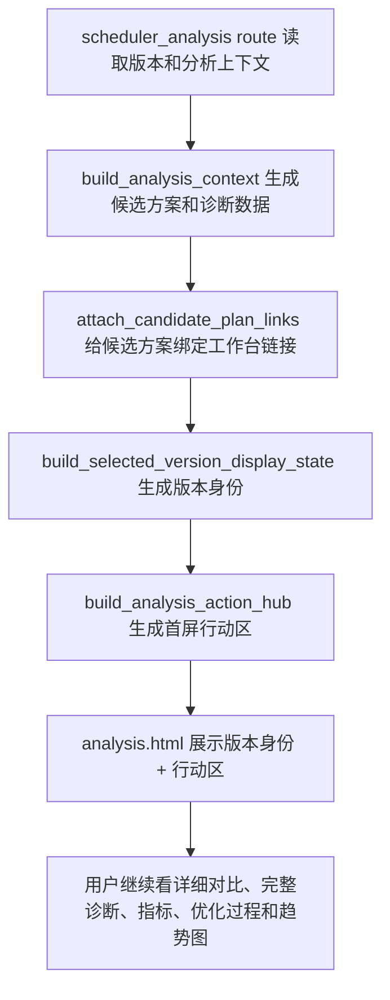

# analysis-action-hub-layout design

## 0. 术语约定

- 分析行动区：排产分析页选中版本后的首屏主区域。它要先回答“推荐怎么看、风险在哪里、下一步点哪里”，再让用户往下看详细表格和技术过程。
- 推荐结论：复用已有候选方案推荐卡，不在本阶段重新计算推荐规则。
- 代表方案摘要：复用已有正式方案、原算法代表方案、重点工序优先方案三类摘要。
- 诊断行动：从现有诊断区里提炼“事实 / 线索 / 证据不足”和可继续查看的入口，帮助用户先处理最关键的风险。
- 技术过程：优化轨迹、趋势图、详细对比表和完整诊断区。本阶段保留这些内容，但放到首屏行动区之后。

## 1. 决策与约束

### 需求摘要

- 选中排产版本后，页面先显示版本身份、推荐结论、主要风险和下一步按钮。
- 没有候选方案时，首屏要显示清楚的中文空状态，不能只留一个空表格。
- 推荐方案卡继续复用已有超期、拖期、工期、换型等指标；新增影响面如果当前算不出来，只显示“数据不足 / 暂时不能判断”。
- 诊断区继续区分已确认事实、可能线索和证据不足，不能把线索说成唯一根因。
- 跳甘特、资源派工、超期清单的入口必须复用 `WorkbenchLink` 结构，保留版本、方案、日期范围和目标页需要的参数。
- 页面不显示 `plan_role`、`scenario_id`、`source_table`、`candidate_id`、`op_id`、`schedule_id` 等内部字段。
- 页面不引入外部资源，不使用破坏 Chrome 109、Python 3.8 或 Win7 离线场景的写法。

### 明确不做

- 不改排程算法，不改 `core/algorithms/`。
- 不改数据库结构，不改 `schema.sql`。
- 不新增外部前端框架、CDN、字体或脚本。
- 不重算候选方案推荐，不改变正式采用方案、代表方案和重点工序优先方案的生成规则。
- 不把全部候选明细提前到首屏；首屏只放推荐、摘要和行动入口，详细对比表继续放在后面。
- 不在本阶段补全甘特任务详情、资源派工执行分层、报表回跳和延期事实桥接；这些属于后续 roadmap 条目。
- 不承诺自动判断唯一根因；证据不足时必须说“暂时不能判断”。
- 不让候选方案或模拟预览出现现场记录写入入口。

### 复杂度档位

走现有 Flask + Jinja + 本地 CSS + 后端 ViewModel 的轻量页面层级调整档位。模板只展示 ViewModel 给好的字段，不在模板里临时猜业务规则。

### 关键决策

- 新增 `web/viewmodels/scheduler_analysis_action_hub.py`，把已有候选方案展示数据和诊断数据整理成首屏行动区合同。
- 行动区 ViewModel 在路由中生成，并且放在候选方案链接完成绑定之后生成。原因是首屏按钮必须复用已经带好上下文的 `WorkbenchLink`。
- 新增 `templates/scheduler/analysis_parts/_action_hub.html`。它只负责展示行动区，不直接访问内部字段。
- `templates/scheduler/analysis.html` 调整选中版本后的展示顺序：版本身份、行动区、告警/空状态、详细方案对比、完整诊断区、指标、优化过程、趋势图。
- `_candidate_comparison.html` 保留完整详细对比表，但推荐卡如果已经在行动区展示，就不重复抢首屏。
- 样式继续写入 `static/css/ui_contract.css`，只补本地类名，不引入外链。

## 2. 名词与编排

### 2.1 名词层

#### 现状

- `templates/scheduler/analysis_parts/_candidate_comparison.html` 已有推荐方案卡、三方案摘要、方案对比表和候选方案下一步链接。
- `templates/scheduler/analysis_parts/_diagnostic_sections.html` 已有诊断分区，能表达事实、线索和证据不足。
- `web/routes/domains/scheduler/scheduler_analysis.py` 已在候选方案展示数据上绑定跨页链接。
- `web/viewmodels/scheduler_analysis_vm.py` 已统一生成分析页上下文。

#### 变化

新增 `AnalysisActionHub` 普通 dict，字段以展示安全为准：

```text
{
  title: str,
  subtitle: str,
  recommendation_card: dict,
  summary_cards: List[dict],
  diagnostic_cards: List[dict],
  next_links: List[WorkbenchLink],
  empty_state: str,
  notice: str,
  has_recommendation: bool,
  has_candidate_summary: bool,
  has_diagnostics: bool
}
```

约束：

- `recommendation_card`、`summary_cards` 只复用已有公开展示字段。
- `diagnostic_cards` 只从已有诊断区提炼标题、状态、说明和公开链接。
- `next_links` 只使用已经生成好的 `WorkbenchLink` 字典。
- 没有数据时给中文说明，不显示 `0` 或内部空值。

### 2.2 编排层



#### 流程级约束

- 行动区只在选中版本后展示。
- 首屏顺序必须让用户先看到“这是什么版本、系统推荐什么、主要风险是什么、下一步去哪看”。
- 跳转入口禁用时，显示中文禁用原因，不渲染假链接。
- 行动区最多展示 3 张代表方案摘要，避免首屏被表格撑长。
- 诊断行动优先展示延期风险、影响解释、数据缺口等用户能继续处理的信息。
- 算不出资源影响、批次影响或延期原因时显示“暂时不能判断 / 数据不足”，不能硬编数字。

### 2.3 挂载点清单

- 分析行动区 ViewModel：`web/viewmodels/scheduler_analysis_action_hub.py` — 新增。
- 分析页路由：`web/routes/domains/scheduler/scheduler_analysis.py` — 在候选方案链接绑定后注入 `analysis_action_hub`。
- 分析页主模板：`templates/scheduler/analysis.html` — 调整 include 顺序并引入行动区。
- 行动区局部模板：`templates/scheduler/analysis_parts/_action_hub.html` — 新增。
- 详细对比局部模板：`templates/scheduler/analysis_parts/_candidate_comparison.html` — 避免首屏推荐卡重复展示。
- 样式：`static/css/ui_contract.css` — 补行动区、摘要卡、诊断行动和按钮布局样式。
- 新增布局回归：`tests/regression_scheduler_analysis_workbench_layout.py` — 锁住首屏顺序、空状态、链接和内部字段不外露。
- 既有合同测试：`tests/regression_scheduler_candidate_plain_language.py`、`tests/regression_scheduler_candidate_analysis_contract.py` — 保持通过。

### 2.4 推进策略

1. 设计与清单落盘。
   退出信号：feature 文档、checklist 和 roadmap item YAML 可解析。
2. 行动区 ViewModel。
   退出信号：纯函数能从已有候选方案和诊断数据生成推荐、摘要、诊断行动、下一步入口和中文空状态。
3. 路由和模板接线。
   退出信号：分析页选中版本后展示版本身份、行动区、详细对比和完整诊断，行动区按钮保留上下文。
4. 样式和首屏层级。
   退出信号：行动区在宽屏和窄屏下不压坏按钮，不引入外链资源。
5. 回归测试。
   退出信号：本阶段指定 pytest 通过。

### 2.5 结构健康度与微重构

##### 评估

- 文件级 — `templates/scheduler/analysis.html`：当前只做 include 编排，适合调整顺序。
- 文件级 — `_candidate_comparison.html`：已有推荐卡和大表格，本阶段不适合把它整体搬到首屏；新增行动区局部模板更清楚。
- 文件级 — `web/viewmodels/scheduler_analysis_vm.py`：已经负责完整分析上下文，若继续塞行动区细节会变重。
- 目录级 — `web/viewmodels/`：已有 `scheduler_analysis_candidates.py`、`scheduler_analysis_candidate_helpers.py` 和多个页面 ViewModel，新增行动区 helper 符合现有归属。

##### 结论：做一处必要拆分

新增 `web/viewmodels/scheduler_analysis_action_hub.py` 是必要拆分。它只把已有展示数据重新组织成首屏行动区，不新增算法，不新增持久化，也不改变候选方案推荐规则。

## 3. 验收契约

### 关键场景清单

- 选中有候选方案对比的版本后，页面顺序为版本身份、行动区、告警/空状态、详细方案对比、完整诊断、指标和技术过程。
- 行动区展示推荐结论、最多 3 张代表方案摘要、诊断行动和下一步入口。
- 没有候选方案时，行动区展示中文空状态，并保留能继续查看诊断或历史信息的入口。
- 推荐卡继续展示已有超期、拖期、工期、换型等公开指标。
- 诊断行动继续区分事实、线索和证据不足；证据不足时显示“数据不足 / 暂时不能判断”。
- 跳甘特、资源派工、超期清单的链接保留版本、方案、日期范围和目标页需要的参数。
- 页面可见文本不出现内部字段名和内部英文枚举。
- 页面不引入外部前端资源。
- 新增 Python 代码保持 Python 3.8 写法。

### 明确不做的反向核对项

- 不改算法。
- 不改数据库。
- 不开放候选方案写现场记录。
- 不把完整候选表格挤到首屏。
- 不实现后续甘特详情、资源派工分层、报表回跳和延期事实桥接。

## 4. 与项目级架构文档的关系

- 验收阶段更新 `.codestable/architecture/ARCHITECTURE.md`：记录排产分析页新增首屏行动区，由 `web/viewmodels/scheduler_analysis_action_hub.py` 生成，模板只展示公开字段。
- 验收阶段更新 `candidate-comparison-business-view` requirement：说明分析页已经能把推荐结论、代表方案摘要和下一步入口提前到首屏；如果仍有后续候选对比范围，则保留对应边界。
