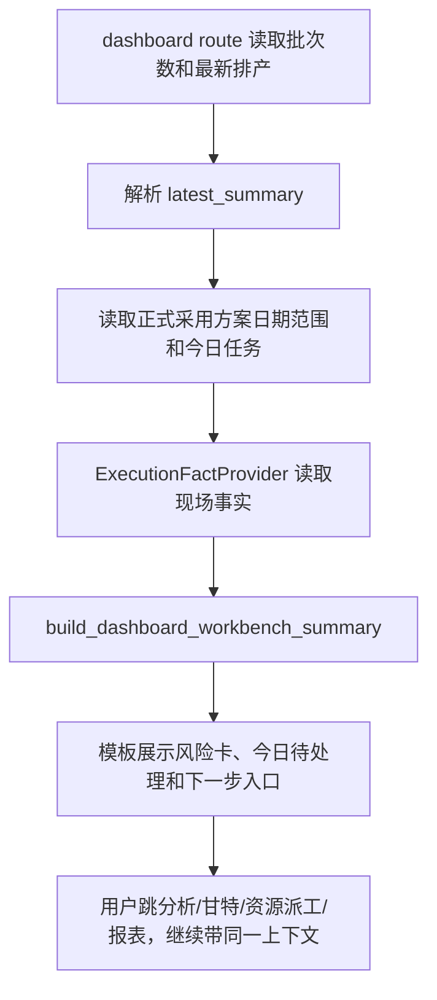

# dashboard-workbench-risk-todos design

## 0. 术语约定

- 首页值班台：仍然是 `/` 首页，不新增页面。它要回答计划员早上打开系统时最关心的三件事：现在看的是哪版计划、今天有什么要先处理、下一步去哪里看明细。
- 今日待处理：后端根据当前数据库实时算出来的提醒，不保存“已处理 / 已忽略”状态。
- 工作台风险卡：首页上方的几个小卡片，用来快速说明待排批次、已排批次、超期、资源压力、现场情况这些概况。
- 工作台链接：第 1 阶段的 `WorkbenchLink`，本阶段所有跳转入口都通过 `web.viewmodels.scheduler_workbench_links` 生成。

## 1. 决策与约束

### 需求摘要

- 首页要出现“今日待处理”区域，最多展示 6 条。
- 待处理类型至少覆盖：超期批次、方案需要确认、资源负荷偏高、现场情况待确认、基础数据缺口。
- 每条待处理都要有中文标题、影响说明、证据说明、当前处理状态、默认动作和备用动作。
- 默认动作和备用动作都必须是 `WorkbenchLink`，不能在模板里手拼 URL。
- 首页不显示 `plan_role`、`scenario_id`、`source_table`、`candidate_id`、`op_id`、`schedule_id` 等内部字段。
- 如果第一版不保存处理状态，页面必须明说待处理项是实时生成的。

### 明确不做

- 不新增 dashboard 路由，不新增数据库表。
- 不改排程算法，不改 `core/algorithms/`。
- 不做“已处理 / 已忽略 / 指派给某人”的状态保存。
- 不把反馈人改成必填。反馈人为空不阻断首页、报表或现场记录流程，也不作为红色风险。
- 不让首页直接填写现场实际；首页只给“计划和现场实际”或资源派工入口。
- 不引入外部 JS、外部 CSS、字体、CDN 或新前端框架。
- 不使用 Python 3.10+ 类型写法。

### 复杂度档位

走现有 Flask + Jinja + 本地 CSS + 后端 ViewModel 的轻量首页升级档位。页面只展示 ViewModel 给的数据，不在模板里猜业务规则。

### 关键决策

- 新增 `web/viewmodels/dashboard_workbench.py` 和 `web/viewmodels/dashboard_workbench_cards.py`。原因是首页风险和待处理的拼装已经超过模板职责，应该由后端统一算好；风险卡和快捷入口单独拆出，避免主 ViewModel 超过项目文件大小限制。
- `web/routes/dashboard.py` 继续负责读取批次数、最新排产历史和解析摘要；再补充计划时间范围、今天的正式计划任务和现场事实，然后交给 ViewModel。
- 计划上下文默认取最新排产版本的正式采用方案。日期范围优先取当前计划的实际起止范围；如果没有排产明细，则日期缺口由链接合同自动禁用需要日期的入口。
- “现场情况待确认”只统计正式采用方案、当天范围内、计划开始时间已经到达、并且现场事实还不能说明进展的任务。未来任务不统计。
- 资源负荷第一版只使用能安全拿到的摘要指标 `machine_util_avg`。`>= 90%` 显示危险，`>= 75%` 显示提醒；拿不到时显示“数据不足”，不显示成 `0%`。
- “方案需要确认”基于最新排产摘要里的 `algo.candidate_comparison`。如果有候选对比记录，就提醒用户去排产分析页复核推荐结果；没有对比记录时不硬造风险。
- “基础数据缺口”只在没有排产版本、摘要解析失败、没有计划日期范围或没有有效计划明细时出现。
- 旧首页里的四张统计卡、最近排产和常用工作区继续保留，但上方新增值班台区域，让用户先看到待处理和下一步。
- V1/V2 首页模板必须保持同步，因为现有 `regression_mirror_template_sync.py` 要求两份 dashboard 模板完全一致。

## 2. 名词与编排

### 2.1 名词层

#### 现状

- `templates/dashboard.html` 和 `web_new_test/templates/dashboard.html` 当前完全一致，只有四张统计卡、最近排产和常用工作区。
- `web/routes/dashboard.py` 当前只取待排批次、已排批次、最新历史和超期数量。
- 第 1 阶段已经有 `build_workbench_plan_context()`、`build_workbench_link()` 和目标页参数矩阵。
- 现场执行事实可以通过 `ExecutionFactProvider` 按 `op_id` 读取。
- 正式采用方案明细可以通过 `SchedulePlanQueryService` 读取。

#### 变化

- 新增 `DashboardWorkbenchSummary` 普通 dict：

```text
{
  generated_at_label: str,
  realtime_note: str,
  latest_plan: WorkbenchPlanContext,
  risk_cards: List[WorkbenchRiskCard],
  todo_items: List[WorkbenchTodoItem],
  quick_links: List[WorkbenchLink],
  empty_state: str
}
```

- `WorkbenchTodoItem` 包含：

```text
kind, severity, title, impact_text, evidence_text,
handling_state_label, primary_action, secondary_action
```

- `WorkbenchRiskCard` 包含：

```text
kind, label, value, helper_text, severity, link
```

### 2.2 编排层



#### 流程级约束

- 待处理项最多 6 条，按 danger > warning > notice 排序。
- 同一种类型只展示一条；如果同类有多条，在影响说明里写数量。
- 链接禁用时保留中文禁用原因，不渲染假链接。
- 模板不读取或展示内部字段，只展示 `label`、`url`、`context_summary`、`disabled_reason` 这类公开字段。
- “现场情况待确认”文案使用“暂未收到 / 录入现场情况 / 现场情况待确认”，不写“必须补录”。
- 空状态用中文说明“当前没有必须马上处理的排产风险”。
- 反馈人为空不进入首页风险判断。

### 2.3 挂载点清单

- 首页 ViewModel：`web/viewmodels/dashboard_workbench.py` — 新增。
- 首页风险卡 ViewModel helper：`web/viewmodels/dashboard_workbench_cards.py` — 新增。
- 首页路由：`web/routes/dashboard.py` — 读取计划范围和今日执行事实，传入 `workbench_summary`。
- 首页模板：`templates/dashboard.html` — 新增值班台区域。
- V2 镜像模板：`web_new_test/templates/dashboard.html` — 保持与 V1 完全同步。
- 样式：`static/css/ui_contract.css` — 补首页值班台、待处理和风险卡样式。
- 合同测试：`tests/regression_dashboard_workbench_contract.py` — 新增。
- 第一轮小烟测：`tests/regression_aps_workbench_first_round_flow_contract.py` — 新增。
- 既有文案测试：`tests/regression_frontend_ui_language_polish.py`、`tests/regression_manual_entry_scope.py` — 保持通过，必要时更新静态断言。

### 2.4 推进策略

1. 设计与清单落盘。
   退出信号：feature 文档、checklist 和 roadmap item YAML 可解析。
2. ViewModel 骨架。
   退出信号：纯函数测试能生成五类待处理、最多 6 条、同类只保留一条。
3. 路由接线。
   退出信号：首页上下文能拿到最新版本、日期范围、今日正式计划和现场事实。
4. 模板和样式。
   退出信号：V1/V2 首页同步，页面出现今日待处理、实时生成说明和中文空状态。
5. 回归测试。
   退出信号：本阶段指定 pytest 通过。

### 2.5 结构健康度与微重构

##### 评估

- 文件级 — `web/routes/dashboard.py`：当前很短，适合保留“取数据”职责；风险拼装不适合继续塞进路由。
- 文件级 — `templates/dashboard.html`：已有统计和常用工作区，如果把判断写进模板会很快变乱，所以新增区域只循环展示 ViewModel。
- 文件级 — `static/css/ui_contract.css`：已有全站合同样式和工作台导航样式，本次补首页值班台类即可。
- 目录级 — `web/viewmodels/`：已有多组 scheduler 和 resource dispatch ViewModel，新增 `dashboard_workbench.py` 符合当前归属。

##### 结论：做一处必要拆分

新增 `web/viewmodels/dashboard_workbench.py` 是必要拆分。它只负责把已有数据整理成首页展示合同，不新增业务持久化，不替代排产服务；风险卡和快捷入口拆到 `web/viewmodels/dashboard_workbench_cards.py`，避免首页主 ViewModel 继续变成超 500 行的大文件。

## 3. 验收契约

### 关键场景清单

- 没有排产历史：首页显示今日待处理区域，并出现基础数据缺口和中文空/缺口说明。
- 有最新正式计划、超期摘要和候选方案对比：首页出现超期批次和方案需要确认提醒。
- `machine_util_avg >= 0.75` 时出现资源负荷提醒；`>= 0.90` 时为危险等级；没有利用率时显示数据不足，不显示 `0%`。
- 当天已到计划开始时间、现场事实仍是未开始且没有实际开始/结束时，首页出现现场情况待确认。
- 未来任务不计入现场情况待确认。
- 每条待处理都有默认动作和备用动作，动作来自 `WorkbenchLink`。
- 首页能跳排产分析、设备甘特、资源派工、计划和现场实际，并保留版本、正式采用方案和日期范围。
- 页面显示“待处理项根据当前数据实时生成，暂不保存已处理状态。”
- 页面不显示内部字段名。
- V1/V2 dashboard 模板保持完全一致。

### 明确不做的反向核对项

- 不新增数据库结构。
- 不写现场记录保存入口。
- 不修改算法或候选方案选择规则。
- 不新增外链资源。
- 不用 Python 3.10+ 语法。

## 4. 与项目级架构文档的关系

- 验收阶段更新 `.codestable/architecture/ARCHITECTURE.md`：记录首页值班台由 `web/viewmodels/dashboard_workbench.py` 生成，首页只是展示实时待处理，不保存处理状态。
- 本阶段是 roadmap 第一轮 A/B/C 的最小闭环；验收后把 `dashboard-workbench-risk-todos` 标记为 done，并在 roadmap changelog 里说明第一轮工作台路径已经可从顶层进入首页再跳到分析、甘特、资源派工和复盘。
