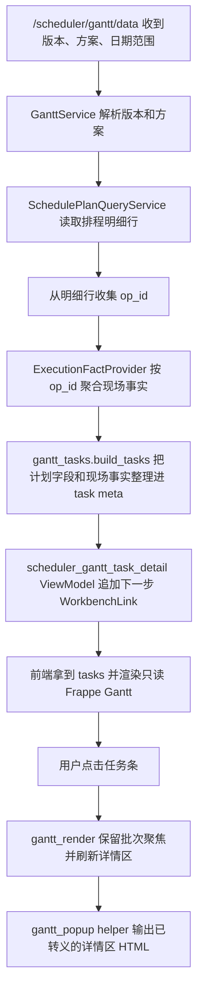

# gantt-task-detail-panel design

## 0. 术语约定

- 甘特任务详情区：甘特图旁边或下方的稳定阅读区。它不替代弹窗，负责让用户点中任务后持续看到这条任务的公开信息。
- 计划时间：`Schedule`、候选方案行或模拟方案行里给出的计划开始和计划结束。
- 现场实际：从 `OperationExecutionEvents` 事件表聚合出来的执行事实，不从计划行、task meta 旧字段或前端展示字段猜。
- 计划和实际小结：把计划时间和现场实际时间放在同一块里说明；没有现场事件时必须显示“暂未记录现场实际”。
- 下一步入口：详情区里的工作台链接，第一版包含资源派工、计划和现场实际、超期清单；链接只显示中文 label，不展示内部参数名。

## 1. 决策与约束

### 需求摘要

- 用户点击甘特任务条后，详情区显示批次、图号或物料、工序、资源、计划时间、状态、超期提示、计划和实际小结。
- 未选择任务时，详情区显示“点击甘特条查看任务详情”。
- 没有现场记录时，详情区显示“暂未记录现场实际”，不能把计划开始 / 结束冒充成实际开工 / 完工。
- 详情区只展示公开字段，不显示 `op_id`、`schedule_id`、`source_table`、`scenario_id` 等内部字段。
- 甘特图继续只读，不开放拖拽写库，不改 vendor。
- 宽屏详情区可以在右侧；1024 和 768 等窄一些的屏幕放到甘特图下方，避免遮挡筛选控件和图表。
- 不引入外部前端资源，不使用破坏 Chrome 109、Win7 或 Python 3.8 的语法。

### 明确不做

- 不改排程算法，不改 `core/algorithms/`。
- 不改数据库结构，不改 `schema.sql`。
- 不改 `static/js/frappe-gantt.min.js`。
- 不开放甘特拖拽、保存草稿、保存模拟方案或正式采用入口。
- 不让候选方案、模拟预览或对比参考方案写现场记录。
- 不做甘特资源负荷摘要；这是后续 `gantt-resource-load-summary`。
- 不在前端硬算延期根因；数据不足时只提示去看超期清单或排产诊断。

### 复杂度档位

走现有 Flask + Jinja + 本地 JS/CSS + ViewModel 的轻量前端增强档位。核心事实来源在后端接好，模板和 JS 只展示后端给出的公开字段。

### 关键决策

- `OperationExecutionEvents` 是现场实际的底层事实源。`OperationExecutionEventRepo` 聚合出 `OperationExecutionState`，`ExecutionFactProvider` 按 `op_id` 给业务层读取执行事实。
- `GanttService.get_gantt_tasks()` 已经读取排程明细行，明细行里有 `op_id`。本阶段在这里批量读取执行事实，并把公开执行状态、实际开工、实际完工、计划和实际小结补进 task meta。
- 新增 `web/viewmodels/scheduler_gantt_task_detail.py` 只做 Web 展示装饰：给每个 task meta 追加详情区下一步链接，不让 core service 反向依赖 Web ViewModel。
- 前端继续用 `static/js/gantt_render.js` 接收 Frappe Gantt 的点击事件；点击时仍保留原来的批次聚焦，同时刷新详情区。
- 详情区 HTML 生成放在 `static/js/gantt_popup.js` 的甘特任务展示 helper 里，复用已有转义、时间格式、公开标签函数，避免同一套字段在弹窗和详情区里各写一份转换。

## 2. 名词与编排

### 2.1 名词层

#### 现状

- `schema.sql` 里 `OperationExecutionEvents` 只追加保存现场事件，包含 `event_type`、`reported_status`、`event_time`、实际设备、实际人员、暂停和异常字段。
- `data/repositories/operation_execution_event_repo.py` 按 `op_id` 聚合事件，输出 `OperationExecutionState`。
- `core/services/scheduler/execution_fact_provider.py` 已有 `facts_by_op_id(op_ids)`，返回 `actual_status`、`actual_start_time`、`actual_end_time` 和状态版本。
- `core/services/scheduler/gantt_service.py` 从 `SchedulePlanQueryService` 读取统一形状的排程明细，再交给 `core/services/scheduler/gantt_tasks.py` 组装 Frappe Gantt task。
- `static/js/gantt_render.js` 的 `onClick` 当前只做批次聚焦和动态装饰。
- `static/js/gantt_popup.js` 当前只生成任务弹窗。

#### 变化

新增或扩展的公开 meta 字段：

```text
meta.execution_status_label: str
meta.actual_start_time: str
meta.actual_end_time: str
meta.actual_start_time_label: str
meta.actual_end_time_label: str
meta.actual_summary_label: str
meta.planned_time_label: str
meta.part_label: str
meta.operation_label: str
meta.resource_label: str
meta.overdue_label: str
meta.delay_hint: str
meta.detail_links: List[WorkbenchLink]
```

字段约束：

- `actual_start_time`、`actual_end_time` 只能来自 `ExecutionFactProvider`。
- 没有执行事件时，`actual_summary_label` 必须包含“暂未记录现场实际”。
- `detail_links` 由 Web ViewModel 使用 `WorkbenchLink` 生成，前端只渲染 `label`、`url`、`disabled`、`disabled_reason`。
- 现有 task meta 里已有的 `op_id`、`schedule_id` 不在本阶段删除，避免破坏旧链路；但详情区模板和 JS 不展示这些字段。

### 2.2 编排层



#### 流程级约束

- 执行事实读取失败不在前端兜底成计划时间；如果后端事实链路异常，应走现有接口错误边界，而不是静默显示错误实际时间。
- 详情区所有动态文本都要 HTML 转义。
- 点击同一批次仍保留现有聚焦能力。
- 筛选导致任务集合重建时，详情区可以回到未选状态。
- 非正式方案下，“计划和现场实际”链接由 `WorkbenchLink` 禁用并给中文原因；详情区不能自行绕开。
- `scenario_id` 可留在 URL 和服务端参数里，但不能作为用户可见文本显示。

### 2.3 挂载点清单

- 甘特后端任务 meta：`core/services/scheduler/gantt_service.py`、`core/services/scheduler/gantt_tasks.py` — 接入执行事实并输出公开详情字段。
- Web 详情 ViewModel：`web/viewmodels/scheduler_gantt_task_detail.py` — 给 task meta 追加下一步链接。
- 甘特数据路由：`web/routes/domains/scheduler/scheduler_gantt.py` — 在返回 JSON 前调用详情 ViewModel。
- 甘特模板：`templates/scheduler/gantt.html` 和 `web_new_test/templates/scheduler/gantt.html` — 增加详情区容器并保持脚本本地加载。
- 甘特前端：`static/js/gantt_popup.js`、`static/js/gantt_render.js` — 生成并刷新详情区。
- 甘特样式：`static/css/aps_gantt.css` — 补宽屏右侧、窄屏下方的稳定布局。
- 回归测试：`tests/regression_gantt_task_detail_panel_contract.py` — 锁住后端事实来源、前端详情展示、内部字段不外露和只读边界。
- 浏览器几何烟测：`tests/regression_ui_browser_geometry_smoke.py` — 验证 1280、1024、768 等宽度不产生页面级遮挡或横向溢出。

### 2.4 推进策略

1. 设计与清单落盘。
   退出信号：feature 文档、checklist 和 roadmap items YAML 可解析。
2. 后端执行事实接入。
   退出信号：甘特 task meta 的实际时间来自 `ExecutionFactProvider`；没有事件时输出“暂未记录现场实际”。
3. 详情链接 ViewModel。
   退出信号：每条任务能生成资源派工、计划和现场实际、超期清单链接，且非正式方案禁用复盘链接。
4. 模板和前端详情区。
   退出信号：未选任务显示空状态，点击任务刷新详情区并保留原批次聚焦。
5. 响应式样式。
   退出信号：宽屏右侧、窄屏下方，详情区不遮挡甘特、筛选和告警。
6. 回归测试。
   退出信号：本阶段指定测试和相关甘特回归通过。

### 2.5 结构健康度与微重构

##### 评估

- 文件级 — `core/services/scheduler/gantt_tasks.py`：当前负责把统一排程明细行转成甘特 task。追加“计划 + 现场实际”的公开 meta 字段仍属于 task 构造边界，但不要把工作台链接也塞进去。
- 文件级 — `core/services/scheduler/gantt_service.py`：当前负责读取排程行、超期、关键链和合同。接入 `ExecutionFactProvider` 属于服务编排层合理位置。
- 文件级 — `web/routes/domains/scheduler/scheduler_gantt.py`：当前负责页面和 data 接口收参。只在 JSON 返回前调用 Web ViewModel，不在 route 里拼 HTML。
- 文件级 — `static/js/gantt_popup.js`：当前已集中做甘特任务公开展示 HTML，并复用转义和公开标签。详情区 HTML helper 放这里，比继续扩大 `gantt_render.js` 更清楚。
- 目录级 — `web/viewmodels/`：已有跨页链接 ViewModel，新增 `scheduler_gantt_task_detail.py` 符合“页面展示装饰放 Web 层”的现有模式。

##### 结论：做一处必要拆分

新增 `web/viewmodels/scheduler_gantt_task_detail.py`，把每条甘特任务的下一步链接装饰留在 Web 层。core service 只负责排程与执行事实，不反向依赖 Web 链接合同。

## 3. 验收契约

### 关键场景清单

- 未选择任务时，详情区显示“点击甘特条查看任务详情”。
- 点击任务后，详情区显示批次、图号或物料、工序、资源、计划时间、状态和超期提示。
- 点击任务后，详情区显示计划和实际小结；没有现场记录时显示“暂未记录现场实际”。
- 有现场开工或完工事件时，详情区显示对应实际开工和实际完工时间；这些字段来自 `ExecutionFactProvider`。
- 详情区展示下一步入口：资源派工、计划和现场实际、超期清单；入口保留版本、方案、日期范围、批次和资源上下文。
- 非正式方案或模拟预览下，计划和现场实际入口禁用并显示中文原因。
- 详情区不显示 `op_id`、`schedule_id`、`source_table`、`scenario_id`。
- 原有弹窗仍存在，点击任务仍能打开弹窗，批次聚焦仍工作。
- 甘特图仍是只读，拖动和拉伸不写库。
- 1280 宽度下详情区可在右侧；1024 和 768 宽度下详情区放在下方，不遮挡甘特和筛选控件。
- 页面不引入外部前端资源，不使用破坏 Chrome 109 或 Python 3.8 的语法。

### 明确不做的反向核对项

- 不改算法。
- 不改数据库结构。
- 不改 vendor。
- 不开放拖拽保存。
- 不做资源负荷摘要。
- 不把计划时间冒充成现场实际。

## 4. 与项目级架构文档的关系

- 验收阶段更新 `.codestable/architecture/ui-gantt.md`：记录甘特详情区的数据链、执行事实来源、前端模块职责和只读边界。
- 验收阶段更新 `.codestable/architecture/ARCHITECTURE.md`：补充甘特工作台层第一版已从弹窗扩展为稳定详情区。
- 验收阶段更新 `shop-floor-execution-feedback` requirement：说明甘特详情区也能查看计划和现场实际小结，但仍不写现场记录。
