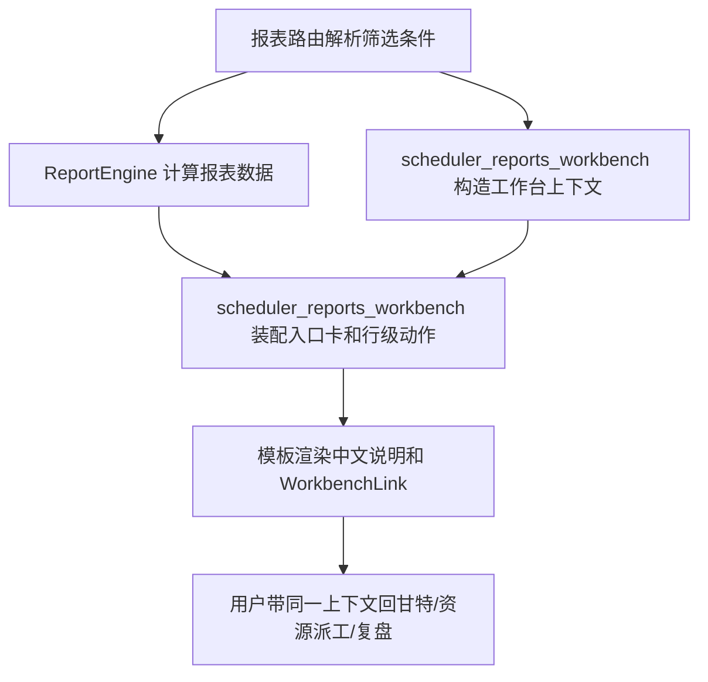

# reports-workbench-backlink design

## 0. 术语约定

- 报表工作台回跳：用户在报表中心或报表明细看到风险后，能带着同一套版本、方案、日期、批次或资源回到甘特、资源派工、超期清单或计划和现场实际。
- 报表入口卡：`/reports/` 上的超期清单、资源负荷与利用率、计划和现场实际、停机影响统计四个入口。
- 行级动作：资源负荷、计划和现场实际、停机影响等表格每行旁边的“继续处理”入口。
- 工作台链接：继续复用 `web/viewmodels/scheduler_workbench_links.py` 输出的 `WorkbenchLink` dict，不在模板里手拼核心 URL。

## 1. 决策与约束

### 需求摘要

- 报表中心不能只是报表列表，要说明每张报表回答什么问题、不能证明什么，并按当前上下文进入详情页。
- 超期清单、资源负荷、计划和现场实际、停机影响不能成为死胡同，看完后要能回甘特、资源派工或复盘。
- 资源负荷行按设备或人员生成回跳，带版本、方案、日期范围和资源对象。
- 计划和现场实际只复盘正式采用方案，行级入口不能为了精确定位而把 `op_id`、`schedule_id` 搬进报表页面。
- 停机影响第一版只做设备级说明和设备级回跳，不做任务级明细；任务级明细留给 `downtime-task-impact-detail`。
- 页面、导出列和公开报表数据不展示内部字段名。
- `web/routes/reports.py` 已经 479 行，本阶段不能继续往路由里堆展示拼装逻辑。

### 明确不做

- 不改排程算法，不改 `core/algorithms/`。
- 不改数据库结构，不改 `schema.sql`。
- 不新增外部图表库、外链脚本、外链样式或外链字体。
- 不把 `source_table`、`candidate_id`、`op_id`、`schedule_id` 做成报表公开字段。
- 不为停机影响做任务级匹配和任务级明细。
- 不给计划和现场实际增加写入能力，它仍然只是正式采用方案的只读复盘。

### 复杂度档位

走现有 Flask + Jinja + ViewModel + 本地 CSS 的默认工作台档位。业务计算仍留在 `ReportEngine` 和 `core/services/report/*`，报表工作台 ViewModel 只做公开展示、空状态和链接装配。

### 深入引用链结论

- 报表页当前数据链路是 `web/routes/reports.py` 解析版本、方案和日期，再调用 `ReportEngine`，模板直接渲染行数据。
- 统一链接底层已经具备能力：`build_workbench_plan_context()` 和 `build_workbench_link()` 支持 `reports_index`、`overdue_report`、`utilization_report`、`execution_review`、`resource_dispatch`、`gantt`。
- 当前缺口不在底层链接合同，而在报表页没有自己的 ViewModel 去消费它。
- `templates/components/ui_macros.html` 的 `reports_nav()` 仍在模板里手拼 URL，且 `start_date/end_date` 和 `date_from/date_to` 互跳时会丢日期；`query_date`、`period_preset`、`plan_id`、`back_to` 和全局“首页值班台”入口也没有统一保留。
- `templates/reports/index.html` 的入口卡是裸 `url_for()`，从带上下文的报表中心进入详情时会丢上下文。
- 资源负荷行有稳定业务字段 `machine_id`、`operator_id`，适合生成设备/人员级回跳。
- 计划和现场实际行目前只返回展示标签，不返回 `op_id` 或 `schedule_id`。这符合公开边界，本阶段只做批次级和页面级回跳。
- 停机影响只有设备级聚合字段 `machine_id`、`machine_name` 等，不能证明受影响任务；空状态必须说“当前没有停机记录或尚未维护停机数据”，不能写成系统确认没有停机。
- 新增测试不会自动进质量门禁，必须登记到 `tools/test_registry.py`；浏览器几何路径来自 `tests/ui_geometry_contract_data.py`。
- 班组资源不是报表能吃的设备/人员筛选。所有会生成 `resource_type/resource_id` 的目标页都要先禁用班组上下文，不能只盯报表页；资源派工吃的是 `scope_type/scope_id/team_id`，仍然保留班组上下文；甘特图不带班组筛选，只打开对应视角。
- 甘特、周计划和排产分析发布全局导航上下文时，不能只带 URL 里的方案角色，还要带服务端解析出的 `requested_plan_role`、`effective_plan_role`、`is_comparison`、`is_superseded_by_newer_version`、`can_dispatch`、`can_write_feedback` 等护栏字段，否则历史正式方案或对比方案会误启用计划和现场实际入口。
- 资源派工页的现场实际写入地址不能靠前端从浏览器地址栏原始查询串临时拼；从首页或报表进入时可能只有 `date_from/date_to` 而没有 `query_date`。写入模板必须由后端使用服务端归一化后的 `filters` 统一生成，确保写入接口拿到完整版本、方案、周期、查询日、日期范围和资源上下文。
- 从报表行跳到甘特、排产分析或周计划后，顶部导航仍要继续保留批次和资源上下文；甘特入口的 `gantt_batch/gantt_resource` 只是页面入参，发布给统一导航上下文时要转成公共的 `batch_id/resource_type/resource_id`。
- 甘特和周计划不能只在链接或前端显示层保留批次/资源上下文。`GanttService` 要把 `batch_id/resource_type/resource_id` 继续传到底层计划明细查询；甘特 JSON、关键链、周计划页面预览和周计划导出必须和用户点进来的范围一致。

## 2. 名词与编排

### 2.1 名词层

#### 现状

- `ReportEngine.overdue_batches()` 输出批次维度，最稳的回跳对象是 `batch_id`。
- `ReportEngine.utilization()` 输出设备和人员聚合行，最稳的回跳对象是 `machine_id` 或 `operator_id`。
- `ReportEngine.execution_review()` 固定使用正式采用方案，输出给用户看的标签，不暴露工序内部身份。
- `ReportEngine.downtime_impact()` 输出设备停机聚合行，第一版只能设备级说明。

#### 变化

新增 `web/viewmodels/scheduler_reports_workbench.py`，作为报表工作台展示出口：

```text
ReportsWorkbenchContext:
  context: WorkbenchPlanContext
  entry_cards: List[ReportsWorkbenchCard]
  page_links: List[WorkbenchLink]
```

```text
ReportsWorkbenchCard:
  title: str
  question_text: str
  limitation_text: str
  link: WorkbenchLink
```

```text
ReportsWorkbenchRowActions:
  primary: WorkbenchLink
  secondary: WorkbenchLink
  tertiary: Optional[WorkbenchLink]
```

约束：

- 模板只渲染 `link.label`、`link.url`、`disabled_reason` 和中文说明，不自己拼核心参数。
- 行级动作只使用业务字段：批次号、设备号、人员号、日期范围和当前方案上下文。
- 内部字段可以留在 URL 参数或隐藏字段里延续现有合同，但不能作为正文、表头、按钮名或导出列。

### 2.2 编排层



#### 现状

- 报表路由负责查询、汇总、导出状态、模板参数，职责已经偏重。
- 报表模板曾直接用 `url_for()` 或导航宏拼地址，筛选表单保留字段也散在模板里，新增字段时容易漏。
- 浏览器几何没有覆盖报表页。

#### 变化

- 路由继续只负责读取筛选条件和调用报表服务；链接、卡片、空状态补充说明交给新 ViewModel。
- 报表中心入口卡改用 `entry_cards`，并增加统一页面级入口，能回甘特、资源派工和正式方案复盘；`plan_id` 和 `back_to` 也跟随同一套链接上下文保留。
- 超期页增加页面级回跳和批次级回跳，批次行能回甘特、资源派工、正式方案复盘或延期说明。
- 资源负荷页每行增加查看资源派工、定位甘特、看相关超期和正式方案复盘入口。
- 计划和现场实际页每行增加回资源派工、定位甘特、查看现场记录入口；只带正式采用方案上下文。
- 停机影响页每行增加设备级回资源派工、定位甘特、正式方案复盘入口，并把空状态文案改成保守表达。
- 几何测试只加 `/reports/` 和关键详情页，不把导出和错误页塞进慢测。

### 2.3 挂载点清单

- `web/viewmodels/scheduler_reports_workbench.py`：新增报表入口卡、页面级链接、行级动作、保守空状态文案。
- `web/viewmodels/scheduler_navigation_links.py`：从当前请求生成排产主导航、全局工作台导航、报表顶部导航链接和报表筛选隐藏字段，模板只负责渲染，避免模板手拼 URL 漏参数。
- `web/viewmodels/scheduler_workbench_links.py`：工作台链接目标补齐报表入口，统一处理非正式方案禁用复盘入口。
- `web/viewmodels/scheduler_workbench_link_query.py`：集中定义报表、甘特、资源派工和正式方案复盘的查询参数映射，并暴露目标页是否使用 `resource_type/resource_id` 主资源筛选，避免模板各自拼 URL 或漏掉班组禁用规则。
- `web/request_resource_context.py`：集中把请求里的 `resource/scope/machine/operator` 资源别名规范成报表可用的设备或人员筛选；资源别名冲突、半截筛选和未支持维度都在这里复用底层校验直接报错，不让导航静默变成全量。
- `web/navigation_context.py`：作为 Flask 请求到纯导航 ViewModel 的适配层，读取当前请求或页面发布的工作台上下文，并把资源筛选交给 `web/request_resource_context.py` 校验。
- `web/render_bridge.py`：把导航 ViewModel 注册成 Jinja 全局函数，供基础模板和报表宏调用。
- `web/routes/reports.py`：只接线新 ViewModel，并把部分展示 helper 移走，保证文件不继续膨胀。
- `web/routes/reports_export_routes.py`：承接超期、资源负荷、计划和现场实际、停机影响的导出路由，页面和导出使用同一批筛选参数。
- `web/routes/reports_export_support.py`：承接报表导出发送、导出日志和非负整数解析等路由辅助逻辑。
- `web/routes/reports_request_support.py`：集中解析版本、方案、批次、资源、日期这些报表请求上下文，避免页面和导出各自读参数。
- `web/routes/reports_page_support.py`：承接报表页面上下文装配，把 `reports.py` 压成路由壳，并把页面、导出、导航使用的版本、方案、日期和资源上下文接到同一条链路。
- `web/routes/reports_plan_template_fields.py`：把方案解析结果转成模板公开展示字段，模板只读“方案名称、预览提示、当前方案说明”，不直接依赖 `plan_resolution` 内部字典结构。
- `web/routes/domains/scheduler/scheduler_navigation_publish.py`：集中解析并发布甘特、周计划、排产分析这些排产页的工作台导航上下文，发布时复制完整服务端方案护栏字段，并在页面自己发布上下文前复用资源别名校验，避免绕过全局导航校验。
- `web/routes/domains/scheduler/scheduler_analysis.py`、`web/routes/domains/scheduler/scheduler_gantt.py`、`web/routes/domains/scheduler/scheduler_resource_dispatch.py`、`web/routes/domains/scheduler/scheduler_week_plan.py`：把排产页上的版本、方案、日期、资源和 `back_to` 发布到统一工作台导航上下文；只有具体资源编号时才把资源筛选传给报表入口；甘特和周计划页上的继续查询、切周或切视图操作也保留同一批次/资源上下文，不让二次操作扩大成全量。
- `web/routes/domains/scheduler/scheduler_resource_dispatch_query.py`、`static/js/resource_execution_context.js`：资源派工现场实际写入地址由服务端按归一化 filters 生成，前端不再用裸路径叠加地址栏原始查询串来补关键计划上下文。
- `web/routes/domains/scheduler/scheduler_week_plan_response.py`：承接周计划导出响应和文件名逻辑，让周计划路由保持在 500 行以内。
- `web/routes/domains/scheduler/scheduler_week_plan_query.py`：集中承接周计划页面和导出的筛选参数、导出链接参数，保证页面预览和 Excel 导出复用同一套批次/资源过滤。
- `core/services/scheduler/gantt_service.py`、`core/services/scheduler/gantt_service_support.py`：甘特任务和周计划行统一接收批次/资源过滤；有过滤时，甘特关键链也基于同一批筛选后的计划行计算。
- `core/services/scheduler/gantt_task_labels.py`、`core/services/scheduler/gantt_tasks.py`、`core/services/scheduler/gantt_critical_chain.py`：甘特条、任务详情和关键链边共用同一套公开任务命名规则，缺图号/名称时统一退到 `piece_id`，避免同一任务在不同位置显示不同名字。
- `core/models/schedule_resource_filter.py`：定义设备/人员资源筛选的底层规范化模型，统一拒绝未知维度、只有编号没类型、只有类型没编号。
- `core/services/report/report_engine.py`：承接超期、资源负荷、停机影响报表计算和导出接线。
- `core/services/report/report_plan_helpers.py`：承接报表计划行查询公共入口，让报表页面和导出复用同一条计划行过滤链。
- `core/services/report/execution_review.py`：承接计划和现场实际正式方案复盘、资源/批次过滤和导出。
- `core/services/report/report_context_filters.py`：集中处理报表批次、设备、人员上下文过滤；能从单一 `machine_id` / `operator_id` 推断资源类型，只有资源编号没类型、只有资源类型没编号、资源主参数与别名冲突、未支持维度都直接报错；停机影响带批次时只保留和当前批次计划行有时间重叠的停机段。
- `core/services/report/report_number_parsing.py`：承接报表展示数字的显式解析，坏字符串、无限值和非数字走可见错误，不静默按 0 展示。
- `core/services/report/exporters/xlsx.py`：资源负荷导出复用严格数字解析，坏利用率不再原样写进 Excel。
- `core/services/report/delay_diagnosis_presentation.py`：延期诊断导出支持按本次超期导出批次过滤诊断行，延期小时和天数遇到坏数字时抛 `ValidationError`。
- `core/services/report/execution_review.py`：计划和现场实际复盘在暂停时长、工序编号遇到坏数字时抛 `ValidationError`，不按 0 静默展示或裸抛系统错误。
- `core/services/scheduler/schedule_plan_query_service.py`、`data/repositories/schedule_plan_query_repo.py`：超期清单底层查询支持批次和资源过滤，并在 service / repository 两层拒绝未知资源类型、只有资源编号没有资源类型、只有资源类型没有资源编号的半截筛选。
- `data/repositories/schedule_resource_sql_filters.py`：把设备/人员资源筛选下推成 SQL 条件，service 和 repository 不各自拼资源条件。
- `templates/scheduler/gantt.html`、`web_new_test/templates/scheduler/gantt.html`：甘特视图切换、周切换和查询表单使用后端计算好的上下文链接或隐藏字段，当前视角保留 `gantt_batch/gantt_resource`，跨视角只保留批次不串资源号。
- `static/js/gantt_ui.js`、`static/js/gantt_contract.js`：用户在甘特页内改批次或资源筛选后，页面上的甘特视图链接和加载表单隐藏字段都同步改成当前范围；同视角保留资源，跨视角只保留批次。`gantt_contract.js` 保持 500 行以内。
- `templates/scheduler/week_plan.html`：周计划查询表单保留 `batch_id/resource_type/resource_id`，用户换周、换版本或换方案后仍按同一范围取数。
- `templates/reports/index.html`：入口卡改为渲染 ViewModel 输出。
- `templates/reports/overdue.html`：补报表能证明/不能证明说明和批次级动作。
- `templates/reports/utilization.html`：补设备/人员行级动作。
- `templates/reports/execution_review.html`：补正式采用方案复盘说明和行级回跳。
- `templates/reports/downtime.html`：补设备级回跳和保守空状态。
- `static/js/report_plan_filter.js`：所有带模拟预览 `scenario_id` 的筛选表单按当前版本和方案身份同步预览上下文；身份偏离初始值时临时清掉旧模拟编号，身份切回初始值时恢复原模拟编号，避免旧模拟方案误绑到新版本或新方案，也避免改回原身份后静默变成正式方案。
- `templates/components/ui_macros.html`：保留全站通用基础宏和兼容包装，排产主导航只循环渲染 Python 生成的链接，避免继续膨胀。
- `templates/components/reports_nav_macros.html`：报表导航和筛选隐藏字段只循环渲染 Python 生成的上下文，不再在模板内拼查询参数。
- `templates/components/workbench_nav_macros.html`、`templates/components/manual_macros.html`：从基础宏中拆出顶层工作台导航和手册浮动按钮，让基础宏文件回到 500 行以内。
- `tests/regression_reports_workbench_backlink_contract.py`、`tests/regression_reports_workbench_navigation_contract.py`、`tests/regression_report_context_filters_contract.py`、`tests/regression_report_plan_filter_js_contract.py`、`tests/regression_web_silent_fallback_contract.py`、`tests/regression_plan_vs_actual_review.py`、`tests/regression_reports_layout_contract.py`、`tests/regression_scheduler_workbench_links_contract.py`、`tests/regression_workbench_nav_entry_contract.py`、`tests/regression_scenario_preview_secondary_outputs.py`、`tests/regression_resource_dispatch_site_records_frontend_contract.py`、`tests/regression_scheduler_analysis_workbench_layout.py`、`tests/regression_scheduler_candidate_analysis_contract.py`、`tests/regression_gantt_critical_chain_unavailable.py`、`tests/regression_gantt_url_persistence.py`、`tests/regression_ui_layout_risk_contract.py`：新增和补强第 7 项页面、行级回跳、导航、底层资源过滤、资源派工写入地址、排产分析导航、候选分析旧合同、甘特二次操作保留筛选、关键链公开标签一致性、数字错误可见性、模拟预览筛选保留、切换版本或方案清理旧模拟编号、切回原身份恢复旧模拟编号和计划实际复盘合同测试。
- `tests/regression_report_export_size_mode_selection.py`、`tests/regression_report_export_large_scope_rejects_need_async.py`：锁住报表导出模式、导出行数阈值和大范围导出拒绝行为，避免导出路径和页面路径脱节。
- `tests/reports_workbench_backlink_helpers.py`：承接报表回跳测试的建库、HTML 解析和 Excel 读取辅助，避免主测试文件超 500 行，并按质量门禁 test-only helper 影响范围登记。
- `tests/regression_scheduler_candidate_analysis_links_contract.py`、`tests/regression_scheduler_candidate_display_contract.py`：从候选方案分析合同里拆出链接和展示断言，避免测试入口文件超 500 行。
- `tests/test_architecture_fitness.py`、`tests/architecture_fitness_support.py`：把架构门禁测试里的扫描辅助函数拆出，主测试文件低于 500 行，高复杂度扫描函数拆成小函数。
- `tests/regression_scheduler_workbench_link_guardrails.py`：从工作台链接合同测试中拆出执行复盘护栏测试，避免测试文件超 500 行。
- `tests/regression_ui_browser_geometry_smoke.py`、`tests/test_ui_browser_geometry_env.py`、`tests/test_ui_geometry_html_contract.py`、`tests/ui_geometry_browser_support.py`、`tests/ui_geometry_runtime_support.py`、`tests/ui_geometry_cdp_client.mjs`、`tests/ui_geometry_probe*.mjs`：从真实浏览器几何烟测里拆出运行环境、CDP 客户端、浏览器探针和页面检查脚本，保持测试入口文件短小，并修正几何环境自测导入。
- `tests/ui_geometry_contract_data.py`：登记报表几何烟测路径。
- `tests/regression_quality_gate_registry_split_scope_contract.py`：锁住 registry 拆分文件、报表链路文件、几何 helper、几何数据和 mjs 脚本的门禁影响范围，并确认真实浏览器几何 smoke 走本轮单独验收，不塞进默认必跑门禁拖慢日常提交。
- `tools/test_registry.py`、`tools/test_registry_data.py`、`tools/test_registry_groups_scheduler.py`、`tools/test_registry_groups_misc.py`、`tools/git_hook_blocked_paths.py`：登记新增报表工作台、计划实际复盘、工作台护栏和 registry scope 测试，拦住 ignored 运行产物误提交，并拆分 registry 数据，避免单文件超 500 行；`pyrightconfig.tools.json` 继续和既有 `QUALITY_GATE_TOOL_PATHS` 保持同步，不为本轮拆分改动历史大文件。
- `core/services/report/report_engine.py`、`web/routes/reports_export_support.py`：导出行数和导出阈值使用显式整数校验，负数、小数和坏字符串抛 `ValidationError`，不静默按 0 处理。
- `开发文档/技术债务治理台账.md`：这是既有超长历史台账，本轮只纳入 `sync_debt_ledger.py check` 要求的既有条目 `line_start/line_end` 同步，不新增或删除静默回退事实；结构性拆分或迁移后续单独治理。

### 2.4 推进策略

1. 设计和清单落盘。
   退出信号：design/checklist 和 roadmap items YAML 可解析。
2. 报表工作台 ViewModel。
   退出信号：入口卡、页面级链接、行级动作都由统一链接合同生成。
3. 报表路由接线。
   退出信号：`reports.py` 仍低于 500 行，路由不承担复杂链接拼装。
4. 报表模板渲染。
   退出信号：报表中心、超期、资源负荷、计划和现场实际、停机影响都出现中文回跳入口和限制说明。
5. 测试和几何登记。
   退出信号：新增页面合同测试、几何路径和质量门禁登记完成。
6. 复审和验收落档。
   退出信号：本地 SubAgent 与 Claude Code 对抗复审无阻塞，质量门禁通过，验收报告、架构、需求和 roadmap 都已回写。提交和 push 是验收后的收尾动作。

### 2.5 结构健康度与微重构

#### 评估

- `web/routes/reports.py` 479 行，已经接近 500 行硬约束；如果直接加链接拼装，文件会超限且职责更混。
- `templates/components/ui_macros.html` 里报表导航宏手拼参数，适合做小范围修正，但不适合承载完整工作台链接规则。
- `web/viewmodels/` 已有 `scheduler_workbench_links.py`、`dashboard_workbench.py`、`scheduler_gantt_task_detail.py` 等工作台展示层文件，新建 `scheduler_reports_workbench.py` 符合现有分层。
- compound convention 检索没有命中与本次冲突的目录或命名决定。

#### 结论：微重构（拆文件）

实现期新增 `web/viewmodels/scheduler_reports_workbench.py`，把报表入口卡、行级动作、保守空状态和资源行装饰集中到一个文件。`web/routes/reports.py` 只调用它，并同步移出少量展示 helper，保证路由文件不超过 500 行。

## 3. 验收契约

### 关键场景清单

- 输入带版本、正式方案、日期范围的 `/reports/` → 四张入口卡能进入超期、资源负荷、计划和现场实际、停机影响，并保留上下文。
- 输入带 `plan_id` 和 `back_to` 的报表页 → 报表顶部导航、页面级回跳、全局工作台“首页值班台”、导出链接和筛选隐藏字段都保留同一返回上下文。
- 从报表行带 `batch_id/resource_type/resource_id` 跳到甘特、排产分析或周计划后，顶部导航再跳回报表、资源派工或复盘仍保留同一批次和资源范围。
- 从报表行带 `batch_id/resource_type/resource_id` 跳到甘特或周计划后，后台取数也只返回这个批次/资源范围；周计划页面预览和 Excel 导出不能扩大成整周整版数据。
- 从首页或报表进入资源派工且只有 `date_from/date_to` 时，现场实际写入地址仍由后端补齐 `query_date/start_date/end_date`，不会生成能点但第一次保存就 400 的入口。
- 报表入口卡显示“这张报表回答什么”和“这张报表不能证明什么”。
- 超期清单批次行能回甘特、资源派工或延期说明，且带批次、版本、方案和日期。
- 资源负荷设备行能带 `scope_type=machine` 和设备号回资源派工、甘特和相关超期。
- 资源负荷人员行能带 `scope_type=operator` 和人员号回资源派工、甘特和相关超期。
- 排产主导航从机器上下文切到人员甘特图、或从人员上下文切到设备甘特图时，不把不匹配的资源编号塞进另一个视角。
- 计划和现场实际页面只展示正式采用方案复盘；非正式上下文不能变成可复盘链接。
- 旧正式版本、对比方案、模拟预览进入排产分析、甘特或周计划后，顶部导航也不能误生成可点击计划和现场实际入口。
- 旧正式版本直接进入计划和现场实际页时，页面也必须明示这是历史正式方案，不能只显示成现行“正式采用方案”；写入层有后端闸门，展示层也不能误导用户。
- 班组上下文进入顶部工作台菜单或排产主导航时，首页值班台、报表中心、排产分析、周计划和报表类入口不生成会跳 400 的主资源筛选 URL；资源派工继续用班组 scope 参数；甘特图不带班组筛选。
- 计划和现场实际行级动作只用批次和资源上下文，不把 `op_id`、`schedule_id` 做成页面正文或导出列。
- 当前报表只支持设备和人员资源筛选；`resource_type=team`、未知资源维度、只有资源编号没有资源类型、只有资源类型没有资源编号、资源主参数与别名冲突的筛选都直接报错，不静默放大全量；只有 `machine_id` 或只有 `operator_id` 的明确单一别名可推断成对应维度。
- 排产页导航和周计划也复用同一套资源请求归一化；只有 `scope_type` 没有 `scope_id` 这类半截筛选必须直接报错，不能当成无筛选后查全量。
- 报表展示、执行复盘和延期诊断遇到坏字符串、无限值或非数字时抛 `ValidationError`，不把坏数据悄悄算成 0，也不裸抛系统错误；导出行数和导出阈值额外要求是非负整数，负数和小数也会抛 `ValidationError`。
- 停机影响无数据时显示“当前没有停机记录或尚未维护停机数据”，不写成系统确认没有停机。
- 停机影响第一版只做设备级入口，不要求任务级明细。
- 页面可见文案、操作列和导出列不出现 `plan_role`、`scenario_id`、`source_table`、`candidate_id`、`op_id`、`schedule_id`。
- 浏览器几何覆盖 `/reports/`、`/reports/overdue`、`/reports/utilization`、`/reports/execution-review`、`/reports/downtime` 的关键页面。
- 不引入外部前端资源，不使用 Python 3.10+ 类型语法。

### 明确不做的反向核对项

- 不新增任务级停机影响明细。
- 不把报表行变成现场事实写入入口。
- 不新增权限模型、审批、扫码或消息推送。
- 不把模拟预览和对比参考方案纳入计划和现场实际复盘口径。

## 4. 与项目级架构文档的关系

- 验收阶段更新 `.codestable/architecture/ARCHITECTURE.md`：记录报表工作台回跳由 `scheduler_reports_workbench.py` 统一装配，并复用 `WorkbenchLink`。
- 验收阶段更新 `.codestable/requirements/scheduler-daily-workbench.md`：补充报表中心和报表明细已经能作为风险处理入口继续回到甘特、资源派工和复盘。
