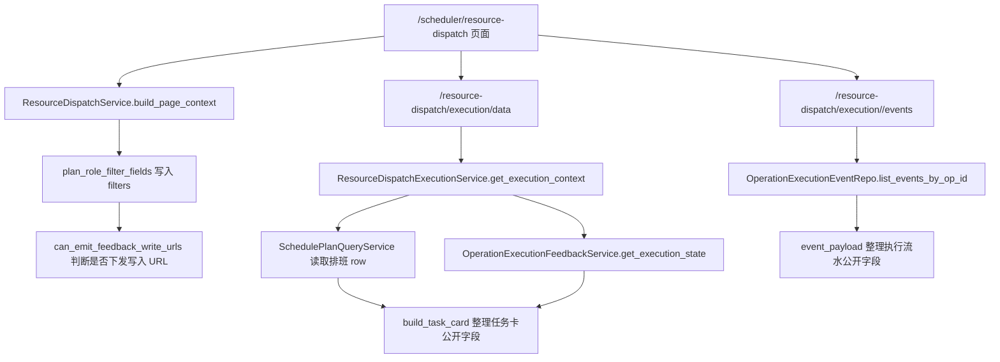

# resource-dispatch-execution-lane design

## 0. 术语约定

- 计划员查看：同一资源派工页里的只读排班入口，包括任务明细、日历矩阵、甘特图和导出。
- 现场事实：计划员代录现场实际情况的入口，包括现场记录任务卡、填写实际情况和 Excel 直接导入。
- 计划和现场实际复盘：只读复盘入口，跳到 `/reports/execution-review`，只复盘正式采用方案，不负责写现场记录。
- 任务卡：`GET /scheduler/resource-dispatch/execution/data` 返回并由 `resource_execution.js` 渲染的现场记录卡。
- 执行流水：`GET /scheduler/resource-dispatch/execution/<op_id>/events` 返回的事件列表，底层来自 `OperationExecutionEvents`。

## 1. 决策与约束

### 需求摘要

- 资源派工页保留现有四个入口：任务明细、现场记录、日历矩阵、甘特图。
- 页面视觉上要能看出“计划员查看”和“现场事实”是两块事，不让 Excel 控件抢在任务卡前面。
- “查看计划和实际”是只读复盘入口，和“填写实际情况”分开；禁用时要展示中文原因。
- 现场记录任务卡要显示图号或物料、计划开始/结束、实际开始/结束、偏差；没有实际记录时用中文说“暂未记录现场实际”。
- 执行流水要显示记录来源和记录时间，不能在前端硬编假时间。
- 候选方案、模拟预览、历史正式方案不能写现场记录，不能输出写入按钮、写入 URL、Excel 导入 URL、模板下载 URL 或任何 `data-*` 写入地址。
- 反馈人继续可空，空了显示“未填写反馈人”。
- Excel 继续一键直接导入；短期不做导入前预览和二次确认入口。
- 页面不引入外部前端资源，不使用破坏 Chrome 109、Win7 或 Python 3.8 的写法。

### 明确不做

- 不复活 `.codestable/features/2026-05-29-resource-dispatch-execution-page-extraction/` 里的独立现场记录页方案。
- 不新增 `/scheduler/resource-execution` 页面，不新增主导航“现场记录”入口，不新增 `scheduler_resource_execution.py`。
- 不改 `OperationExecutionEvents` 表结构，不改 `schema.sql`。
- 不改排程算法，不改 `core/algorithms/`。
- 不新增现场员工账号、我的任务、班组权限、多人权限、扫码、消息推送、撤销、审批。
- 不把暂停、继续、报异常做成新的实时闭环；已有暂停/异常字段只作为计划员代录事实和备注展示。

### 复杂度档位

走现有 Flask + Jinja + 本地 JS/CSS + ViewModel 的轻量页面层级和展示合同增强。底层写入身份和写入 URL 仍由后端判断，前端只按后端给出的 URL 和 `available_actions` 展示。

### 深入引用链结论

- 写入身份链路已经在底层守住：`schedule_plan_identity_builder` 只给当前正式采用方案 `can_write_feedback=True`，`scheduler_workbench_links.can_emit_feedback_write_urls()` 再要求正式 adopted、非 scenario、非 preview、非历史和 `can_dispatch`。
- 页面写入 URL 下发点在 `scheduler_resource_dispatch._execution_write_urls()`。不可写时三个 URL 都是 `None`；本阶段不把这个判断搬到前端。
- 写操作最终仍由 `OperationExecutionFeedbackService._load_current_official_schedule()` 校验正式 adopted、`source_table=schedule`、无 scenario、排程和工序匹配。页面隐藏 URL 不是唯一防线。
- 任务卡缺图号/物料和偏差，根因在 `web/viewmodels/scheduler_resource_dispatch_execution.build_task_card()` 没把已有排班 row 和执行 state 整理成公开字段。
- 执行流水有真实字段：`OperationExecutionEvents.created_at` 是记录落库时间，`source_table` 当前受表约束只能是 `schedule`，可以展示成“正式排程现场记录”。所以本阶段不需要改库。
- 旧拆页设计已被 `resource-dispatch-js-split` 取代，本阶段只在现有 `/scheduler/resource-dispatch` 页面内做分层。

## 2. 名词与编排

### 2.1 数据链路



### 2.2 变化字段

任务卡新增公开字段：

```text
part_no: str
part_name: str
part_label: str
planned_time_label: str
actual_time_label: str
actual_start_delta_label: str
actual_end_delta_label: str
actual_delta_summary: str
```

约束：

- `part_label` 由图号和物料名组成；两者都拿不到时显示“未填写图号或物料”。
- 偏差由计划时间和执行 state 的实际时间计算；没有实际开工或完工时显示“暂未记录现场实际”。
- 偏差计算只做展示，不改变事件、不写库、不影响重排。

执行流水新增公开字段：

```text
record_source_label: str
record_time: str
record_time_label: str
```

约束：

- `record_time` 来自 `OperationExecutionEvents.created_at`。
- `record_time_label` 没有值时显示“暂未记录落库时间”，不在前端用当前时间代替。
- `record_source_label` 当前从 `source_table='schedule'` 翻译为“正式排程现场记录”；如果未来接 Excel 来源字段，再单独扩展表结构或事件 payload。

### 2.3 页面分层

- 顶部动作区保留“查看计划和实际”，作为只读复盘入口。禁用时展示 `execution_review_link.disabled_reason`。
- 结果区改成两个可见分组：
  - 计划员查看：任务明细、日历矩阵、甘特图。
  - 现场事实：现场记录。
- 现场记录 tab 内先显示任务卡和提示，再把反馈人、模板下载、Excel 直接导入放进“批量维护”折叠区，避免 Excel 控件抢首屏。
- 现有 `resource_dispatch_shared/core/execution/boot` 分文件结构继续保留，不新增独立页面。

### 2.4 挂载点清单

- `web/viewmodels/scheduler_resource_dispatch_execution.py`：新增任务卡公开字段、偏差展示和执行流水记录来源 / 记录时间。
- `static/js/resource_execution_context.js`：集中执行区共享上下文，包括提示、填写人读取和写入 URL 拼接。
- `static/js/resource_execution_cards.js`：渲染任务卡新增字段；把卡内“查看计划和实际”改成“查看现场记录”；事件列表显示来源和记录时间。
- `static/js/resource_execution_actual.js`：保留实际情况内联填写和提交逻辑。
- `static/js/resource_execution_import.js`：保留 Excel 直接导入逻辑。
- `static/js/resource_execution.js`：只做执行区加载和点击事件编排。
- `templates/scheduler/resource_dispatch.html`：分组 tab；现场记录内任务卡优先，批量导入折叠；禁用复盘入口展示原因。
- `static/css/resource_dispatch.css`：补资源派工分组和批量维护局部样式，不继续扩大公共 CSS。
- `tests/regression_resource_dispatch_workbench_lane_contract.py`：新增第 6 项合同测试。
- `tests/regression_resource_dispatch_site_records_frontend_contract.py`：同步现有测试口径，继续守住写入 URL、反馈人可空、Excel 无预览确认。
- `.codestable/roadmap/aps-frontend-workbench/aps-frontend-workbench-items.yaml`：绑定本 feature 并进入 in-progress。

### 2.5 推进策略

1. 设计与清单落盘。
   退出信号：feature 文档、checklist 和 roadmap item YAML 可解析。
2. ViewModel 公开字段。
   退出信号：任务卡包含图号/物料、计划/实际时间、偏差；执行流水包含来源和记录时间。
3. 前端页面分层。
   退出信号：计划员查看和现场事实视觉分组；任务卡先于批量 Excel 控件；复盘入口禁用原因可见。
4. 合同测试。
   退出信号：新增 lane 合同测试和既有现场记录前端合同通过。
5. 对抗复审与验收落档。
   退出信号：本地 SubAgent 和 Claude Code 复审无阻塞；acceptance、roadmap、checklist、architecture / requirement 必要回写完成。

### 2.6 结构健康度与微重构

##### 评估

- `ResourceDispatchExecutionService` 已经负责单独读取带内部定位字段的执行任务卡，继续留作服务编排层，不新增 route。
- `build_task_card()` 正是任务卡公开展示合同的集中点，新增字段放这里最贴近根因。
- `event_payload()` 已经把事件模型转成公开 JSON，新增记录来源和记录时间放这里最贴近根因。
- `resource_execution.js` 已经独立负责现场记录卡和事件列表，适合只改渲染，不反向污染 `resource_dispatch_core.js`。
- 模板当前把四个 tab 放在同一组，本阶段只做分组和顺序，不拆页面。

##### 结论：不新增大抽象

本阶段不新增新服务、不新增页面、不新增表结构。只在既有 ViewModel 和现有现场记录 JS 上补齐缺失的公开字段和入口层级。

## 3. 验收契约

### 关键场景清单

- 页面能看出两个区域：计划员查看、现场事实。
- 四个现有入口仍存在：任务明细、现场记录、日历矩阵、甘特图。
- 现场记录任务卡在 Excel 控件前展示。
- “查看计划和实际”是顶部只读复盘入口；禁用时显示中文原因。
- 卡内按钮用于看执行流水，文案为“查看现场记录”，不再让用户误以为它会跳复盘页。
- 任务卡显示图号或物料信息；拿不到时显示“未填写图号或物料”。
- 任务卡显示计划开始/结束、实际开始/结束、开工偏差、完工偏差；没有实际记录时显示“暂未记录现场实际”。
- 执行流水显示记录来源和记录时间；记录时间来自后端 `created_at`。
- 模拟预览、候选方案、对比参考方案、历史正式方案下，不输出写入按钮、写入 API URL、Excel 导入 URL、模板下载 URL 或 `data-*` 写入地址。
- 反馈人可空的口径继续成立。
- Excel 预览和确认入口不出现。
- 页面、导出列和公开 payload 不泄露 `source_table`、`scenario_id`、`candidate_id` 等身份字段；执行写入所需 `op_id`、`schedule_id` 仍只作为受控写入任务卡定位字段存在，不做用户可见文案。
- 不新增 `/scheduler/resource-execution`、主导航现场记录入口或 `scheduler_resource_execution.py`。
- 页面不引入外部前端资源，不使用破坏 Chrome 109 或 Python 3.8 的语法。

### 明确不做的反向核对项

- 不拆独立现场记录页面。
- 不改数据库结构。
- 不改排程算法。
- 不新增权限模型和现场员工账号。
- 不新增 Excel 预览 / 确认。
- 不把记录来源硬编成无法追溯的假值；只展示后端真实字段能证明的来源。

## 4. 与项目级架构文档的关系

- 验收阶段更新 `.codestable/architecture/ARCHITECTURE.md` 或新增资源派工架构段，记录资源派工页仍是同页分层，执行事实来自 `OperationExecutionEvents`。
- 验收阶段更新 `.codestable/requirements/shop-floor-execution-feedback.md`：补充资源派工页已把“看排班 / 代录现场事实 / 复盘计划和实际”分清。
