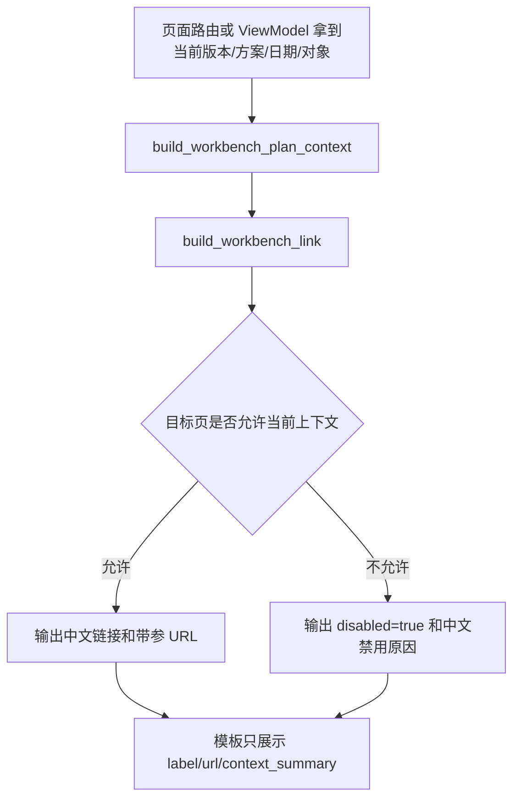

# workbench-context-link-contract design

## 0. 术语约定

- 工作台计划上下文：给页面和链接共同使用的一组业务信息，包含版本、方案、日期范围、批次、资源、写入状态和中文说明。代码里当前没有同名模块；`rg "WorkbenchPlanContext|scheduler_workbench_links|dashboard_workbench"` 只命中文档，说明这是全新合同。
- 工作台链接：一个带中文文案、目标页、URL、禁用原因和必带参数清单的链接对象。它不是模板按钮样式，而是跨页跳转数据。
- 目标页：固定使用 roadmap 里的 10 个值：`dashboard`、`analysis`、`gantt`、`week_plan`、`resource_dispatch`、`overdue_report`、`delay_diagnosis`、`utilization_report`、`execution_review`、`reports_index`。新增值必须先改 roadmap。
- 写入护栏：非正式方案、候选方案、模拟预览和历史正式方案只能查看，不能下发现场记录写入按钮、表单 action、API URL、Excel 导入 URL、模板下载 URL 或 `data-*` 写入地址。

## 1. 决策与约束

### 需求摘要

- 为计划员工作台提供统一链接和上下文数据。
- 成功标准是：页面不再各自手拼关键入口；测试能证明跳分析、甘特、资源派工、报表和复盘时不丢版本、方案、日期、批次或资源。
- 普通用户看到中文业务名，不直接看到 `plan_role`、`scenario_id`、`source_table`、`candidate_id`、`op_id`、`schedule_id` 这些内部字段。
- 非正式方案可以把内部字段放在 URL 或隐藏域里传递上下文，但不能把写入地址下发给页面。

### 明确不做

- 不改排程算法。
- 不新增页面。
- 不重做资源派工、甘特或报表的完整布局。
- 不做 Excel 导入预览 / 二次确认。
- 不新增现场人员账号、多权限模型或审批流。
- 不引入外部前端框架、外链脚本、外链样式或外链字体。
- 不使用 Python 3.10+ 写法；类型继续使用 `Optional[...]`、`List[...]`。

### 复杂度档位

走“现有 Flask + Jinja + 本地静态资源”的默认前端工作台档位，无偏离。这个阶段主要是 ViewModel 合同和少量路由/模板接线，不引入新运行时。

### 关键决策

- 新增 `web/viewmodels/scheduler_workbench_links.py` 作为统一出口。原因是跨页链接属于“模板渲染需要的数据拼装”，不应该继续散落在模板、路由和单页 helper 里。
- 新增 `web/viewmodels/scheduler_workbench_link_query.py` 承载各目标页参数矩阵。原因是 10 个目标页各自需要的日期、方案、资源和批次参数不同，把矩阵留在主出口文件里会让链接合同越来越难读。
- 新增 `core/services/scheduler/resource_dispatch_page_context.py` 承载资源派工页面只读查询上下文装配。原因是实现期接入工作台链接和写入护栏后，原路由文件会同时承担查询解析、页面只读上下文、写入入口判断和模板渲染；拆出版本、方案身份、筛选条件、可查询状态这类只读上下文 helper 可以控制文件体积，同时不改变对外行为。复盘入口和写入入口状态仍在路由层装配。
- 复用现有方案身份字段，不重新判断业务规则。已有 `schedule_result_view_context.plan_role_filter_fields()` 和资源派工 ViewModel 能提供方案身份和可写状态，本 feature 只统一展示和链接参数。
- `required_params` 写进链接对象，用测试锁住跳转合同。它不是给用户看的字段，只用于防止后续链接悄悄漏参数。
- `execution_review` 只面向正式采用方案。当前上下文不是正式采用方案时，链接禁用并显示中文原因；正式采用方案即使现场记录暂不可写，也可以进入只读复盘。
- `WorkbenchPlanContext` 默认不可写；只有后端明确传入可写状态，且上下文仍是正式采用方案，才允许生成现场记录写入口。复盘入口和写入口分开判断，避免把只读复盘误关掉。
- `overdue_report` 和 `delay_diagnosis` 第一版复用现有 `/reports/overdue` 路由；合同用 `target_page` 和中文文案区分“看超期清单”和“解释为什么晚”，两者都继续携带版本、方案、模拟预览、日期和批次上下文。
- `week_plan` 纳入统一目标页，URL 使用现有 `/scheduler/week-plan`，同时保留 `week_start`、日期范围、方案、资源和批次上下文，不再由分析页单独手写半截链接。
- `execution_review` 的 URL 可以携带 `plan_role=adopted` 表示正式采用方案口径，但不能携带非 adopted 的 `plan_role` 或 `scenario_id`。非正式方案只能得到禁用链接。
- `resource_dispatch` 工作台入口按 roadmap 矩阵保留 `date_from/date_to`、`query_date`、`period_preset` 和 `scope_type`；资源派工路由负责把 `date_from/date_to` 解析成页面内部使用的起止日期。

## 2. 名词与编排

### 2.1 名词层

#### 现状

- `web/routes/domains/scheduler/scheduler_analysis_links.py` 只有分析页局部链接，缺少日期、`scenario_id` 和 `required_params`。
- `templates/dashboard.html` 直接用 `url_for()` 拼常用入口，不带版本、方案和日期。
- `web/routes/domains/scheduler/scheduler_resource_dispatch.py` 当前只用 `has_history and can_query` 决定是否下发现场记录模板和导入 URL，没有先看工作台写入护栏。
- `web/routes/report_plan_preview.py` 已有报表侧方案和日期解析工具，但不负责跨页链接对象。

#### 变化

- 新增 `WorkbenchPlanContext`：普通 `dict`，字段按 roadmap 契约落地，包含 `version`、`version_label`、`plan_role`、`plan_role_label`、`scenario_id`、`scenario_display_label`、`date_from`、`date_to`、`query_date`、`period_preset`、`batch_id`、`resource_type`、`resource_id`、`resource_label`、`is_preview`、`can_write_feedback`、`guardrail_text`、`guardrail_reason_type`、`capacity_source_label`、`capacity_gap_text`。
- 新增 `WorkbenchLink`：普通 `dict`，包含 `label`、`url`、`target_page`、`context_summary`、`disabled`、`disabled_reason`、`required_params`。
- 新增内部值到中文展示的函数：方案身份、护栏原因、资源视角、区间类型、甘特视图统一翻译。
- 新增构建函数：

```python
# 来源：roadmap 5.1 / 5.3，落点 web/viewmodels/scheduler_workbench_links.py
context = build_workbench_plan_context(
    version=12,
    plan_role="adopted",
    scenario_id=None,
    date_from="2026-05-25",
    date_to="2026-05-31",
    resource_type="operator",
    resource_id="O1",
    resource_label="张三",
    can_write_feedback=True,
)
link = build_workbench_link(context, "gantt", label="查看设备甘特图", view="machine")
```

期望输出里，`link["url"]` 带 `version=12&plan_role=adopted&start_date=2026-05-25&end_date=2026-05-31&view=machine`，`link["required_params"]` 至少包含 `version`、`plan_role`、`start_date`、`end_date`、`view`。

### 2.2 编排层



#### 现状

- 页面各自拼 URL，跳转参数缺少统一矩阵。
- 资源派工和报表已经有局部查询参数解析，但没有统一 `target_page` 和 `required_params`。
- 非正式方案的后端写入校验已有，但页面层仍可能拿到写入 URL。

#### 变化

- 所有新增工作台入口优先调用统一 ViewModel 生成链接。
- 分析页候选方案链接改用统一 ViewModel，先覆盖甘特、资源派工、超期清单这几条高风险入口。
- 资源派工页面下发写入 URL 前增加明确护栏：只有 `plan_identity.can_write_feedback` 和当前查询可用时才下发模板/导入/执行写入相关 URL。
- 本阶段先把合同和关键接线跑通；后续首页、甘特详情、报表回跳继续复用同一模块。

#### 流程级约束

- 链接禁用时必须给中文原因，不能只给空 URL。
- URL 可以带内部参数；普通正文、按钮文案、导出公开列不能直接显示内部字段名。
- 不能为了“稳一点”吞掉参数错误后静默回默认正式方案。无法生成目标上下文时，链接禁用并说明缺什么。
- 现场记录写入、模板下载和实际情况导入接口必须拿到完整资源派工查询上下文；不能只靠 `version` 或 `plan_role` 让后端静默补默认日期、默认视角或最新正式方案。
- `execution_review` 只生成正式采用方案链接；非正式方案禁用，不能因为调用方传 `disabled=False` 被重新打开。
- `execution_review` 不能通过 `extra_params` 追加 `scenario_id`、非 adopted 方案角色、模拟预览身份或写入护栏字段。
- 批量构造链接时，配置缺 `target_page` 或配置项不是字典要直接报错，不能静默少渲染一个入口。
- 分析页保留的“周计划”入口必须走统一 `week_plan` target page，不能混入半截链接对象。
- 资源派工现场记录二级接口只能返回公开计划身份，不把 `source_table`、`candidate_id`、`scenario_id`、`requested_plan_role` 或 `effective_plan_role` 交给前端；实际写入时由后端从当前查询条件重新解析计划身份。

### 2.3 挂载点清单

- ViewModel 公共出口：`web/viewmodels/scheduler_workbench_links.py` — 新增。
- 链接参数矩阵：`web/viewmodels/scheduler_workbench_link_query.py` — 新增，集中维护目标页需要带哪些 URL 参数。
- 分析页候选方案入口：`web/routes/domains/scheduler/scheduler_analysis_links.py` — 修改为调用统一链接合同。
- 资源派工页面写入地址下发：`web/routes/domains/scheduler/scheduler_resource_dispatch.py` — 修改护栏，非正式方案不下发写入 URL。
- 资源派工页面上下文：`core/services/scheduler/resource_dispatch_page_context.py` — 新增，集中拼装页面需要的版本、方案身份、筛选条件和可查询状态等只读上下文；复盘入口、写入入口状态和工作台链接仍由 `web/routes/domains/scheduler/scheduler_resource_dispatch.py` 接线。
- 回归测试入口：`tests/regression_scheduler_workbench_links_contract.py` — 新增合同测试。

### 2.4 推进策略

1. 合同骨架：新增上下文、链接和中文映射函数。
   退出信号：纯函数测试能构造 10 个目标页链接。
2. 参数矩阵：补齐各目标页必带参数、日期参数翻译和禁用规则。
   退出信号：测试覆盖首页、分析、甘特、资源派工、报表、复盘的关键跳转。
3. 页面接线：把分析页局部链接和资源派工写入 URL 护栏接入统一合同。
   退出信号：非正式方案不会下发现场记录写入地址，分析页链接不丢 `scenario_id`。
4. 回归测试：新增 focused 合同测试，跑本阶段指定 pytest。
   退出信号：`tests/regression_scheduler_workbench_links_contract.py` 通过。

### 2.5 结构健康度与微重构

##### 评估

- 文件级 — `web/routes/domains/scheduler/scheduler_analysis_links.py`：当前很小，只负责分析页局部链接，修改点集中。
- 文件级 — `web/routes/domains/scheduler/scheduler_resource_dispatch.py`：路由文件约 160 行，本次只改写入 URL 下发条件，不拆结构。
- 目录级 — `web/viewmodels/`：已有多个 scheduler ViewModel 文件，本次新增一个同层文件，命名跟现有 `scheduler_analysis_*`、`scheduler_resource_dispatch*` 一致。
- compound convention 检索：没有命中目录组织 / 命名 / 归属类决定。

##### 结论：实现期做了两处行为不变拆分

设计阶段原本判断“不做微重构”。实现期接入后，为了避免主出口和资源派工路由继续膨胀，实际做了两处行为不变拆分：

- `web/viewmodels/scheduler_workbench_link_query.py`：只拆链接参数矩阵，不改变链接合同的对外函数。
- `core/services/scheduler/resource_dispatch_page_context.py`：只拆资源派工页面只读查询上下文装配，不承载复盘入口、写入入口状态或资源派工执行链路分层。

资源派工执行写入、导入、复盘等更大范围拆分仍留给 roadmap 后续 `resource-dispatch-execution-lane`。

## 3. 验收契约

### 关键场景清单

- 输入正式采用方案、版本和日期范围 → 甘特、分析、资源派工、超期清单、资源负荷、报表中心链接都保留版本、方案和日期。
- 输入正式采用方案、版本和日期范围生成 `execution_review` 链接 → 链接保留 `version`、`plan_role=adopted`、日期范围和资源对象。
- 输入带 `scenario_id` 的模拟预览 → 除 `execution_review` 外的查看类链接继续带 `plan_role` 和 `scenario_id`，中文摘要显示模拟预览名。
- 输入非正式方案并生成 `execution_review` 链接 → 链接禁用，显示“计划和现场实际只复盘正式采用方案，请切换到正式采用方案后查看”。
- 输入延期说明目标页 → `target_page=delay_diagnosis`，第一版 URL 仍落到 `/reports/overdue`，但不能丢版本、方案、模拟预览、日期和批次参数。
- 输入资源对象 → 跳资源派工时保留 `scope_type`、`resource_id` 和日期查询参数；跳甘特时保留 `view`。
- 资源派工页面处在不可写方案 → 不输出现场记录模板下载 URL、Excel 导入 URL、执行写入 URL 或对应 `data-*` 地址。

### 明确不做的反向核对项

- 不新增数据库表或改 `schema.sql`。
- 不改 `core/algorithms/`。
- 不引入外链脚本、外链样式或新前端框架。
- 新 Python 代码不出现 `int | None`、`list[str]`。
- 页面可见文案不直接出现 `source_table`、`candidate_id`、`op_id`、`schedule_id`。

## 4. 与项目级架构文档的关系

- 需要在验收阶段更新 `.codestable/architecture/ARCHITECTURE.md` 或 `ui-gantt.md` 的工作台链接口径：跨页上下文由 `web/viewmodels/scheduler_workbench_links.py` 统一生成，目标页参数矩阵由 `web/viewmodels/scheduler_workbench_link_query.py` 集中维护，资源派工页面只读查询上下文由 `core/services/scheduler/resource_dispatch_page_context.py` 装配，资源派工复盘入口和写入入口状态由 `web/routes/domains/scheduler/scheduler_resource_dispatch.py` 接线。
- 需求文档暂不升级；这是 `aps-frontend-workbench` roadmap 的第一条基础合同，能力落地后再由后续工作台页面归并到用户指南和架构现状。
