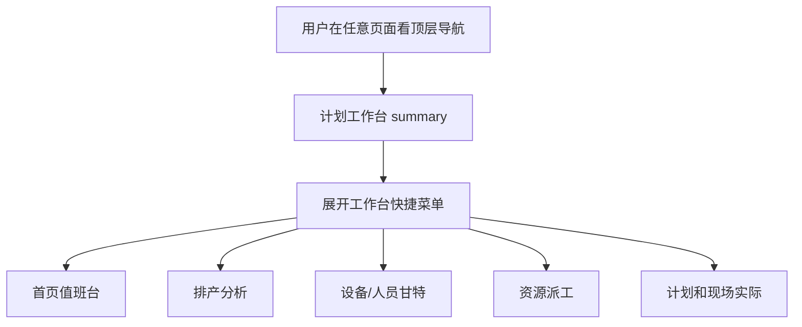

# workbench-nav-entry design

## 0. 术语约定

- 计划工作台入口：全站顶层导航里的一个作业入口，面向计划员日常处理排产风险和查看结果，不是新页面。
- 工作台快捷菜单：从“计划工作台”展开的一组本地链接，第一版包含首页值班台、排产分析、设备甘特图、人员甘特图、资源派工、计划和现场实际。
- 首页值班台：仍指 `dashboard.index` 当前首页；第 3 阶段才升级首页待处理内容，本阶段只让它在顶层导航里以工作台身份出现。
- 计划和现场实际：报表里的正式计划与现场实际复盘页，路由是 `reports.execution_review_page`。

## 1. 决策与约束

### 需求摘要

- 顶层导航要出现“计划工作台”或等价的一跳入口。
- 计划员从任意页面都能直接进入首页值班台、排产分析、设备甘特、人员甘特、资源派工、计划和现场实际。
- 入口只显示中文业务名，不显示 `plan_role`、`scenario_id`、`source_table`、`candidate_id`、`op_id`、`schedule_id`。

### 明确不做

- 不新增工作台页面。
- 不升级首页待处理区；首页内容升级放到 `dashboard-workbench-risk-todos`。
- 不重排所有顶层导航模块；工艺、人员、设备、物料、报表、系统继续保留。
- 不引入外部 JS、外部 CSS、外部字体、菜单库或前端框架。
- 不在顶层导航里带写入 URL、表单 action、Excel 导入 URL 或模板下载 URL。
- 不把模拟预览、候选方案或历史正式方案做成可写入口。
- 不使用 Chrome 109 不稳的前端能力；不使用 Python 3.10+ 写法。

### 复杂度档位

走现有 Flask + Jinja + 本地 CSS 的轻量导航档位。本阶段只改模板、宏、CSS 和静态合同测试，不新增运行时服务或数据库结构。

### 关键决策

- 计划工作台入口放在 `templates/base.html` 的顶层导航左侧。原因是它要从任意页面可达，不应该藏在排产二级导航或报表页内部。
- 快捷菜单使用原生 `<details>/<summary>` 和普通 `<a>` 链接，不写新 JS。原因是键盘可达、Chrome 109 支持、离线交付简单。
- 菜单正文抽到 `templates/components/ui_macros.html`。原因是 `base.html` 保持骨架职责，菜单链接和文案归 UI 宏统一维护。
- `static/css/ui_contract.css` 只补全局工作台导航样式，不改 `base.css` 的旧导航底色和布局基础。
- 第一版顶层菜单只给无上下文入口，不尝试在任意页面拼当前版本/日期/方案。跨页上下文由第 1 阶段合同和各业务页内部链接负责；顶层导航只解决“入口找得到”。

## 2. 名词与编排

### 2.1 名词层

#### 现状

- `templates/base.html` 顶层导航现在是固定链接：首页、排产、工艺、人员、设备、物料、报表、系统。
- `templates/components/ui_macros.html` 已有 `scheduler_nav()` 和 `reports_nav()` 二级导航，但没有全站级工作台菜单。
- `static/css/ui_contract.css` 已有 header 对齐样式和二级导航样式；`base.css` 里 `nav a` 负责全站顶层导航基础外观。
- `templates/dashboard.html` 当前有“常用工作区”，但用户必须先进首页才能看到这些入口。

#### 变化

- 新增 `ui.workbench_nav_menu()` 宏，输出：

```text
计划工作台
  - 首页值班台 -> dashboard.index
  - 排产分析 -> scheduler.analysis_page
  - 设备甘特图 -> scheduler.gantt_page(view='machine')
  - 人员甘特图 -> scheduler.gantt_page(view='operator')
  - 资源派工 -> scheduler.resource_dispatch_page
  - 计划和现场实际 -> reports.execution_review_page
```

- `templates/base.html` 顶层导航在最左侧调用这个宏，让“计划工作台”成为第一眼入口。
- CSS 新增 `aps-workbench-nav`、`aps-workbench-nav-menu`、`aps-workbench-nav-link` 等类，保证菜单能换行、不挡住原有导航、窄屏下仍能点。

### 2.2 编排层



#### 现状

- 顶层“排产”入口只到执行排产页；分析、甘特、资源派工还要再从页面内或首页卡片找。
- “计划和现场实际”藏在报表中心下，计划员想复盘现场实际时路径偏深。
- 顶层导航没有一个中文词能告诉用户“这里是计划员今天工作的总入口”。

#### 变化

- 顶层增加“计划工作台”菜单，直接提供 6 个作业入口。
- 原有“首页”“排产”“报表”等顶层链接保留，避免老用户路径突然消失。
- 菜单链接都是 GET 页面链接，不携带写入动作，不创建业务状态。

#### 流程级约束

- 菜单禁用 JS 依赖，展开和键盘焦点由浏览器原生能力负责。
- 菜单链接文案必须是中文业务名。
- 菜单里不能出现内部字段名，也不能出现 Flask endpoint 名作为用户文案。
- 菜单不能包含现场记录写入、Excel 导入、模板下载这类写入口。
- 样式只能使用本地 CSS，不能引入外部资源。

### 2.3 挂载点清单

- 全站顶层导航：`templates/base.html` — 新增“计划工作台”入口挂载点。
- UI 宏：`templates/components/ui_macros.html` — 新增 `workbench_nav_menu()`。
- 全站样式：`static/css/ui_contract.css` — 新增工作台菜单样式。
- 导航合同测试：`tests/regression_workbench_nav_entry_contract.py` — 新增静态合同测试。
- 用户可见文案守护：`tests/regression_frontend_ui_language_polish.py` — 如有必要补充顶层菜单内部字段名守护。

### 2.4 推进策略

1. 设计与清单落盘：写 design/checklist，回写 roadmap item。
   退出信号：CodeStable YAML/frontmatter 校验通过。
2. 导航宏和模板接线：新增 `workbench_nav_menu()` 并挂到 `base.html`。
   退出信号：静态测试能找到“计划工作台”和 6 个目标链接。
3. 样式接线：补本地 CSS，让菜单在顶层导航里可展开、可换行、不会挤出文字。
   退出信号：CSS 中有明确工作台导航类，且无外链资源。
4. 回归测试：新增导航合同测试，跑本阶段指定测试。
   退出信号：`regression_workbench_nav_entry_contract.py` 和 `regression_frontend_ui_language_polish.py` 通过。

### 2.5 结构健康度与微重构

##### 评估

- 文件级 — `templates/base.html`：当前顶层导航直接写在 base 里，文件不大；如果把菜单所有链接直接塞进去，会让 base 从骨架变成菜单明细文件。
- 文件级 — `templates/components/ui_macros.html`：已有多组导航宏，新增一个全站工作台宏符合当前归属。
- 文件级 — `static/css/ui_contract.css`：已有全站 UI 合同样式和 header 对齐样式，本次补少量菜单类，不需要新 CSS 文件。
- 目录级 — `templates/components/` 和 `static/css/` 现有归属清楚，不需要重组。
- compound convention 检索：未命中“工作台 导航”相关长期决定或技巧。

##### 结论：不做

本阶段不做微重构。只新增一个 UI 宏和少量 CSS；不拆 `base.html`，不重组组件目录，不调整全站导航信息架构。

## 3. 验收契约

### 关键场景清单

- 打开任意继承 `base.html` 的页面 → 顶层导航能看到“计划工作台”。
- 展开“计划工作台” → 能看到首页值班台、排产分析、设备甘特图、人员甘特图、资源派工、计划和现场实际 6 个入口。
- 点击设备甘特图 / 人员甘特图 → URL 分别带 `view=machine` / `view=operator`。
- 菜单链接都是普通页面 GET 链接，不包含现场记录写入、Excel 导入、模板下载或表单 action。
- 菜单文案不出现 `plan_role`、`scenario_id`、`source_table`、`candidate_id`、`op_id`、`schedule_id`。
- 没有外部 JS/CSS/CDN/字体；不新增前端框架。

### 明确不做的反向核对项

- 不新增 dashboard 路由或工作台新页面。
- 不修改排程算法、数据库或 installer。
- 不删除原有首页、排产、报表入口。
- 不把工作台菜单做成需要 JS 才能打开。
- 不把“计划和现场实际”写成可编辑现场记录入口。

## 4. 与项目级架构文档的关系

- 验收阶段需要更新 `.codestable/architecture/ARCHITECTURE.md`：记录顶层导航已有“计划工作台”入口，且它只是只读页面入口集合，不下发写入地址。
- requirements 暂不单独回写；第 3 阶段首页值班台落地后，再把用户每天打开系统的入口能力归并到需求文档或用户指南。
