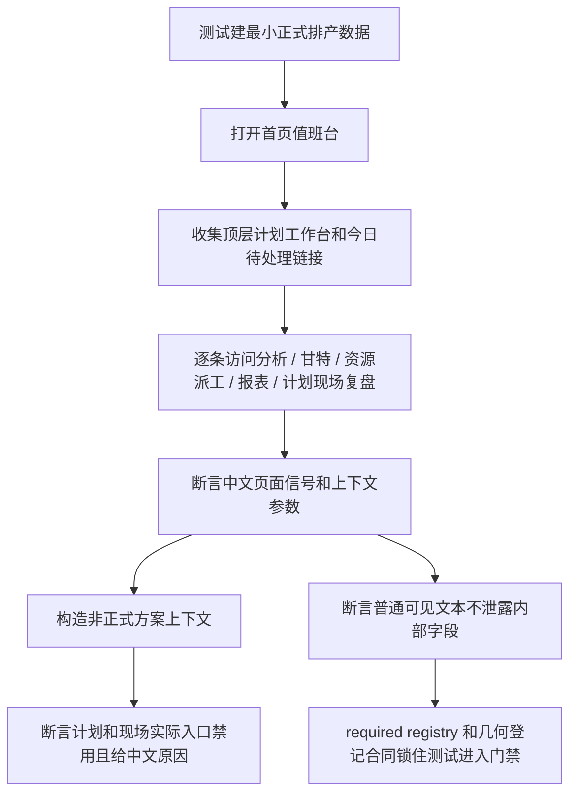

# workbench-flow-regression-suite design

## 0. 术语约定

- 工作台主流程回归测试：不是测某个按钮样式，而是证明计划员能从顶层计划工作台进入首页，再带着同一版本、正式方案、日期、批次和资源上下文进入分析、甘特、资源派工、报表和计划现场复盘。
- 第一版完整主流程：只覆盖 roadmap 前 7 条已经完成的能力，不覆盖延期解释接现场事实、甘特资源负荷摘要、停机任务级明细和牵连订单影响面。
- 流程断言：对页面状态、链接参数、中文文案、内部字段不泄露和目标页可达性做组合断言。
- 几何烟测登记：`tests/ui_geometry_contract_data.py` 里的真实浏览器路径和预期信号；它证明页面不崩、不重叠、不缺关键入口，但不替代业务主流程断言。
- required regression 登记：`tools/test_registry_data.py` 和 `tools/test_registry_groups_scheduler.py` 里质量门禁会读取的测试清单和影响范围。

## 1. 决策与约束

### 需求摘要

- 新增 `tests/regression_aps_workbench_flow_contract.py`，证明第一版工作台主流程存在。
- 测试从首页出发，覆盖超期解释 / 超期清单、方案对比、甘特图、资源派工、计划和现场实际、报表回跳。
- 测试必须断言版本、方案、日期范围、批次、资源上下文不会跨页跳丢。
- 测试必须断言非正式方案的计划和现场实际入口禁用，并显示中文原因。
- 测试必须断言普通页面不显示 `plan_role`、`scenario_id`、`source_table`、`candidate_id`、`op_id`、`schedule_id` 等内部字段名。
- 新测试要进入质量门禁 required regression 登记，不能只是本地手工跑过。
- 真实浏览器几何继续使用现有几何烟测数据；本 feature 只补第一版工作台关键页面路径或登记断言，不把整站都塞进慢测试。

### 明确不做

- 不改排程算法，不改 `core/algorithms/`。
- 不改排程算法相关数据库结构；本轮测试下钻暴露的现场记录身份护栏缺口，允许只改 `OperationExecutionEvents` 相关 `schema.sql`、迁移和迁移契约。`schema.sql` 为满足 500 行门禁可做不改变语义的注释和排版压缩。
- 不新增外链脚本、外链样式、外链字体、外部前端框架或外部浏览器库。
- 不实现第二阶段增强：延期解释接现场事实、甘特资源负荷摘要、停机任务级明细、牵连批次 / 订单影响面。
- 不把 `regression_ui_browser_geometry_smoke.py` 直接塞进默认 required tests；它继续作为单独浏览器验收目标。
- 不在测试里硬造生产逻辑；测试只搭最小数据，业务链接仍走真实 Flask route、真实 ViewModel 和现有 service。
- 不使用 Python 3.10+ 类型写法。

### 复杂度档位

走现有 Flask test client + HTML 解析 + required registry 的测试合同档位。它比单元测试更接近用户流程，但仍比真实浏览器慢测轻；真实浏览器只负责几何和布局烟测。

### 关键决策

- 新建一个主流程测试文件，而不是继续扩 `tests/regression_aps_workbench_first_round_flow_contract.py`。后者已经证明第一轮最小闭环，继续塞完整第一版会让单文件过大，也会把“最小闭环”和“完整第一版流程”混在一起。
- 主流程测试优先复用现有工作台能力；如果测试暴露正式方案身份、历史 / 缺失版本显示、写入口禁用这些第一版护栏缺口，可以做最小生产修复并用回归锁住，不扩成第二阶段业务实现。
- 测试数据使用最小 APS 数据集：一个正式版本、一个批次、一个工序、一个设备、一个人员、一个候选方案摘要和一条现场事实缺口。目标是证明流程存在，不是重测排产算法。
- 业务流程断言优先使用 Flask test client；浏览器几何继续由 `tests/regression_ui_browser_geometry_smoke.py` 和 `tests/ui_geometry_contract_data.py` 覆盖。这样能把“业务上下文不丢”和“页面布局不坏”分开，避免一个慢测试承担所有责任。
- required registry 只新增新测试目标和必要 scope，不改 `scripts/run_quality_gate.py`。现有门禁已经能读取 `QUALITY_GATE_GUARD_TESTS` 和 scheduler required regression group。

## 2. 名词与编排

### 2.1 名词层

#### 现状

- `tests/regression_aps_workbench_first_round_flow_contract.py` 已从首页证明第一轮路径存在：计划工作台、今日待处理、超期、方案确认、资源负荷、现场情况待确认，以及首页跳分析、甘特、资源派工、计划和现场实际、超期清单、资源负荷。
- `tests/regression_reports_workbench_backlink_contract.py` 和 `tests/regression_reports_workbench_navigation_contract.py` 已证明报表中心、超期、资源负荷、计划和现场实际、停机影响的回跳、过滤、导出和计划身份护栏。
- `tests/regression_scheduler_workbench_links_contract.py` 和 `tests/regression_scheduler_workbench_link_guardrails.py` 已证明底层 `WorkbenchLink` 参数矩阵和非正式方案复盘禁用。
- `tests/ui_geometry_contract_data.py` 已登记报表几何路径，但还没有把首页、分析、甘特、资源派工这些工作台第一版关键页面整理成同一组工作台几何口径。
- `tools/test_registry_data.py` 的 `QUALITY_GATE_GUARD_TESTS` 和 `tools/test_registry_groups_scheduler.py` 的 `scheduler_analysis_gantt_reports_week_plan` 分组已经包含多条工作台相关回归。

#### 变化

新增主流程测试文件：

```text
tests/regression_aps_workbench_flow_contract.py
```

测试文件里的核心对象是：

```text
WorkbenchFlowStep:
  label: str
  href: str
  expected_path: str
  required_query: Dict[str, str]
  expected_text: str
```

示例：

```text
输入：首页 HTML 中“查看超期清单”的链接
期望：目标路径是 /reports/overdue，query 中 version=12、plan_role=adopted、date_from/date_to、batch_id 都保留，目标页显示“超期”和“继续处理”
来源：tests/regression_aps_workbench_first_round_flow_contract.py 的 HTML link collector 和 tests/reports_workbench_backlink_helpers.py 的链接解析思路
```

新增或调整 required registry：

```text
QUALITY_GATE_GUARD_TESTS += tests/regression_aps_workbench_flow_contract.py
SCHEDULER_REQUIRED_REGRESSION_GROUPS.scheduler_analysis_gantt_reports_week_plan.target_paths += tests/regression_aps_workbench_flow_contract.py
```

新增或调整几何合同：

```text
tests/ui_geometry_contract_data.py
```

只登记第一版工作台关键页面路径和稳定中文信号，避免浏览器烟测变成整站大巡检。

### 2.2 编排层



#### 现状

- 首页最小闭环测试自己建库、打开 Flask app、用 HTMLParser 收集链接。
- 报表回跳测试已有较完整的 `_client()`、`_parser_for()`、`_query()` 等 helper，但 helper 是报表专属，不能把主流程测试硬塞成报表测试。
- 真实浏览器几何烟测会起本地 app，访问 `UI_GEOMETRY_PAGE_PATHS`，检查 HTTP 状态、稳定文本、关键 DOM id、主内容溢出和重叠。
- 质量门禁通过 registry 识别 required tests；新增测试如果只放在文件里、不登记，就不能证明会被门禁持续执行。

#### 变化

- 主流程测试复用轻量 HTMLParser 模式，单独建最小数据和收集链接，避免依赖某一个报表 helper 的私有测试语义。
- 流程断言分三层：
  1. 起点层：顶层“计划工作台”和首页“今日待处理”存在。
  2. 跳转层：分析、甘特、资源派工、超期清单、资源负荷、计划和现场实际都可达，并保留上下文。
  3. 护栏层：非正式方案下计划和现场实际禁用，普通页面可见文本不露内部字段。
- 几何合同只补缺少的工作台关键路径和稳定信号，不改变浏览器探针逻辑。
- registry 合同补新测试进入 required list 和 scheduler 分组，避免未来文件存在但门禁不跑。

#### 流程级约束

- 测试失败必须暴露具体哪条路线断了，不能只报“页面不对”。
- 测试只断言用户可见中文和业务参数，不断言内部函数名。
- 对 `plan_role`、`scenario_id` 等内部参数：URL 和隐藏字段允许存在；可见文本不允许出现。
- 非正式方案不能通过“没有链接”含糊处理，必须有中文禁用原因。
- 真实浏览器兼容证明如果跑的是新版本 Chrome，只能写成布局烟测；Chrome 109 兼容仍按项目交付边界在验收报告里如实说明。

### 2.3 挂载点清单

- `tests/regression_aps_workbench_flow_contract.py`：新增第一版工作台主流程回归测试。
- `tests/regression_scheduler_plan_identity_summary_guardrail.py`：锁住正式方案身份、坏摘要、空明细历史和缺失版本的可见护栏。
- `tests/regression_gantt_task_detail_panel_contract.py` / `tests/regression_gantt_task_detail_js_contract.py`：锁住甘特详情面板和前端任务详情脚本的工作台上下文护栏，并进入 required registry。
- `core/services/scheduler/schedule_plan_identity_builder.py`：把“当前可执行正式方案”收紧到必须有真实 Schedule 明细来源。
- `web/routes/dashboard.py` / `web/viewmodels/dashboard_workbench.py`：把无效方案身份、缺失版本、坏摘要暴露成首页可见数据缺口。
- `web/viewmodels/scheduler_gantt_task_detail.py` / `web/viewmodels/scheduler_reports_workbench.py` / `web/viewmodels/scheduler_resource_dispatch.py`：复用统一计划身份护栏，避免不可写方案输出复盘或写入口。
- `tests/ui_geometry_contract_data.py`：补工作台关键页面几何路径和稳定信号。
- `tests/regression_ui_browser_geometry_smoke.py`：只在已有合同测试里确认几何清单覆盖工作台关键页面，不改探针核心逻辑。
- `tests/regression_quality_gate_registry_split_scope_contract.py`：补新测试进入 registry 和分组的合同断言。
- `tools/test_registry_data.py`：把新主流程测试加入 required guard tests。
- `tools/test_registry_groups_scheduler.py`：把新主流程测试加入 `scheduler_analysis_gantt_reports_week_plan` 分组。

### 2.4 推进策略

1. 测试骨架：新增主流程测试文件，先复用首页建库和 HTML 解析思路跑通一条“首页 -> 目标页”路径。
   退出信号：测试能打开首页并访问至少一个目标页。
2. 主流程断言：补齐分析、甘特、资源派工、超期清单、资源负荷、计划和现场实际的上下文和中文信号断言。
   退出信号：第一版主流程所有路线都有版本、方案、日期、批次或资源上下文证据。
3. 护栏断言：补非正式方案复盘禁用、内部字段不可见和无法定位中文原因的断言。
   退出信号：非正式入口不会生成可点击复盘，页面可见文本不露内部字段。
4. 几何登记：补工作台关键页面路径和稳定信号，保持真实浏览器探针职责不变。
   退出信号：几何合同测试能证明关键路径已登记。
5. 门禁登记：把新测试加入 required registry 和 scheduler required regression group。
   退出信号：registry 合同测试证明新测试会被质量门禁覆盖。
6. 验证收口：运行本 feature 指定 pytest、registry 合同、几何 HTML 合同和质量门禁入口。
   退出信号：指定测试通过，后续 acceptance 能用这些证据逐条核对。

### 2.5 结构健康度与微重构

#### 评估

- 文件级 — `tests/regression_aps_workbench_first_round_flow_contract.py`：259 行，职责是第一轮最小闭环；继续扩完整第一版会混淆测试目的。
- 文件级 — `tests/regression_reports_workbench_backlink_contract.py`：500 行，已经到项目质量门禁边界，不能再追加主流程断言。
- 文件级 — `tests/regression_reports_workbench_navigation_contract.py`：500 行，已经到项目质量门禁边界，不能再追加主流程断言。
- 文件级 — `tests/ui_geometry_contract_data.py`：132 行，适合补少量工作台页面信号；如果后续超过 500 行，再单独拆几何数据。
- 文件级 — `tools/test_registry_data.py`：268 行，适合补一个 required test。
- 文件级 — `tools/test_registry_groups_scheduler.py`：324 行，适合补一个 target path。
- 目录级 — `tests/`：已有大量顶层回归文件，本次只新增 1 个按现有 `regression_*_contract.py` 命名的测试文件，不引入新目录。
- compound convention 检索没有命中本次测试目录组织或命名冲突。

#### 结论：不做微重构

本 feature 通过新增独立测试文件来避免继续挤压既有 500 行边界文件，不需要先做只搬不改行为的拆分。`tests/` 顶层文件很多是既有项目形态，本阶段不重组目录；测试目录重组会超出“主流程测试套件”范围，后续如需治理应单独走 `cs-refactor`。

#### 超出范围的观察

- `tests/` 顶层 regression 文件数量较多，未来可以考虑按业务域拆子目录，但这会影响门禁路径、registry 和导入方式，本 feature 不做。

## 3. 验收契约

### 关键场景清单

- 输入首页 `/` → 页面显示“计划工作台”“首页值班台”“今日待处理”，并能找到超期、方案确认、甘特、资源派工、计划和现场实际入口。
- 从首页进入超期清单 → 目标页显示超期相关中文文案，URL 保留 `version`、`plan_role`、`date_from/date_to` 和批次上下文。
- 从首页进入排产分析 → 目标页显示方案推荐或方案对比相关中文文案，URL 保留版本、正式方案和日期范围。
- 从首页进入设备甘特和人员甘特 → 目标页显示甘特图和任务详情区，机器视角 `view=machine`，人员视角 `view=operator`，日期范围不丢。
- 从首页进入资源派工 → 目标页显示资源排班和现场记录入口，URL 保留版本、正式方案、日期范围，并按当前带入的资源类型保留上下文；设备上下文继续是 `scope_type=machine`，人员上下文继续是 `scope_type=operator`。
- 从首页进入计划和现场实际 → 目标页显示正式采用方案复盘，不携带非正式方案或模拟预览身份。
- 从报表明细行回甘特或资源派工 → 批次或资源上下文继续保留，目标页不会扩大成全量。
- 非正式、历史、缺失版本、坏摘要或空明细方案上下文生成计划和现场实际入口 → 链接禁用或回到可用版本，并显示中文原因。
- 普通页面可见文本 → 不包含 `plan_role`、`scenario_id`、`source_table`、`candidate_id`、`op_id`、`schedule_id`。
- 几何合同 → `/`、`/scheduler/analysis`、`/scheduler/gantt?view=machine`、`/scheduler/gantt?view=operator`、`/scheduler/resource-dispatch`、`/reports/`、`/reports/overdue`、`/reports/utilization`、`/reports/execution-review` 都在几何清单中有稳定文本或关键 DOM 信号。
- 门禁登记 → 新测试存在、被 `QUALITY_GATE_GUARD_TESTS` 收录、被 scheduler required regression group 收录。

### 明确不做的反向核对项

- 不出现 `core/algorithms/` 改动。
- `schema.sql` 的语义改动只允许出现在 `OperationExecutionEvents` 方案身份护栏：去掉 `source_table` / `effective_plan_role` 默认值，状态修订号唯一约束补齐版本、排程行、批次和方案身份；允许为了 500 行门禁做不改变 SQL 语义的注释和排版压缩，不改排程算法表结构。
- 不出现外链脚本、外链样式、外链字体或新前端框架。
- 不出现第二阶段 feature 的生产实现文件或测试名。
- `regression_ui_browser_geometry_smoke.py` 不进入默认 required tests。
- 新增 Python 测试不使用 `int | None`、`list[str]` 这类 Python 3.10+ 写法。

## 4. 与项目级架构文档的关系

- 本 feature 主要改变测试体系，不新增系统业务模块；测试暴露的一版工作台身份和写入口护栏缺口，只做最小生产修复并由回归锁住。
- 验收阶段需要更新 `.codestable/architecture/ARCHITECTURE.md`：补一句“工作台主流程由 `tests/regression_aps_workbench_flow_contract.py` 和 required registry 持续证明，几何烟测由 `tests/ui_geometry_contract_data.py` 维护关键页面路径”。
- 不需要更新 `ui-gantt.md` 的业务架构；如果几何路径包含甘特页，只是测试覆盖，不改变甘特现状。
