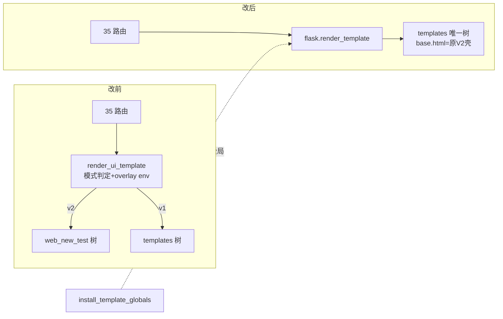

# fusion-dual-track-retirement design

## 0. 术语约定

| 术语 | 定义 | 防冲突结论 |
|---|---|---|
| 双轨机器 | render_bridge.py(243)/ui_mode.py(79)/ui_mode_request.py(58)/ui_mode_store.py(70)/routes/system_ui_mode.py(93) 五文件 + web_new_test/ overlay 树 | ADR [[v2-sidebar-shell-promotion]] 已裁决删除 |
| 壳转正 | V2 base.html 改造后覆盖 templates/base.html，style.css 进 static/css/ | roadmap 4.1 契约 |
| install_template_globals | 新建的模板全局安装函数，承接 init_ui_mode 的 8 个 Jinja 全局注入 | grep 全仓无同名 |
| APP_UI_MODE | 另一轴的 launcher 环境变量（与 aps_ui_mode cookie 无关），**不在本 feature 范围** | 侦察已区分，防误删 |

## 1. 决策与约束

**需求摘要**：执行 ADR `v2-sidebar-shell-promotion`——默认 UI（V2 侧栏壳）转正为唯一壳，整套双轨切换机器退役。成功标准：五文件与 web_new_test/ 整树删除、全站渲染走 flask 原生 render_template、用户视觉零变化（V2 用户无感知）、full gate 全绿、Win7 打包冒烟通过。

**复杂度档位**：走 Web 应用默认档位，无偏离。

**关键决策**（侦察 agent 按当前 HEAD 全量核证，纠偏挖掘档案多处过期）：

1. **六步实施序**（每步独立可验证，第 4 步原子）：
   - 步 0（已核销）：工作包3 孤儿 CSS + workbench 挂载已由 fusion-v2-quickwin-pack（cd0c2c3e）落地。
   - 步 1：V2 title 常量化修复（base.html:8 `{{ title or "排产系统" }}`）——现网 V2 用户可见变化，独立 commit；base.html 不在镜像守卫清单，单边改不触发守卫。
   - 步 2：壳转正——V2 base.html 改造版（静态链 `ui_v2_static.static`→`static`、**保留 :6-7 探针 meta 暂不删**、保留 nav 包裹挂载）覆盖 templates/base.html；style.css **cp（非 mv）**进 static/css/。此时双轨仍在、render_ui_template 不动：V1 用户看到新壳，V2 用户走 overlay 旧壳，两壳几乎相同，全量 gate 独立验证。
   - 步 3：切换入口下线——backup.html「界面设置」整卡(:31-60)+:10 文案、page_manuals_system.py 3 处、scheduler_manual.md:1755（**双份双写，镜像守卫仍 LIVE**）、README.md:41。路由本体暂留（无入口无害），规避删桥后 `ui_mode` 模板变量悬空的中间态。
   - 步 4（原子大 commit）：删 5 文件 + web_new_test/ 整树 + 探针 meta；新建 install_template_globals 接 factory；35 路由 import 切换（34 单行 + scheduler_config.py:14-21 多行块改直引 manual_src_security）；**web/routes/system.py:23 的 `from . import system_ui_mode as _ui_mode` 注册行与 :7 docstring 同删**（Codex 审核抓出的漏项——这是路由注册 side-effect 入口，漏删则应用导入直接炸）；static_versioning.py:22 删 ui_v2_static.static；bat :44/:70 删 add-data；tools 7 文件门禁源 + 台账校正（机制见决策 7）+ registry 同步；测试面 3 删 31 改（动态导入清单见 2.1）。LIVE 门禁源/台账/registry 互锁决定必须原子。
   - 步 5：行为不变收尾——删 base.css（转正后引用方归零）+ ui_contract.css legacy 注释段、verify_manual_styles.py/check_manual_layout.py 单模式化、pyrightconfig 死 exclude、3 处 ui_mode="v1" 死 kwarg。
2. **`_log_warning` 先搬后删**（侦察发现的隐藏炸点）：保留文件 web/manual_src_security.py:10 反向 import 被删文件 ui_mode_request 的 `_log_warning`(:21-29，9 行)——步 4 内先把它搬进 manual_src_security 私有化再删文件。
3. **8 个 Jinja 全局全部要搬**：init_ui_mode(:68-80) 注入的 safe_url_for/get_help_card/get_manual_url/get_full_manual_section_url/build_workbench_navigation_links/build_report_navigation_links/build_scheduler_navigation_links/preserved_report_context_fields 在 factory 零等效注入（grep 实证）；versioned url_for 由 static_versioning context_processor 兜底不依赖桥。新函数落 web/bootstrap/ 下（factory.py 调用点 :258 原位替换）。
4. **镜像守卫随树退役**：tests/gate_meta/test_v1_v2_mirror_sync_guard.py 在步 4 与 web_new_test/ 同删（其 docstring 已自述此命运），registry 两处登记同步退场。
5. **system_ui_mode 测试联动**：test_sp05_path_topology_contract.py:495 把被删文件列入 _safe_next_url 消费者元组并 read_text——步 4 必须同步删元组项（侦察新发现，档案未记）。
6. **打印缺陷不顺手修**：V2 sidebar-header 文字打印可见是存量缺陷（同孤儿 CSS 性质），登记观察项归后续 feature，本次不动 print.css（范围纪律）。
7. **台账校正走 sync_debt_ledger 流程，两段式刷新**（Codex 两轮审核共同打磨出的实施级顺序——第一版"先删全部常量再刷"被复审证伪：旧台账项的清除靠 `is_startup_scope_path()` 判定，它依赖 UI_MODE_STARTUP_SCOPE_PATHS（quality_gate_operations.py:204-209、quality_gate_shared.py:1419-1421），常量先删则 `web/ui_mode_store.py` 旧台账项（台账 :1983-1999）清不掉，gate 按"陈旧登记"报红且 refresh 链会去读已删文件）。定案顺序：① 删失效 SilentFallbackSample（quality_gate_shared.py:366-372），**启动链 scope 常量暂留**；② 跑 `refresh --mode scan-startup-baseline` 第一次——靠仍在的 scope 判定清掉旧 ui_mode 台账项；③ 删 UI_MODE_STARTUP_SCOPE_PATHS/GUARD_PATHS/GUARD_SYMBOLS 与 SILENT_REFRESH_SYMBOL_ALIASES/SILENT_REFRESH_GROUP_ALIASES（quality_gate_operations.py:43/:49，键全是 ("web/ui_mode.py", *)）中 ui_mode 相关条目等常量；④ 第二次刷新更新 scope；⑤ gate scan 验证零红。台账 JSON 区不许手改。
8. **步 2 的 style.css 临时双份加进镜像守卫**（Codex 建议采纳）：cp 后 static/css/style.css 与 web_new_test/static/css/style.css 形成新双写对，步 2 同 commit 把该对加进 test_v1_v2_mirror_sync_guard.py 清单（注释更新），步 4 随守卫整体退役——不选 mv 因为既有测试直接读 web_new_test 路径（test_manual_entry_scope.py:488/:503），mv 会炸中间态。

**明确不做**：不动 APP_UI_MODE 环境变量轴（launcher 语义）；不修 print.css；不给 sidebar 加 icons（roadmap 第 10 条）；不动 manual_src_security 的安全逻辑（只搬 _log_warning + 改 import 方向）；不重排 V2 壳视觉（转正=原样搬家+title 修复）；error_base.html 不动。

## 2. 名词与编排

### 2.1 名词层

**现状**（全部按当前 HEAD 实核）：
- 渲染入口：35 个路由文件 `from web.ui_mode import render_ui_template as render_template`（34 单行 + scheduler_config.py:14-21 两段多行：manual 系符号真身在 manual_src_security，facade 搭车出口）。
- 双轨核心：render_bridge.init_ui_mode（factory.py:39/:258 消费）注册 ui_v2_static 蓝图(:44-51)、构建 overlay env(:55-66)、注入 8 全局(:68-80)；get_ui_mode 被 tools/quality_gate_shared.py:208 守卫符号集消费。
- 切换面：POST /system/ui-mode 唯一路由，唯一模板入口 backup.html:36 表单。
- 探针：base.html:6-7 aps-ui-template-env meta ← tests/ui_geometry_probe_page_eval.mjs:63 与 test_ui_geometry_html_contract.py:78/:96/:139 消费。
- 量化：删除面 5 文件 543 行 + web_new_test 整树（base.html + 6 镜像模板 + style.css + manual 镜像）+ 测试 3 删 31 改 + tools 7 文件。
- **web.ui_mode / system_ui_mode 的非路由消费全集**（动态/直接导入，步 4 逐项安置，漏一处即红；Codex 两轮补齐至 9 项）：tests/app_runtime/test_safe_next_url_hardening.py:22（importlib.import_module("web.ui_mode")→改直引 manual_src_security）、tests/config/test_scheduler_config_manual_url_normalization.py:10（import web.ui_mode→同前）、tests/web_pages/test_request_service_test_factory_invariant.py:56（mock 面→随 facade 删重写或删用例）、tests/_scripts_e2e/run_complex_excel_cases_e2e.py:255 与 run_real_db_replay_e2e.py:188（from web.ui_mode import init_ui_mode→改调 install_template_globals）、web/routes/system.py:23（注册行，同删）、**tests/web_pages/test_system_request_services_contract.py:11（顶层 UI_MODE_COOKIE_KEY）+ :389-391/:467-468（函数内 import system_ui_mode→相关用例随路由删除）、tests/app_runtime/test_safe_next_url_observability.py:130-131/:181-184（直接调 ui_mode_set()→用例随路由删除）**。
- 探针 meta 的消费判定是"必须有"非三选一：ui_geometry_probe_page_eval.mjs:63-64 hasAppShell = meta 存在 && 壳结构 && 主题按钮；test_ui_geometry_html_contract.py:78/:139 同样硬断 meta——步 4 删 meta 同步改两入口判定为"壳结构+主题按钮"。**安全性已核证**（我方+Codex 双方独立确认）：错误页走 error_base.html（templates/error.html:1），无 header/nav/apsThemeToggle（error_base 内联样式自包含），删 meta 后两特征足以区分错误页，无需替代区分器。
- 文档清理面：README.md:41 与 :133、docs/manual_usability_review_report.md:23、docs/frontend_manual_audit_and_rewrite_blueprint.md:24、docs/manual_audit_report.md:6——README 两处步 4 改写；docs/ 三处属历史报告档案，列验收 grep 白名单不改写。

**变化**：
- 新增：`web/bootstrap/template_globals.py::install_template_globals(app)`（8 全局一次性安装，启动期调用，签名见示例）。
- 删除：五文件、web_new_test/ 整树、镜像守卫测试、test_ui_mode.py(511)、test_ui_mode_startup_guard_observability.py(85)。
- 修改：templates/base.html（被 V2 壳改造版覆盖）、35 路由 import、factory 调用点、static_versioning 端点集、bat、tools 门禁源、台账、31 个测试文件。
- 复制后临时双份（步 2，非移动）：web_new_test/static/css/style.css cp→ static/css/style.css，双份对入镜像守卫至步 4 同退（守卫 docstring"style.css 只在 V2 树"与对数文案同步改 8 对）；搬家：ui_mode_request._log_warning → manual_src_security 私有。

接口示例：

```python
# 来源：新建 web/bootstrap/template_globals.py（承接 render_bridge.py:68-80 原注入面）
def install_template_globals(app: "Flask") -> None:
    """启动期把跨页模板全局一次性装进 app.jinja_env（原 init_ui_mode 注入面，双轨退役后唯一安装点）。"""
    env = app.jinja_env
    env.globals.setdefault("safe_url_for", safe_url_for)
    env.globals["get_help_card"] = get_help_card
    # ... 共 8 个，与 render_bridge.py:68-80 逐一对应，无增无减
```

### 2.2 编排层



**现状**：每请求经 render_ui_template 做模式判定、选 env、重注 5 全局（:200-205）；启动期 init_ui_mode 注 8 全局 + 注册 ui_v2_static 蓝图。
**变化**：渲染链退化为 flask 原生；8 全局改启动期单点安装；蓝图/overlay env/模式判定整段消失。

**流程级约束**：
- 原子性：步 4 的删除面/接线面/门禁源/台账/测试面互锁，必须单 commit 落地，验证 = full gate 全净（worktree 含 untracked 全净）。
- 镜像纪律：步 1-3 期间镜像守卫仍 LIVE，凡动双份文件必须双写（manual.md 等）。
- 不留垫片：ui_mode.py facade 不保留任何转出口；manual 系 import 全部改直引 manual_src_security。
- 错误语义：install_template_globals 安装失败应让启动失败（不 try-pass）——宏断供是页面级灾难，启动期暴露优于运行期 UndefinedError。
- 可观测点：workbench 契约测试 :108（nav 结构）转正后改读 templates/base.html 继续守卫；:118 `static-v2` 前提自检断言步 4 删除（随双轨消失失去语义）。

### 2.3 挂载点清单

1. 壳：`templates/base.html` 被 V2 改造版覆盖 — 修改（转正核心）
2. 模板全局安装：`web/bootstrap/template_globals.py` + factory.py:258 调用点 — 新增/修改
3. 静态版本化端点集：`web/bootstrap/static_versioning.py:22` 删 `ui_v2_static.static` — 修改
4. 打包：`build_win7_onedir.bat` :44/:70 删 web_new_test add-data — 修改
5. 门禁源：tools/ 7 文件（quality_gate_shared/scan/ledger/operations/entries/support、long_gate_manifest、test_registry_data/groups_misc）ui_mode 相关条目退场 — 修改
6. 切换入口：backup.html「界面设置」卡 + POST /system/ui-mode 路由 — 删除

### 2.4 推进策略

1. 步 1 title 修复 → V2 渲染任意页 `<title>` 显示页名；独立 commit
2. 步 2 壳转正 → V1 强制模式渲染出侧栏壳、全量 gate 绿；style.css 双份对加进镜像守卫；独立 commit
3. 步 3 入口下线 → /system/backup 无界面设置卡、manual 双份同步、镜像守卫绿；独立 commit
4. 步 4 原子退役 → 五文件+整树删除、35 路由切换、8 全局经新函数注入、门禁源/台账/测试面同步；full gate 全净 + 打包冒烟
5. 步 5 收尾 → base.css 等死引用清理；gate 绿

### 2.5 结构健康度与微重构

##### 评估
- 文件级 — web/bootstrap/factory.py（~480 行）：本次改 2 行（import+调用点），健康。
- 文件级 — 新文件 template_globals.py 预估 ~40 行，落 web/bootstrap/（已有 static_versioning.py 同类先例），归属清晰。
- 目录级 — web/bootstrap/ 现 4 文件，加 1 不摊平。
- compound 检索：命中 [[v2-sidebar-shell-promotion]] ADR（本 feature 即其实施）；无目录组织类 convention。

##### 结论：不做

##### 超出范围的观察
- V2 sidebar 打印可见缺陷（print.css 不认 .sidebar div）——存量缺陷，建议并入 fusion-anchor-baseline-prep 的打印介质回归清单或单独小修。
- ui_contract.css:2937 "Legacy V1 tokens" 注释段与 style.css:708 六变量临时副本——归 fusion-tokens-single-source。
- 根目录 verify_manual_styles.py / check_manual_layout.py 属脚本类双模式遗存，步 5 单模式化但不重构其结构。

## 3. 验收契约

关键场景：
1. 步 1 后：V2 渲染 `GET /scheduler/gantt` 的 `<title>` 含「甘特图」而非常量「APS 排产系统」。
2. 步 2 后：强制 v1 cookie `GET /` 渲染出侧栏壳（含 sidebar-nav 与 top-header）；全量 required 0 失败。
3. 步 3 后：`GET /system/backup` 无「界面设置」卡、无 ui_mode 表单；镜像守卫 8 对全绿（步 2 起含 style.css 双份对；manual 双写同步）。
4. 步 4 后：`grep -r "from web.ui_mode\|render_bridge\|web_new_test" web/ templates/ tools/ tests/ static/ *.bat` 零命中（台账 JSON 历史行经 sync_debt_ledger 流程校正后的残留、docs/ 三份历史报告、本 feature 文档为白名单）；`GET /` 等 20 条锚点页面全部 200 且几何契约过（探针判定已改壳结构+主题按钮）；workbench 下拉、help 卡、manual 链接、报表导航在真渲染中可用（8 全局无一断供）；POST /system/ui-mode 404；`python -c "import app"` 不炸（system.py 注册行已删）。
5. 步 4 后：full gate 全净通过（含 quickref/required 长缓存重算）；`build_win7_onedir.bat` 语法面无 web_new_test 残留（打包冒烟或静态校验）。
6. 步 5 后：base.css 物理删除且全仓零引用；verify_manual_styles.py 单模式跑通。
7. 全程：用户视觉零变化（步 1 title 除外）——改前/改后 V2 首页+gantt 截图比对。

明确不做的反向核对：
- print.css 零 diff；error_base.html 零 diff；icons 不加（sidebar nav-item 区无 svg 新增）。
- APP_UI_MODE 相关测试（launcher 轴）零 diff。
- manual_src_security.py 安全函数签名零变化（仅新增私有 _log_warning + 删一行 import）。

## 4. 与项目级架构文档的关系

验收时归并：① ARCHITECTURE.md「顶层计划工作台入口」「首页计划员值班台」等条目中"经典界面/现代镜像/双树"的表述全部改单树口径；② 删除双轨相关记载（render_bridge/ui_mode 机制描述若有）；③ ADR v2-sidebar-shell-promotion 标注已实施；④ roadmap 第 2 条回写 done，第 26 条镜像守卫标注已随树退役。
