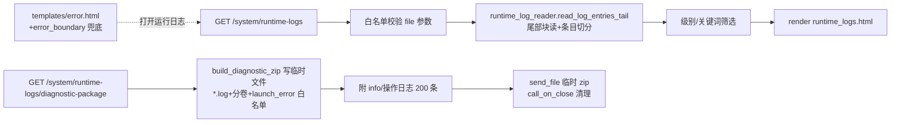

# fusion-runtime-log-viewer design

## 0. 术语约定

| 术语 | 定义 | 防冲突结论 |
|---|---|---|
| 运行日志 | logs/ 下的文件日志（aps.log/aps_error.log/launcher.log），程序自动产生 | 与既有「操作日志」（OperationLogs 表，业务审计）严格区分，页面命名并列 |
| 日志条目 | 以 `^\d{4}-\d{2}-\d{2} \d{2}:\d{2}:\d{2} \[` 时间戳行为界切出的块（含后续 traceback 行）——三个 handler 的 formatter 都以该格式开头（console :93-101 / 文件 :103-117 / error 文件 :119-134，datefmt 同一），锚定稳定 | 实读三份真实日志验证：aps.log 70093/70175 行命中、launcher.log 355/355、aps_error.log 92 行中锚点行 4 个（:1/:23/:47/:69，余为 traceback 多行体，符合预期） |
| 诊断包 | logs/ 下 `*.log`（含轮转分卷 aps.log.N）+ aps_launch_error.txt + 环境信息 + 最近操作日志打成的 zip | 全仓无 zipfile 先例；临时文件范式参照 excel_utils.py:346-349（彼处 os.fdopen 接管 fd；本 feature 因 zipfile 自己重开路径，直接 os.close(fd)），下载用 send_file(路径) + 响应关闭回调清理（见决策 4'） |
| 块式倒读 | 从文件尾部按块读取避免整文件载入（aps.log 已 8MB 逼近 10MB 轮转上限） | 新词，无冲突 |

## 1. 决策与约束

**需求摘要**（用户 2026-06-11 提出）：现场报错后计划员只能进文件夹翻 log 人肉转述，维护者远程拿不到证据。三件事：① 系统管理新增「运行日志」页自助看报错；② 一键导出诊断包微信/U 盘发给维护者；③ 报错页"请查看日志"文案升级为带入口的门。成功标准见第 3 节。

**复杂度档位**：走 Web 应用默认档位，无偏离。

**关键决策**：

1. **三文件白名单 + 显式选择**：页面只认 `aps_error.log`（默认）/`aps.log`/`launcher.log` 三个固定名，query 参数 `file` 校验进白名单，非白名单值显示"未知的日志文件"并回默认——不做任意路径读取（目录遍历红线）。轮转分卷不进页面（页面看最新，分卷归诊断包）。
2. **读取策略：尾部块读 + 条目上限 + 边界规则钉死**：以二进制模式从文件尾向前按 64KB 块步进读取，**字节层先拼接、后解码**——锚点匹配在字节层做（时间戳锚点是纯 ASCII，字节正则无歧义），跨块的 UTF-8 多字节字符天然完整（解码永远发生在"自最后一个完整时间戳锚点起的连续字节段"上）；解码统一 `decode("utf-8", errors="replace")`，损坏字节显示为 �（诚实呈现不吞）。按时间戳行边界切条目，最多取最近 200 条（常量单点）后停——10MB 文件不整读。**超长条目**：内存保留量受 MAX_ENTRY_BYTES（256KB）硬上限——超限即转「弃中段巡锚」模式：固定保留条目尾半（128KB），继续按块向前只为找上一个时间戳锚点（每块仅留 24 字节锚点跨界窗口，中段字节即读即弃，内存恒 O(块)）；找到锚点后回读条目头半（128KB），按 头+「……（条目过长，中段已截断）」+尾 呈现——头行的时间戳/级别恰是排障最关键信息，不能因条目超长而丢失；**巡锚 IO 预算 ENTRY_HUNT_BUDGET_BYTES（4MB）**：超预算仍无锚点（launcher.log 无轮转上限的病态场景）即放弃头半，按无锚点兜底呈现尾半（实现初版「累计 256KB 即停」会让 >320KB 条目头行整体丢失，2026-06-12 实现期修订为本方案——内存上限不变，IO 上限由 256KB 放宽至 4MB 显式预算）。**截断切点在解码前回退至合法 UTF-8 字符边界**（向前扫至非延续字节，最多回退 3 字节），避免一刀切出假 �——� 只代表磁盘上真实的坏字节，不是截断副作用。**向前读尽文件头仍无锚点**（非本系统格式的文件被指为日志）：保留量同受 256KB 上限约束，整段（超限时为尾半）作为一条 level=UNKNOWN 的条目呈现，头行显示「（无法按时间戳切分，原样显示尾部内容）」。空文件/文件不存在显示诚实空态（"暂无报错记录，系统运行正常" / "日志文件不存在（可能尚未产生）"），读取失败明示"日志读取失败"不静默（4.11 契约）。
3. **筛选最小集**：级别（ERROR/WARNING/全部，对 aps.log 有意义）+ 关键词包含匹配（对条目全文）。不做日期范围（条目本就倒序，翻到为止）、不做正则（普通用户用不上）、不做分页 DB 化（文件就是源）。
4. **诊断包安全红线（roadmap 4.11 + items notes 钉死，红线表述已于 2026-06-11 回写修订）**：zip 收 logs/ 下三类——`fnmatch *.log`、轮转分卷 `正则 ^.+\.log\.[0-9]+$`（精确匹配 RotatingFileHandler 的 .1~.5 命名，比 `*.log.*` 通配窄，杜绝 `x.log.bak` 之类混入）、显式列名的 `aps_launch_error.txt`（启动失败关键证据；上游 roadmap 红线原文"只收 *.log 通配"会丢失它，已先回写 roadmap/items 把红线改为白名单制再落本设计——单文件显式列名，不开通配口子）。**结构性排除 aps_secret_key.txt**（同目录密钥，泄漏即事故）；实现处注释明示红线 + 测试断言 zip 名单永不含 secret。
   **4'. 临时 zip 的生命周期（Windows 时序钉死）**：`tempfile.mkstemp` 返回已打开的 fd——照 excel_utils.py:346-349 先例**立即 `os.close(fd)` 释放句柄**（zipfile 自己开路径写）；清理**不用普通 try/finally**（finally 在 send_file 返回响应对象时就执行，Windows 下文件正被响应流持有，删除会 PermissionError 或截断下载），改用 **`response.call_on_close(清理函数)`**——响应流真正关闭后删文件，清理函数内 `os.remove` 失败只 logger.warning 不抛（孤儿临时文件是可容忍的降级，下次系统临时目录清理会收走）；构包阶段（send_file 之前）失败则当场 finally 删除并 flash 错误。
5. **环境信息新立单点**：全仓无 APP_VERSION 常量（侦察纠偏），诊断包内 `diagnostic_info.txt` 拼现有事实：APP_NAME、CURRENT_SCHEMA_VERSION（migration_state.py:9）、health contract_version、sys.version 首行、platform.platform()、导出时间。不新立版本号体系（那是发布流程的事，归观察项）。
6. **操作日志附最近 200 条**：复用 operation_log_service.list_recent(limit=200)（侦察核实签名现成），写成 `operation_logs.txt` 纯文本附进 zip——对照"报错前用户干了什么"。读取失败时 zip 内放说明文件不中断导出（诊断包本身是排障工具，部分内容缺失好过整体失败，但缺失必须在包内明示）。
7. **报错出口接门双路径**（侦察纠偏：主战场是 templates/error.html 非 error_boundary）：① templates/error.html :4/:23 文案补「打开运行日志」链接（url_for），并新增**发生时刻**一行（服务端本地时间，格式与日志时间戳同 `YYYY-MM-DD HH:MM:SS`）——用户带着这个时刻去运行日志页按时间对位，把"看到错就去翻日志"变成"按时刻定位条目"；② error_boundary.py:344 minimal 兜底页是纯字符串拼接且渲染于"模板系统已坏"的场景——**只改文案加裸路径 `/system/runtime-logs` 文本提示与同格式时刻，不引 url_for**（模板坏时 url_for 可能也不可靠，裸文本最稳）。errorhandler(500) 的 JSON payload 文案不动（API 消费方不需要页面链接）。
8. **只读不写、不删**：不提供清空/删除日志（轮转管大小，报错证据不许销毁——与操作日志页的删除功能刻意相反，页面文案明示这一点）。
9. **新路由文件 + 速查表同步**：`web/routes/system_runtime_logs.py`（照 system_health.py 模式挂 system bp），system.py 加 side-effect import；**两条新路由必须同步系统速查表**（check_quickref_vs_routes 是 LIVE 门禁，刚在双轨退役吃过亏）。

**明确不做**：不做日志 tail 实时刷新/websocket；不做远程上报；不做日志级别运行时调整；不删改 logging.py 任何配置；不做任意文件下载端点（只有打包端点）；不动操作日志页既有功能；EXPECTED_PAGE_SIGNALS 锚点登记本期不做（手工清单非强制，归 fusion-anchor-baseline-prep 统一盘）。

## 2. 名词与编排

### 2.1 名词层

**现状**：
- 日志产物：AppLogger 三 handler（logging.py:93-101 console / :103-117 文件 / :119-134 error 文件），formatter 时间戳行首格式钉死；launcher.log 由 launcher_observability.py append（行格式 `时间 [LEVEL] text`，无轮转上限）。LOG_DIR=config.py:33（APS_LOG_DIR env 优先）。
- 页面骨架先例：system_logs.py（路由+筛选+分页）、templates/system/logs.html（hero 卡+筛选卡+结果卡）、system_nav 宏三入口（ui_macros.html:407-413）。
- 下载先例：excel_utils.py:404-409 BytesIO+send_file（小文件适用，本 feature 因体量改临时文件路径，mkstemp 句柄处理照 :346-349）。
- 「请查看日志」出口：templates/error.html:4/:23（主）、error_boundary.py:316/:344（兜底）、error_handlers.py:103/:110（JSON/HTML 装配处）。

**变化**：
- 新增 `core/services/system/runtime_log_reader.py`：纯函数读取层（详见接口示例）——放 core/services/system/ 与 operation_log_service 同居，路由薄。
- 新增 `web/routes/system_runtime_logs.py`：两条路由（页面 GET + 诊断包 GET）。
- 新增 `templates/system/runtime_logs.html`：照 logs.html 骨架。
- 修改：ui_macros.html system_nav 宏加第 4 入口；templates/error.html 两处文案接门；error_boundary.py:344 兜底文案；系统速查表登记两路由。

接口示例：

```python
# 来源：新建 core/services/system/runtime_log_reader.py（纯函数，不依赖 Flask）
LOG_FILE_CHOICES = ("aps_error.log", "aps.log", "launcher.log")   # 页面白名单
MAX_ENTRIES = 200            # 页面单次最多条目
TAIL_BLOCK_SIZE = 64 * 1024  # 尾读块步进
MAX_ENTRY_BYTES = 256 * 1024 # 单条目硬上限，超过则头尾保留+截断标记
ENTRY_ANCHOR_RE = re.compile(rb"(?m)^\d{4}-\d{2}-\d{2} \d{2}:\d{2}:\d{2} \[")  # 字节正则——锚点匹配在 bytes 层，勿用 str 正则
DIAGNOSTIC_EXTRA_FILES = ("aps_launch_error.txt",)  # 诊断包显式白名单（启动失败证据，唯一 .txt 例外）

def read_log_entries_tail(log_path: str, *, max_entries: int = MAX_ENTRIES) -> List[Dict[str, str]]:
    # 输入：日志文件绝对路径 → 输出：倒序条目 [{"head": 首行, "body": 余下行, "level": "ERROR"}, ...]
    # 二进制尾读：字节层跨块拼接 → 锚点切分 → 每条目独立 decode("utf-8", errors="replace")
    # level 从头行 `[LEVEL]` 正则捕获，捕获不到 → "UNKNOWN"（模板按未知级别样式渲染，不猜不吞）
    # 文件不存在 → 返回 []（路由层据此出"尚未产生"空态）；读取 IO 错误 → 抛 OSError（路由层明示"读取失败"）
    # "2026-06-11 20:26:25 [ERROR] web... :\n  消息\nTraceback..." → head/body/level 三段

def build_diagnostic_zip(log_dir: str, zip_path: str, *, operation_logs_text: str, info_text: str) -> None:
    # 写入 zip_path（调用方 mkstemp 后立即 os.close(fd)；清理走 response.call_on_close，见决策 4'）——
    # 不返回 bytes：launcher.log 无轮转上限、分卷最坏 ~60MB，全内存构包不可接受；
    # zipfile.ZipFile(zip_path, "w", ZIP_DEFLATED) + zf.write(逐文件流式压缩) 内存占用 O(块)
    # 收 log_dir 下 fnmatch("*.log") + re ^.+\.log\.[0-9]+$ 分卷 + DIAGNOSTIC_EXTRA_FILES 存在者；
    # 永不收其它文件（aps_secret_key.txt 结构性排除）；附 diagnostic_info.txt 与 operation_logs.txt
```

### 2.2 编排层



**现状**：系统管理组三页（备份/操作日志/排产历史），side-effect import 注册（system.py:15-22）；错误页死文案无入口。
**变化**：组内加第 4 页 + 下载端点；错误出口指过来。零既有流程改动，纯增量挂载。

**流程级约束**：
- 错误语义：日志读取 OSError → 页面明示"日志读取失败：{中文原因}"不吞；诊断包内单项缺失（操作日志读不到）→ 包内放 `operation_logs_读取失败.txt` 说明，导出不中断；zip 构建阶段失败 → flash 错误回页面，临时文件当场 finally 清理；下载成功路径走 response.call_on_close 清理（决策 4'）。
- 安全：file 参数白名单严格相等匹配（不做路径拼接）；zip 名单测试钉死 secret 排除且**该测试登记进 tools/test_registry_data.py 的 QUALITY_GATE_GUARD_TESTS**（安全红线交给门禁强制，不靠人记得跑）；**同时登记进 tools/test_registry_groups_misc.py 的 request_services_runtime_error_boundary 组 target_paths**（required 测试必须被 required regression group 覆盖——test_registry.py:264-265 强制，该组 scope 已含 web/routes/**、core/services/system/**、templates/system/**，恰是本 feature 的全部落点；不新建组，group_count==8 被 test_long_gate_manifest.py:117 钉死）；下载文件名 `aps_诊断包_YYYYMMDD_HHMMSS.zip` 中文语义。
- 性能与内存：尾读上限 200 条 + 64KB 块步进，最坏读约 1-2MB 不整读 10MB；诊断包写临时文件流式压缩（launcher.log 无轮转上限 + 分卷最坏 ~60MB，禁全内存构包），同步打包 Win7 可接受（本地零网络），不做异步。
- 可观测：导出动作写一条操作日志（复用 op_logger，与备份下载同纪律）；导出失败 logger.error。
- 速查表同步：两条路由 + 文档同段登记（LIVE 门禁）。
- 测试落位：读取层边界单测 `tests/web_pages/test_system_runtime_log_reader.py`（真实 formatter 样本/跨块多字节字符/超长条目截断/无锚点文件/坏字节 replace）；页面契约 `tests/web_pages/test_system_runtime_logs_page.py`；诊断包安全 `tests/web_pages/test_diagnostic_package_security.py`（守卫登记项）。**call_on_close 测试注意**：Flask test client 默认非 buffered，挂在 call_on_close 上的清理只在 `Response.close()` 时执行——下载成功路径的测试必须读完响应体后显式 `resp.close()`（或 with 上下文）再断言临时文件无残留，否则会误判泄漏。

### 2.3 挂载点清单

1. 路由注册：`web/routes/system.py` 加 `from . import system_runtime_logs` side-effect import — 修改
2. 导航入口：`templates/components/ui_macros.html` system_nav 宏第 4 入口（active 键 runtime_logs） — 修改
3. 错误页接门：`templates/error.html` 两处 + `web/error_boundary.py:344` 兜底文案 — 修改
4. 速查表：`开发文档/系统速查表.md` 登记两条新路由 — 修改（LIVE 门禁源）
5. 守卫登记：`tools/test_registry_data.py` QUALITY_GATE_GUARD_TESTS 加诊断包安全测试 — 修改（required 集随之 +1）
6. 守卫组覆盖：`tools/test_registry_groups_misc.py` request_services_runtime_error_boundary 组 target_paths 加同一测试 — 修改（required 测试必须有 group owner，不新建组）

### 2.4 推进策略

1. 读取层：runtime_log_reader 纯函数 + 边界单测（真实 formatter 样本/空文件/跨块多字节/超长条目/无锚点/坏字节）→ 单测绿
2. 页面：路由 + 模板 + system_nav 入口 → 浏览器三文件切换/筛选/空态可见
3. 诊断包：zip 构建（临时文件）+ 下载端点 + 安全断言测试（zip 名单永不含 secret，先红后绿写法：先断言空实现红）+ 守卫登记 → 下载解包验证内容
4. 接门：error.html（链接+发生时刻）+ 兜底文案 + 速查表登记 → 500 页可点入运行日志；check_quickref_vs_routes OK
5. 全量验证：required 门禁 + 真实服务截图目检 → 全绿

### 2.5 结构健康度与微重构

##### 评估
- 文件级 — 新增 3 文件（reader 预估 ~150 行 / 路由 ~120 行 / 模板 ~150 行），全部远低于 500 行门禁（新 py 文件自动入扫，侦察核实）。
- 文件级 — ui_macros.html（~420 行）加 3 行入口；error_boundary.py 改 1 行文案；改动密度低。
- 目录级 — core/services/system/ 现 4 文件、web/routes/ 的 system_* 现 6 文件，各加 1 不摊平且命名同构。
- compound 检索：无目录组织类 convention 命中。

##### 结论：不做

##### 超出范围的观察
- 全仓无应用版本号常量（诊断包只能拼 schema/contract 版本）——若要正式版本体系需走发布流程设计，建议后续 cs-decide。
- error_handlers.py 的 500 JSON 文案"请查看日志"对 API 消费方无入口可言——未来若做前端 fetch 错误统一提示再议。

## 3. 验收契约

关键场景：
1. `GET /system/runtime-logs`（有报错历史）→ 200，默认展示 aps_error.log 倒序条目，最新在最上；条目首行含时间戳与级别，traceback 折叠/区块呈现；系统管理导航高亮。
2. 切换 `?file=aps.log` / `?file=launcher.log` → 各自内容；`?file=../etc/passwd` 或任意非白名单值 → 显示"未知的日志文件"且回落默认，不发生文件读取。
3. 关键词筛选 `?q=备份` → 仅含该词条目；级别筛选 ERROR → 仅 ERROR 条目。
4. 空 error 日志 → "暂无报错记录"绿色空态；文件不存在 → "日志文件尚未产生"；读取 IO 失败（测试 monkeypatch）→ "日志读取失败"明示，页面 200 不抛 500。
5. 读取层边界（单测钉死）：① 跨 64KB 块边界的多字节中文字符完整呈现不出 �（构造样本卡块边界）；② 单条目 >256KB → 头尾保留 + 「……（条目过长，中段已截断）」标记，且截断切点回退合法 UTF-8 边界不产生假 �；③ 真实损坏字节 → � 替换显示不抛 UnicodeDecodeError；④ 整文件无时间戳锚点 → 单条 UNKNOWN 条目原样呈现（读取量同受 256KB 上限）；⑤ 头行无 `[LEVEL]` → level=UNKNOWN。
6. `GET /system/runtime-logs/diagnostic-package` → zip 附件下载（临时文件构包；下载成功路径 response.call_on_close 清理、构包失败路径当场 finally 清理，测试两条路径都断言无残留临时文件）；解包含 aps.log/aps_error.log/launcher.log（存在者）+ `*.log.[0-9]+` 分卷 + aps_launch_error.txt（存在时）+ diagnostic_info.txt（schema=19 等）+ operation_logs.txt；**永不含 aps_secret_key.txt**（测试在 logs 目录播种假 secret 后断言 zip 名单），**且 `x.log.bak` 等非数字后缀不进包**；该安全测试已登记 QUALITY_GATE_GUARD_TESTS + group target_paths 双处。
7. 操作日志服务读取失败（monkeypatch raise）→ zip 仍生成，内含读取失败说明文件。
8. 任意页触发 500（测试用既有 500 测试路径）→ 错误页含「打开运行日志」链接指向 /system/runtime-logs，且含与日志同格式的发生时刻 `YYYY-MM-DD HH:MM:SS`。
9. 页面无删除/清空按钮（grep 模板反向断言）；导出动作落一条操作日志。
10. check_quickref_vs_routes → OK（两新路由已登记）。
11. required 门禁全量 0 失败（含新登记守卫）。

明确不做的反向核对：
- 无 POST 路由（grep system_runtime_logs.py 只有 @bp.get）。
- logging.py 零 diff；system_logs.py（操作日志页）零 diff。
- 模板无 setInterval/websocket（无实时刷新）。
- zip 构建代码中无目录通配收任意文件（白名单常量唯一来源）；无 `*.log.*` 宽通配（只认数字分卷正则）。
- reader 无无参 `read()` / `readlines()` 整文件读取（grep 反向断言；带 size 参数的块读 `read(TAIL_BLOCK_SIZE)` 合法）。

## 4. 与项目级架构文档的关系

验收时归并：ARCHITECTURE.md 系统管理相关条目补一句"运行日志页（文件日志只读查看+诊断包导出，与操作日志的业务审计语义并列）"；roadmap 第 34 条回写 done。reader 纯函数层若被未来备份健康提示（第 32 条）复用 logs 目录读取，接口已就位。
