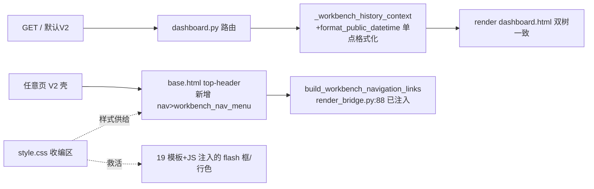

# fusion-v2-quickwin-pack design

## 0. 术语约定

| 术语 | 定义 | 防冲突结论 |
|---|---|---|
| V2 壳 | `web_new_test/templates/base.html`，默认 UI（`DEFAULT_UI_MODE="v2"`，web/ui_mode_request.py:12）的页面骨架 | 与 roadmap/记忆口径一致 |
| 孤儿 CSS | 规则只存在于 `static/css/base.css`（V1 专属）、但消费方模板/JS 在 V2 默认态也会渲染的类——V2 不加载 base.css，故这些元素今天裸奔 | 挖掘档案已对抗核证（capability-mining.md 工作包3 [corrected] 条） |
| 收编区 | `web_new_test/static/css/style.css` 中承接 V1 规则的分节；文件已有先例分节 `Legacy V1 template compatibility layer`（:560） | 沿用既有命名语义，不新造词 |
| 公开时间口径 | `format_public_datetime`（web/viewmodels/scheduler_history_summary.py:209-213）输出的"X年X月X日 HH:MM"；坏值→"时间记录异常"，空值→"-" | 已有测试钉死（test_scheduler_candidate_plain_language.py:309） |

## 1. 决策与约束

**需求摘要**：默认界面三处当天可感知的存量缺陷一次修复——① 「计划工作台」入口只挂在 V1，默认 UI 看不见（旗舰缺陷）；② 19 模板 + 1 处 JS 注入的 `flash-card flash-warning` 降级警示框、process/detail 内外协行色等 11 类样式在 V2 裸奔（降级提示视觉弱化 = 变相伪装好数据）；③ 首页"当前查看排产"卡的时间是裸 DB 字符串（全仓唯一一处未走公开口径的 schedule_time）。成功标准见第 3 节。

**复杂度档位**：走 Web 应用默认档位，无偏离。

**关键决策**：

1. **V2 挂载点选 top-header 并包一层 `<nav>`**——下拉链接样式选择器是 `nav .aps-workbench-nav-link`（ui_contract.css:3576/:3585），要求 nav 祖先；V1 命中是因为挂在 `<header><nav>` 里，V2 top-header（web_new_test base.html:112）内无 nav。不包 nav 则菜单链接裸样式。（换做法名词层不同：改 CSS 选择器会动 V1 已验收的样式面，扩散风险更大。）
2. **下拉样式需补浅色适配，落 style.css 收编区**——`.aps-workbench-nav` 用的 `--aps-nav-text` 只定义在 base.css:18（V2 不加载），hover/open 态硬编码 `#334155` 深底白字是按 V1 深色导航设计的，直接挂上浅色 top-header 视觉突兀。补约 10 行 scoped 规则（`.top-header .aps-workbench-nav…`）适配浅色；色值暂用裸 hex 并留注释指向 fusion-tokens-single-source（00-tokens.css 尚不存在，token 化是第 5 条的事）。
3. **收编的 flash 规则用 `:not(.alert)` 与双挂元素硬隔离，插位无关**——对抗审核证伪了最初的"插位"方案：`.flash-card.flash-warning` specificity (0,2,0) 恒压 `.alert-warning` (0,1,0)，先后顺序根本不参与裁决，原样收编会把 V2 flash 循环消息（双挂 `flash-card flash-* alert alert-*`，V2 base.html:145 与 common_draft.js:128）翻成 flash 配色（文字色/边框全变）。定案：收编变体一律写成 `.flash-card.flash-warning:not(.alert)`（亮色）与 `html[data-theme="dark"] .flash-card.flash-warning:not(.alert)`（暗色），只命中单挂的页内框/JS 注入框（19 模板 + resource_execution_cards.js:70 全部不带 alert 类），双挂元素完全不被新规则触碰——"双挂零变化"由选择器结构保证，不依赖级联顺序。`:not(单类)` Chrome 109 安全。
4. **收编不是逐行剪贴，需补三类伴生物才能成活**（两轮对抗审核发现的硬依赖）：① **盒模型**——单挂框的 padding/圆角/下边距/阴影在 V1 来自 base.css:344-352 的 `.flash-card` 基类，style.css:537 的基类只有 padding-right+transition；补 `.flash-card:not(.alert)` 盒模型规则（同样 :not 隔离，不碰双挂的 alert 盒模型）。**收编时不含 :349 的 `transition: opacity 0.4s` 行**——让 style.css:537 既有 transition（0.2s 双属性）继续生效，避免 (0,2,0) 把单挂框淡出降格成 0.4s 单属性；padding-right 40px 压过既有 3rem 与 V1 渲染一致，单挂框无 .flash-close 子元素（复审抽查 gantt/config 页写死框均纯文本 div）无叠字风险。② **动画**——`.btn-loading::before` 依赖 `@keyframes aps-spin`（base.css:581，全仓唯一定义），随规则一并收编，否则加载圈是静止残圈。③ **CSS 变量六个**（第二轮复审纠错：原"五个"清单漏了盒模型消费的第六个）——收编规则引用的 `--aps-success/--aps-warning/--aps-danger/--aps-border/--aps-text-muted/--aps-radius` 在 V2 链路亮色态全部未定义（未定义变量使整条声明失效：左色条消失、border-radius 归 0），在收编区头部 `:root` 补这六个定义，值取 base.css:8-19 原值（#16a34a/#d97706/#dc2626 恰是 roadmap 4.4 定版语义色，不取 style.css 自有的 --warning-color #f59e0b 那套分叉值；--aps-radius: 6px 恰与 style.css --radius-md 0.375rem 等值），注释标注"待 fusion-tokens-single-source 收编"；暗色态 --aps-border/--aps-text-muted 已由 ui_contract.css:2941-2942（html[data-theme=dark] 块内）重定义，层叠自然接管，不重复定义；--aps-success/warning/danger 在 V1 暗色区也无重定义，沿用亮色值与 V1 行为一致。**激活回归已穷尽排除**：V2 四 CSS 中 var(--aps-*) 的全部既有消费点只有 ui_contract.css:10-18/:20 的 fallback 位，且被一级变量（--success-color 等恒定义）短路永不求值——补定义零激活、零回归。
5. **首页时间在路由侧单点格式化，模板只消费 display 值**——与全仓既有模式一致（scheduler_week_plan.py:94、scheduler_analysis_read.py:44 都是路由侧格式化，均在 web/routes/domains/scheduler/ 下；其余模板消费 `schedule_time_display`）。格式化点落 `_workbench_history_context`（web/routes/dashboard.py:225-234，workbench_history 的唯一产地，下游两个消费点——:326 喂 summary builder、:346 喂模板——共用）。workbench_history 空库时为 None，取值用与该函数既有风格一致的 getattr 形式，不点属性。不在模板里调函数、不新增 Jinja filter。
6. **dashboard.html 双树同改并保持字节级一致**——它是 6 个镜像模板之一，镜像守卫（第 26 条）尚未落地，本 feature 自带 cmp 验证。

**明确不做**：不删 `static/css/base.css`（V1 壳 templates/base.html:44 还在引用，删除属第 2 条双轨退役）；不动 render_bridge/ui_mode 双轨机器；不修 V2 `<title>` 常量化缺陷（第 2 条工作包②）；不给 V2 sidebar 加图标（第 2 条可选项）；不改 `.alert-*` 既有规则一个字符；不写镜像守卫测试（第 26 条独立 feature）。

## 2. 名词与编排

### 2.1 名词层

**现状**：
- `workbench_nav_menu` 宏：templates/components/workbench_nav_macros.html:5-29，details/summary 下拉，消费 Jinja 全局 `build_workbench_navigation_links()`；该全局在 V1 env 与 V2 overlay env **双双已注入**（render_bridge.py:73 与 :88）——V2 挂上即取到数据，无需新注入。
- `ScheduleHistory.schedule_time`：`Optional[str]`（core/models/schedule_history.py:12），DB 默认值产生的 `"YYYY-MM-DD HH:MM:SS"` 裸字符串；dashboard.html:137 `{{ ui.summary_item('时间', latest_history.schedule_time) }}` 直接渲染（全仓唯一裸渲染点）。
- 孤儿 CSS 11 类全集（base.css 行号）：`.flash-card.flash-success/.flash-error/.flash-warning`(:354-373)、`.warning`(:149)、`.stat-card-delta`(:486)、`.group-box`(:726)、`.row-internal/.row-external`(:718-722)、`.btn-loading`(common_confirm.js:247 消费)、`.required-label`(common_required.js:30 消费)；暗色变体区 :773-811 中**只挑 flash 三变体 + row 两类共 5 条**（同区的 `.stat-card`/`pre`/`.empty-state-icon` 暗色规则不在孤儿清单，不搬）。伴生物三件（决策 4）：`.flash-card` 基类盒模型(:344-352，不含 :349 transition 行)、`@keyframes aps-spin`(:581)、六个 `--aps-*` 变量定义（success/warning/danger/border/text-muted/radius）——缺任何一件收编规则在 V2 链路下半残。

**变化**：
- 新增：style.css「V1 收编区」规则块（11 类 + 5 条暗色变体 + 约 10 行下拉浅色适配），动机见决策 2/3。
- 新增：dashboard 模板上下文新字段 `latest_history_time_display: str`（路由侧由 `format_public_datetime(workbench_history.schedule_time)` 产出；无记录时模板侧本就不渲染该卡）。
- 修改：dashboard.html:137（双树）消费 display 值替代裸字段。

接口示例：

```
# 输入 → 输出（来源：web/viewmodels/scheduler_history_summary.py format_public_datetime）
"2026-05-05 10:00:00"  → "2026年5月5日 10:00"
"debug raw garbage"    → "时间记录异常"
None / ""              → "-"
```

### 2.2 编排层



**现状**：V2 壳渲染链 `render_ui_template → v2_env`（render_bridge.py:182-193）已注入全部所需全局；workbench_nav_macros.html 经 ChoiceLoader([v2, base]) 回落 V1 树可用（render_bridge.py:58-61，V2 base.html:56 已 import ui 宏集）；V1 壳 :56 挂宏的编排不动。dashboard 的 workbench_history 单点产出（`_workbench_history_context`），下游 :326（summary builder）与 :346（模板上下文）两个消费点。

**变化**：三处都是"在既有编排上挂一个消费点"，零新流程、零新分支：① V2 base.html top-header h2 之后插 `<nav>{{ ui.workbench_nav_menu() }}</nav>`；② `_workbench_history_context` 返回值加一个 display 字段；③ style.css 加收编区。

**流程级约束**：
- 错误语义：format_public_datetime 自带坏值口径（"时间记录异常"），路由侧不再包 try——函数是纯函数不抛（已有测试钉死），包了就是过度防御；None 容器用 getattr 取字段（函数既有风格）。
- 镜像约束：dashboard.html 改完 `cmp templates/dashboard.html web_new_test/templates/dashboard.html` 必须 exit 0。
- 级联约束：收编规则一律带 `:not(.alert)` 隔离（决策 3/4），`.alert-*` 区（style.css:522-536）与双挂元素计算样式零变化；隔离由选择器结构保证，与插位无关。
- 缓存预期：改 dashboard.html 会按设计使 quickref 长门禁缓存条目失效重算（long_gate_manifest 的 input_scopes 跟踪双树模板）——这是预期行为非故障，全量门禁多付一段重算耗时。
- 可观测点：required 门禁 `test_workbench_nav_entry_contract.py`（tools/test_registry_data.py:108 列入 QUALITY_GATE_GUARD_TESTS）扩 V2 断言后即为本 feature 的长期守卫；impact 选测的 `ui_layout_presenters_system` 组 scope 已含 `web_new_test/**`（test_registry_groups_misc.py:210-213，2026-06-02 已加），无需动门禁源。

### 2.3 挂载点清单

1. V2 壳挂载：`web_new_test/templates/base.html` top-header 内 `<nav>{{ ui.workbench_nav_menu() }}</nav>` — 新增
2. 样式供给：`web_new_test/static/css/style.css` 「V1 收编区」规则块 — 新增
3. 首页时间消费点：`templates/dashboard.html:137` 与 `web_new_test/templates/dashboard.html:137`（镜像）改为 display 值 — 修改
4. 门禁断言：`tests/web_pages/test_workbench_nav_entry_contract.py` 新增 V2 文件挂载断言 + V2 env 渲染断言 — 修改（required 集内）

### 2.4 推进策略

1. 静态结构：V2 壳挂宏 + nav 包裹 + 浅色适配 CSS → 浏览器 V2 下拉可见、可展开、7 入口齐
2. 样式收编：11 类 + 伴生三件（盒模型/keyframes/变量）+ 5 暗色变体，全程 `:not(.alert)` 隔离 → /scheduler/gantt、/scheduler/config、process/detail 三高频页警示框/行色成活且成形（左色条+圆角+边距齐）；flash 循环消息亮/暗计算样式零变化
3. 数据接线：`_workbench_history_context` 格式化 + 双树模板改字段 → 首页时间显示公开口径，cmp exit 0
4. 守卫扩面：V2 门禁断言（先红后绿自证）→ V1 旧断言不回归
5. 全量验证：required 门禁 + 锚点测试集 + 改前/改后双主题截图人工目检（本地比对不入 git）→ 全绿零回归

### 2.5 结构健康度与微重构

##### 评估
- 文件级 — web_new_test/templates/base.html（~160 行）：单一壳层职责，本次插 1 行挂载，健康。
- 文件级 — web_new_test/static/css/style.css（795 行 → 约 885 行）：CSS 不在 .py 500 行门禁内（fast_static_precheck.py:170 仅 endswith('.py')）；拆层归 roadmap 第 7 条 fusion-css-layer-split，本 feature 不抢跑。
- 文件级 — web/routes/dashboard.py：本次只在 `_workbench_history_context` 加 1 字段，改动密度低。
- 目录级 — 无新文件落盘，不评估。
- compound convention 检索：无命中目录组织/命名类 convention。

##### 结论：不做

##### 超出范围的观察
- ui_contract.css 6277 行单文件、workbench-nav 样式硬编码 V1 深色（:3519-3617）——归 roadmap 第 5/6/7 条令牌轨道，本 feature 仅做 scoped 适配不动原规则。
- style.css 自有 token 与 base.css 语义色分叉（--warning-color #f59e0b vs --aps-warning #d97706 等）——本 feature 收编区取 base.css 原值（即 roadmap 4.4 定版值），分叉合一归第 5 条。
- V2 `<title>` 块常量化（web_new_test base.html:8）——已登记为第 2 条工作包②，不顺手修。

## 3. 验收契约

关键场景：
1. 默认模式（不带任何 UI mode cookie/参数）`GET /` → 响应 HTML 含 `aps-workbench-nav` 与「计划工作台」文案；adopted 上下文下 7 个入口为可点链接。
2. V1 模式强制 `GET /` → 既有入口断言（test_base_header_mounts_plan_workbench_menu）仍通过，V1 视觉零变化（V1 壳 templates/base.html:44-47 根本不加载 style.css——它由 ui_v2_static 蓝图专供 V2，templates/ 全树零引用——收编区对 V1 结构性零暴露）。
3. V2 渲染 /scheduler/gantt（5 个降级警示框）、/scheduler/config、process/detail（内外协行色+group-box）→ 警示框获得 warning 配色**且盒模型完整**（左 4px 色条、圆角、下边距）；行色/虚线框生效。验证方式：改前/改后双主题截图（无现成管线，人工四截**仅本地留档不入 git**——评审完即删，避免二进制进库且 full gate 要求 worktree 全净含 untracked；暗色态用常规浏览器点主题开关截取，headless 置 cookie 麻烦；截图基线管线属第 3 条不抢跑）。
4. V2 flash 循环消息（双挂 alert 类）亮色与暗色主题 → 计算样式与改动前零差异（由 `:not(.alert)` 选择器结构保证；截图佐证）。
5. 首页有排产记录 → 时间显示"X年X月X日 HH:MM"；DB 时间字段为脏值 → 显示"时间记录异常"；无记录（workbench_history 为 None）→ 路由不抛错、该卡按既有逻辑不渲染。
6. `cmp templates/dashboard.html web_new_test/templates/dashboard.html` → exit 0。
7. required 门禁全量 → 0 失败；新增 V2 断言在挂载改动前红、改动后绿（先写断言跑红，再挂载跑绿，顺序自证断言有效）。V2 断言双形态：① 文件 grep——web_new_test/templates/base.html 含挂载语句且不含「计划工作台」硬文案（镜像既有 V1 断言纪律）；② 真渲染——app_client 不带 cookie `GET /`（默认即 V2）断 200 且响应含 `aps-workbench-nav` 与「计划工作台」（红态已实证：当前该断言为红）。快验命令 `pytest -q tests/web_pages/test_workbench_nav_entry_contract.py`，全量走 `scripts/run_quality_gate.py --require-clean-worktree --long-gate-cache`。
8. `@keyframes aps-spin` 收编成活验证（复审纠错：btn-loading 由 common_confirm.js:239-247 设计为**只加在同表单未被点击的其它 submit 按钮上**，单按钮表单永不出现，"任一确认按钮"不成立）：主验证 = V2 任意页 DevTools 对一个按钮 `classList.add('btn-loading')` → 加载圈持续转动；辅证 = style.css 含 `@keyframes aps-spin` 文本断言。
9. 场景 5 脏值红绿验证的播种方式：测试里显式 `INSERT INTO ScheduleHistory (schedule_time, ...) VALUES ('debug raw garbage', ...)`（既有测试 INSERT 都靠 DB 默认值不含该列，须显式给列）→ 改前页面含裸串、改后显示"时间记录异常"。

明确不做的反向核对：
- `git status` 不含 base.css 删除；base.css 内容零 diff。
- render_bridge.py / ui_mode*.py / routes/system_ui_mode.py 零 diff。
- V2 base.html `<title>` 块零 diff；sidebar nav-item 区零 diff。
- style.css 既有 `.alert-error/.alert-success/.alert-warning`（:522-536）与既有 `.flash-card` 基类（:537）零 diff（收编盒模型走新增的 `:not(.alert)` 规则，不改旧行）。
- 不新增 Jinja filter/global（`factory.py` 与 render_bridge 注入面零 diff）。
- tools/ 门禁源零 diff（scope 已覆盖 web_new_test，对抗审核证实无需动）。

## 4. 与项目级架构文档的关系

本 feature 改动局限在前端壳层/样式/单页时间口径，无新增系统级名词或跨模块流程。验收时仅需：① architecture 中关于"workbench 入口仅 V1 可见"的缺陷记载（若有）更新为已修复；② roadmap items.yaml 回写 done。无新增架构 doc 需求。
