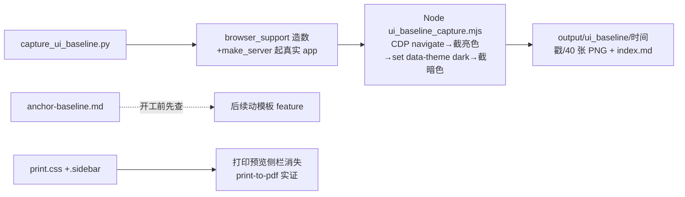

# fusion-anchor-baseline-prep design

## 0. 术语约定

| 术语 | 定义 | 防冲突结论 |
|---|---|---|
| 锚点 | 测试/门禁对模板渲染产物的依赖点：文案字符串、CSS 类名、DOM 结构、正则 | 与甘特图「时间锚点」无关；本 doc 全部指测试锚 |
| 爆点 | 改模板必撞的高危锚（撞了即门禁红或长缓存全废） | 新词 |
| 截图基线 | 改版前按页面×主题落盘的 PNG 参照集，供改版后人工 A/B | 不是像素 diff 门禁（明确不做） |
| 缓存税 | 改动触发 long gate 缓存作废、被迫全量重跑的时间成本 | 机制见 tools/long_gate_fingerprint.py |

## 1. 决策与约束

**需求摘要**（roadmap 第 3 条，模块 G）：后续 20+ 个动模板的 feature 开工前需要知道「改这个页面会撞哪些锚、要交多少缓存税」；改版后需要可对照的视觉基线；打印介质从未有回归清单且存量缺陷（V2 侧栏打印可见）已挂账到本 feature（dual-track-retirement 验收报告 §9 明确归属）。

**复杂度档位**：Web 应用默认档位，无偏离。

**关键决策**：

1. **爆点清单白名单制 + 可重跑命令**：清单只收「改版必撞」高危锚——① dashboard 正则锚（test_dashboard_overdue_count_tolerance.py:14-18 文案+DOM+类名三件套，roadmap :236 已点名）；② EXPECTED_PAGE_SIGNALS 20 页信号（ui_geometry_contract_data.py:45-178，机器真相源）；③ test_frontend_ui_language_polish.py 的 28 个模板/静态文件依赖面（820 行 255 断言 + 双料指纹源身份）；④ 3 个全模板扫描测试（no_inline_event_jinja / urlfor_endpoints / ui_contract_component_tokens）；⑤ verify_manual_styles.py / check_manual_layout.py 的 CSS 正则断言（manual 系样式改动必查）；⑥ **CDP 探针 JS DOM 硬锚**（Codex 审核补类）——ui_geometry_probe_page_eval.mjs 硬编码的壳层选择器（:63-64 `header nav`/`header.top-header`/`nav.sidebar-nav` + `apsThemeToggle`）、路径→控件 id 映射（:202-210）、三张系统表 id（:232-235），且被 test_ui_browser_geometry_smoke.py:131-136 反向钉死——改壳/导航/主题按钮必撞。**不做 2091 断言全量盘点**（产出不可维护，冻结快照会腐烂）；清单每节附可重跑 grep/pytest 命令，「开工前先查」查的是活数据。
2. **机器锚不另立真相源**：EXPECTED_PAGE_SIGNALS 已被 roadmap 4.9 钦定为页面信号单点（「文案变更只改这一处」），爆点清单是它的**导览 md** 而非第二份 yaml——再造机器可读副本违背本 roadmap 自己的 label-single-source 方向。
3. **落档位置 roadmap drafts/**：`.codestable/roadmap/aps-frontend-fusion/drafts/anchor-baseline.md`——capability-mining.md 同构先例（roadmap 正文 4 处引用 drafts/），aps-frontend-fusion-items.yaml notes「开工前先查本产物」的引用方式已预设于此。缓存税自觉两条：roadmap/ 下的 md 是 ENTRY_DEBT_LEDGER_SYNC input_scope，本清单更新会作废该 entry 缓存（成本低于全量档，可接受，design 言明免后人误判异常）；另 check_quickref_vs_routes 的指纹也覆盖 templates/**+static/**（long_gate_manifest.py:542-555）——它不是文案/DOM 爆点但属缓存税，写进清单缓存税节。
4. **截图基线复用 CDP 探针管线，不新建**：`tests/ui_geometry_cdp_client.mjs:108-131` 的 `send()` 通用通道现成，加 `Page.captureScreenshot` 是参数级扩展（CDP 路线就绪：probe.mjs:16-24 remote-debugging-port=0 起 Chrome、:102-146 DevToolsActivePort 等待逻辑全现成——比 `--screenshot` 命令行模式可靠，后者在本机实测会挂起超时）；造数/起服/超时/profile 清理继承 ui_geometry_browser_support.py。**复用方式钉死**（Codex 审核提醒：`_build_app(tmp_path, monkeypatch)` 是 pytest fixture 签名）：手跑脚本用 `tempfile.TemporaryDirectory()` + `pytest.MonkeyPatch.context()` 适配调用，不抽共享 helper 不改 browser_support 本体（零 diff 反向核对项）。新增独立采集脚本 `tests/_scripts_e2e/capture_ui_baseline.py`（与 run_browser_extreme_stress_case.py 同居——手跑工具非测试），遍历 FULL_UI_CONTRACT_PATHS 20 页 × 亮/暗双主题（暗色切法照探针先例 `document.documentElement.setAttribute('data-theme','dark')`，page_eval.mjs:54；**截图前必须 await 两帧 rAF**——common_theme.js:128-156 真实主题切换用双 requestAnimationFrame 延迟应用，截图比 computed-style 采样更易撞渲染帧竞态，不写「必要时再加」）≈ 40 张 PNG。
5. **截图产物不入 git，比对人工 A/B**：落 `output/ui_baseline/{时间戳}/`——双重纪律保障：.gitignore:147-150 忽略 output/ + tools/git_hook_blocked_paths.py:5-12 拉黑（test_quality_gate_registry_split_scope_contract.py:278-298 用 output/playwright/*.png 实证 hook 会拦）；第一版不做像素 diff 门禁——本机字体/抗锯齿/Chrome 版本差异会让自动 diff 假阳性失控，且浏览器档本就 CI skip。hex-migration（第 6 条）要的「分批+逐批截图 A/B」消费的正是这套人工流程。
6. **打印缺陷顺手修（基线准备含修复，边界拍板）**：print.css 隐藏名单加 `.sidebar`——实证：top-header 是 `<header>` 元素（base.html:110）被既有 `header` 规则盖住，唯 `.sidebar` 是 div（base.html:58）零 print 规则，打印时 240px 深色渐变列照常占位（style.css:59-67 + .app-container flex :53-57）。flex 容器独子自然占满全宽，无需动 .app-container。修复以 Chrome headless `--print-to-pdf` 实证前后差异。
7. **打印回归清单并入 anchor-baseline.md 单档**：「每页打印预览必查项」（侧栏不可见 / A4 landscape 生效 / 表格分页保护 / sticky 还原 / 链接黑色），规则源仅两处（print.css 94 行 + ui_contract.css:3484-3495），消费方 fusion-dispatch-print-sheet（第 31 条周派工单）开工前先查本节。三件套同档一处查，不散三个文件。

**明确不做**：不做像素 diff 自动门禁；不做 2091 断言全量冻结清单；不新建 EXPECTED_PAGE_SIGNALS 之外的机器锚源；不接 CORE_BROWSER_SMOKE_PATHS 消费方（零消费方现状留给 fusion-frontend-gates 的快速浏览器档接线，本 feature 只在清单里登记此事实）；不改 EXPECTED_PAGE_SIGNALS 内容本身；不动 language_polish 测试（文案攒批纪律照旧）；截图脚本不进 required/long gate（手跑工具）。

## 2. 名词与编排

### 2.1 名词层

**现状**：
- 锚点散布：language_polish 820 行 255 断言（QUALITY_GATE_SOURCE_FILES:164 指纹源 + py38 fail-on-hit 名单）、dashboard 正则锚（tolerance.py:14-18）、EXPECTED_PAGE_SIGNALS 20 页（tests/app_runtime/ui_geometry_contract_data.py:45-178，双档消费）、全模板扫描 3 测试、manual 系 2 脚本（long gate input_scopes :718/:722）、CDP 探针 JS 硬锚（page_eval.mjs:63-64/:202-210/:232-235，被 smoke:131-136 反向钉死）。
- 截图管线：CDP 探针只采几何信号零截图（probe.mjs 379 行）；暗色「半程」能力已有（page_eval.mjs:54 切 data-theme 后采对比度信号）；全仓零截图落盘机制。
- 打印：print.css 94 行单 @media print 块 + ui_contract.css:3484 第二块；`.sidebar` 缺陷实证成立；全仓无 window.print 调用（打印诉求在第 31 条）。

**变化**：
- 新增 `.codestable/roadmap/aps-frontend-fusion/drafts/anchor-baseline.md`：三节（锚点爆点清单 / 截图基线使用说明 / 打印介质回归清单）。
- 新增 `tests/_scripts_e2e/capture_ui_baseline.py`：手跑截图采集脚本。
- 修改 `tests/ui_geometry_cdp_client.mjs` 或新增轻量 capture mjs：Page.captureScreenshot 能力（取实现时最小侵入者；倾向独立 `tests/ui_baseline_capture.mjs`，不碰探针既有 379 行）。
- 修改 `static/css/print.css`：隐藏名单加 `.sidebar`。

接口示例：

```python
# tests/_scripts_e2e/capture_ui_baseline.py（手跑：.venv/bin/python tests/_scripts_e2e/capture_ui_baseline.py）
# 复用 ui_geometry_browser_support 的造数起服；遍历 FULL_UI_CONTRACT_PATHS × ("light","dark")
# 产物 output/ui_baseline/<YYYYmmdd_HHMMSS>/<安全化路径>__<theme>.png + index.md（路径↔文件名对照表）
# 退出码非 0 当且仅当任一页面截图失败（失败页面列表打印，不静默跳过）
```

### 2.2 编排层



**现状**：动模板 feature 开工靠零散记忆找锚；视觉回归靠肉眼记忆；打印无清单。
**变化**：三件套就位；纯增量 + print.css 一行级修复，零既有流程改动。

**流程级约束**：
- 截图脚本失败语义：单页截图失败不中断采集（继续余页）但最终退出码非 0 且打印失败清单——基线缺页必须被看见，不静默。
- 暗色截图前必须等 data-theme 切换后的样式重算（统一口径：必须 await 两帧 rAF——与决策 4 一致，不留「必要时再加」的余地）。
- print.css 修复不得影响屏幕介质（@media print 块内改动，结构性隔离）。
- anchor-baseline.md 头部写明「活文档：每节命令可重跑刷新；EXPECTED_PAGE_SIGNALS 是机器真相源本档只做导览」。

### 2.3 挂载点清单

1. 爆点清单：`drafts/anchor-baseline.md` 新文件 — roadmap 第 3 条 notes 已预设引用，无代码挂载
2. 截图脚本：`tests/_scripts_e2e/capture_ui_baseline.py` + `tests/ui_baseline_capture.mjs` 新文件 — 手跑工具，不进 registry/gate（_scripts_e2e 同居先例）
3. 打印修复：`static/css/print.css` 隐藏名单 — 修改（@media print 块内）
4. 打印回归断言：`tests/web_pages/test_print_css_contract.py` 新文件——钉死 `.sidebar` 在 print 隐藏名单内 + @page A4 landscape 存在（轻量文件级断言，防回潮；不起浏览器）
5. 守卫组归属：`tools/test_registry_groups_misc.py` ui_layout_presenters_system 组 target_paths + `tools/test_registry_data.py` QUALITY_GATE_GUARD_TESTS **双登记** — 修改（实现期修订：原设计「只进组不进 GUARD_TESTS」被门禁契约否决——test_long_gate_manifest::test_required_groups_cover_required_registry 强制组 target 集合与 required registry 完全相等，组里出现非 required 测试即 unknown 报错；该组是 static/** 的 owner，改 print.css 强制触发）

### 2.4 推进策略

1. 爆点清单：盘点六类高危锚写 anchor-baseline.md 第一节（含可重跑命令实测可用）→ 命令逐条跑通
2. 打印：print.css 修复 + 回归清单（第三节）+ test_print_css_contract.py → print-to-pdf 前后对照实证侧栏消失
3. 截图基线：capture mjs + py 脚本 → 实跑产出 40 张 PNG + index.md，抽查亮暗两张目检
4. 收尾：anchor-baseline.md 第二节（截图使用说明）+ required 门禁全绿

### 2.5 结构健康度与微重构

##### 评估
- 文件级 — 新增 4 文件（清单 md / py 脚本预估 ~120 行 / mjs ~100 行 / 测试 ~40 行），全部远低于 500 行门禁。
- 目录级 — _scripts_e2e 现 23 文件加 1 同构；tests/ 根的 mjs 与 ui_geometry_probe.mjs 同居同构。
- compound 检索：无目录组织类 convention 命中。

##### 结论：不做

##### 超出范围的观察
- ui_geometry_probe.mjs 379 行逼近大文件感知线，且 page_eval 已拆出——后续若再扩探针建议先拆传输层/采样层。
- print.css 的 `header, nav` 元素级选择器对未来新壳脆弱——tokens-single-source 落地后可考虑改类名选择器（归该 feature 顺手评估）。

## 3. 验收契约

关键场景：
1. anchor-baseline.md 三节齐全；第一节六类锚（含 CDP 探针 JS DOM 硬锚）每条含「锚在哪/改它要动什么/缓存税」+ 可重跑命令，命令逐条实跑通过（grep 有命中、pytest 可收集）；缓存税节含 quickref 指纹说明。
2. `capture_ui_baseline.py` 实跑：FULL_UI_CONTRACT_PATHS 全 20 页 × 亮/暗 = 40 张 PNG 落 output/ui_baseline/时间戳/，index.md 对照表 20 行（每页一行，亮/暗两列）；抽查 dashboard 亮/暗两张目检主题确实不同（暗色背景深色）。
3. 截图脚本单页失败注入（临时改坏一个 path）→ 其余页继续、退出码非 0、失败清单可见。
4. 打印修复实证：Chrome headless --print-to-pdf 渲染 dashboard，修复前 PDF 含侧栏深色列、修复后无（两 PDF 落 /tmp 人工目检 + pdftotext 抽字验证侧栏菜单词不在正文流）。
5. test_print_css_contract.py：断言 print.css @media print 块内 `.sidebar` 在 display:none 名单、@page 含 A4 landscape——文件级 grep 断言，毫秒级；已登记 ui_layout_presenters_system 组 target_paths（改 print.css 强制触发本测试，test_long_gate_manifest 自洽绿）。
6. 屏幕介质零回归：required 门禁全绿（含 ui_geometry HTML 契约 + 浏览器几何冒烟 2 条）。
7. output/ui_baseline/ 不可入库实证：git add 被 hook 拦或 .gitignore 覆盖（git check-ignore 验证）。

明确不做的反向核对：
- EXPECTED_PAGE_SIGNALS（tests/app_runtime/ui_geometry_contract_data.py）零 diff。
- test_frontend_ui_language_polish.py 零 diff（文案攒批纪律）。
- ui_geometry_probe.mjs / browser_support.py 零 diff（截图走独立 mjs，不碰探针）。
- 无像素 diff/比对代码（grep 新脚本无 compare/diff 像素逻辑）。
- CORE_BROWSER_SMOKE_PATHS 零消费方现状不变（grep 仍仅定义处）。

## 4. 与项目级架构文档的关系

验收时归并：ARCHITECTURE.md 模块索引补「改版基线三件套」一句（产物位置+打印修复）；roadmap 第 3 条回写 done——它是 fusion-tokens-single-source（第 5 条）与 fusion-dashboard-cockpit（第 19 条）两条长链的解锁前置，回写后就绪批次扩容。anchor-baseline.md 作为 LIVE 导览档由后续每个动模板 feature 的 design 阶段引用。
