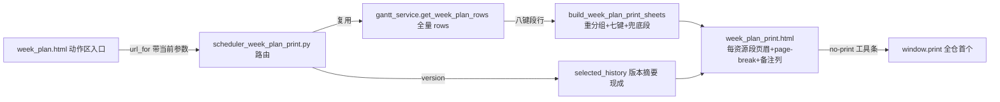

# fusion-dispatch-print-sheet design

## 0. 术语约定

| 术语 | 定义 | 防冲突结论 |
|---|---|---|
| 派工单页 | `/scheduler/week-plan/print` 独立打印视图：屏幕态=预览+工具条，打印态只剩纸面内容 | 与「资源派工页」（resource_dispatch，现场记录工作入口）是两个东西——本页是纸、只读、零写入；命名统一用「周派工单」 |
| 资源段 | 按设备或人员分组后的一个打印单元（一资源一页） | 分组键=段行的「设备」/「人员」展示串（厂内资源串含 id，同名异 id 不并组；段行零内部键是 #16 钉死的 by-design，不为打印开旁路） |
| 兜底段 | 双视图各自的「外协/未分配」资源段，固定排最后 | operator 视图：没派人的工序（display_operator 回落值）；machine 视图：全部外协/无设备行（「外协 {supplier}」串无 supplier_id，Suppliers.name 无唯一约束，按供应商串分页会把重名供应商错并到一张纸——归兜底段与 gantt_tasks.py:127 machine_id 空即兜底同语义，段内每行「设备」列仍显示各自供应商串做参照） |
| 单日切换 | `day=YYYY-MM-DD` 可选参数，只印该日行（加急重排后补打当天） | 周为主：缺省印整周；day 不在所选周内按参数错误明示，不静默回落整周 |

## 1. 决策与约束

**需求摘要**（roadmap 第 31 条，模块 N，2026-06-11 现场实践重定+用户两项拍板）：车间按周打印计划。按设备/按人员双视图（同一份周计划行重分组，每行带另一维度做交接参照）+ 周为主附单日切换 + 一资源一页 page-break 整叠打印（无任务资源不出纸）+ 人员视图「外协/未分配」兜底段 + 页眉印方案版本与生成时间（防车间贴旧纸误用）+ 行尾空白备注列（手写用，不设签字栏——用户拍板）。依赖 #16 已 done（周选择器/空周提示就位，同文件施工冲突已解除）。

**复杂度档位**：Web 应用默认档位，无偏离。

**关键决策**：

1. **打印页=独立路由不进 WorkbenchLink**：`GET /scheduler/week-plan/print`，参数与周计划页同形（version/plan_role/scenario_id/week_start）+ `group_by=machine|operator`（缺省 machine）+ `day` 可选。入口挂周计划页动作区，沿 export 按钮同页动作先例（`url_for` 带当前查询参数，**含 batch_id/resource_type/resource_id 筛选透传**——打印当前筛选结果，页眉数据范围行明示筛选条件，防拿部分筛选的纸当全量周计划），新路由模块**必须**进 `scheduler_route_registrar._ROUTE_MODULES` 并同步门禁 `test_sp05_path_topology_contract.py` 的写死清单（蓝图只 import 清单内模块，漏登记则路由不存在、url_for 直接炸），**不加 TARGET_PAGE_PATHS 目标**——该合同管跨页工作台导航，同页衍生动作（导出/打印）一直走 url_for 先例，加目标反而让 13 目标合同混入非导航语义。
2. **重分组纯函数落新文件** `core/services/scheduler/week_plan_print_sheet.py`（~90 行）：`build_week_plan_print_sheets(rows, *, group_by, day=None) -> List[Dict]`，输入 #16 的八中文键段行（消费不改造），输出 `[{"resource_label", "rows"}]`。分组按「设备」/「人员」展示串；组内行保持上游排序（日期→时段已排好）；**双视图兜底段均排最后**：operator 视图收「外协/未分配」行，machine 视图收全部「外协 {supplier}」+「外协/未分配」行（供应商串无 id、重名会错并组——统一归兜底段消解，行内「设备」列保留各自供应商串；按供应商分页留观察项，待业务确认供应商名唯一或提出需求再议）；**无任务资源天然不出现**（分组来自实际行）；day 过滤在本函数做（`day` 不在行集合所在周时由路由先校验，见决策 4）。
3. **派工单行=7 个计划字段+空白备注列，「现场状态」列刻意不进纸**（4.11 加粗约束：第一版只含计划任务不含现场事实——纸面状态在车间会立刻过期误导；要含必须走 4.10 唯一入口，本版不做）：builder 输出行只保留 日期/批次号/图号/工序/设备/人员/时段 七键（drop「现场状态」），模板行尾渲染空 `备注` 列。
4. **路由落新文件** `web/routes/domains/scheduler/scheduler_week_plan_print.py`（scheduler_week_plan.py 已 475/500，不再加码）：复用 `get_week_plan_rows` **全量 rows**（不是 preview 前 50）；`group_by` 非法值 / `day` 格式非法（`abc`、`2026-99-99`）/ `day` 不在 `[week_start, week_end]` 内均按 ValidationError 明示（不静默回落、不让 builder 把坏串过滤成空页装正常）；版本无历史/空行集走打印页内空态明示（入口不藏——空态文案给下一步指引，4.11 诚实态）。
5. **模板独立不 extends base.html**：`templates/scheduler/week_plan_print.html`——纸面内容不需要侧栏/导航/胶囊，extends 后再用 print.css 隐藏是负优化。显式 link 00-tokens.css + print.css + 页内最小样式（**表格边框/列宽/页眉排版自带**——常规表格基线在 style.css/ui_contract.css，独立模板不引它们，纸面表格样式必须自足，验收含打印预览目检）；屏幕态工具条（`no-print`：打印按钮=全仓首个 `window.print()` 调用、返回周计划链接、设备/人员视图切换链接）；打印态每资源段 `page-break-after: always`（print.css 既有 `.card` 保护沿用、表格行防拆 `tr { page-break-inside: avoid }` 已有）。开工前先过 anchor-baseline.md 第三节打印介质回归清单 5 条。
6. **页眉每资源段重复**（防整叠拆开后单页失去身份）：方案版本号 · 方案身份中文标签 · 生成时间（`format_public_datetime(schedule_time)`，selected_history 取数沿 #16 胶囊喂参同源）· 周范围（或单日）· 资源名。**警示判定=`plan_role_resolution` 的 `is_current_executable_official_version` 为假即印**（该键由 SchedulePlanResolution.to_dict 全链路携带——只看 selected_role/scenario_id 会漏掉「历史正式方案」：旧版本仍是 adopted 无 scenario，正撞贴旧纸误用）：`is_superseded_by_newer_version` 真印「历史正式方案，已被新版本替代，不得下发执行」，其余非可执行态印「非正式方案，不得下发执行」；印进纸面而非仅屏幕（4.7 身份诚实）。**段内行多跨物理纸时身份不丢**：段页眉（版本/警示/资源名）放进该段表格的 `<thead>`（浏览器打印对 thead 有每页重复语义），打印预览目检含「大量外协行跨页」样例——每张物理纸都能看到版本与警示。
7. **测试**：① builder 单测（双视图分组/兜底段排序/七键 drop 现场状态/day 过滤/空输入）；② 页面契约（app_client 种子：页眉字段/page-break 类/备注列/现场状态零出现/非 adopted 警示/入口链接带参数）；③ 参数错误（group_by 非法、day 出周、day 格式非法 `abc`/`2026-99-99`）明示断言；④ print.css 契约测试按需扩展。不进 GUARD_TESTS（纸面展示非安全红线）。

**明确不做**：不动 `gantt_week_plan.py`/`_sched_display_utils.py`（只消费段行，零 diff——grep 钉死）；不加 TARGET_PAGE_PATHS 目标（合同文件零 diff）；不接现场事实——口径=**纸面零现场事实**（builder drop 列+打印 HTML「现场状态」零出现断言）：复用 get_week_plan_rows 的调用链照常读事实（gantt_service.py:477 现成行为，为省一次读取而给 service 加旁路 flag 违反模块 W 最小消费纪律，刻意不做）；新文件 `ExecutionFact` import 零出现（grep 钉死）；不设签字栏；不做资源排班页导航链接（该页未落地，roadmap 注明非依赖）；无新表、无新算法、零写入（4.11）。

## 2. 名词与编排

### 2.1 名词层

**现状**：八中文键段行由 `build_week_plan_rows` 产出（gantt_week_plan.py:71-80，#16 后含「现场状态」）；设备/人员展示串 `_display_machine/_display_operator`（_sched_display_utils.py:46-60，回落「外协/未分配」「外协 {supplier}」）；`get_week_plan_rows` data dict（gantt_service.py:482-498，rows/week_start/week_end/history/plan_role_resolution）；selected_history 版本摘要（scheduler_week_plan.py:91-111，schedule_time_display/strategy_label）；print.css 全站打印规则（base.html:46 挂载，A4 landscape/分页保护）；周计划页动作区 export 按钮先例（week_plan.html:9-14）。

**变化**：
- 新增 `core/services/scheduler/week_plan_print_sheet.py`：`build_week_plan_print_sheets`。
- 新增 `web/routes/domains/scheduler/scheduler_week_plan_print.py`：打印页路由；同步登记 `scheduler_route_registrar._ROUTE_MODULES` 与 `test_sp05_path_topology_contract.py` 写死清单（蓝图只 import 清单内模块）。
- 新增 `templates/scheduler/week_plan_print.html`：独立打印模板。
- 修改 `templates/scheduler/week_plan.html`：动作区加「打印周派工单」入口（带当前查询参数）。
- 修改 `static/css/print.css`：仅当现有规则不够时补打印页专属段（预计 0~10 行；A4 landscape/分页保护现成）。

接口示例：

```python
# week_plan_print_sheet.py（新文件，纯函数——输入 #16 段行，输出资源段列表）
def build_week_plan_print_sheets(rows, *, group_by: str, day: Optional[str] = None) -> List[Dict[str, Any]]:
    # group_by="machine"：按「设备」串分组（外协/无设备行统一归兜底段）；
    # "operator"：按「人员」串分组（「外协/未分配」行归兜底段）
    # 兜底段固定排最后；其余组按展示串序
    # 行输出七键（drop「现场状态」——4.11 第一版零现场事实）
    # day 给定时只留 row["日期"]==day 的行；过滤后空组不出现
    # [{"resource_label": "M1 车床", "rows": [...]}, ...]
```

### 2.2 编排层



**流程级约束**：
- 参数错误（group_by 非法 / day 出周）抛 ValidationError 明示，不静默回落缺省（决策 4）。
- 空行集（无历史/空周/day 过滤后为空）渲染打印页内空态文案+返回链接，不 404 不空白纸。
- 身份字段只从 `plan_role_resolution` 读（#16 教训：键名真源，勿拼 `plan_resolution`）；警示判定用 `is_current_executable_official_version` / `is_superseded_by_newer_version`（决策 6），不止看 selected_role；警示必须进纸面。
- 打印页零 JS 依赖（`window.print` 是唯一脚本行为，内联即可）；不引外部库。

### 2.3 挂载点清单

1. `web/routes/domains/scheduler/scheduler_week_plan_print.py` — 新路由文件
2. `web/routes/domains/scheduler/scheduler_route_registrar.py` `_ROUTE_MODULES` — 登记一行（漏登记路由不存在）
3. `tests/gate_meta/test_sp05_path_topology_contract.py` 写死模块清单 — 同步一行
4. `core/services/scheduler/week_plan_print_sheet.py` — 新 builder 文件
5. `templates/scheduler/week_plan_print.html` — 新模板
6. `templates/scheduler/week_plan.html` 动作区入口按钮 — 修改一处
7. 测试文件（tests/schedule/service/ + tests/web_pages/ 各一）

拔除推演：删 3 个新文件 + 回退 registrar/门禁/入口按钮各一行 + 删测试 → feature 完全消失，零悬挂引用（print.css 若有补段一并删）。

### 2.4 推进策略

1. builder 新文件 + 单测（双视图/兜底段/七键/day 过滤/空输入）→ 绿
2. 路由 + 模板 + 入口按钮 → 页面契约测试 → 绿
3. 浏览器打印目检（Chrome 打印预览：分页/页眉重复/备注列宽/anchor-baseline 第三节 5 条）
4. 既有 week_plan 测试回归 + daily gate → 绿

### 2.5 结构健康度与微重构

##### 评估
scheduler_week_plan.py 475/500——本 feature 零加码（新路由独立文件，仅 week_plan.html 模板加入口）；core/services/scheduler/ 与 web/routes/domains/scheduler/ 目录均按职责分文件、不摊平；新文件预计 ~90/~110 行。compound 无相关 convention 冲突。

##### 结论：不做

超出范围的观察：scheduler 域路由文件已 8+ 个，若再增 2-3 个可考虑按「查询页/导出打印/写入」分子目录——不阻塞本 feature，留待 cs-refactor。另：外协行若业务方将来要求按供应商各自成段分页，需先给 Suppliers.name 加唯一约束或把 supplier_id 带进段行旁路（涉及 #16 段行契约变更），单独立条不在本 feature 做。

## 3. 验收契约

关键场景：
1. machine 视图：两设备各成资源段，段内行按日期+时段序，每行带「人员」列做交接参照；外协/无设备行（含「外协 {supplier}」）统一入兜底段排最后，行内「设备」列保留各自供应商串（两个重名供应商不会各自成段错并）。
2. operator 视图：没派人的工序入「外协/未分配」兜底段且固定最后一段；每行带「设备」列。
3. 一资源一页：每资源段容器带 page-break 标记类；本周无任务的资源不出现任何段（无任务不出纸）。
4. 页眉：每资源段重复 版本号/方案身份标签/生成时间/周范围（或单日）/数据范围（批次/资源筛选条件，有则明示）/资源名；`is_current_executable_official_version` 为假即印警示——历史正式方案（旧 adopted 版本）印「历史正式方案，已被新版本替代，不得下发执行」，模拟预览/对比方案印「非正式方案，不得下发执行」；当前可执行正式方案零警示。
5. 单日切换：`day=2026-06-01` 只含该日行且页眉显示单日；`day` 出周 / `day=abc` / `day=2026-99-99` → ValidationError 明示；`group_by=bogus` → 同样明示。
6. 行尾「备注」空白列存在；「现场状态」三字在打印页 HTML 零出现（断言钉死 4.11）。
7. 入口：周计划页动作区「打印周派工单」链接带当前 version/week_start/plan_role/scenario_id/batch_id/resource_type/resource_id 全量参数（打印当前筛选结果）；空行集时打印页渲染空态文案+返回链接（不 404）。
7b. 打印预览目检（Chrome）：表格有边框、列宽合理、备注列留白可手写、页眉每页重复（含大量外协行跨页样例——thead 重复语义核证）、anchor-baseline 第三节 5 条全过。
8. 既有周计划全部测试零回归；daily gate 绿。

明确不做的反向核对：
- `gantt_week_plan.py` / `_sched_display_utils.py` / `scheduler_workbench_link_query.py` 零 diff。
- 新文件 grep `ExecutionFact` 零命中；打印页 HTML「现场状态」零出现（纸面零现场事实口径——调用链读事实是 get_week_plan_rows 现成行为，不另开旁路 flag）；grep 全仓 `window.print` 仅打印模板一处。
- 无新表；无 POST 路由（只读）；并行 WIP 文件零接触（staged diff 核对）。

## 4. 与项目级架构文档的关系

验收时归并：ARCHITECTURE.md 周计划条目追加派工单打印段（独立打印路由/4.11 零事实/身份警示进纸面/全仓首个 window.print）；roadmap 第 31 条回写 done（无下游解锁）。
