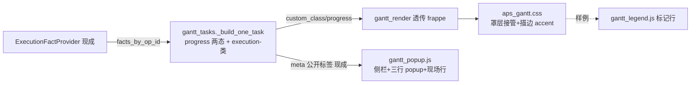

# fusion-gantt-execution-visuals design

## 0. 术语约定

| 术语 | 定义 | 防冲突结论 |
|---|---|---|
| 执行着色类 | 服务端追加进 `custom_class` 的 `execution-<status>`（processing/paused/exception/completed 四态） | 后缀=`STATUS_LABELS` 词表键（operation_execution_event.py 常量同源，不另造）；只在 `has_execution_record` 为真时追加——无记录的计划行视觉零变化；未知状态码不追加类（DOM class 不收垃圾串） |
| 完工罩层 | progress=100 时 frappe 在条形上叠的 `.bar-progress` 全宽矩形 | frappe 默认紫 `#a3a3ff` 会整条盖死 `--aps-bar-color`（四种配色模式全失效）——aps_gantt.css 必须接管其 fill |
| 双向互缺 | popup 有 优先级/加工方式 而侧栏没有；侧栏有 现场摘要/现场状态/实际起止 而 popup 没有；时长两边都没有（meta 现成） | 本次收口方向：侧栏补 优先级/加工方式/时长，popup 补现场摘要一行；popup 的「状态」行（计划态四档）保持不动 |

## 1. 决策与约束

**需求摘要**（roadmap 第 12 条，模块 W，契约 4.10）：甘特条 progress 硬编码 0（gantt_tasks.py:245）——完工工序在图上看不出完没完工；条形无执行状态视觉；侧栏与 popup 的 meta 字段双向互缺。依赖 #2 已 done（双轨退役，甘特模板单树）。模块 W 纪律：只消费已存在的服务/字段（ExecutionFactProvider 链路现成，gantt_service.py:370 已喂 facts）。

**复杂度档位**：Web 应用默认档位，无偏离。

**关键决策**：

1. **progress 只允许 completed→100**（4.10 红线原文：禁止用 quantity_done 估算部分进度伪装精度）：`_build_one_task` 中判定——`has_execution_record` 复用 `_execution_detail_meta(fact)` 已产出的布尔值（不二次复制判断），completed 直读 `fact.actual_status == EXECUTION_STATUS_COMPLETED`（meta 只有中文 label 没有 raw 码，raw 码判定只在服务端这一处）→ 100，其余一律 0。无 fact / not_started / preview 身份零事件 → 0（现状自然成立，零特判——provider 按完整计划身份读取，候选/模拟身份永远无事实是 schema CHECK 钉死的契约）。
2. **执行着色类追加**：`css` 列表（gantt_tasks.py:220-223）在 `has_execution_record` 为真且 `actual_status` ∈ **四态白名单 frozenset{processing, paused, exception, completed}**（不是「STATUS_LABELS 已知键」——词表还含 not_started，正常链路被 has_execution_record 排除，但假数据/测试假 fact 可能拼出 `execution-not_started`，白名单制杜绝）时追加 `execution-<status>`。`_execution_detail_meta` 不加 raw 码进 meta——展示仍只消费公开 label（4.10），CSS 类由服务端拼好，前端零判断。
3. **视觉通道分离**（与既有信号不打架），**CSS 写法钉死而非只钉顺序**（Codex 设计审核两阻塞收口）：
   - fill 归配色模式（JS `--aps-bar-color` inline 不动，batch/priority/source/status 四模式照常）；
   - **完工 = 罩层接管，普通/hover/active 三态一次写齐**：frappe-gantt.css 的 `.bar-progress` 默认紫 #a3a3ff 且 `:hover .bar-progress`/`.active .bar-progress` 还会改成 #8a8aff（frappe-gantt.css:40/:76/:86）——只覆盖普通态，悬停/选中会闪回紫色。钉死写法：`.bar-wrapper.execution-completed .bar-progress, .gantt .bar-wrapper.execution-completed:hover .bar-progress, .gantt .bar-wrapper.execution-completed.active .bar-progress { fill: var(--ui-success); fill-opacity: 0.45 }`（特异性 ≥ frappe 的 hover/active 规则）；
   - processing / paused / exception = 描边 accent（`var(--ui-primary)` / `var(--ui-warning)` / `var(--ui-danger)`），**选择器自带 `:not(.overdue)` 守卫**：`.bar-wrapper.execution-processing:not(.overdue) .bar { stroke: var(--ui-primary); stroke-width: 2 }`——overdue 红边优先由选择器语义保证，不依赖 818 行文件里的书写顺序（顺序会被未来重排破坏）；
   - **暗色主题补对应规则**：aps_gantt.css:685-687 的 `html[data-theme="dark"] .gantt .bar-wrapper .bar { stroke: ... }` 会盖掉描边 accent——执行态描边与 overdue 红边都需要 `html[data-theme="dark"]` 前缀的同款规则压回（dark 块内 execution/overdue 描边重申一次）；罩层 fill 不受 dark stroke 规则影响但目检确认可读；
   - aps-external 虚线/aps-critical 金边不变；
   - **零新增裸 hex**：aps_gantt.css 冻结额度 115（test_css_token_source_contract），全用 `--ui-*` token（语义色 4.4 已单源）。
4. **侧栏详情补三行**（gantt_popup.js buildTaskDetailHtml dl）：优先级（`publicPriorityLabel(meta.priority)`）、加工方式（`publicSourceLabel(meta.source)`）、时长（`meta.duration_minutes` 格式化「X 小时 Y 分钟」，分钟数据现成 :271）；**popup 补一行** `现场：meta.actual_summary_label`（buildTaskPopupHtml lines）。两边 helper 全现成（gantt_contract.js:229/238），零后端改动。
5. **legend 标记行补执行状态样例**（gantt_legend.js 标记 row）：完工罩层样例 + 三描边样例——条形上多出的视觉信号必须在图例可查，不做哑谜 UI。
6. **测试**：① gantt_tasks 后端单测**新增 payload 断言**（completed→progress 100+类 / processing/paused/exception→progress 0+各自类 / 无记录→零类零 progress / not_started 有假记录→零类（白名单守卫）/ 未知码→零类 / meta 键集无 raw 码无 ExecutionFact 泄漏）——现有 test_gantt_task_detail_panel_contract.py 只锁 meta 标签没锁 progress/class，不能只依赖它；② JS contract 测试扩展（侧栏三行+popup 现场行——沿 test_gantt_task_detail_js_contract.py 既有模式）；③ CSS 由 hex 冻结门禁自动守 + 新增 CSS 契约断言（completed 罩层三态选择器齐全**且规则体含 `var(--ui-success)` 与 `fill-opacity` 值** / execution 描边带 :not(.overdue) / dark 块含执行态重申——正则锁写法+锁值，防重排或拆规则漏值）。既有 fixture 的 `progress: 0` 字面量（short_task/adapter/critical_outline 三契约）无 facts 输入语义不变，零改动预期。

**明确不做**：不动 `resource_dispatch_rows.py:322` 的 progress 0（资源派工行不在甘特渲染链，单独条目再议）；不升级 `statusKeyForTask`/「按工序状态」配色去消费执行事实（计划态 vs 现场态两套语义混在一个下拉会糊掉身份——留观察，归 #27 controls-rework 议）；不做部分进度（4.10 红线）；不做沿链巡检（#13）/负荷条带（#15）；不动 ExecutionFactProvider 与读取链；meta 不透传 ExecutionFact 整体及 schedule_id/source_table/effective_plan_role/scenario_id（4.10——既有 meta 已含 schedule_id 是历史现状，本次不新增内部字段）；不改 popup「状态」行语义。

## 2. 名词与编排

### 2.1 名词层

**现状**：task payload 由 `_build_one_task` 产出（gantt_tasks.py:238-284）：顶层 `progress: 0` 硬编码（:245）、`custom_class` = priority 类 + overdue（:220-223/:249）、`meta` 含 `**_execution_detail_meta(fact)` 七个公开标签（:152-177，含 actual_summary_label/has_execution_record）；facts 经 `gantt_service.py:370` `_execution_facts_by_op_id` → `ExecutionFactProvider.facts_by_op_id_for_plan_rows`（完整计划身份，op_id 裸读毒化 raise）。前端：`gantt_render.js:99-115` 透传 custom_class/progress 给 frappe-gantt.min.js（progress_width = w×progress/100，`.bar-progress` 默认紫 #a3a3ff）；着色 `aps_gantt.css:4-6`（priority 三类 --aps-bar-color fallback）+ `gantt_decorations.js:265-267`（colorMode inline setProperty）；侧栏 `gantt_popup.js:78-128`（dl grid，现场三行有、优先级/加工方式/时长无）；popup `:150-185`（优先级/加工方式有、现场摘要无）；legend 标记行 `gantt_legend.js:212+`。

**变化**：
- 修改 `core/services/scheduler/gantt_tasks.py`：progress 两态 + css 追加 execution-<status>（`_execution_detail_meta` 返回值零变化）。
- 修改 `static/css/aps_gantt.css`：执行着色规则段（罩层接管 + 三描边；overdue 规则后置注释钉死）。
- 修改 `static/js/gantt_popup.js`：侧栏 dl 补三行 + popup lines 补现场行 + 分钟格式化小 helper。
- 修改 `static/js/gantt_legend.js`：标记行补执行状态样例。

接口示例（payload 增量）：

```python
# 有现场记录的生产中工序
task["custom_class"] == "priority-normal execution-processing"
task["progress"] == 0
# 已完工工序
task["custom_class"] == "priority-urgent overdue execution-completed"
task["progress"] == 100
# 无记录计划行（含 preview 身份）——与现状逐字节相同
task["custom_class"] == "priority-normal"
task["progress"] == 0
```

### 2.2 编排层



**流程级约束**：
- 着色类与 progress 的判定都以 `has_execution_record` 为门槛——「无事实=计划行原样」是不变量（preview/候选身份自动满足）。
- CSS 优先级用选择器语义钉死（execution 描边 `:not(.overdue)` 守卫；completed 罩层覆盖普通/hover/active 三态；dark 块重申）——不依赖规则书写顺序（818 行文件重排即破）。
- 前端只做展示格式化、不新增业务分支：类是服务端拼好的字符串，JS 只透传；新增三行/一行只读 meta 现成键（时长的「X 小时 Y 分钟」格式化 helper 与现有 formatChineseDateTime 同性质，属展示格式化）。

### 2.3 挂载点清单

1. `core/services/scheduler/gantt_tasks.py` `_build_one_task` — progress 两态 + css 追加（修改）
2. `static/css/aps_gantt.css` — 执行着色规则段（修改）
3. `static/js/gantt_popup.js` — 侧栏三行 + popup 现场行（修改）
4. `static/js/gantt_legend.js` — 标记行样例（修改）
5. 测试（tests/gantt/ 单测扩展 + JS contract 扩展）

拔除推演：回退 4 文件改动段 + 删测试断言 → payload/DOM/图例回到现状，feature 消失零悬挂。

### 2.4 推进策略

1. gantt_tasks progress+类 + 单测（两态/门槛/键集）→ 绿
2. aps_gantt.css 规则段 + gantt_popup.js 行补全 + legend 样例 → JS contract 测试扩展 → 绿
3. 浏览器目检（有完工/生产中/暂停/异常事实的种子：罩层/描边/图例/侧栏 popup 行；四配色模式×执行类叠加可读；暗色主题下罩层可读）
4. 甘特全量测试回归 + daily gate → 绿

### 2.5 结构健康度与微重构

##### 评估
gantt_tasks.py 357 行（+~10）；gantt_popup.js 199（+~15）；aps_gantt.css 818（+~25）；gantt_legend.js（+~10）——全部健康余量充足；无新文件必要（改动是四处既有职责的就地增强，不是新名词）。compound 无冲突 convention。

##### 结论：不做

超出范围的观察：「按工序状态」配色（statusKeyForTask 计划态）与现场执行态两套语义并存，用户可能混淆——建议 #27 controls-rework 时统一拍板（合并为一套或明示两套）；gantt_color.js/aps_gantt.css 的 hex 字面量迁 token 归 #6 hex-migration。**已知既有边界（本 feature 不修）**：frappe-gantt.css:73/:83 的 hover/active 还会改主条 `.bar` fill（特异性 (0,4,0) > aps 基础 (0,3,0)），「fill 归配色模式」在悬停瞬间本就不完全成立——非本次引入，归 #14 fix-pack 或 #27 议。

## 3. 验收契约

关键场景：
1. 有 completed 事实的工序：progress=100，条形见绿罩层（四种配色模式底色上都可辨）；custom_class 含 execution-completed。
2. processing/paused/exception 事实：对应描边 accent（蓝/琥珀/红），progress=0；与 overdue 并存时红边胜出（`:not(.overdue)` 选择器语义保证，CSS 契约正则断言钉死）。
3. 无事实工序（含模拟预览/候选身份）：custom_class 零 execution- 前缀、progress=0——payload 与现状逐字节一致（回归断言）。
4. 未知状态码的 fact：不追加类、progress=0（防御断言）。
5. 侧栏详情：优先级/加工方式/时长 三行渲染（中文 label 走既有 helper）；popup：现场摘要一行渲染（无记录显示「暂未记录现场实际」）。
6. legend 标记行含执行状态样例。
7. aps_gantt.css 零新增裸 hex（冻结门禁绿）；全甘特测试零回归；daily gate 绿。
8. 浏览器目检：亮/暗双主题下罩层与描边可读（dark 块含执行态/overdue 描边重申规则）；完工条 hover/选中时罩层不闪回紫色。

明确不做的反向核对：
- `resource_dispatch_rows.py` 零 diff；`gantt_color.js` 零 diff（statusKeyForTask 不动）；`ExecutionFactProvider`/`gantt_service.py` 零 diff。
- meta 新增键数=0（grep `_execution_detail_meta` 返回 dict 键集不变）；无 quantity_done 出现。
- 并行 WIP 文件零接触（staged diff 核对）。

## 4. 与项目级架构文档的关系

验收时归并：ARCHITECTURE.md 甘特任务详情区条目追加执行可视化段（progress 两态红线/着色类门槛/通道分离）；ui-gantt.md 若有渲染协议节同步；roadmap 第 12 条回写 done（解锁 13/14/15/27 甘特链四条）。
