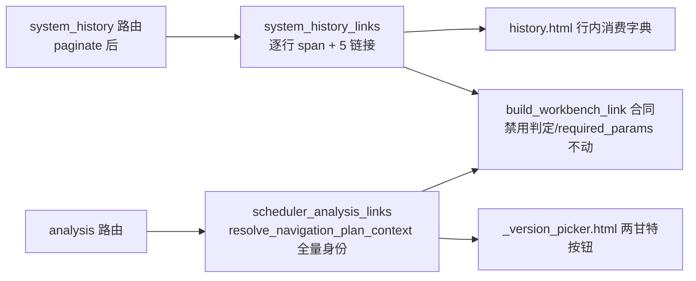

# fusion-handrolled-links-adoption design

## 0. 术语约定

| 术语 | 定义 | 防冲突结论 |
|---|---|---|
| 手拼链接 | 模板里裸 `url_for(...)` 只带 version 的跳转——丢方案身份（plan_role/scenario_id）与日期范围 | 与「收编」对象限定为 roadmap 点名的 7 条；history.html 的「去补充」批次链接与分页链接**不在本次范围**（批次详情无方案身份概念、分页是页内表单态非工作台续行） |
| WorkbenchLink 合同 | `build_workbench_link(context, target) -> {label,url,disabled,disabled_reason,required_params,...}` 字典，模板只消费不拼 | 现有合同零改动地复用；唯一结构性新增是路径参数型目标（见决策 3） |
| 路径参数型目标 | 路径里含 `{batch_id}` 占位的目标（batch_detail），区别于现有 11 个纯 query 目标 | TARGET_PAGE_PATHS 首次出现占位符语法；缺参 fail-loud 不出半截 URL |

## 1. 决策与约束

**需求摘要**（roadmap 第 11 条，模块 C，items.yaml notes）：手拼链接丢身份上下文（模拟预览点过去掉回正式视角）是真实缺陷；扩公共枚举影响面大需在 design 拍板。无前置依赖。

**复杂度档位**：Web 应用默认档位，无偏离。

**关键决策**：

1. **收编范围 = 7 条链接两处**：① `templates/system/history.html` 的 `history_version_links(version)` 宏（:3-11，行级 5 链接：设备甘特/人员甘特/周计划/资源排班/优化分析，:65 selected 与 :286 每行两个调用点）整宏删除，改消费 WorkbenchLink 字典列表；② `templates/scheduler/analysis_parts/_version_picker.html` :26-27 两条 `ui.link_button(url_for('scheduler.gantt_page',...))` 改消费链接字典。其余裸 url_for（去补充/分页/表单 action）明确不动。

2. **日期范围必须喂否则全禁用（本设计最大的坑，正面拍板）**：gantt/week_plan/resource_dispatch 在 `DATE_RANGE_REQUIRED_TARGETS` 内，context 缺 date_from/date_to 时 `_date_range_reason` 直接禁用。收编后每个版本的链接都要带该版本的计划日期跨度：
   - history 页：**先分页后装配**——`paginate_rows` 之后只给当前页 ≤per_page 行逐行取 span（`get_plan_time_span_dates` helper 内部在无 scenario 时走 `get_plan_time_span`，与 `get_plan_time_span_for_view(version, "adopted", None)` 等价——不钉死函数名，钉死「adopted 口径 + 日期转换」）（行级历史是正式排产记录，role 固定 adopted 与现状目标页默认一致）；span 读取异常按 dashboard `_load_plan_time_span` 先例 per-row 宽 catch（Exception——resolve_plan_view 会因缺 adopted/未知角色等数据问题抛 ValueError，同属「该行数据坏」语义）→ `plan_time_span_load_error` 进 context，由 `_date_range_reason` 把错误文案变成该行禁用原因（明示不静默，单行坏历史不炸整页）。
   - analysis 选择器：selected 版本单次 span 查询，喂给两条甘特链。
   - **span 字段口径钉死**：repo 返回 ScheduleTimeSpanRow 的 `start_time/end_time` 是完整时间串——必须复用 `schedule_result_view_range.get_plan_time_span_dates` 的现成转换取 `start_date/end_date` 日期口径（不把时间串塞进日期参数）。
   - **span 为 None（无计划行，如失败/模拟运行）→ 链接禁用并给原因**——比现状「点过去看空页/回退页」更诚实，属有意行为变化，验收场景钉死。
3. **TARGET_PAGE_PATHS 扩两目标（独立拍板，公共枚举变更）**：
   - `"history": "/system/history"`——非 VERSION_REQUIRED（version 是可选筛选）、非 DATE_RANGE_REQUIRED；spec 走新 `plan_style="version_only"`（只带 version，无 plan_role——历史页无方案身份概念）+ `date_style="none"` + `resource_style="none"`。
   - `"batch_detail": "/scheduler/batches/{batch_id}"`——**路径参数型目标新机制**：`build_workbench_link` 发现路径含 `{batch_id}` 时取 batch 值（实参优先 context 兜底）做 `urllib.parse.quote(safe="")` 替换；**缺 batch_id 直接 raise ValueError**（fail-loud，不出半截 URL）；spec `batch_in_path=True` 跳过 query 层 batch 参数（不重复）、`plan_style="none"`/`date_style="none"`/`resource_style="none"`（批次页不消费方案身份与日期，query 只剩 back_to）。本 feature 不动任何「去补充」消费点——batch_detail 目标的第一个生产消费方是第 18 条（fusion-batch-detail-schedule-card，依赖本条），此处只立合同+契约测试。
   - `"none"`/`"version_only"` style 是各 `_append_*` 分发函数的显式枚举扩展（含 batch_position/period 短路，未知值仍 raise）；契约测试钉死：history 链接 query 只含 version（可选）+back_to、batch_detail 链接 query 只含 back_to（无 batch_id/query_date/period_preset 泄漏）。
   - 守卫同步：`test_target_pages_and_public_label_mappings_are_fixed` 的全集断言（test_scheduler_workbench_links_contract.py:465）扩 2 键——该断言在常规区，不在文件下方 B-2 红线「逐字保留」区，可改但必须连同 TARGET_DEFAULT_LABELS（"查看排产历史"/"查看批次详情"）一起钉死。
4. **analysis 选择器修身份缺陷（roadmap 点名的真实缺陷）**：路由用现成 `resolve_navigation_plan_context(services, version, plan_role, scenario_id)` 的 plan_resolution + `plan_guard_fields_for_resolution(…, FULL_PLAN_GUARD_FIELDS)` 建全量 context——场景预览（带 scenario_id）跳甘特保留 scenario_id 不再掉回正式视角；裸 preview（无 scenario_id）由 `_preview_without_public_identity_reason` 禁用并明示「模拟预览不能通过普通链接继续跳转」。history 行级刻意用轻量 context（version+adopted+span 日期，无 plan_resolution）——20 行逐行做全量身份解析不成比例，且行级历史本就是 adopted 语义（`_plan_role_links` 先例同款）。
5. **装配归属**：history 行级链接落新文件 `web/viewmodels/system_history_links.py`（~80 行：轻量 context + 5 链接 spec 列表）；analysis 选择器链接加进现成 `web/routes/domains/scheduler/scheduler_analysis_links.py`（域内同类函数聚居）。行数红线：scheduler_workbench_link_query.py 415→~450、scheduler_workbench_links.py 442→~460，均 <500 但余量收窄，design 落账（后续 feature 进这两文件前先看行数）。
6. **测试**：① 枚举契约（新 2 目标的 label/路径/required 语义 + batch_detail 缺参 raise + quote 转义）；② history 链接装配单测（URL 形态对照/失败 span 禁用/模拟版本禁用文案）；③ analysis 选择器（scenario 保留/裸 preview 禁用）；④ 页面契约（history 页 5 链接渲染 + 禁用态 title；analysis 选择器两按钮）；⑤ 既有 links contract 全集断言更新。不进 GUARD_TESTS（导航链接非安全红线；links contract 测试本身已在 required 体系内）。

**明确不做**：不收编「去补充」批次链接与分页链接；不动 build_workbench_plan_context 签名（4.2 扩展归第 9 条胶囊）；不给 batch_detail/history 目标加生产消费方（第 18 条的活）；不做 span 批量查询 API（当前页行+selected ≤201 次 SQLite 查询数 ms 级，过早优化）；不动 ui.link_button 宏（禁用态用 reports/index.html 现成的 span.is-disabled 形态）。

## 2. 名词与编排

### 2.1 名词层

**现状**：TARGET_PAGE_PATHS 11 键纯 query 目标（scheduler_workbench_link_query.py:7）；build_workbench_link 字典合同（scheduler_workbench_links.py:355）；契约测试钉死全集（test_scheduler_workbench_links_contract.py:465，常规区）；history.html 宏 :3-11；_version_picker.html :26-27；dashboard `_load_plan_time_span` 异常先例（dashboard.py:111）；`_plan_role_links` 轻量 context 先例（scheduler_analysis_links.py:14）。

**变化**：
- 修改 `web/viewmodels/scheduler_workbench_link_query.py`：TARGET_PAGE_PATHS/TARGET_DEFAULT_LABELS 各 +2；_TARGET_QUERY_SPECS +2（none/version_only style 分支）。
- 修改 `web/viewmodels/scheduler_workbench_links.py`：build_workbench_link 路径占位替换（~15 行）。
- 新增 `web/viewmodels/system_history_links.py`：`build_history_version_links(version, *, span, span_error) -> List[Dict]`（纯数据变换；span IO 在路由层 `_load_history_span_dates`）。
- 修改 `web/routes/system_history.py`：paginate 后逐行装配 `workbench_links`（selected 同款）。
- 修改 `templates/system/history.html`：删宏，行内消费链接字典（启用 `<a class="table-action-link">` / 禁用 `<span class="table-action-link is-disabled" title=原因>`，reports/index.html 同形态）。
- 修改 `web/routes/domains/scheduler/scheduler_analysis_links.py` + `scheduler_analysis.py`：`build_version_picker_gantt_links(...)` 装配传模板。
- 修改 `templates/scheduler/analysis_parts/_version_picker.html`：两按钮消费字典（启用走 ui.link_button 同视觉，禁用走 is-disabled span）。
- 测试：修改 test_scheduler_workbench_links_contract.py（全集 +2 与新目标契约）；新增 tests/web_pages/test_history_links_adoption.py。

接口示例：

```python
# web/viewmodels/system_history_links.py（纯数据变换——viewmodel 架构适应度门禁禁 IO，
# span 读取归路由层 system_history._load_history_span_dates，dashboard 先例同款）
def build_history_version_links(version, *, span, span_error="") -> List[Dict[str, Any]]:
    # 轻量 context：version + role=adopted + span 日期（先例 _plan_role_links）
    # span_error 非空 → plan_time_span_load_error 进 context（该行链接禁用并明示原因）
    # 返回 5 链接：gantt(machine)/gantt(operator)/week_plan/resource_dispatch/analysis

# scheduler_workbench_link_query.py 新 spec
# 注意：_append_query_from_spec 无条件读 spec["batch_position"] 并追加 period/query_date
# （:347-357 必经分支）——两新 spec 必须显式给 batch_position="none"（分发函数加 none 分支
# 跳过 batch 追加，未知值仍 raise），并以 date_style="none" 在 _append_target_date_query/
# _append_period_query 处短路 period/query_date（none 分支同样显式、未知 raise）
"history": {"plan_style": "version_only", "date_style": "none",
            "batch_position": "none", "resource_style": "none"},
"batch_detail": {"plan_style": "none", "date_style": "none",
                 "batch_position": "none", "resource_style": "none",
                 "batch_in_path": True},

# build_workbench_link 路径占位（batch_detail）
# path 含 "{batch_id}" → quote(batch_value, safe="") 替换；无值 raise ValueError
```

### 2.2 编排层



**流程级约束**：
- 先 `paginate_rows` 再装配链接——span 查询次数上界 = per_page+1（selected 单独一组，:65），≤201；同版本（selected 与列表行重合）按 version 去重缓存一次查询。
- per-row try/except 只包 span 获取这一调用（含其 ValueError/OSError 数据态），链接装配代码在 try 外——编程错误穿透不伪装成数据问题。
- 缺 batch_id 校验不受 disabled 影响（query 装配阶段即 raise）；路径占位的真正替换只在未禁用的 URL 拼装时做，禁用链接 url 仍为空串（现合同语义不变）。
- history 行级 role 固定 "adopted" 字面量——与目标页缺省解析一致，不引入第二默认值来源。

### 2.3 挂载点清单

1. `web/viewmodels/scheduler_workbench_link_query.py` — 修改（枚举+spec+style 分支）
2. `web/viewmodels/scheduler_workbench_links.py` — 修改（路径占位）
3. `web/viewmodels/system_history_links.py` — 新文件
4. `web/routes/system_history.py` — 修改
5. `templates/system/history.html` — 修改（删宏）
6. `web/routes/domains/scheduler/scheduler_analysis_links.py` — 修改
7. `web/routes/domains/scheduler/scheduler_analysis.py` — 修改
8. `templates/scheduler/analysis_parts/_version_picker.html` — 修改
9. `tests/schedule/route_view/test_scheduler_workbench_links_contract.py` — 修改（常规区）
10. `tests/web_pages/test_history_links_adoption.py` — 新文件

### 2.4 推进策略

1. 枚举+spec+路径占位 + links contract 测试更新 → 绿
2. history viewmodel+路由+模板 + 页面测试 → 绿 → 浏览器目检（正常版本 5 链接可点/无 span 版本禁用带原因）
3. analysis 选择器链 + 测试 → 绿 → 浏览器目检（scenario 预览保留身份）
4. analysis/history 既有测试回归 + required 快测 + daily gate → 绿

### 2.5 结构健康度与微重构

##### 评估
新增 2 文件；两个公共 viewmodel 各 +~35/+~18 行（450/460，<500 但余量收窄需落账）；style 分发函数加分支后 radon 复核 ≤C。

##### 结论：不做（余量落账即可）

## 3. 验收契约

关键场景：
1. history 页正常版本行：5 链接 URL 含 `version=N&plan_role=adopted` 且 gantt 带 `view=…&start_date&end_date`（span 日期）、week_plan 带 `week_start`、analysis 同样带 `plan_role=adopted&date_from&date_to`（修订：与其余 4 链一致——本 feature 的目标就是不丢上下文，旧稿「仅 version」是保守笔误；analysis 路由接受这三参且仅作透传）——逐目标 URL 形态单测钉死。
2. 无计划行版本（失败/模拟运行）：4 条日期必填链接禁用 + title 给原因；analysis 链仍可点；页面 200 无炸。
3. span 查询抛异常的行：该行禁用且原因=错误文案（明示），其余行正常（单行坏历史不传染）。
4. analysis 选择器 scenario 预览（请求形态 `version=N&plan_role={base_plan_role}&scenario_id=S1`——plan_role 合法值仅 adopted/baseline_best/critical_best，`scenario_preview` 是解析后的状态值不是请求参数值，生产先例 scheduler_gantt_adjustments.py:129-133）：甘特链接保留 scenario_id（缺陷修复的正向钉死）；裸 preview 无 scenario_id → 禁用「模拟预览不能通过普通链接继续跳转」。
5. batch_detail 合同：`build_workbench_link(ctx, "batch_detail", batch_id="B 1/2")` → `/scheduler/batches/B%201%2F2`（quote safe=""）+ query 仅 back_to；缺 batch_id raise ValueError，**且 disabled=True 时同样 raise**（缺 batch_id 是调用方编程错误而非数据态，语义不随禁用摇摆——第 18 条接入前钉死）；history 目标 version 可选、query 无 batch/period 泄漏；**extra_params 逃逸堵死**：history/batch_detail 两目标对 extra_params 传入 batch/period/日期/资源/身份维度键一律 raise（execution_review 先例同款），query 合同不可被调用方绕过。
6. 枚举守卫：全集断言 13 键通过；TARGET_DEFAULT_LABELS 新 2 键钉死。
7. grep 反向核对：模板内旧宏 `{% macro history_version_links` 零残留（精确到宏定义，Python 侧 build_history_version_links 函数名是新装配层不算残留）；_version_picker 无裸 `url_for('scheduler.gantt_page'`；收编范围外裸链接（去补充/分页）原样。
8. 既有回归：links contract 全文件、analysis 系、history 页测试、quickref 门禁全绿；daily gate 绿。

明确不做的反向核对：
- build_workbench_plan_context 签名零 diff；ui_macros.html 零 diff。
- 「去补充」/分页链接零 diff；无 span 批量 API。
- 并行会话 WIP（backup.py/system_backup.py）零接触，验收用 staged/commit diff 核对。

## 4. 与项目级架构文档的关系

验收时归并：ARCHITECTURE.md「报表工作台回跳」段补 history 页与 analysis 选择器收编入 WorkbenchLink + TARGET_PAGE_PATHS 13 目标（含路径参数型 batch_detail）；roadmap 第 11 条回写 done（解锁第 18 条）。
